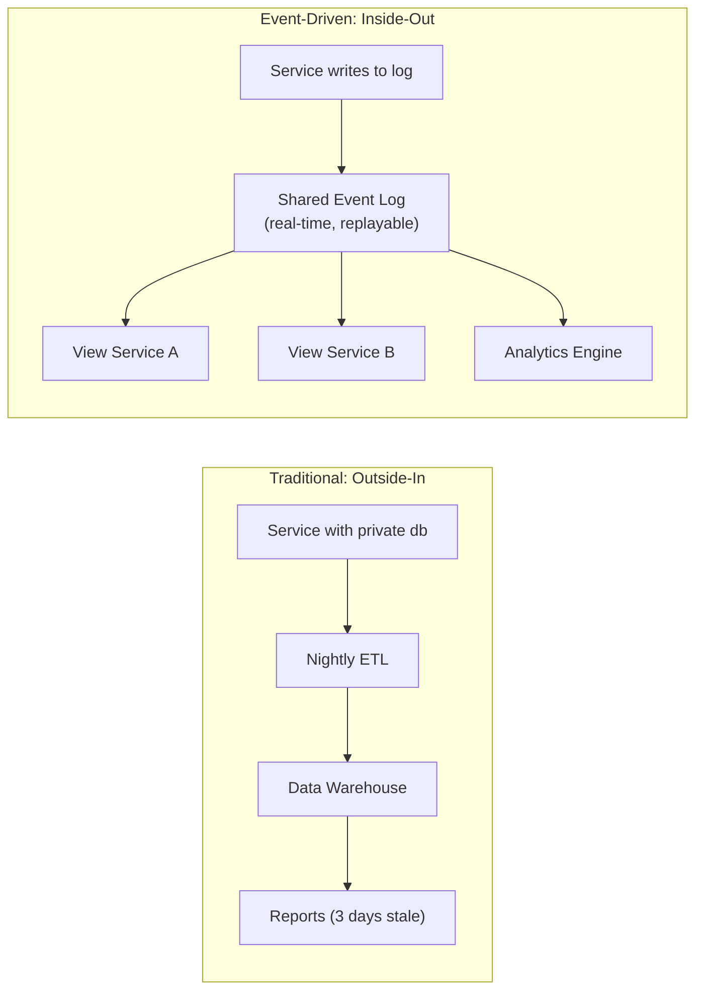
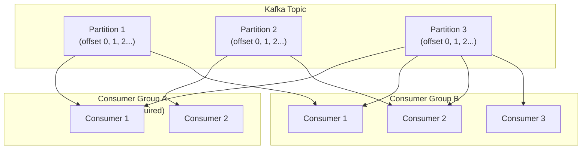

## Strengths

- **Kafka as architecture, not infrastructure.** Stopford elevates Kafka
  from middleware to architectural backbone. The "inside-out database"
  framing (Chapter 9) is original and persuasive.
- **Grounded in production reality.** Written from direct experience
  building Kafka at Confluent — not from conference talks or blog posts.
  The trade-off discussions carry genuine operational weight.
- **Events vs. commands taxonomy is a genuine contribution.** Stopford's
  insistence on strict naming has shaped how teams structure their
  Kafka topics and event schemas across the industry.
- **Practical CQRS with Kafka.** Rather than theoretical explanation,
  the book shows five concrete implementation patterns in Chapter 7 —
  covering trade-offs the reader will actually face.
- **Enterprise-scale thinking.** Unlike microservice books written for
  startups, Stopford addresses the hard problems: data sharing across
  organizational boundaries, schema governance, the REST-to-ETL
  migration trap (Chapter 8).
- **Honest about when not to use events.** Chapter 1 and recurring
  warnings throughout the book make it a corrective to the hype cycle
  around event-driven architecture.

---

## Weaknesses

- **Dense for its length.** At 171 pages the book is short, but the
  concepts per page ratio is very high. Some passages assume fluency in
  distributed systems vocabulary.
- **Kafka-centric.** The patterns are real, but the practical
  implementation paths are Kafka-specific. Engineers building with
  Pulsar, Kinesis, or Service Bus must translate.
- **Schema Registry is a black box.** The book explains concepts but
  delegates the implementation mechanics of schema management to the
  Confluent Schema Registry, without going deep on its operation.
- **Limited testing guidance.** Unit and integration testing for
  event-driven services is barely addressed — an area where most teams
  struggle the most in practice.
- **Transaction chapter is skeptical.** Stopford accurately describes
  Kafka's transaction API (Chapter 12), but his conclusion — "do
  we really need transactions?" — may frustrate engineers in domains
  (financial services, healthcare) where strong consistency is required.

---

## Criticism

### The "Kafka Sales Brochure" Critique

Some readers see the book as marketing dressed as technical content.
Stopford is a Confluent employee; the book's canonical solutions
invariably depend on Confluent's paid ecosystem (Schema Registry,
KSQL which has been rebranded as ksqlDB, Confluent Cloud).
The patterns themselves are sound, but the commercial context is
worth awareness. The core concepts apply to any replayable log system.

### The "Missing the Complexity" Critique

Several reviewers note that the book understates the operational
difficulty of running event-sourced and CQRS systems at scale.
Schema migration across 50+ consuming services, managing consumer
lag during replays, and multi-topic atomic commits are either
glossed over or presented as simpler than they are in practice.
Teams that underestimate these challenges have learned this from
production incidents, not from the book.

### The "Dates the Book" Critique

Originally published as a shorter report in 2018 and then expanded,
the book reflects the Kafka ecosystem circa 2017–2018. ksqlDB has
evolved, Kafka Connect has changed, and newer patterns like
Iceberg-backed log storage and tiered storage have emerged. The
conceptual framework is timeless; the specific implementations
require current documentation.

---

## Context: Why This Book Exists

The early-to-mid-2010s was the peak of the microservices hype cycle
driven by Netflix, Amazon, and Martin Fowler's writings. Teams
decomposed monoliths into thousands of services without a clear
strategy for data sharing. The result: the "REST-to-ETL problem"
(termed in this book's Chapter 8) — systems glued together with
synchronous APIs that then required nightly batch ETL to share data.

Stopford's answer was the log: a single, ordered, replayable stream
of events that describes "what happened" across the entire
organization. Services subscribe to the log and build their own
views. This is:

- The pattern LinkedIn used to scale Kafka to trillions of messages
- The pattern that underpins Kafka Streams and KSQL
- The central idea that made Kafka more than "a message bus"

Sam Newman's foreword situates the book precisely: microservices
give us team autonomy, but autonomy without a shared data strategy
creates operationally expensive islands. Stopford's event streams
are the bridge.

---

## Appreciation: The "Inside-Out Database" Chapter

Chapter 9, "Event Streams as a Shared Source of Truth," is the
intellectual centerpiece. Stopford inverts the traditional database
mental model: instead of services exposing APIs and periodically
dumping data to a data warehouse, services *publish their internals*
as an event stream. Other services *subscribe* and build local views.

The traditional model has low-latency writes but high-latency reads
(days until data reaches analysts). The inside-out model has near-
zero latency for new data consumers, at the cost of requiring
consumers to manage state and handle schema evolution.

This pattern is what Kafka advocates call the "unified log" — a
single immutable log that replaces thousands of API endpoints and
nightly batch pipelines.

---

## Appreciation: The Competing Consumer Pattern

Stopford explains why Kafka's consumer group model makes scaling
event processing genuinely simple compared to traditional message
queues:

- Each consumer group gets its own independent offset — "competing
  consumers" without coordination
- Adding consumers to a group increases parallelism up to the number
  of partitions
- Multiple consumer groups can process the same events for different
  purposes without interfering

This is the practical enabler of event-driven architecture at scale.
