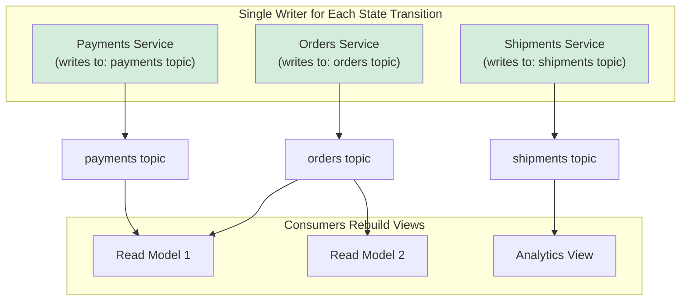

## Opening (0:00–0:45)

Welcome to BookAtlas. Today, we're diving into one of the most
influential books on modern system architecture: *Designing Event-Driven
Systems: Concepts and Patterns for Streaming Services*, by Ben Stopford.

Originally published by O'Reilly in May 2018, this 171-page book comes
from an engineer who has lived the problems it describes. Ben Stopford
is a principal engineer at Confluent, the company behind Apache Kafka.
He was building Kafka infrastructure at scale when he wrote this book —
so this isn't theory from someone watching from the sidelines. It's
practice, written by one of the practitioners.

The book carries a foreword by Sam Newman, author of *Building
Microservices*, who calls it the answer to a critical gap: microservices
give us team autonomy, but autonomy without a shared data strategy
creates expensive islands. Stopford shows how event streams are the
bridge.

---

## The Problem Stopford Is Solving (0:45–2:30)

To understand why this book matters, you have to understand the problem
it arose from.

The early 2010s saw a massive push toward microservices. Netflix, Amazon,
every startup — decompose the monolith, give teams autonomy, ship faster.
And that worked, kind of.

But here's what happened next: those thousands of independently deployed
services needed to share data. Some teams built synchronous REST APIs.
Others used message queues. Some hauled data into nightly batch ETL
pipelines into a data warehouse.

None of those approaches scaled. Synchronous APIs create tight coupling
— if the payment service is down, the checkout service is down, and the
whole site goes down with it. Nightly ETL means data is days old by the
time analysts see it. Message queues don't remember — if a consumer
crashes, the message is gone.

Stopford's answer is the log. A shared, ordered, replayable stream of
events that every service can read from. The log is the backbone of the
system. And that insight — simple on the surface, profound in its
implications — is the heart of this book.

---

## What Kafka Really Is (2:30–5:00)

Stopford spends Chapter 3 unravelling what Kafka is. This is one of the
most valuable sections of the book, because most engineers arrive at
Kafka with the wrong mental model.

He says: Kafka is not a message queue like RabbitMQ. It's not an
enterprise service bus. And it's not quite a database.

What it actually is: a distributed, persistent, replayable log. Think
of an accounting ledger that never closes. Every event gets appended in
order, and any service can read from any point in that history.

The genius of this design is that it separates the concerns of producers
and consumers. Producers just write — fast, they don't care who's
reading. Consumers read at their own pace, and can even re-read from
any previous point. And because the log is persistent, a consumer that
crashes and restarts doesn't lose anything. It just continues from where
it left off.

This is fundamentally different from a message queue, where once a
message is acknowledged, it's gone. Kafka's events stick around until
you decide to age them out — which means you can replay history whenever
you need to.

---

## Events vs. Commands: The Taxonomy That Changes Everything (5:00–8:00)

Chapter 5 might be the most important chapter in the book. Stopford
insists that engineers get sloppy with their message naming — calling
everything a "message" or an "event" — and that sloppiness causes real
bugs and operational pain.

His taxonomy:

Commands are requests for action. They're directed, synchronous,
imperative. "Process this order."

Events are records of what already happened. They're broadcast,
asynchronous, declarative. "Order forty-two has been processed."

Queries are requests for information without side effects. They're
typically synchronous API calls.

The reason this matters: commands and events have fundamentally different
lifecycles. A command expects a response — if the consumer doesn't
reply, the producer is left hanging. An event is fire-and-forget — the
producer doesn't know or care who's listening.

When engineers treat events as commands — expecting every consumer to
handle them — they end up with systems that silently fail. The producer
thinks everything is fine, but half the consumers never received the
message, or received a version they couldn't parse.

Stopford's prescription: name things correctly. If it's a command, call
it a command, design for retry and response. If it's an event, call it
an event, design for idempotent consumption and eventual consistency.

---

## Loose Coupling — and Its Limits (8:00–10:30)

Here's where Stopford challenges a common article of faith in the
microservices community.

Engineers love loose coupling. It's supposed to mean you can change one
service without breaking another. And message brokers are supposed to
give you that.

Stopford says: message brokers change the type of coupling, they don't
eliminate it. If consumers depend on a specific event schema, changing
that schema still breaks consumers — it just happens at message parse
time rather than at build time.

More importantly, he introduces the idea of "essential data coupling."
Some coupling is inevitable because services share domain concepts.
An "order" in the orders service is the same thing as an "order" in the
payments service. You cannot eliminate that coupling — but you can
manage it deliberately.

This is the practical impact of the three collaboration patterns:
notification, state transfer, and event collaboration. Each makes
different trade-offs about what data flows between services and when.

The key insight: choose your pattern deliberately based on the coupling
requirements, not based on which pattern is currently fashionable.

---

## Stateful Stream Processing — Kafka Streams (10:30–14:00)

One of the more advanced sections of the book covers stateful stream
processing. This is where events aren't just forwarded — they're used
to build and maintain local state.

Stopford makes a distinction that many engineers miss. There are three
ways to process a stream:

Stateless: Read each event, transform it, write the result. No memory
of previous events. Simple, but limited — you can only answer things
like "count events per minute" if you keep that count outside the
processor.

Event-driven: React to events by making calls back to other services.
This works but reintroduces synchronous coupling.

Stateful streaming: Maintain local state — a table, a window, a join —
derived from the stream itself. Kafka Streams is the primary example.
It gives you exactly-once processing semantics, local state stores
backed by the changelog, and automatic recovery when a processor restarts.

The changelog topic is the mechanism that makes this work. Every state
change is written to a compacted Kafka topic. If the service crashes,
the state store is rebuilt by replaying the changelog. No checkpoint
coordination required.

Stopford treats this as a first-class architectural choice, not a
performance optimization.

---

## Event Sourcing and CQRS (14:00–18:00)

Chapters 6 and 7 get into the deep end: Event Sourcing and CQRS.

Event Sourcing means you never store current state. You store every
event that led to that state, and rebuild the current state by replaying
the event log. It turns your database into a function that reduces a
list of events into a single result.

CQRS — Command Query Responsibility Segregation — separates the write
path from the read path. Commands go through validation and become
events. Queries read from a pre-computed, read-optimized view built
from those events.

Stopford shows five concrete ways to implement these patterns with
Kafka, and the comparison is the real value of this chapter:

In-process views with Kafka Streams tables: simplest, fastest reads,
but state is local and must be rebuilt on failure.

Writing through a database into a Kafka topic: legacy systems can
participate via Kafka Connect and CDC — no code changes required.

Writing through a state store to Kafka: the most functional, using
Kafka Streams processors. State survives crashes via changelog topics.

Unlocking legacy systems with CDC: Debezium captures row-level changes
from existing databases (MySQL, PostgreSQL, MongoDB) and publishes them
to Kafka topics. Suddenly that legacy system is part of your event
ecosystem without a single line of application code.

The key reminder throughout: event sourcing is not for every system.
It's complex, it requires new operational patterns, and it only pays off
when you genuinely need to rebuild state, audit change history, or
support time-travel-style queries.

---

## Schema Evolution: The API Contract of Events (18:00–21:00)

Chapter 13 covers schema evolution — a topic many teams only discover
the hard way, after a breaking schema change has crashed half their
consumers.

Stopford treats event schemas API contracts. The same discipline that
applies to REST endpoints applies to event schemas: backward
compatibility, versioning, deprecation, and migration.

The primary tools he discusses:

Confluent Schema Registry: stores schemas centrally, validates
messages against schemas at write time, and provides compatibility
checks before a schema change is allowed.

The compatibility modes: backward compatible, forward compatible, or
full — meaning consumers on either the old or new schema can still
process messages.

Schema evolution scenarios: adding optional fields (safe, backward
compatible), removing fields (safe for new consumers, breaks old ones),
renaming fields (technically OK for most serialization formats, but
requires careful testing).

The reminder that stops teams in their tracks: schema changes are
deployment changes. A producer deploying a new schema is useless if
consumers haven't been updated. Schema compatibility checks are the
safety net that prevents half-deployed changes from causing data loss.

---

## Consistency Without Transactions (21:00–24:00)

Chapter 11 is one of the most counter-intuitive sections. Stopford
argues that in event-driven systems, you can often achieve better
consistency without distributed transactions — not by weakening
consistency, but by changing the system structure.

The core mechanism is the **single writer principle**: each aggregate
or state transition is written by exactly one service, to exactly one
topic, at exactly one time. This eliminates the need for distributed
transactions because there's no coordination required.

If two services need to coordinate — say, creating an order and
reserving inventory — they use a **command topic**: one service issues
a command, another service processes it asynchronously. The result
is effectively a saga, but without explicit saga orchestrator code.

Stopford addresses the elephant in the room: does this actually work?
His answer: it works for a remarkably wide range of use cases, and the
systems that genuinely need strict distributed transactions tend to
be financial systems with regulatory requirements — a well-bounded
category.

Chapter 12 covers Kafka transactions, but Stopford is careful to note
their limitations: transactions are expensive, they don't scale as
well as idempotent consumers, and they don't solve the broader problem
of coordinating multiple services. Know when to use them, but prefer
simpler patterns when possible.

---

## When NOT to Use Events (24:00–25:30)

One of the most valuable aspects of this book is what it tells you to
avoid.

Event-driven architecture is not a universal upgrade. Stopford is
explicit: if your system is simple, if your teams are small, if you
have a bounded context with a single database, events are complexity
you don't need.

The overhead of event-driven architecture:
- Schema management and compatibility enforcement
- Consumer group monitoring and lag alerting
- Topic lifecycle governance (creation, deletion, retention policy)
- Event replay and data backfill procedures
- Consumer idempotency design
- Tracing across asynchronous boundaries
- Operational knowledge (Kafka, ZooKeeper, Schema Registry, ksqlDB)

If your system is a CRUD API with one database and a small team, use
a relational database. It will be simpler, better supported, and
easier to operate. Stopford would agree: the simplest system that
solves your problem is the right system.

---

## The Organization-Scale View (25:30–27:30)

Chapters 8, 9, and 10 are what make this book stand apart from other
EDA and Kafka books.

Most books on Kafka talk about integrating services within a team.
Stopford talks about integrating organizations.

He introduces the "God Service" problem: as organizations grow,
services accumulate APIs that serve every other service. A payment
service starts as a clean API but gradually becomes the payment
service, the fraud service, the settlement service, the reporting
service. It's now the God Service — everything depends on it.

Event streams solve this by making data a first-class citizen. Rather
than the God Service pushing data to fifty downstream systems via
API, it publishes to a log. Consumers subscribe independently.

The "Lean Data" chapter is where the rubber meets the road. How do
you handle data that consumers need but producers emit inefficiently?
How do you avoid the "data divergence problem" where two services have
different views of the same entity?

Stopford's approach: build view services that consume the log, derive
what they need, cache the result, and rebuild on failure. The log is
the source of truth. Views are rebuilt from the log, not duplicated
by ETL.

---

## Closing (27:30–28:30)

*Designing Event-Driven Systems* is a practitioner's guide. It's
written by someone who was building the systems he describes — and
who's seen the mistakes teams make.

The book's most important contribution is its framing: event-driven
architecture is not a technology choice. It's an architectural choice
about how your organization shares data across service boundaries.

The log as backbone is the central idea, and it's powerful because it's
simple: every important thing that happens gets recorded once, in order.
Every service can read and build what it needs. No point-to-point APIs.
No nightly ETL. No God services.

The book has limitations. It's Kafka-centric. It assumes you're already
operating at the scale where events make sense. It doesn't deeply cover
testing or operational patterns.

But if you're a backend engineer building distributed systems, a
platform engineer evaluating Kafka, or a technical lead making
architecture decisions — this is a book you should read.

I'm BookAtlas. See you in the next one.
