## Part I — Foundations: What Architecture Is, and What It Is Not

### Chapter 1: Introduction

The chapter opens with the book's core definition: software architecture is the set of decisions that are *expensive to reverse*. Everything else — formatting, library choice, naming — is design. The line between design and architecture is not clean, but the principle is defensible: an architecture decision is one whose reversal requires rewriting large portions of the system, re-training teams, or renegotiating contracts with stakeholders.

The chapter also establishes the book's scope and audience limits. Architecture is not a phase that happens before coding. It is a continuous activity that runs alongside development. The authors distinguish their approach from two competitors in the field: the purely academic tradition (Shaw, Garlan, Perry) and the framework-specific approach (tutorials tied to Spring, Kubernetes, or particular cloud platforms). Their target is the middle: a vocabulary that survives across languages and frameworks, and a set of patterns that can be compared and reasoned about independent of any specific technology.

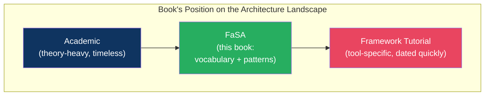

The chapter closes with an outline of what follows and a plea for the reader to resist the temptation to skip to the pattern catalog. The foundations (Part I) are not optional filler. Without the vocabulary established in chapters 2 through 5, the pattern chapters (chapters 6 through 14) are just shapes to memorize.

---

### Chapter 2: Architectural Thinking

This is the philosophical core of the book. The central argument: architecture is fundamentally about trade-offs, and the professional skill an architect must develop is the habit of making trade-offs explicit.

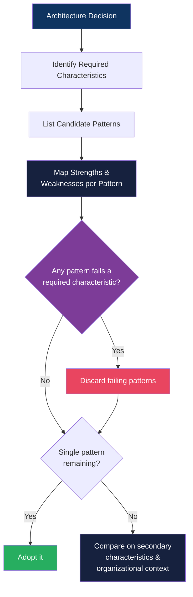

The chapter reclaims the most common response from architects — "it depends" — and reframes it. "It depends" is correct most of the time, but only when followed by an enumeration of the things it depends on. The required characteristics of the system. The rate and nature of change in the domain. The size and distribution of the delivery team. Operational capabilities. Risk tolerance. An architect who cannot list the dependencies is hiding ignorance. An architect who can is practicing the discipline.

Cargo-cult architecture is the failure mode the chapter warns against: adopting microservices because a conference talk said they are "better," or using a message broker because it appears in the architecture slide deck. If you cannot name the trade-off, you do not understand the decision — and if you do not understand the decision, you are not designing architecture.

---

### Chapter 3: Modularity

Before any pattern can be evaluated, the reader must understand the substrate on which patterns operate: the module. The chapter covers cohesion and coupling as the foundational pair of concepts.

**Cohesion** measures how strongly related the responsibilities within a single module are. The highest cohesion is achieved when a module does one thing and does it well. **Coupling** measures how much one module must know about another to function. The lowest coupling is achieved when interaction happens through a narrow, stable interface.

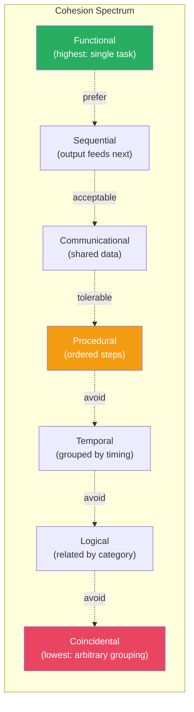

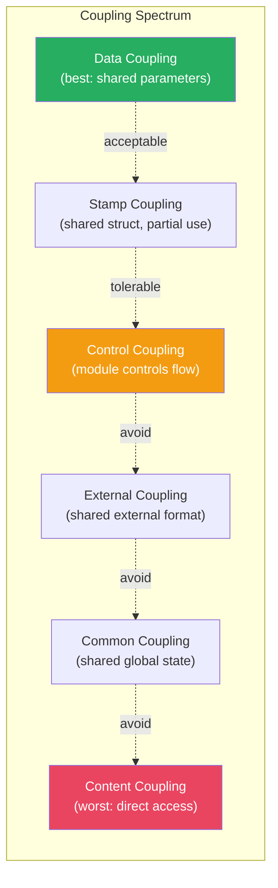

The interaction between cohesion and coupling drives every architecture pattern. A layered architecture achieves high cohesion within layers (all database access in one place, all business logic in another) but creates coupling across layers. An event-driven system achieves low coupling between producers and consumers but makes causal reasoning (following a transaction across event chains) much harder. Understanding this dialectic is the prerequisite for pattern comparison.

---

### Chapter 4: Architecture Characteristics

The book introduces eight core architecture characteristics grouped into three categories. These provide the vocabulary for all discussions of quality, *-ilities*, and non-functional requirements.

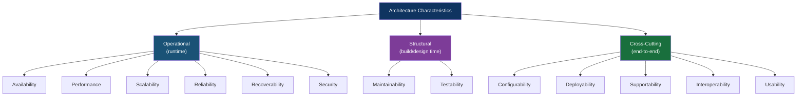

The critical discipline: not every system needs all eight. An embedded IoT sensor requires availability but cares little for maintainability. A public-facing payment API requires security, availability, and performance but treats deployability and usability as secondary. The architect's first task on a new system is to interview stakeholders and answer: which are *required*, which are *desired*, and which are irrelevant? Every subsequent pattern decision is evaluated against this required set.

---

### Chapter 5: Component-Based Thinking

The chapter establishes the component as the unit of architecture. A component is a logical unit: a cohesive collection of functionality with a well-defined boundary and a published interface. It exists independently of deployment topology, language, or framework.

The sequence matters. Component identification must precede pattern selection:

1. Analyze the business domain and identify the *dynamics of change* — which concepts change together? Independently?
2. Define component boundaries based on cohesion and change coupling.
3. Assign components to the pattern that best fits the required architecture characteristics.
4. Choose technology (languages, frameworks, infrastructure) to *support* that pattern — not to define it.

The common mistake, repeated across many organizations: a team selects a pattern ("let's do microservices"), then defines components as services. The result is that service boundaries reflect deployment constraints rather than business cohesion — and change becomes costly because services with the same rate of change are split apart, or services with different change rates are coupled.

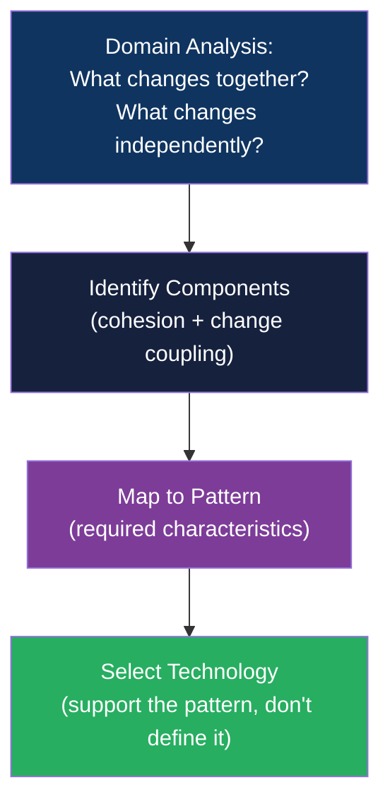

---

## Part II — The Pattern Catalog: Nine Structural Models

Each chapter from 6 through 14 follows the same template: explanation of the pattern, a topology diagram, a concrete use case, an analysis of strengths and weaknesses, and a mapping to architecture characteristics. The uniform treatment is intentional — it makes the patterns comparable, which is the only reason to catalog them.

### Chapter 6: Layered Architecture

The default. The pattern divides responsibility into presentation, business, persistence, and (optionally) database layers. The topology is a stack: each layer talks only to the layer immediately below it.

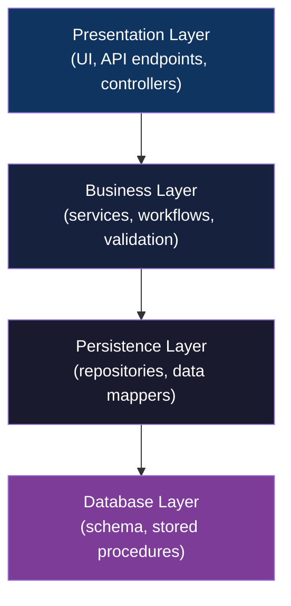

Strengths: simplicity, testability within layers, easy to understand for new developers, well-suited to small teams and small-to-medium codebases.

Weaknesses: layers can become "architecture astronauts" — deep abstractions that hide rather than expose meaning. The pattern enforces deploy-atomically: a monolith deploys as a single unit and all layers share a process boundary. Performance degrades at scale because every request must transverse multiple layers. Hidden dependencies across layers (the persistence layer calling back into the business layer, for example) are a common source of bugs.

---

### Chapter 7: Microkernel (Plugin) Architecture

The pattern defines a minimal core system with a well-defined extension point; all domain-specific functionality lives in plugins loaded on demand.

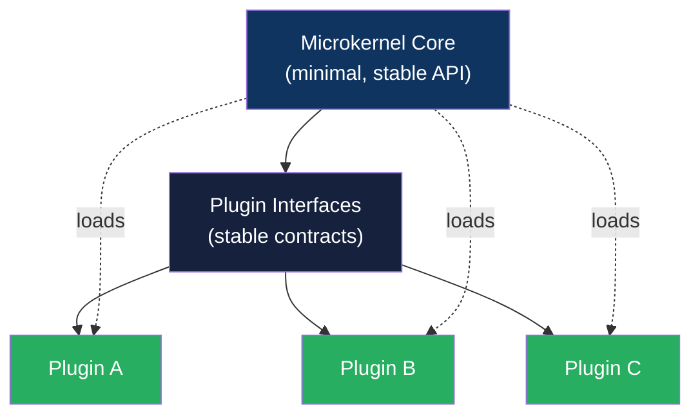

Use cases: operating systems (the archetype), IDE extensions (VS Code, Eclipse), web browsers (Chrome extensions), ETL pipelines that load transformation modules at runtime.

The critical design constraint: the microkernel interface must be *stable*. Any change to the core API boundary is a breaking change to every plugin in the ecosystem. The core is held to a higher stability standard precisely because it is small. This is the inverse of a layered architecture: the base is minimal rather than foundational, and the extensions are where complexity lives.

---

### Chapter 8: Service-Based Architecture

A middle-ground pattern where the system is decomposed into a handful of independently deployable services — fewer than microservices, coarser-grained, typically held within a single team's ownership.

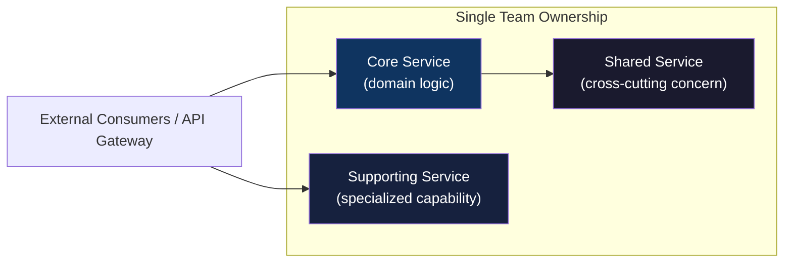

The pattern is the pragmatic first step for teams that sense a monolith will become a constraint but are not yet at the microservices threshold — the service count stays in the single digits rather than scaling to dozens. The strength is independent deployability without the network complexity of full microservices. The weakness is that service boundaries still require careful definition: if services are split poorly, the team inherits distributed system problems without the benefits of true independent evolvability.

---

### Chapter 9: Microservices Architecture

The pattern most practitioners have opinions about. The book is deliberately agnostic: microservices are a *specialization* of the service-based pattern with additional constraints — independent deployment, autonomous teams, bounded contexts that map onto services.

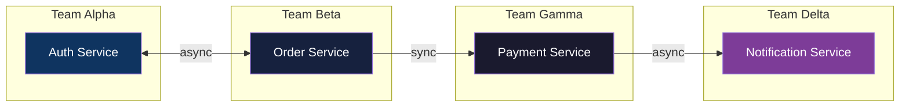

The real arguments for microservices are *organizational*, not technical: a large organization with many autonomous teams cannot converge on a single deployment artifact without a heavy governance process. Microservices align the code deployment boundary with the team communication boundary — exactly what Conway's law predicts.

The real arguments against microservices are *operational*: every network hop adds latency, every separate deployable adds a monitoring surface, every inter-service contract adds a maintenance surface. The book cites Fowler's rule of thumb (roughly 35 services as a practical ceiling for most organizations) as a data point, not a law.

The chapter's verdict: most systems should start as modular monoliths. Microservices are a *refactoring* reached when the monolith becomes painful — organizational scaling, team autonomy requirements, or deployment frequency constraints make the distribution cost worth paying. They are not a starting pattern.

---

### Chapter 10: Event-Driven Architecture

The pattern replaces synchronous request-response communication with asynchronous events. Producers emit events into a message broker (Kafka, RabbitMQ, or an in-memory bus); consumers process events independently.

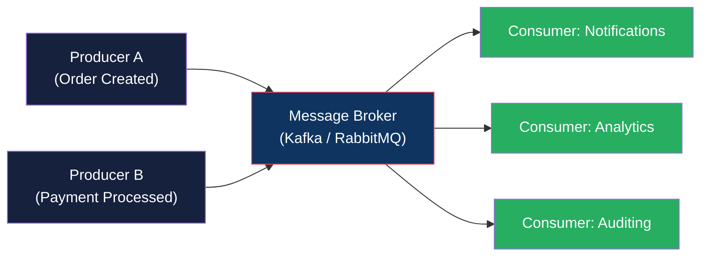

Strengths: loose coupling (producers and consumers do not need to know about each other), horizontal scalability (consumers can be scaled independently), resilience (failure of one consumer does not block producers).

Weaknesses: causal reasoning is categorically harder than in synchronous systems. An error may surface hours later as a wrong state in another service — far from the origin of the problem. Debugging requires replaying the event stream in order, which demands exactly-once delivery semantics, replay infrastructure, and observability that most systems do not invest in until after the problem appears. Event ordering and event schema evolution are the two hidden costs the pattern imposes as mandatory work, not optional polish.

---

### Chapter 11: Space-Based Architecture

The most specialized of the nine patterns. It eliminates the database as a shared bottleneck by replicating data into in-memory data grids (IMDG) across processing nodes. Requests are routed to the node holding the relevant data in memory.

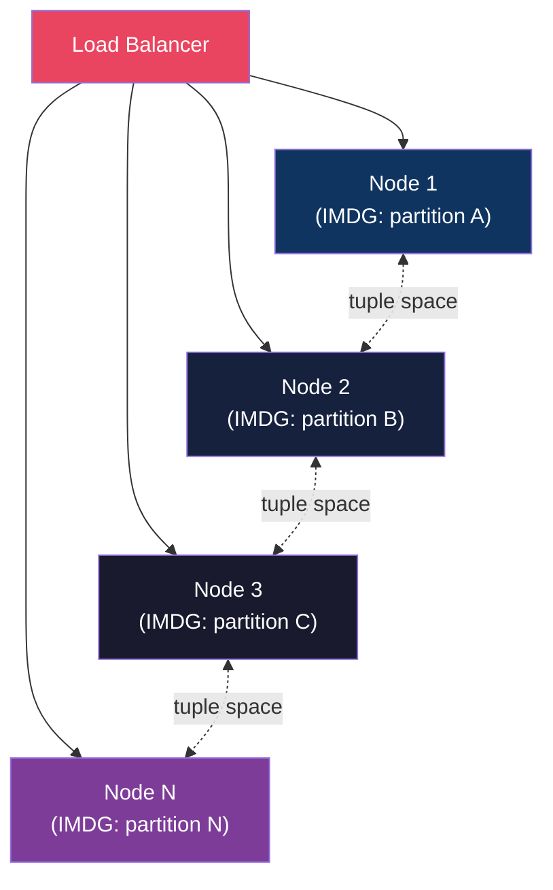

The pattern achieves advertised scalability but requires commercial IMDG products (Hazelcast Gigaspace, Oracle Coherence), substantial memory per node, and testing strategies that are genuinely hard — testing a distributed in-memory system with eventual consistency is not trivial. The book presents this as a specific tool for a specific problem: extremely high-volume, concurrent access to shared state where the database is the actual bottleneck. It is not a general-purpose approach.

---

### Chapter 12: Pipeline Architecture

Data flows through a configurable sequence of processing stages, each performing a single transformation. The archetype is Unix pipelines (`cat file | grep pattern | sort | uniq`).

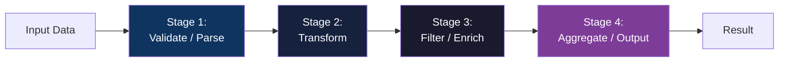

Use cases: compilers (lexing → parsing → optimization → code generation), ETL workflows, API gateway request/response filter chains, video/audio processing pipelines, CI/CD build pipelines.

The pattern is right when the *sequence of operations* is the primary design constraint and each stage is independent. The weakness is cumulative latency and error recovery: a failure at stage 5 of 10 requires coordinated rollback or retry across stages that may have already succeeded — and the pattern must define that coordination explicitly, which adds complexity.

---

### Chapter 13: Client-Server Architecture

The oldest pattern in the book and the one most modern systems still depend on implicitly. The server hosts the data and computational logic; the client requests services or data.

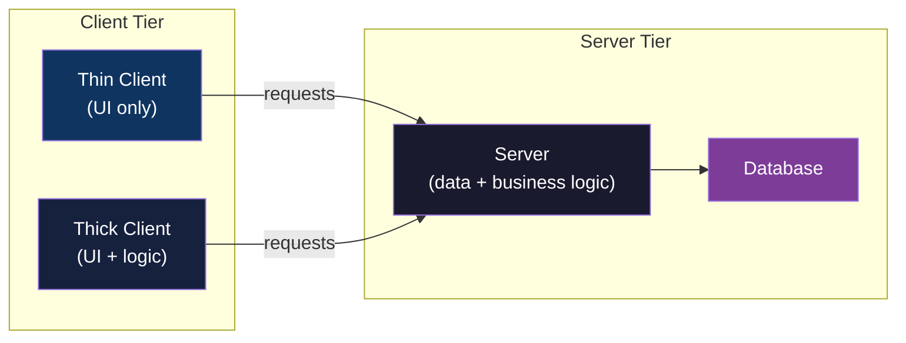

The chapter distinguishes thin clients (UI only, all logic server-side) from thick clients (logic on both sides). Modern systems have converged on thin-client-over-HTTP as the default, making this pattern less visible as an explicit design question — but its constraints remain: the server is a potential single point of failure and a concurrency bottleneck; the client and server must negotiate a contract that is versioned over time; any change to the server contract requires coordinating all clients.

---

### Chapter 14: Service-Oriented Architecture (SOA)

The earlier enterprise pattern, distinguished from microservices by its central coordination point: an *enterprise service bus* (ESB) that routes, transforms, and orchestrates requests between services.

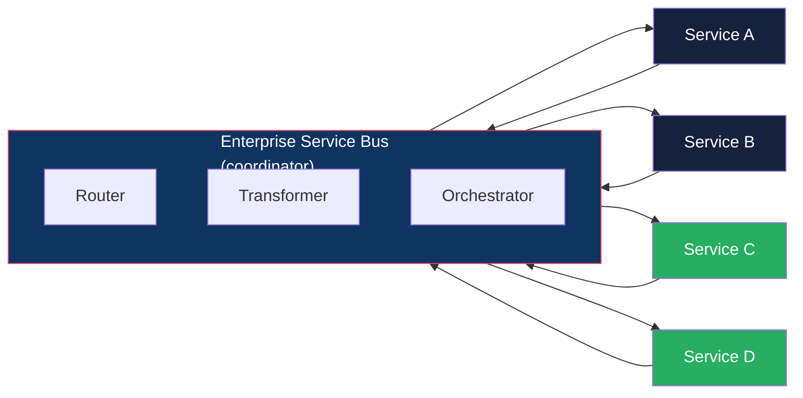

The ESB centralizes governance and integration logic, which is genuinely useful in large enterprises with heterogeneous systems. The weakness: the ESB itself becomes a bottleneck, a single point of failure, and a governance nightmare when dozens of teams route through it. The chapter notes that many SOA implementations became compliance exercises rather than architecture exercises — companies adopted the pattern because it was "enterprise" without achieving the independence the pattern is meant to deliver.

---

## Part III — Techniques, Documentation, and Soft Skills

### Chapter 15: Foundations — The 4+1 View Model and Architectueral Context

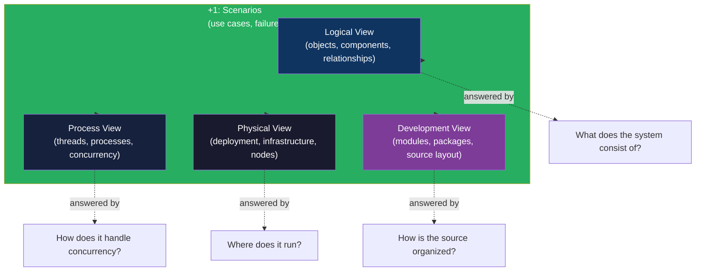

Kruchten's model (1995) adopted as the canonical structural description framework. The +1 is not a fifth view — it is the *driver*. Scenarios (key user journeys and critical failure sequences) are what activate the system and reveal which characteristics matter for which parts. A trading system that needs sub-millisecond latency will have very different process and physical views than an internal HR tool where 200ms is acceptable.

Each view has a specific audience and purpose:
- **Logical** talks to engineers about code structure and component design.
- **Process** talks to performance engineers and SREs about concurrency and availability targets.
- **Physical** talks to infrastructure and DevOps about deployment topology and failure domains.
- **Development** talks to developers about module structure, package layout, and build dependencies.

---

### Chapter 16: Architecture Archetypes and Deployment

The chapter introduces the concept of an *archetype* — a readily recognizable architecture solution that addresses a specific set of requirements. Archetypes are patterns at a higher level of abstraction; they describe not just structural arrangement but the specific problem context they are designed to solve.

Deployment architecture receives its own treatment here. The chapter covers the topology of how components are physically distributed across environments — from single-process monoliths running on a single server to distributed systems spanning multiple regions and availability zones. Topics include:

- Deployment descriptors and infrastructure-as-code as architecture artifacts
- The relationship between deployment topology and the architecture characteristics of availability and recoverability
- How deployment decisions create constraints on the patterns that can be chosen

The chapter closes with a table of common archetypes and the characteristics they are optimized for, which the reader can use as a quick reference when evaluating candidate architectures.

---

### Chapter 17: Software Architecture Documents and Diagrams

The chapter is a polemic against the wrong way to document architecture. The target is the architecture description document (ADD) written in a word processor, maintained by a team of three, never read by anyone who actually builds the system. The book's position: documentation must be *useful* first, *comprehensive* second.

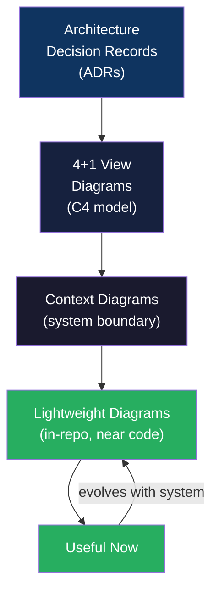

Concrete recommendations:
- C4 model diagrams for describing structure — at the level of detail the audience needs
- Context diagrams at the system boundary (one per system, kept current)
- ADRs for decisions (context, decision, status, consequences)
- Diagrams that live *in the repository, near the code*, maintained by the same people who change the code

The principle tying them together: documentation lives with the system it describes. Architecture documents stored in a separate wiki go stale within months. Documentation committed to the repo evolves with the codebase because it is updated by the people who know it is wrong.

---

### Chapter 18: Risk Identification and Mitigation

The chapter closes the technical half with the topic most architecture books treat as afterthought: risk. Architecture is fundamentally about managing uncertainty, and uncertainty manifests as risk.

The risk analysis framework the book proposes:
1. **Identify risk areas** per architecture characteristic: where could this system fail to meet its required characteristics?
2. **Assess probability and impact**: if the risk materializes, how bad is it? How likely is it?
3. **Design mitigation**: what architectural decision reduces the probability or impact of this risk?
4. **Validate the mitigation**: can we prove the risk is reduced?

The chapter connects this framework back to the patterns catalog: each pattern has characteristic risks. Space-based architecture's risk is operational complexity and cost. Event-driven's risk is debugging and causal reasoning. Microservices' risk is distributed system failure modes. The exercise of mapping risks to patterns is the practical application of the trade-off analysis framework from chapter 2.

---

### Chapters 19–22: The Soft Skills Portfolio

The final four chapters are the most personally written and the most uneven. Together they constitute roughly one-fifth of the book and cover the human dimension of the architect's role — the part that determines whether a technically correct architecture ever gets built.

**Chapter 19: Soft Skills.** Covers the foundational interpersonal competencies: active listening, framing, finding win-win positions, and pushing back without burning relationships. The book treats these as professional skills, not personality traits — meaning they can be practiced and improved like any other technical skill.

**Chapter 20: Negotiation and Influence.** An architect has influence, not authority. The chapter provides structural advice for having hard conversations: frame in terms of business risk (not technical purity), provide alternatives (not just objections), and document decisions that go against your advice (so you are not blamed for the predictable failure).

**Chapter 21: Career Development.** Addresses the practical question of how to get into an architecture role from an engineering role — without waiting for the title. The advice is concrete: learn to communicate in business terms, volunteer for cross-team design discussions, build a track record with ADRs and lightweight documentation, find a mentor who is already in the role.

**Chapter 22: The Architect in the Organization.** The closing chapter ties the strands together. Architecture is not what an individual designs — it is what a team (or many teams) actually builds. The architect's job is partly to design the *team shape*, not just the system shape, because Conway's law guarantees the system will mirror the communication structure of the team that builds it.

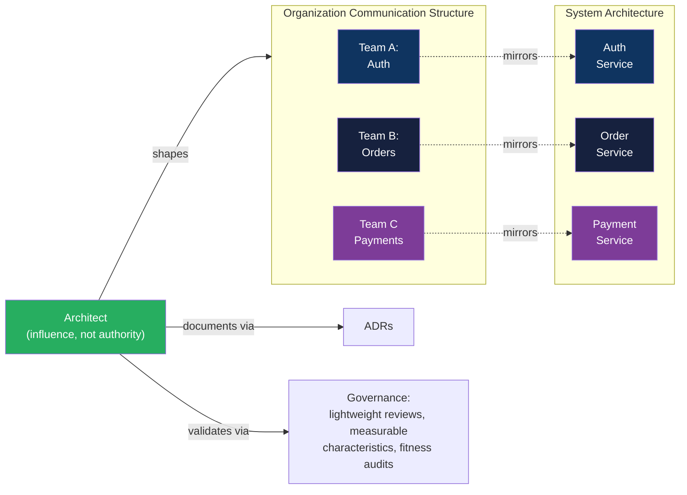

The chapter's closing argument: the architect is not the smartest person in the room. They are the person who can *coordinate* the smartest people in the room. The role requires technical fluency enough to earn credibility, communication skills enough to share it, and political skill enough to use it.

---

## Synthesis: How the Book Holds Together

The book's structure mirrors its thesis about architecture itself. Part I builds definitions and vocabulary (the foundations). Part II delivers a fixed catalog of patterns (the structural toolbox). Part III provides the practices that make the toolbox actually usable in a real organization (the process layer).

The internal consistency is deliberate. Every decision the authors made about the book mirrors the principles they advocate for systems: uniform treatment of patterns makes them comparable; comparison enables trade-off analysis; trade-off analysis is the actual value of the vocabulary. The book is, in this sense, a working demonstration of its own thesis.

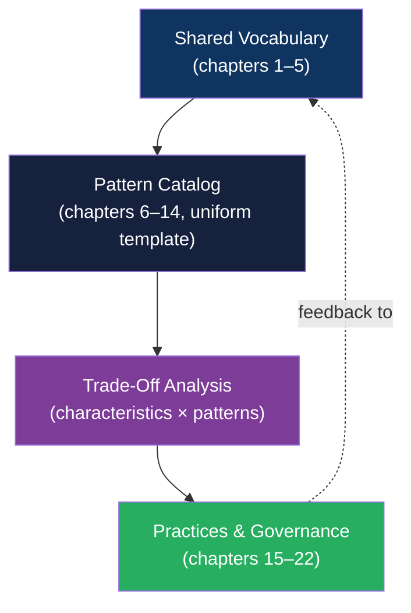

A reader who finishes chapters 1 through 5 cannot read the pattern chapters as a list of shapes to memorize. They read them as a set of comparable trade-offs. A reader who finishes chapters 6 through 14 knows *what* each pattern costs. A reader who finishes chapters 15 through 22 knows *how* to introduce, document, and govern these decisions in an organization where they do not have unilateral authority.

That is the complete value of the book. No single chapter delivers it alone.
