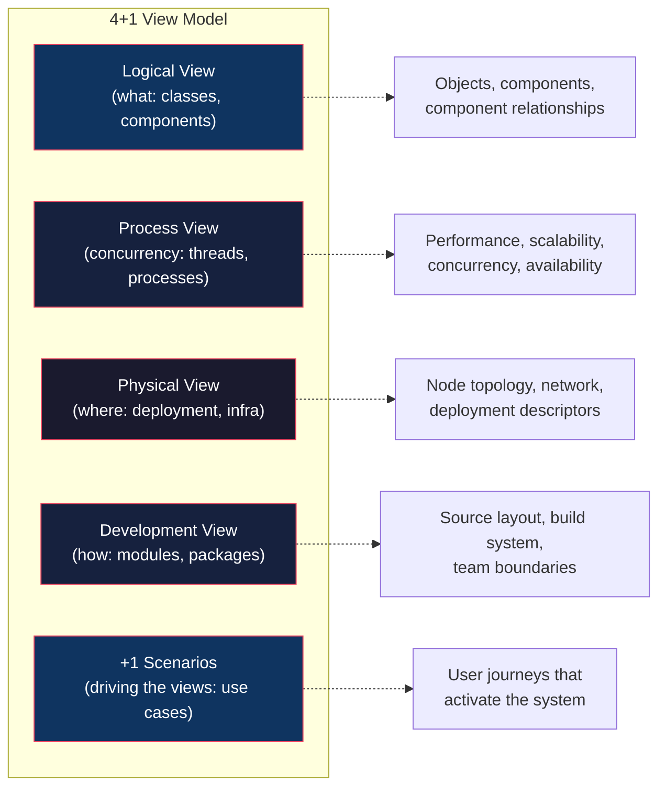
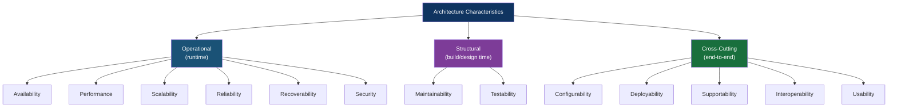
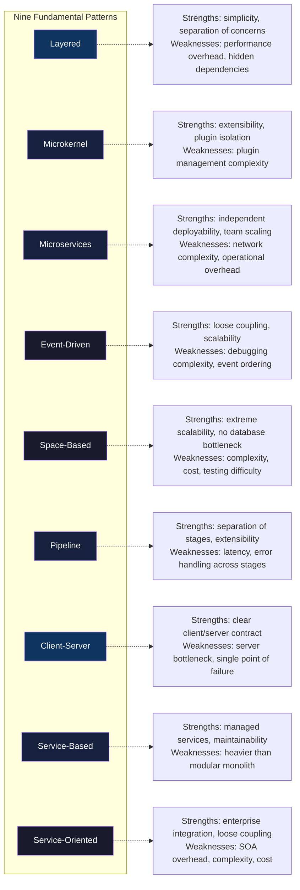
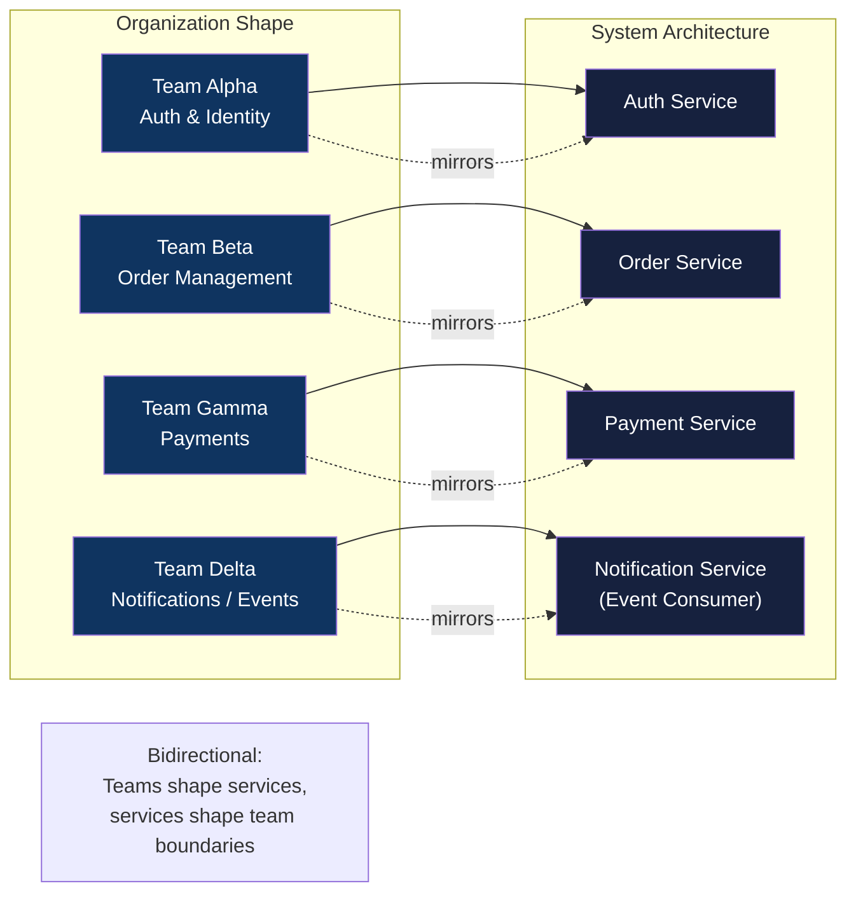

## Architecture Defined: Decisions, Not Diagrams

The opening definition is the spine of the entire book. Richards and Ford
ground architecture not in structure but in *cost*: an architecture is the
set of decisions that are *expensive to reverse*. Everything else —
formatting, naming, library choice — is design.

This distinction matters. It reframes the architect's job from "draw the
best diagram" to "make the decisions that cost the most to undo, and make
them with eyes open." A diagram that cannot be reversed in under a sprint
is architecture. A choice about whether to use a sorted list or a hash set
is design. The line is not always clean, but the principle is precise.

The cost-as-boundary framing also implies a time horizon question: expensive
to undo *relative to the rate of change this system will experience*. A
system you expect to evolve for ten years demands different architectural
decisions than a prototype shipping in four weeks. Architecture must be
evaluated against the expected lifespan and business context of the
system — not against some abstract notion of "good" or "bad."

Every architectural decision is, at its core, a trade-off. Richards and
Ford treat trade-off analysis as a *skill*, not a cliché. The professional
move is not to find the "right" answer but to name the trade-offs
explicitly and agree on which side of each trade-off the team is willing
to accept. This requires:

- A shared vocabulary for talking about qualities (the architecture
  characteristics)
- A shared vocabulary for describing structural options (the nine patterns)
- A shared process for capturing the *why* of a decision (ADRs)

That combination — qualities, structures, decisions — is what the book
delivers.

---

## The 4+1 View Model: Four Angles on One System

Kruchten's 4+1 view model (1995) remains the best single tool for
describing a system. The book adopts it as the canonical structural
description framework. The four views are:



The +1 is not a fifth view — it is the *driver*. Scenarios (use cases, key
user journeys) are what activate the system and reveal which characteristics
matter for which parts of the architecture. A trading system that needs
low-latency fills under 1ms will have very different process and physical
views than an internal HR management system where 200ms is fine.

The power of the model is that it forces the architect to describe a
system from four distinct angles rather than collapsing everything into a
single "architecture diagram." The logical view cannot fully explain
performance or deployment. The physical view cannot explain cohesion.
Each view reveals different problems.

---

## Architecture Characteristics: The Vocabulary of Qualities

The book introduces eight core architecture characteristics grouped into
three categories. These are the language engineers use to discuss
*-ilities* and non-functional requirements without hand-waving.



The critical insight: not every system needs all eight. An embedded IoT
sensor collects data and pushes it upstream; availability is critical,
but maintainability and testability matter little. A public-facing payment
API needs security, availability, and performance, but deployability and
usability are secondary concerns. The architect's first job is to name the
*required* set for *this* system, then evaluate patterns against that set.

The inverse is equally important: a pattern that *fails* a required
characteristic should be eliminated early. If you need sub-millisecond
latency, microservices with network hops between every call is likely a
non-starter. If you need to scale to millions of concurrent users, a
monolithic synchronous pipeline has a ceiling. Naming the required
characteristics *first* eliminates the wrong patterns before teams invest
in them.

---

## Architecture Patterns: The Catalog

The core of the book is nine patterns, each described with the same
template: explanation, topology diagram, use case, strengths, weaknesses,
and characteristic analysis. The uniform treatment is deliberate — it
enables *comparison*, which is the real goal.



### Selected Pattern Trade-Offs

**Layered (N-Tier):** The default for most web applications. Simple,
understandable, easy to test and deploy as a single unit. The weakness is
hidden: layers can become "architecture astronauts" — abstractions that
hide instead of expose meaning. Performance is acceptable up to a point
but degrades with internal network hop patterns.

**Event-Driven:** Replaces synchronous calls with asynchronous message
passing. Excellent for loose coupling and scalability — nodes don't need
to know about each other. The critical weakness is *event ordering* and
*causal reasoning*. In an event-driven system, understanding "why the
current state is X" requires tracing an ordered sequence of events, which
can span hours, days, or multiple out-of-order consumers. Debugging
event-driven systems is categorically harder than debugging synchronous
ones.

**Space-Based (In-Memory Data Grid):** Eliminates the database bottleneck
by replicating data into memory across nodes and using a tuple space or
in-memory data grid for coordination. The pattern achieves extreme
scalability but at the cost of operational complexity, licensing (most IMDG
products are commercial), and significantly harder testing. Best justified
only when the problem domain is *inherently* about massive concurrent
access to shared state.

**Microservices:** Independent deployability and team scalability are the
real arguments, not "microservices are better." The weaknesses — network
latency, distributed data management, inter-service contracts — are real
and increase with service count. The 35-service limit mentioned by Fowler
is not arbitrary; beyond that, team communication overhead begins to
dominate the system complexity. The pattern is correct when the *team
structure* requires it (Conway's law in action: many autonomous teams need
many autonomous services).

**Microkernel (Plugin):** The core system is minimal; all specific
functionality is loaded on demand via plugins. Excellent when
extensibility is the primary requirement and you cannot predict what
extensions will be needed. Operating systems are the archetype. Web
browsers and IDEs are the modern software examples. The weakness is the
plugin interface: any change to the core API boundary is a breaking change
to every plugin.

**Pipeline:** Data flows through a configurable sequence of processing
stages. Think Unix pipes, ETL workflows, or compilers. The pattern is
excellent when the sequence of operations is the primary design concern
and each stage is independent. The weakness is end-to-end latency and
error handling: a failure in stage 3 of 10 may require rolling back or
recovering state across stages that were already completed.

**Broker (RPC/ORB):** Coordinated by a central broker that routes requests
from clients to servers. CORBA and older COM models are the archetype. The
pattern has largely been absorbed by REST APIs, GraphQL, and message
brokers (Kafka, RabbitMQ), but the distinction remains: the broker is the
coordination point, and it is a potential bottleneck and single point of
failure.

---

## Component-Based Thinking vs. Technology Choice

One of the signal contributions of the book is arguing that *component
identification precedes technology choice*. This runs counter to the
prevailing practice in many organizations, where the pattern (or platform)
is chosen first — "we're going to use Kubernetes" or "we're building a
microservices architecture" — and then the system is shoehorned into it.

A component is a logical unit: a cohesive collection of functionality with
a well-defined boundary and a published interface. It exists independently
of deployment. A pattern is a physical arrangement: how those components
are located, communicated with, and evolved.

The common failure goes like this:

1. Team selects microservices (pattern)
2. Components are then defined per-service
3. Service boundaries end up reflecting deployment constraints rather than
   cohesion
4. Change becomes hard because services with the same rate of change are
   split apart, or services with different change rates are coupled
5. The architecture fights the business instead of serving it

The correct sequence, per Richards and Ford:

1. Analyze the business domain and identify the *dynamics of change* —
   which concepts change together? Independently?
2. Define component boundaries based on cohesion and change coupling
3. Assign components to the pattern that best fits the required
   architecture characteristics
4. Choose technology (languages, frameworks, infrastructure) to
   *support* that pattern

---

## Architecture Decision Records (ADRs)

ADRs are the book's most concrete, immediately actionable recommendation.
They are lightweight documents — typically five to twenty lines — capturing
a single architecture decision. The prescribed template covers:

| Section | Contents |
|---|---|
| **Context** | What was the problem or situation requiring a decision? |
| **Decision** | What was decided? What is the outcome? |
| **Status** | Proposed, accepted, deprecated, superseded |
| **Consequences** | What becomes easier or harder as a result? |

The key insight about ADRs is that they *survive turnover*. When a
decision is made in a meeting, the rationale leaves with the people in the
room. When a decision is written down, it becomes organizational memory.
Most architecture decisions are re-litigated every six to twelve months
because the rationale was never captured. ADRs fix this at near-zero
cost — a markdown file in a repo, committed with the code.

ADRs also serve as a checklist for new joiners (and new architects): a new
principal engineer can read the ADR directory and understand *why* the
system is shaped the way it is within a day. Without ADRs, that
understanding takes months of code archaeology and hallway conversations.

---

## The Architect in the Organization

Architecture does not exist at the level of an individual. It exists at
the level of a team — or many teams — building, operating, and inheriting
the system. Conway's law is not a cautionary tale; it is a *fact* the
architect must work with.



The implication is radical: if you want the architecture to be more
modular, you may need to restructure the teams before you restructure the
code. If you want loose coupling between services, you need loose
communication between the teams that own them. An architect who cannot
influence team structure is architecting only half the system.

This is why soft skills cannot be a sidebar. The architect's authority is
*influence*, not positional power. The role requires:

- Negotiating scope and priorities with product and engineering managers
- Convincing engineers to follow standards they did not design
- Influencing SDLC investments (observability, CI/CD, testing) that other
  teams control
- Managing upward: having hard conversations with senior leadership about
  technical debt, staffing, and platform investment

Richards and Ford are explicit that this is roughly half the job. A
technically brilliant architect who cannot navigate the organizational
landscape will not succeed.

---

## Architecture Governance: From Decisions to Enforcement

Governance is the missing link between making good decisions and ensuring
they are implemented. The book treats governance as a lightweight,
collaborative process — not a compliance bureaucracy. Effective governance
means:

- **ADRs are required for decisions above a threshold** (e.g., any
  decision affecting more than two teams or requiring infrastructure
  investment over a defined budget)
- **A lightweight review process**: architecture review meetings are
  short, focused on trade-offs, and include the *teams affected*, not
  just the architecture group
- **Measurable architecture characteristics**: each characteristic
  (availability, performance) should have a measurable target, so
  governance can be about *outcomes*, not *compliance with process*
- **Regular architecture fitness reviews**: periodic sweeps where the
  team examines whether the actual system matches the intended
  architecture — and whether the intended architecture still matches the
  business requirements

The governance model should match the organization's maturity and size. A
two-month-old startup of eight engineers does not need architecture review
boards. A 500-engineer organization with twenty teams does. Richards and
Ford's rule of thumb: governance overhead should increase with the cost of
reversing an architectural decision.

---

## Trade-Off Analysis: A Systematic Approach

The book's most durable contribution is the *mental model* for analyzing a
trade-off. The process is:

1. **Name the required characteristics** for this specific system
2. **List candidate patterns** that satisfy the required set
3. **For each pattern**, identify which required characteristics it
   strengthens and which it weakens
4. **Eliminate patterns** that fail a required characteristic in a way
   the business cannot accept
5. **Among remaining patterns**, compare on the secondary characteristics
   and organizational context (team size, team distribution, expected
   growth rate, risk tolerance)

```mermaid
flowchart TD
    A["Step 1:<br/>Name required<br/>architecture characteristics"] -->
    B["Step 2:<br/>List candidate<br/>patterns"] -->
    C["Step 3:<br/>Map each pattern to<br/>strengths and weaknesses"] -->
    D{"Step 4:<br/>Any pattern fails a<br/>required characteristic?"} -->
    E[Remove failing patterns] -->
    F{"Step 5:<br/>Single pattern<br/>remaining?"} -->
    G[Adopt it] &
    H["Compare remaining<br/>patterns on secondary<br/>characteristics and<br/>organizational context"] -->
    F
    D -->|No| F

    style A fill:#0f3460,color:#fff
    style B fill:#16213e,color:#fff
    style C fill:#16213e,color:#fff
    style D fill:#7d3c98,color:#fff
    style E fill:#e94560,color:#fff
    style F fill:#7d3c98,color:#fff
    style G fill:#27ae60,color:#fff
    style H fill:#16213e,color:#fff
```

The critical discipline: do not allow a trade-off to be left unnamed. A
decision where every stakeholder agrees there are no trade-offs is either
trivial or not understood. The professional move is *always* to require an
explicit list of what is being accepted and what is being rejected.

---

## The "It Depends" Reclaimed

"It depends" is the most common (and most derided) answer from
architects. Richards and Ford's response: "It depends" is correct far more
often than practitioners want to hear — but only when followed by a
structured explanation of *what it depends on*.

The right pattern depends on:
- Which architecture characteristics are *required* vs. *desired*
- The rate and nature of change in the domain
- The size, distribution, and maturity of the delivery team
- Operational capabilities (observability, CI/CD, incident response)
- Organizational risk tolerance
- The system's expected lifespan

When an architect says "it depends" without being able to name *what it
depends on*, they are hiding ignorance. When they say "it depends — here
are the six factors that determine the answer and here is how this system
scores on each" they are exercising expertise. The book makes this
distinction repeatedly and it is perhaps the most transferable lesson in
the volume.

---

## Architecture as a Set of Decisions: Implications

The consequences of the "decisions not diagrams" framing cascade through
every topic in the book:

- **Diagrams describe decisions, not architecture.** The 4+1 views are
  documentation of decisions already made. They are not the architecture
  itself.
- **Governance is about decision quality**, not diagram approval. A
  governance process that approves or rejects an architecture diagram
  after the decisions are already baked into it is useless. Real
  governance focuses on the decision-making process, the trade-off
  analysis, and the required characteristics.
- **Architecture debt is real but different from technical debt.** It
  arises when decisions made under different assumptions or constraints
  become expensive to revisit. It accumulates when team members leave,
  when business requirements shift, or when technology changes faster
  than the architecture anticipated.
- **Evolution is the norm, not the exception.** The book does not present
  architecture as a phase that happens before coding. It presents it as a
  continuous activity — a series of decisions made repeatedly as the
  system, the team, and the requirements evolve.

---

## Summary: The Book's Intellectual Architecture

The book's structure mirrors its thesis about architecture itself: a
foundational layer of definitions and vocabulary, a fixed catalog of
patterns, and a set of practices that tie the whole thing together. The
structure is not accidental. Richards and Ford designed the book to be
usable as a *reference*, not just as a narrative. Each of the nine pattern
chapters can be read in isolation — which is exactly how a working
architect would use them.

The design decisions the authors made for this book mirror the principles
they advocate for systems: uniform presentation of patterns enables
comparison, which enables trade-off analysis, which is the actual value of
the vocabulary. The whole thing is self-consistent in a way that is rare
in the architecture book genre.
