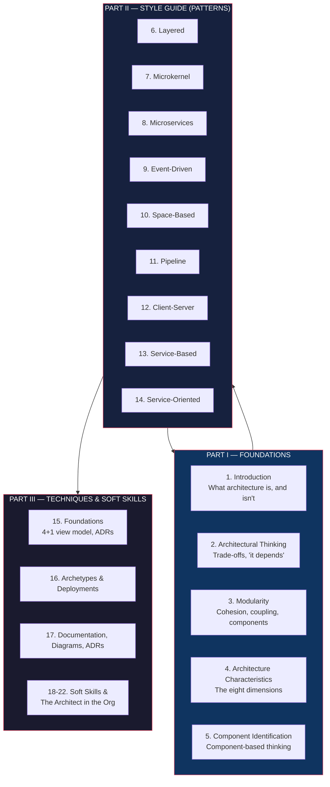

## Overview

*Fundamentals of Software Architecture* (2020) by **Mark Richards** and
**Neal Ford** is the modern practitioner's handbook for software
architecture. Where most books on the topic tilt either toward
deeply theoretical taxonomies (Shaw, Garlan) or framework-specific
recipes (Spring, Kubernetes, Lambda), Richards and Ford aim for the
middle ground: a vendor-neutral vocabulary, a set of foundational
patterns, and a way of *thinking* about systems that survives across
languages, frameworks, and tenures.

**Mark Richards** is an independent consultant, the author of O'Reilly's
*Software Architecture Fundamentals* video series, and a working
architect with three decades of experience in middleware and
distributed systems. **Neal Ford** is a director / software architect
at ThoughtWorks, the author of *The Productive Programmer* and
*Building Evolutionary Architectures*, and a long-time voice in the
software design community. Together they wrote the second book in
the trilogy, *Software Architecture: The Hard Parts* (2021), and
later volumes on the soft skills of architects. The 2020 book is the
entry point.

The argument runs like this. Software architecture is a real
engineering discipline, but most practitioners learn it by osmosis —
through code reviews, design arguments, and the slow accumulation of
scar tissue. That is not enough. Architecture is a set of
*decisions*, and decisions are best made with a vocabulary. The book
delivers that vocabulary:

- A way of **thinking architecturally** (what architecture is and
  is not; how it relates to design and to engineering).
- A **structural model** for describing any system (Kruchten's 4+1
  view model).
- A way to **characterize the problem** before reaching for a
  solution (eight architecture characteristics, grouped into
  operational, structural, and cross-cutting).
- A catalog of **nine fundamental patterns** (layered, microkernel,
  microservices, event-driven, space-based, pipeline, client-server,
  service-based, service-oriented) with explicit trade-offs for
  each.
- A **component-based approach** to decomposing systems that
  precedes technology choice.
- **Architecture Decision Records (ADRs)** as the lightest-weight
  tool for capturing decisions.
- A serious treatment of the **soft skills** of the job — the human,
  political, and organizational work that determines whether a
  technically correct architecture ever gets built.
- A discussion of **how architects fit into organizations** —
  because architecture is not what an individual designs, it is
  what a team (or many teams) actually builds.

The book is deliberately long-form, vendor-neutral, and
opinionated. It does not pretend to give a recipe. It gives a
vocabulary and a process so the practitioner can reason about *any*
recipe.

---

## Executive Summary

The book's center of gravity is the **nine-pattern style guide**.
Each pattern is treated identically: an explanation, a
topology, an example use case, a strengths/weaknesses analysis, and
a section on the architecture characteristics the pattern
strengthens or weakens. That symmetry is deliberate — it makes the
patterns *comparable*, which is the whole point. Architects do not
pick patterns in isolation. They pick them against a list of
required characteristics and the organizational reality of the team
that will build and run them.

The soft-skills half is the part most architecture books skip.
Richards and Ford make it roughly a third of the book. They argue
that the hardest part of architecture is not the technical trade-off
analysis — it is convincing humans. Negotiation, facilitation, the
art of being a 'consultant on demand,' and the political work of
managing upward all get their own chapters. A reader who finishes
the book and cannot negotiate a single change with their team has
missed the point.

---

## Key Takeaways

- **Architecture is set of decisions hard to change.** Richards
  open with this definition (after Garlan and predecessors): the
  architect's job is to make the decisions that are *expensive to
  reverse*. Everything else is design. The rest of the book
  operationalizes that definition.

- **Trade-offs are the entire game.** The phrase "it depends" is
  said so often it has become a joke. Richards and Ford reclaim it:
  every architecture decision is context-specific, and the
  professional move is to name the trade-offs explicitly rather
  than pretend they don't exist.

- **The 4+1 view model (Kruchten, 1995) is still the best tool for
  describing systems.** Four views of the same system —
  *logical* (objects, components), *process* (concurrency, threads,
  processes), *physical* (deployment, infrastructure), and
  *development* (modules, packages, source layout) — plus the
  *+1* of use cases / scenarios that tie them together. Together
  they answer the question "what does this system look like?" from
  four angles plus the user perspective.

- **The eight architecture characteristics** (per the book's
  taxonomy) are the language for describing *-ilities* and
  non-functional requirements. They group into:

  | Group | Characteristics | When evaluated |
  |---|---|---|
  | Operational | Availability, Performance, Scalability, Reliability, Recoverability, Security | Run-time |
  | Structural | Maintainability, Testability | Build / design time |
  | Cross-cutting | (varies — configurability, deployability, supportability, usability, …) | End-to-end |

  Every architecture decision should be evaluated against the
  characteristics the system actually needs.

- **The nine fundamental patterns.** Layered, microkernel,
  microservices, event-driven, space-based, pipeline, client-server,
  service-based, and service-oriented. Each has a clear topology,
  a clear use case, and clear trade-offs. The book treats them with
  the same template so a reader can compare them on equal terms.

- **Component identification precedes technology choice.** The most
  common architectural mistake is reaching for a technology
  ("let's do microservices!") before the system is decomposed into
  components. Components are a logical concept; the pattern is a
  physical one. Mixing the two makes for bad architecture.

- **ADRs are the lightest-weight tool for durability.** A template
  (Context, Decision, Status, Consequences) and a directory in the
  repo. They survive team turnover. They prevent the
  re-litigation of every decision. The book presents ADRs as the
  single highest-leverage practice an architecture group can adopt.

- **Architecture is a sociotechnical system.** Conway's law is real:
  the system will mirror the communication structure of the team
  that builds it. The architect's job is partly to design the team
  shape, not just the system shape.

- **Soft skills are not a 'nice to have.'** Roughly half the
  architect's job is communication, negotiation, and influence
  without authority. The book devotes Part III to this — including
  career advice, learning plans, and the political navigation of
  being the person who has to say no.

- **The architect is not the smartest person in the room.** They
  are the person who can *coordinate* the smartest people in the
  room. The book repeatedly returns to this theme.

---

## Who Should Read

| Read this | Skip this |
|-----------|-----------|
| Senior engineers stepping into architecture roles | Junior engineers with no production experience (the soft-skills chapters will feel abstract) |
| Tech leads responsible for multi-team system design | Pure managers with no technical fluency (the pattern chapters assume code familiarity) |
| Engineers who want a shared vocabulary with their team | Veteran architects who already have a settled pattern vocabulary (this is a fundamentals text) |
| Anyone preparing for staff/principal architecture interviews | Hands-on coders looking for a tutorial (this is about thinking, not typing) |
| Practitioners who find the space full of vendor pitches and want a vendor-neutral reference | Readers looking for a single 'best' answer — the book insists there isn't one |

---

## Core Themes

**Trade-offs over truths.** The whole book is built on the claim
that architecture is the art of choosing the right *wrong* answer.
Every pattern is a trade-off. The architect's job is to be
explicit about which trade-offs are acceptable in a given context.

**Symmetry of pattern presentation.** Each of the nine patterns
gets the same treatment: explanation, topology, examples,
strengths, weaknesses, and a checklist of which architecture
characteristics it strengthens. The reader is meant to use the
chapters as a *reference*, not read them cover to cover.

**Operational reality.** The book repeatedly ties architectural
decisions to operational concerns: deployability, observability,
scaling, failure modes. Architecture that looks great in a
diagram but cannot be operated is bad architecture. This
operational grounding distinguishes the book from older texts
that treat architecture as a static structural exercise.

**The architect as a person.** Part III is a meditation on the
human side. Career paths into architecture, learning plans,
negotiation techniques, the political work of being right and
still not getting what you want, the loneliness of the role. The
book is unusually honest about how hard the job is.

**Lightweight documentation.** ADRs, C4 diagrams, lightweight
diagrams over heavy ones, and the principle that the
documentation should be *useful*, not *comprehensive*. The book
covers documentation with the same pragmatism as the rest.

---

## Why This Book Matters

Software architecture, as a discipline, has historically suffered
from two failure modes. **The first is excessive abstraction.**
Older texts (Shaw, Garlan, Perry) are rigorous but require a
graduate-level commitment to read. **The second is framework
capture.** Recent texts often amount to "use Kubernetes, use Kafka,
use Spring Cloud" — useful but tied to a vendor and a moment in
time.

*Fundamentals of Software Architecture* occupies a useful middle
ground. It is rigorous enough to give a working vocabulary; it is
practical enough to be read by an engineer in a week. It is
vendor-neutral but not framework-blind (the patterns get concrete
when needed). And it treats the soft skills as seriously as the
hard skills — which is rare, and which makes the book useful
beyond the first reading.

For most working software engineers, this is the right second book
on architecture (after something narrower, like *Clean
Architecture* or *A Philosophy of Software Design*). It is also
the right first book to read as a *team* — the shared vocabulary it
delivers is more valuable than any individual chapter.

The book has been criticized for being wide rather than deep (the
nine patterns are necessarily compressed), and for tilting toward
the ThoughtWorks/consulting worldview (microservices and
event-driven get more love than the authors' influence might
suggest). These are real but minor weaknesses. The book does what
it sets out to do: give a working architect a complete, defensible
vocabulary for the job.

---

## Related Books

| Book | Author(s) | How It Connects |
|------|-----------|----------------|
| **Clean Architecture** | Robert C. Martin | The classic companion. Martin is more prescriptive; Richards & Ford are more trade-off-focused. The two together form a strong foundation. |
| **Patterns of Enterprise Application Architecture** | Martin Fowler | The 2002 pattern catalog. Some overlap (layered, service-layer) but FaSA is more current and broader. |
| **Building Microservices** | Sam Newman | Deeper treatment of one of the nine patterns. Best follow-up if microservices is the chosen path. |
| **Software Architecture: The Hard Parts** | Ford, Richards, Sadalage, Dehghani | The sequel. Trade-off analysis for the genuinely hard architecture decisions (when to use which database, how to break apart a monolith, etc.). |
| **Building Evolutionary Architectures** | Ford, Parsons, Kua | The companion on adaptive systems. FaSA covers static structure; BEA covers dynamic change. |
| **A Philosophy of Software Design** | John K. Ousterhout | The code-level complement. PSD is about *modules*; FaSA is about *systems*. Read both. |
| **Documenting Software Architectures** | Clements et al. | The deeper dive on the C4 model and architectural documentation. The lighter treatment in FaSA is a good intro. |
| **Designing Data-Intensive Applications** | Martin Kleppmann | The data-centric complement. FaSA covers structure; DDIA covers data flow, consistency, and storage trade-offs. |

---

## Final Verdict

**Rating: 9/10**

*Fundamentals of Software Architecture* is the most useful
single book on architecture written in the last decade for
working engineers. It is comprehensive without being
encyclopedic; it is opinionated without being dogmatic; it treats
the soft skills with the seriousness they deserve. The pattern
catalog is necessarily compressed, but the consistency of
presentation makes the chapters usable as a reference, which is
the real point.

**The strengths.** Wide scope treated with consistent depth.
Vendor-neutral. Genuinely current (microservices, event-driven,
space-based are all treated as first-class). Soft skills given
real weight. ADR advocacy is a high-leverage recommendation
most teams will benefit from.

**The weaknesses.** Nine patterns in one book means each gets
roughly 15 pages; for a team committing to a specific pattern,
you will need a deeper secondary text. The book tilts toward
the ThoughtWorks worldview — microservices and event-driven
arguably get more sympathetic treatment than their actual
production success might warrant. The soft-skills chapters can
read as consulting-style self-help if you are not in the mood.

**Bottom line.** If you are a senior engineer stepping into an
architecture role, or an architect looking to refresh your
vocabulary, this is the book to read. It is the rare architecture
book that improves with team reading — the shared vocabulary it
delivers is worth more than any individual insight. The sequel,
*The Hard Parts*, goes deeper on the trade-off analysis; the
soft-skills volumes round out the trilogy. Start here.
