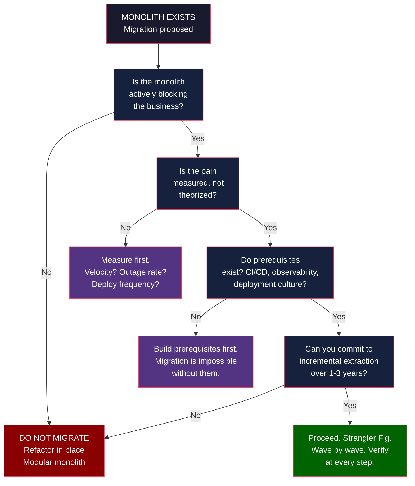
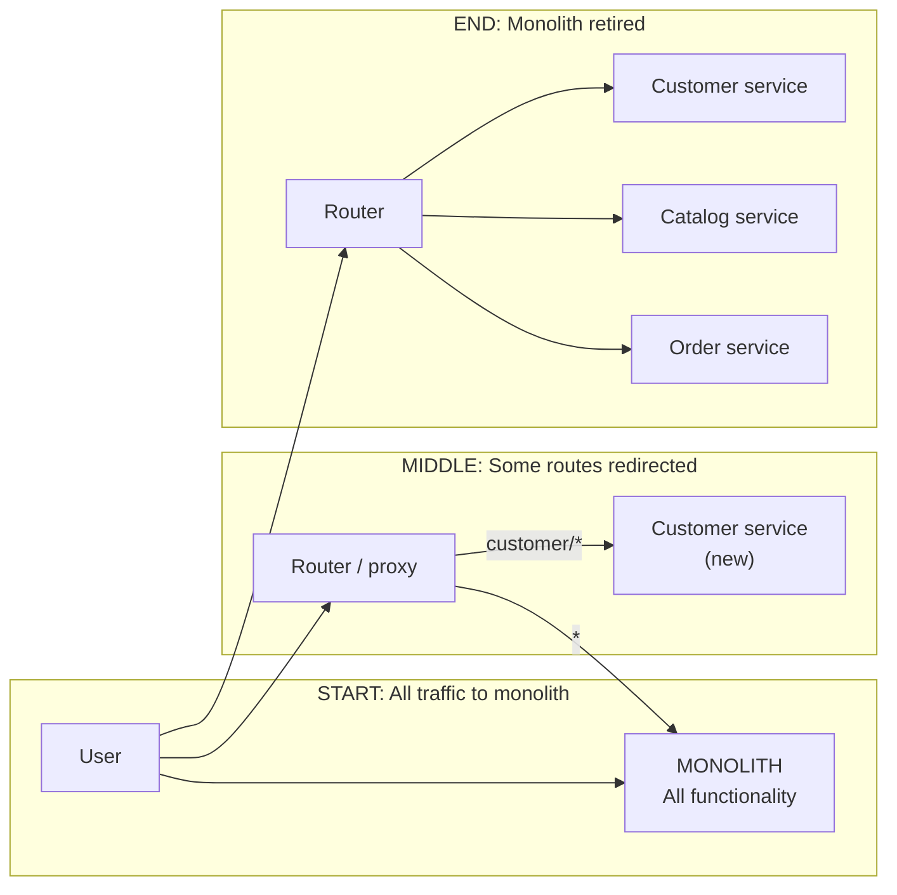
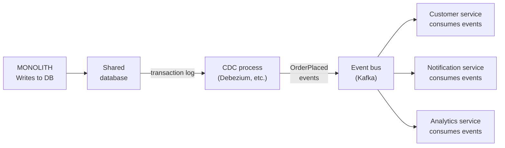
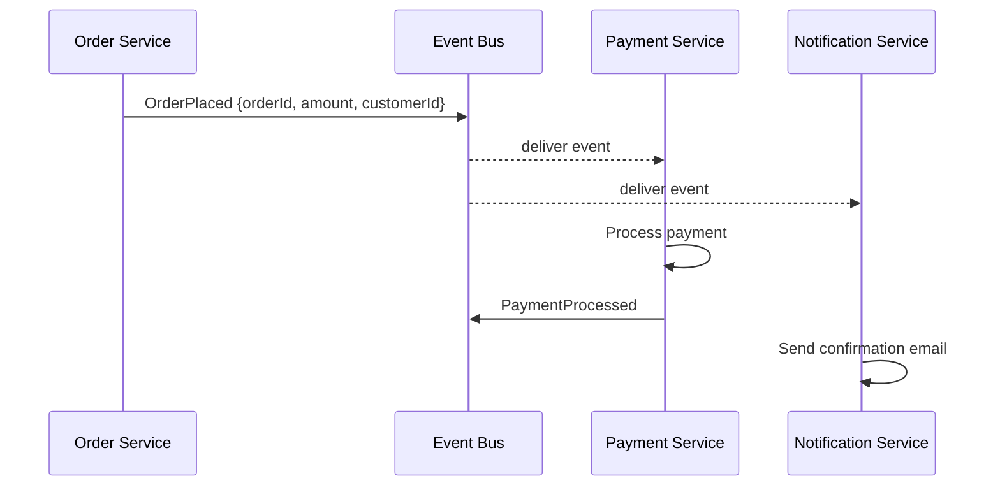
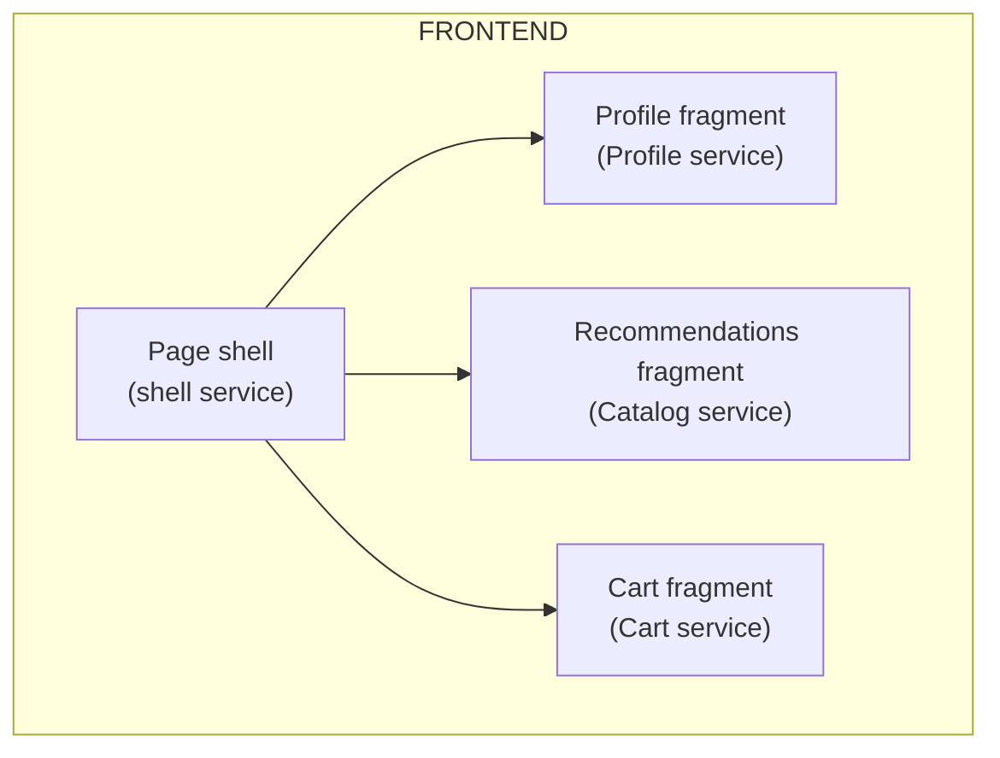
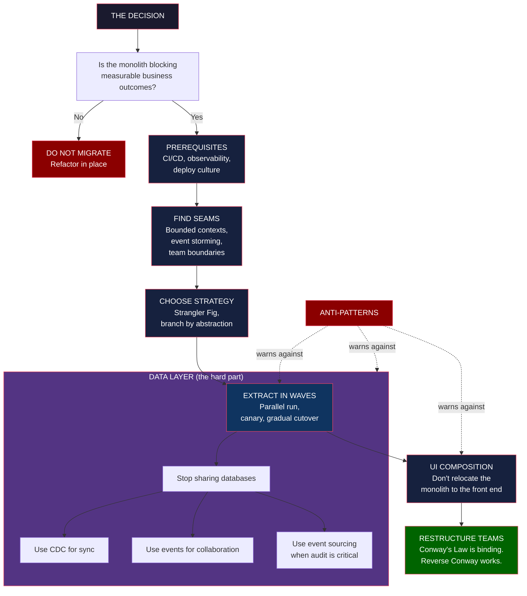

## The Decision: When to Migrate, When Not To

Newman opens with a contrarian argument that runs through the entire book: **the default answer to "should we migrate to microservices?" is no.**

Most monoliths should stay monoliths. The cost of migration is enormous — measured in years of engineering time, organizational disruption, and risk of failure. The success stories are survivorship-biased: you read about Netflix, Amazon, and Uber, and you do not read about the hundred organizations that tried the same transformation and gave up. Newman's bar for migration is high and explicitly evidence-based.

The triggers he considers legitimate:

- **Independent deployability is blocked.** A change to a single line in the codebase requires a full redeploy, a regression test of the entire system, and a maintenance window. Team velocity has collapsed.
- **Scaling is per-function impossible.** The catalog needs ten times more capacity than the checkout, but the monolith forces you to scale both together. You are paying for capacity you do not need.
- **Reliability failures cascade.** A bug in the recommendations feature takes down checkout. Shared deploys, shared databases, and shared failure domains mean one bad release is a system-wide outage.
- **Technology choice is frozen.** A new use case (machine learning inference, real-time analytics) requires infrastructure that the monolith cannot host. The team cannot experiment safely.
- **Team autonomy is impossible.** Multiple teams must coordinate every change. The bottleneck is communication, not code.

The triggers he considers *illegitimate*:

- "Microservices are the modern way to build." (Fashion, not evidence.)
- "Our monolith is ugly." (Refactoring does not require decomposition.)
- "We want to use Kubernetes." (Tool, not architecture.)
- "Our CTO read about Netflix." (Survivorship bias.)

The decision framework is deliberately weighted against migration. Newman argues that most teams who migrate would be better served by a well-structured monolith — a "modular monolith" with clear internal boundaries, ready for future extraction. The book spends more pages on the decision than on the patterns, because the patterns are useless if the decision is wrong.

---

## Finding Seams: Where to Cut

Once the decision to migrate is made, the next question is where to cut the monolith. Newman's answer is unambiguous: **decompose by capability, not by layer.** A `Customer` service beats a `Database` service. A `Recommendation` service beats a `BusinessLogic` service. The cuts should follow the natural boundaries of the business domain.

The technique for finding those boundaries comes from Domain-Driven Design (Eric Evans). **Bounded contexts** are the regions of the business model where a particular term has a single, consistent meaning. `Customer` in the billing context is not the same as `Customer` in the marketing context — they have different attributes, different lifecycles, different owners. A microservice is, in practice, a bounded context with its own data store and API.

Newman offers several techniques for finding the seams:

- **Event storming.** A workshop where domain experts and engineers map out the business events (Order Placed, Payment Received, Item Shipped) and aggregate them into bounded contexts. Surfaces hidden dependencies and shared concepts.
- **Seam analysis in the codebase.** Looking for modules that change together, modules that are deployed together, and modules that have a clear interface to the rest of the system. The natural seams are usually visible in the code.
- **Team boundaries.** Where the teams are already split, the service boundaries often already exist. This is the Reverse Conway move applied retroactively.
- **Business capability mapping.** The capabilities the business cares about (catalog, checkout, fulfillment, support) usually map cleanly to bounded contexts. Capabilities are more stable than features; they survive reorganizations.

The wrong way to find seams: by technical layer. A `Service` layer, a `Repository` layer, a `Database` layer — all of these cut horizontally through the business logic. They produce distributed monoliths (services that cannot be deployed independently, because they all need to change together), not microservices.

---

## The Strangler Fig Pattern

The single most important pattern in the book, attributed to Martin Fowler. The Strangler Fig grows a new system around an old one, replacing functionality piece by piece until the old system can be retired.

The pattern in detail:

1. **Place a routing layer in front of the monolith.** A reverse proxy, an API gateway, or a DNS-level router. All traffic still goes to the monolith.
2. **Identify the next capability to extract.** Choose something with a clean interface, a clear bounded context, and minimal shared state. Newman's heuristic: start with the easiest, prove the pattern, then take on harder extractions.
3. **Build the replacement service alongside the monolith.** New code lives in the new service. Old code still runs in the monolith. Both implementations are reachable.
4. **Run both in parallel (parallel run pattern).** The router sends the same request to both; the responses are compared. Catches semantic differences that tests miss.
5. **Switch traffic gradually.** Canary first, then small percentage, then full cutover. The old implementation stays in the codebase (or in a disabled state) for rollback.
6. **Delete the old code.** Once the new service is in production and stable, remove the legacy implementation from the monolith. This step is often skipped and always regretted.
7. **Repeat for the next capability.** The Strangler Fig grows one service at a time, on a cadence the team can sustain.

The pattern is powerful because it makes migration reversible. Every step is independently shippable and independently reversible. If the new service fails in production, traffic routes back to the monolith. If the team loses momentum, the project pauses cleanly. Big-bang rewrites cannot offer this.

Newman is explicit that the Strangler Fig is not free. You run two systems in parallel, you maintain routing logic, and you tolerate temporary code duplication. The cost is worth paying for the safety.

---

## The Data Layer: Where Migrations Die

Newman devotes three chapters to the data layer, and they are the deepest in the book. His central claim: **the data layer is where microservice migrations fail.** Service boundaries are negotiable; data ownership is not. Two services writing to the same table is not microservices — it is a distributed monolith, the worst of both worlds.

### Why Shared Databases Are a Trap

When the monolith's database is shared across multiple extracted services, every service has a transitive dependency on every other. A schema change in one service ripples to all consumers. A migration blocks the entire system. The benefits of independent deployment evaporate.

The problem is invisible at first. It looks like clean service boundaries, with each service exposing a clean API. But under the hood, the services are coupled through the shared database — a coupling that does not appear in any API documentation and does not show up in service-level tests. It shows up only at migration time, when you try to change the schema and discover that three services depend on the same table.

The fix is to give each service its own data store. But "give each service its own database" is easy to say and hard to do. The challenges:

- **Schema migration is irreversible.** Once two services depend on the same column, splitting them requires coordinated changes in both.
- **Cross-service queries are needed.** Reports, analytics, and admin tools still need data from multiple services. The shared database was a convenient way to express those queries.
- **Transactional consistency is needed.** Orders and payments must be updated atomically. The shared database was a convenient way to express that atomicity.
- **Legacy code is everywhere.** The monolith's data layer is usually a dense thicket of stored procedures, triggers, and ORM models. Untangling it is months of work.

Newman walks through the patterns for solving each of these.

### Pattern 1: Change Data Capture (CDC)

CDC treats the monolith's database as the source of truth and publishes its changes as events. A new service subscribes to the events it cares about and maintains its own read model. The monolith is unaware of the new service; the new service does not need to know the monolith's schema in detail.

Tools like Debezium read the database's transaction log (e.g., PostgreSQL's WAL) and emit change events. The new service treats these events as its data feed. This is how you extract a service from a monolith without the monolith's cooperation.

### Pattern 2: Event Collaboration

Instead of a service calling another service synchronously, it publishes an event. Other services that care about the event subscribe and react. The interaction is asynchronous, the coupling is loose, and the failure modes are different from synchronous calls.

The trade-off: you give up strong consistency. The order is placed, but the payment may take seconds to process. The notification may arrive before or after the payment. This is eventual consistency, and it requires the business to be designed for it.

Newman is explicit: this is the dominant pattern for inter-service communication in a microservice system. Synchronous calls (`Service A` calls `Service B` over HTTP) are a smell; events are the default.

### Pattern 3: Event Sourcing

Instead of storing the current state, store the sequence of events that led to it. State is a derived view, recomputable by replaying the events. This gives you a complete audit trail, time-travel debugging, and natural fit for event collaboration.

The trade-off: event sourcing is hard. Querying becomes more complex (you need materialized views to answer simple questions). Schema evolution on the event log is delicate. Newman recommends it only when the use case explicitly benefits (financial systems, audit-heavy domains).

### Pattern 4: Branch by Abstraction

A technique for changing behaviour behind a stable interface. You create an abstraction layer (a wrapper, an interface, a gateway) that the monolith uses. You implement the new behaviour inside the abstraction. You switch implementations atomically. You delete the old implementation.

This is the technique for incremental database migration. You wrap the table access in a repository, implement the new repository against a new schema, switch over, and drop the old schema. Newman uses this pattern to extract a single table at a time from a shared database.

---

## UI Composition

A chapter that is often skipped and always regretted. The front end is rarely part of the migration conversation, but it is usually a monolith too. If your back end is microservices and your front end is a single page that calls all of them, you have moved the monolith up a layer.

UI composition is the pattern: the front end itself is decomposed into components, each owned by a different team, each able to be deployed independently. A page might assemble itself from multiple UI fragments, each fetched from its own service.

Techniques include **micro-frontends** (each team owns a self-contained bundle of UI), **server-side composition** (the page is assembled by an aggregator, not the browser), and **edge-side includes** (fragments are cached and stitched at the CDN). Newman is pragmatic — the right answer depends on the team structure, the deployment cadence, and the user experience requirements.

The key warning: do not let the back end become microservices and the front end remain a monolith. The communication bottleneck moves to the front end. The deployment coupling moves to the front end. The shared failure modes move to the front end. You have not fixed the problem; you have relocated it.

---

## Organizational Change and Conway's Law

The book's final movement is on people. Newman is explicit: **Conway's Law is binding.** The architecture of a system mirrors the communication structure of the organization that built it. If your team structure is monolithic, your architecture will be monolithic, no matter how many services you extract.

The implication is bidirectional. If you want a microservice architecture, you must have a team structure that supports it — small, autonomous, long-lived teams each owning a service. The Reverse Conway move: restructure the teams first, and the architecture will follow.

Newman's prerequisites for a successful migration:

- **CI/CD.** Every service must be independently deployable. If a deploy takes a week of manual coordination, you cannot extract services.
- **Observability.** Centralized logging, distributed tracing, metrics. If you cannot see what is happening across services, you cannot operate them.
- **Containerization.** Lightweight, reproducible deployment. Kubernetes or equivalent. Not strictly required, but the de facto baseline.
- **Feature flags.** The ability to switch behaviour in production without a deploy. Essential for canary releases and gradual cutover.
- **A deployment culture.** Teams that are comfortable deploying, monitoring, and rolling back their own services. Without this, no amount of tooling will save you.

If you do not have these, Newman argues, the migration is doomed. The patterns assume a mature platform; the alternatives (manual deploys, shared logs, on-call chaos) make the patterns impossible to execute safely.

---

## Anti-Patterns

Newman names the failure modes he has seen. The list is the book at its most practical — these are the traps to avoid.

- **Distributed Monolith.** Services that cannot be deployed independently. A schema change in one requires coordinated changes in all. The worst of both worlds: distributed complexity with monolithic coupling.
- **Microservice Envy.** Decomposing too small, too early. A "service" with one function and one endpoint. Operational overhead exceeds the benefit.
- **The Shared Database Trap.** Two services writing to the same table. See above. The most common cause of failure.
- **Chatty Services.** Services that call each other in tight loops, with no batching, no caching, no aggregation. Network latency dominates. The architecture is correct; the implementation is hostile.
- **Time-Dependent Coupling.** Services that depend on a shared clock or a shared cron schedule. A "deploy at midnight" service is coupled to every other service's midnight behaviour.
- **Front-End Bottleneck.** A monolithic front end calling microservices. The problem has been moved, not solved.
- **Stateless Hype.** Believing services must be stateless at all costs. Stateful services are fine, if state is owned and managed deliberately.
- **Premature Decomposition.** Extracting services before the bounded context is stable. The seam moves; the service has to be rewritten. Newman's advice: extract later than you think, not earlier.

---

## Frameworks

---

## Mental Models

| Model | Application |
|-------|-------------|
| **Strangler Fig** | Migration is growth, not replacement. New system grows around old; old is retired when nothing calls it. |
| **Bounded Context** | A region of the business where a term has one meaning. The natural unit of decomposition. |
| **Anti-Corruption Layer** | A translation layer between the monolith and the new service. Prevents legacy concepts from leaking into the new system. |
| **Parallel Run** | Both old and new implementations process the same traffic; responses are compared. Catches semantic differences. |
| **Conway's Law** | Architecture mirrors organization. To change architecture, change the teams first. |
| **Reverse Conway Maneuver** | Restructure the team intentionally, and the architecture will follow. |
| **Distributed Monolith** | The anti-pattern: services that cannot be deployed independently. Worst of both worlds. |
| **Premature Decomposition** | Extracting services before the bounded context is stable. The seam moves; the service is rewritten. |
| **CDC** | The monolith's transaction log is the source of truth. New services subscribe to change events. |
| **Eventual Consistency** | The default for inter-service communication. The business must be designed for it. |

---

## Key Lessons

1. **The default is no migration.** Newman's most important lesson. Most monoliths should stay. The cost is high, the failure rate is high, the success stories are survivorship-biased.
2. **The Strangler Fig is the only safe pattern.** Big-bang rewrites fail. Incremental extraction is reversible at every step.
3. **Decompose by capability.** A `Customer` service beats a `Database` service. Capability-aligned services are autonomous and durable.
4. **The data layer is the hard part.** Service boundaries are negotiable; data ownership is not. CDC, events, and event sourcing are the patterns that make data-layer migration possible.
5. **Shared databases are a trap.** Two services writing to one table is a distributed monolith. The single most common cause of failure.
6. **UI composition is part of the migration.** A monolithic front end calling microservices is not microservices. The problem has been moved, not solved.
7. **Migrate in waves.** Each wave extracts one service, verifies it, and retires the old code. Skip the verification step at your peril.
8. **Conway's Law is binding.** Migration and team restructuring must proceed together. Sequencing is impossible.
9. **Prerequisites are not optional.** CI/CD, observability, containerization, feature flags, and a deployment culture. Without these, the patterns cannot be executed safely.
10. **Anti-patterns are predictable.** Distributed monolith, microservice envy, chatty services. Newman has watched each destroy real projects.

---

## Practical Applications

**Auditing a proposed migration**: Before committing, run Newman's decision test. Is the monolith blocking measurable business outcomes (deploy frequency, lead time, MTTR, change failure rate)? If not, the migration is not justified. If yes, are the prerequisites in place? If not, building them is the first wave.

**Finding the first extraction**: Use event storming. Invite domain experts and engineers. Map the business events. Cluster them into bounded contexts. The context with the cleanest interface and the most stable model is the first extraction.

**Splitting a shared database**: Start with a single table. Wrap its access in a repository (branch by abstraction). Implement the new repository against a new schema. Run both in parallel. Compare results. Switch the read path first, then the write path. Drop the old table. Repeat for the next table.

**Building a new service alongside the monolith**: Place a routing layer (API gateway, reverse proxy) in front of the monolith. Build the new service. Route a small percentage of traffic to the new service. Use feature flags to control the cutover. Compare metrics. Increase the percentage. Retire the old path.

**Reorganizing the team for migration**: Identify the bounded contexts. Assign a long-lived team to each. Move the relevant code, the relevant database tables, and the relevant on-call rotation to the new team. Give them a deployment pipeline and a clear interface to the rest of the system. The architecture will follow.

**Detecting anti-patterns early**: Watch for these signals. Two services writing to the same table. Synchronous chains of calls deeper than two. A single front end calling all services. A shared schema change that requires coordinated deploys. Any of these means the migration has stalled or failed; revert the relevant changes.

---

## Examples

**The E-Commerce Migration (composite)**: A retailer with a 10-year-old PHP monolith serving 50,000 orders/day. Newman's prescription: extract the `Recommendations` capability first (clean bounded context, read-mostly, low risk). Use CDC to populate a new `Recommendations` service from the monolith's order events. Run in parallel for a month. Cut over. Move to `Inventory`, then `Checkout`. Avoid the temptation to extract `Customer` first — it touches everything.

**The Shared-Database Disaster (cautionary)**: A financial services company extracted 12 services from a Java monolith, but kept the shared Oracle database. Two years later, a schema change in the `Account` table required coordinated deploys of all 12 services. The migration had not improved deploy frequency; it had only added network calls. The fix: a multi-year data-layer migration, one table at a time, using branch by abstraction.

**The Front-End Bottleneck (common)**: A media company decomposed its back end into 30 services, but kept its Ruby on Rails front end as a single page calling all of them. Every deploy of any service required a front-end deploy. Every front-end deploy required regression tests of all 30 services. The "microservices" had improved nothing; the bottleneck had simply moved. The fix: UI composition, with each team owning its own front-end bundle.

**The Premature Decomposition (cautionary)**: A startup decomposed its 6-month-old monolith into 15 services because microservices were fashionable. Each service was a thin wrapper around a few database tables. The operational overhead (15 deploy pipelines, 15 sets of metrics, 15 on-call rotations) exceeded the engineering capacity. Two years later, the company was consolidating back into a modular monolith.

**The Conway Fix (positive)**: A bank restructured its IT teams around bounded contexts (retail, commercial, treasury, risk) and let the architecture follow. The monolith persisted, but the team structure enabled future extraction. Five years later, the bank is migrating, but the migration is feasible because the teams are already aligned.

---

## Action Plan

1. **Run Newman's decision test.** Is the monolith blocking measurable business outcomes? If not, do not migrate. Refactor in place.
2. **Inventory the prerequisites.** Do you have CI/CD, central logging, distributed tracing, feature flags, and a deployment culture? If not, build them. They are the first wave.
3. **Find the seams.** Use event storming, bounded-context analysis, or team-boundary analysis. Pick the cleanest, most stable bounded context as your first extraction.
4. **Place a routing layer in front of the monolith.** API gateway or reverse proxy. All traffic still goes to the monolith.
5. **Build the new service alongside.** New code in the new service. Old code stays. Both implementations are reachable.
6. **Run both in parallel.** Send the same traffic to both. Compare responses. Catch semantic differences.
7. **Switch traffic gradually.** Canary, 1%, 10%, 50%, 100%. Roll back at the first sign of trouble.
8. **Delete the old code.** This step is often skipped and always regretted. The Strangler Fig only works if the old system is actually strangled.
9. **Reorganize the team.** Each bounded context gets a long-lived team. Move code, data, and on-call rotation to the new team. Conway's Law will do the rest.
10. **Watch for anti-patterns.** Shared databases, chatty services, front-end bottlenecks, premature decomposition. Catch them early. Revert when you see them.
