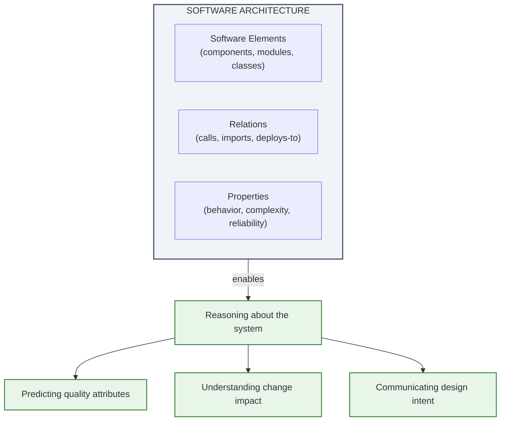
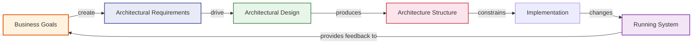
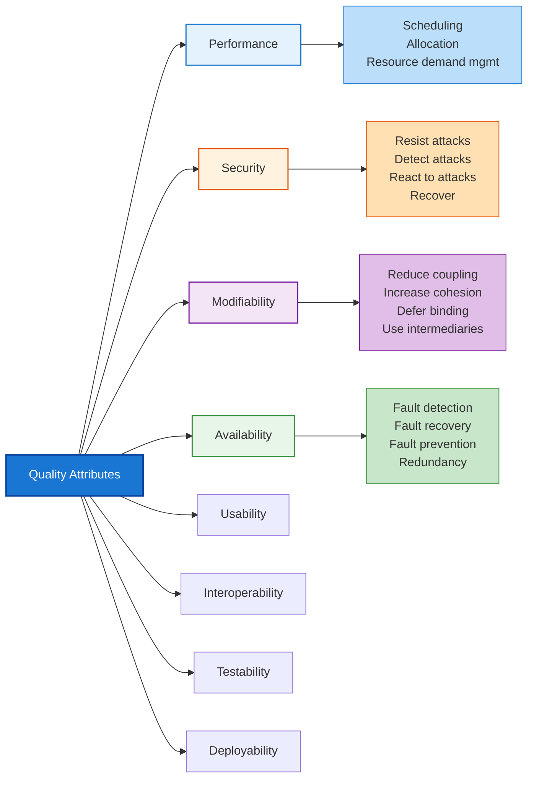
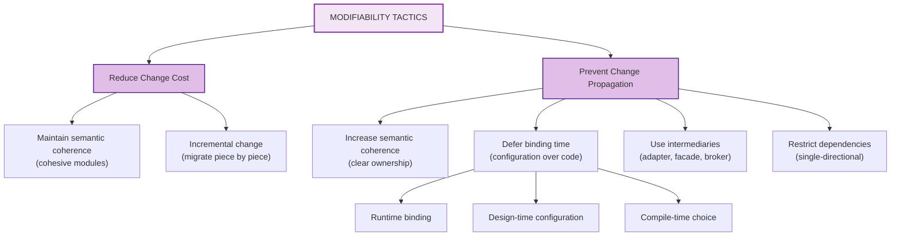
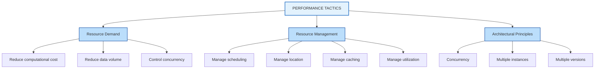
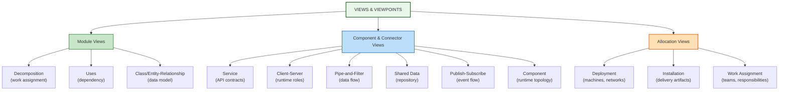
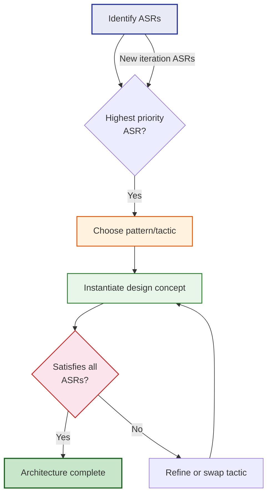
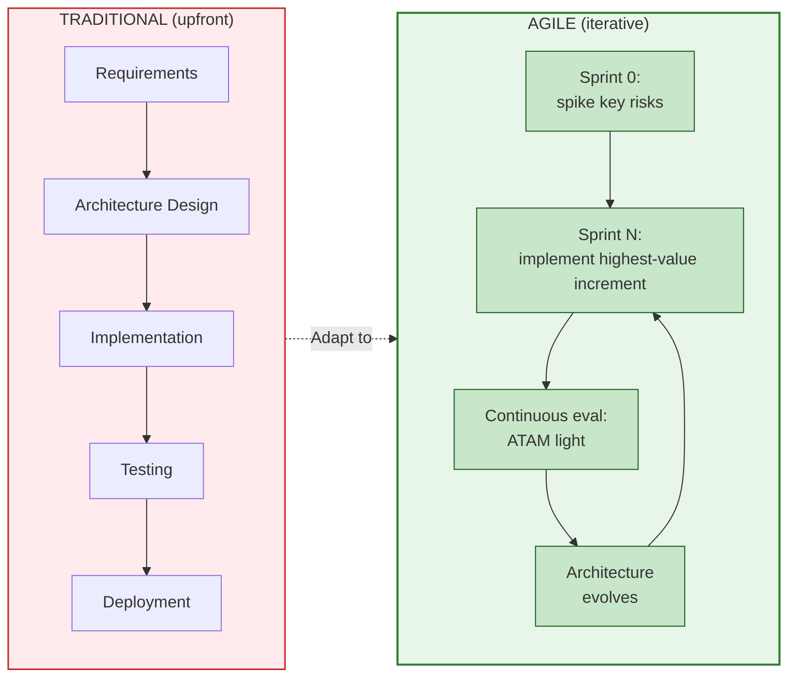

## Software Architecture as Sets of Structures

The book opens with its foundational definition, repeated and refined across every edition:

> The software architecture of a system is the set of structures needed to reason about the system, which comprise software elements, relations among them, and the properties of both.

Two parts matter. First, architecture is not a diagram or a document; it is the *structures* that exist in the system regardless of whether anyone records them. Second, architecture exists to support *reasoning* — analysis, prediction, and decision-making by stakeholders.

Every stakeholder cares about a different structure. The developer cares about the module decomposition — what can be edited in isolation. The operator cares about the runtime structure — what can crash, what can scale, what talks to what. The project manager cares about the work-assignment structure — who builds what, in what order. Architecture must serve all of these simultaneously.

---

## The Architecture Business Cycle

Architecture does not exist in a vacuum. Business goals drive requirements. Requirements shape architecture. The resulting architecture imposes constraints on future business options. The Architecture Business Cycle (ABC) makes this feedback loop explicit.

Ignoring the cycle produces architectures that satisfy abstract technical ideals while failing the business they were supposed to serve. The ABC is the book's primary mechanism for keeping architecture grounded in organizational reality.

---

## Quality Attributes: The True Drivers of Architecture

Functionality tells you *what* a system does. Quality attributes tell you *how well* it does it. And it is quality attributes — not features — that make one architecture preferable to another.

### Defining Quality Attributes

The book defines each major quality attribute through four facets:

| Facet | Description |
|---|---|
| **Stimulus** | The condition that provokes a quality response (e.g., "a spike in traffic") |
| **Response** | How the system should react (e.g., "continue serving requests without error") |
| **Measure** | How to judge whether the response was adequate (e.g., "99.9% availability during the spike") |
| **Context** | The situation in which the response occurs (e.g., "during peak business hours") |

Only by specifying all four facets does a vague requirement ("the system must be available") become a testable quality attribute scenario.

### The Quality Attribute Taxonomy

The book groups quality attributes into roughly eight primary categories, each with its own set of tactics:

---

## Architectural Tactics and Patterns

Tactics and patterns are the two primary tools for achieving quality attributes in architecture.

### Tactics

A **tactic** is a design-level primitive — a specific structural or behavioral decision that influences a quality attribute response. Tactics are the vocabulary of architectural design.

**Modifiability tactics** address the cost and risk of making changes:

**Performance tactics** address throughput, latency, and resource utilization:

**Security tactics** follow a lifecycle model — resist, detect, react, recover — at each architectural layer.

### Patterns

An **architectural pattern** is a named, documented solution to a recurring architectural problem in a specific context. Unlike a style, which describes the broad organization of an entire system, a pattern operates at a finer granularity and targets a single quality attribute concern.

The relationship: a style provides the palette; patterns are the brushes; tactics are the strokes.

---

## Views and Viewpoints: Documenting Architecture

Architecture documentation is not a single document. It is a **package** of views, each addressing the concerns of a specific stakeholder group. This is the book's most influential contribution to practice — a structured alternative to the chaotic "draw some boxes and arrows" approach.

### The View Classification

A **viewpoint** is a convention for constructing, presenting, and analyzing a view — the "how to" behind a view. A **view** is an instance — the actual representation created using a viewpoint. A **documentation package** collects views, viewpoints, and supporting documentation (rationale, requirements mapping, glossary) into a coherent artifact.

---

## Attribute-Driven Design (ADD)

ADD is the book's answer to "how do I *create* an architecture?" It is a recursive, top-down method:

1. Identify all architecturally significant requirements (ASRs), prioritizing quality attribute scenarios.
2. For the most important ASR, choose a design concept — a style, pattern, or tactic — that directly addresses it.
3. Instantiate the concept: Create the structural elements, assign their responsibilities, define their interfaces.
4. Check the design against all ASRs. If satisfied, proceed. If not, refine.
5. Repeat for remaining ASRs, recalculating priorities as the design evolves.

ADD produces architectures that are *provably* motivated by requirements, not by the architect's intuition or fashion.

---

## Common Architectural Styles

The book surveys the dominant architectural styles as reference points. Each makes different tradeoffs among quality attributes:

| Style | Primary Communication | Key Quality Attribute Effects |
|---|---|---|
| **Layered** | Downward calls only | Modifiability (separation), testability |
| **Client-Server** | Request-response | Modifiability, deployability |
| **Pipe-and-Filter** | Stream-oriented data flow | Performance, reusability |
| **Shared Data (Repository)** | Central data access | Data integrity, concurrency |
| **Publish-Subscribe** | Anonymous event broadcast | Modifiability, availability, scalability |
| **Microkernel** | Plugin registration | Modifiability, extensibility |
| **Service-Oriented** | Service contracts | Interoperability, modifiability |
| **Client-Server with brokers** | Remote procedure call | Interoperability, flexibility |

No style is universally correct. The 4th edition's key addition: **microservices are best understood as a deployment-time composition of established styles**, typically publish-subscribe or client-server, applied to independently deployable services. The debate is therefore not "microservices or monolith" but "which style beneath the deployment boundary."

---

## Architecture in the Life Cycle

The book's treatment of how architecture fits into software development has evolved across editions. Early editions assumed a waterfall model. By the 4th edition, the advice has been thoroughly adapted to Agile and DevOps.

In Agile contexts, architecture is not done once at the start. It is done continuously — starting with a minimal viable architecture (MVA) that addresses the most significant risks, then evolving it through sprint-by-sprint evaluation. The ADD method and lightweight ATAM variants (called **Lightweight Architecture Evaluation**, or LAE) are designed for exactly this cadence.
