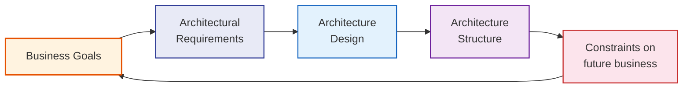

## Introduction

Welcome to BookAtlas. Today we are talking about the book that essentially *defined* the field it covers: *Software Architecture in Practice* by Len Bass, Paul Clements, and Rick Kazman. Fourth edition, 2022. Addison-Wesley. Over 600 pages. This is a heavy book in every sense of the word.

If you have ever sat through a design review where someone drew boxes on a whiteboard and everyone disagreed about what the boxes meant — this book is the cure for that. If you have ever built a system that worked perfectly in production until the one thing nobody planned for happened — this book explains why that happens and how to prevent it. If you have ever heard an architect say "trust me, the design will handle that" with no way to check — this book gives you the methods to ask the right questions before the code is written.

This is a textbook. It is not always easy reading. But it is a textbook that has been continuously revised for over 25 years because it genuinely works.

---

## Who Are the Authors?

Let me say a word about the authors, because authority matters in architecture. Authority is earned in the field, not in the classroom alone.

**Len Bass** has been at the Software Engineering Institute at Carnegie Mellon since essentially the beginning of the institute. SEI is where "software architecture" became a real discipline in the early 1990s. Bass has been there through the entire evolution. He has consulted on architectures in aerospace, telecommunications, military systems, and large-scale enterprise software. When he speaks, he is speaking from hundreds of evaluations.

**Paul Clements** is a senior SEI researcher and one of the leading practitioners of architecture evaluation. His work on ATAM — the Architecture Tradeoff Analysis Method — is the single most widely adopted architecture evaluation technique in the industry. When people say "we did an ATAM," Clements is one of the people who built that method.

**Rick Kazman** is a professor at the University of Hawaii and has been involved with SEI for decades. His research spans architectural design, evaluation, and decision-making. He co-created the architectural pattern literature and helped develop SAAM — the predecessor to ATAM. He brings both the academic rigor and the real-world consulting experience.

Together these three have evaluated more architectures — in more domains, under more pressure — than almost anyone alive. That matters. This is not a book of theory. It is a book of tested practice.

---

## The Central Definition

Let me start with the book's thesis, because everything that follows flows from it.

**Software architecture is the set of structures needed to reason about a system.**

That is the definition. Note what it does *not* say. It does not say architecture is a diagram. It does not say architecture is a document. It does not say architecture is the thing you draw before you write code.

It says architecture is the *structures* — the actual elements, relationships, and properties that exist in the system, whether you have drawn them or not. And its purpose is to enable *reasoning* — analysis, prediction, decision-making.

A stakeholder needs to reason about something. A developer needs to reason about what they can change without breaking others. An operator needs to reason about what can fail and what happens when it does. A project manager needs to reason about who is responsible for what. Each of those reasons needs a different structure. The architecture must contain — or be expressible as — all of them.

---

## The Problem: Functionality Is Not Architecture

Here is the trap most architects fall into. They confuse functionality with architecture. They think "I designed the architecture when I chose the API." No. You designed a module. You did not design the architecture.

The architecture is the structures that determine what the system *cannot* do easily. It is the set of constraints that limit future changes. If you can change your mind tomorrow without rewriting half the system, you did not make an architectural decision — you made a detailed design choice.

This distinction matters because it determines which decisions deserve investment and which do not. The book's core claim: architecture is the carrier of the earliest, and hence most-fundamental, hardest-to-change design decisions. Getting them wrong is enormously expensive. Getting them right sets the trajectory for everything that follows.

---

## Quality Attributes: Where Architecture Earns Its Keep

So what should architecture be designed to achieve? The answer is: **quality attributes**.

Functionality is table stakes. Every system has functionality. What makes one architecture better than another is how well it achieves qualities that matter to the stakeholders. And these qualities are not vague preferences. They can be made concrete through scenarios.

Here is the book's method. Take a quality attribute. Rather than saying "the system must be modifiable," specify it as a scenario:

> **Stimulus:** A developer needs to add a new reporting aggregate to the financial analytics module.
> **Response:** The system provides a documented extension point that allows the new aggregate without modifying other aggregates or the query engine.
> **Measure:** The change takes no more than four person-hours and requires no regression testing of existing aggregates.
> **Context:** The system is running in production and supporting concurrent users.

See the difference? This is not a wish. It is a requirement with measurable criteria. An architect can now design a structure — an extension point, a plugin interface, a registry — that specifically addresses this scenario. And you can evaluate whether the design actually satisfies it before writing a line of implementation code.

The book organizes quality attributes into families with their own sets of tactics:

**Modifiability tactics.** Reduce coupling between modules. Increase cohesion within them. Defer binding to runtime rather than compile time. Use intermediaries — adapters, facades, brokers — so that changes are isolated to specific connectors rather than propagating everywhere.

**Performance tactics.** Control resource demand: reduce computational cost, compress data, limit concurrency where it hurts. Manage resources: schedule efficiently, cache intelligently, replicate data to reduce contention. Add architectural structure: support asynchronous communication, parallelize independent work.

**Availability tactics.** Think in terms of fault prevention, fault detection, fault recovery. Redundancy — multiple instances, geographic replication. Fault detection — heartbeats, checksums, timeouts. Recovery — rollback, graceful degradation, failover. These are not operational concerns. They are architectural structures.

**Security tactics.** A layered strategy: resist attacks through authentication, authorization, encryption, and input validation. Detect attacks through monitoring, audit trails, and anomaly detection. React to attacks through isolation, quarantine, and incident response procedures. Recover through backup restoration and service restoration.

Each of these has a corresponding set of design patterns and structural decisions that an architect can apply. This is what makes the book practical: it connects the abstract quality requirement all the way down to a structural decision.

---

## The Architecture Business Cycle

This is one of the book's most important contributions and one that is less discussed in industry than it should be.

The Business Cycle says: architecture is not a purely technical artifact. It is shaped by business context. And it shapes the business back.

Business goals create requirements. Requirements create architecture. The architecture creates constraints — technical debt, maintenance costs, vendor lock-in, performance ceilings — that either enable or limit future business options. The organization then updates its goals, and the cycle repeats.

Why does this matter? Because many architecture failures are not technical failures. They are *business* failures dressed up as technical failures. An architect designed a clean, elegant system that could not be deployed on the cloud because the company had internal policy constraints the architect never asked about. A product team could not ship a feature because the modular structure made it technically impossible to compose. These are ABC failures, not code failures.

---

## Documenting Architecture: Views and Viewpoints

Here is where the book has its greatest practical impact for day-to-day work. The book argues that architecture documentation must be structured around *views*. Each view serves a different stakeholder and addresses a different concern. No single view is sufficient.

The 4th edition identifies three primary view families:

**Module views** describe the decomposition of the system into units of implementation — classes, packages, subsystems. A developer reading a module view learns what is implemented where and what they can change without touching someone else's code.

**Component-and-connector views** describe the runtime structure — the components that execute, the connectors that mediate their interaction, and the configuration that governs their deployment. An operator reading a C&C view learns what runs, how it communicates, and what happens if one piece fails.

**Allocation views** describe how software elements are mapped to non-software contexts: hardware machines, development teams, file systems, and organizational units. A project manager reading an allocation view learns who is responsible for what and where each piece lives in the physical infrastructure.

The rationale is elegant in its simplicity: every stakeholder has a question architecture must answer. If your documentation does not provide the answer, the stakeholder will infer it — often incorrectly — from a view meant for someone else.

---

## The Attribute-Driven Design Method

ADD is the book's structured approach to *creating* architecture from requirements. It is important because most architects design by intuition, experience, or fashion. ADD makes the process repeatable and evidence-based.

The method is iterative. You begin with your prioritized quality attribute scenarios. You select the scenario with the highest priority. You search for a design concept — a style, pattern, or tactic — that directly addresses that scenario. You instantiate it: create the structural elements, assign responsibilities, define interfaces. Then you check whether the emerging design still satisfies all scenarios. If it does, you proceed to the next prioritized scenario. If it does not, you refine or replace your design choice.

This is recursive by design. ADD does not produce a finished architecture in one pass. It produces a sequence of refinements, each motivated by a specific requirement and each checked against all previously satisfied requirements. The result is an architecture with a clear *traceability chain* back to its source requirements. Anyone can ask "why was this module structured this way?" and you can point to the scenario that required it.

---

## ATAM: Evaluating Before You Commit

This is the book's most famous method. ATAM — the Architecture Tradeoff Analysis Method — is a structured evaluation process that brings together architects, stakeholders, and evaluators to surface the risks and tradeoffs in a design before construction begins.

A **sensitivity point** is a design decision that has a large effect on a quality attribute. Changing it — even slightly — meaningfully changes the quality. Sensitivity points are where architecture is most fragile.

A **tradeoff** is a design decision that positively affects one quality attribute while negatively affecting another. Caching improves performance but complicates modifiability. Replication improves availability but hinders security. Every architectural decision has costs.

ATAM works by:

1. Presenting the business drivers and architectural approach.
2. Generating quality attribute utility tree — mapping scenarios to priorities.
3. Analyzing the architecture against the highest-priority scenarios.
4. Identifying sensitivity points and tradeoffs.
5. Presenting findings to stakeholders in plain language.

It does not produce a scorecard. It does not declare a pass or fail. It produces *shared understanding* — a map of where the design is strong, where it is risky, and which decisions have the highest stakes. This map becomes the input to the next round of design iterations.

---

## Architecture in Modern Practice

The 4th edition — the current one — made a significant addition to the book's life-cycle discussion. The authors directly address how architecture fits into Agile, DevOps, and cloud-native environments.

The message: architecture does not go away in Agile. It changes form. Instead of a big upfront design, you produce a minimal viable architecture that addresses the most significant risks, then evolve it continuously through lightweight evaluation. ATAM itself has a lightweight variant called **Lightweight Architecture Evaluation**, designed to be incorporated into sprint reviews or architecture checkpoints.

The 4th edition also clarifies a point that has been the source of endless industry confusion: **microservices are a deployment pattern, not an architectural style**. A microservice is a bounded, independently deployable unit. The architectural style — RESTful services, event-driven, CQRS, event sourcing — is what determines the quality attributes of the system. "Should we use microservices?" is the wrong question. "Which architectural style best achieves our quality attribute requirements, and how should we deploy it?" is the right one.

---

## Where Architecture Ends and Design Begins

This is a distinction the book handles carefully. The boundary is not a line in the sand. It is a gradient defined by *scope* and *difficulty of change*.

A decision whose reversal requires coordinated changes across many modules, teams, or deployment boundaries is architectural. A decision whose reversal requires changes within a single module or class is design-level.

This means the boundary moves as the system evolves. What was architectural in a monolith may be design-level in a service-oriented system, and vice versa. The architect's responsibility is not to draw a permanent line but to understand which decisions have architectural consequences *today* and to revisit that assessment as the system and its context change.

---

## The Architecture Manager's Job

The final theme: architecture is not solely the architect's job. It is the organization's job. Architecture decisions must be governed, communicated, and enforced. Technical debt — at the architecture level — must be tracked and managed. Organizational changes — team restructuring, acquisition, product pivots — must be assessed for architectural impact.

The book calls this **architecture management** and treats it as a first-class concern, not an afterthought. Architecture governance boards, architectural decision records, quality attribute workshops for new teams, and regular architecture evaluations are all part of the management discipline. Skipping them is the professional equivalent of skipping code reviews.

---

## The Book's Legacy and Limits

This book is not perfect. It is long. It is abstract in places. Some of its examples — telecommunications switches, aerospace systems, large government IT programs — come from domains far removed from the web apps most engineers build today. And its language of "tactics" and "styles" can feel dated when compared with the vibrant pattern vocabulary of the cloud-native community.

But its core ideas have not aged. Quality attribute scenarios are still the best way to make non-functional requirements operational. Views and viewpoints are still the best framework for architecture documentation. ATAM is still the most rigorous evaluation method available, even if most teams use its lightweight cousin. ADD's core insight — that architecture should be traceable to requirements — is something most systems still fail to achieve.

*Software Architecture in Practice* is not a book you finish and put aside. It is a reference you return to at different stages of a project. Before a design review, read Chapter 8. Before a documentation effort, read Chapter 9. Before an evaluation, read Chapter 6. Before a requirements workshop, read Chapter 3.

It is a textbook that earned its place on every serious architect's shelf. Read it. Re-read it. Use it.
