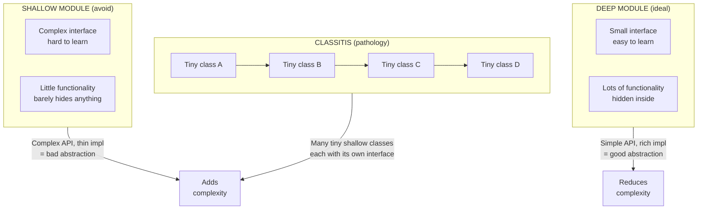

## Complexity: The Fundamental Problem

Ousterhout's starting point: **complexity is the fundamental
limitation in software development**. Not performance. Not features.
Not even correctness, because an incomprehensible system cannot be
made correct.

He defines complexity as:

> Anything related to the structure of a software system that makes it
> hard to understand and modify the system.

Complexity has two root causes:

- **Dependencies.** Code in one place cannot be changed without
  understanding or modifying code elsewhere. Every dependency is a
  cognitive tax.
- **Obscurity.** Important information is not obvious. A variable's
  purpose, a function's side effects, the reason code is written a
  certain way — all hidden.

Complexity is **incremental**. It arrives not in a single bad decision
but in hundreds of small ones: a special case here, a pass-through
variable there, a vague name somewhere else. Each feels harmless in
isolation. Together, they cripple a system.

Ousterhout distinguishes two approaches to this reality:

| Approach | Mindset | Outcome |
|---|---|---|
| Tactical programming | Get the next feature working as fast as possible | Complexity accumulates; system slows to a crawl |
| Strategic programming | Invest in good design as you go | Complexity stays manageable; velocity is sustainable |

Tactical programming is the default for most developers. Ousterhout
argues it is the single biggest source of long-term complexity.

---

## Deep Modules

The central concept of the book. Every module has two parts:

- **Interface:** everything a developer must know to use the module
  (method signatures, behavior, side effects, constraints).
- **Implementation:** the code that fulfills the interface's promises.

Ousterhout visualizes modules as rectangles. The area is the
functionality provided. The top edge is the interface complexity.



The best modules are **deep**: simple interface, lots of functionality.
The worst are **shallow**: interface nearly as complex as the
implementation, offering little leverage.

### Examples

**Deep module — Unix file I/O.** Five functions: `open`, `read`,
`write`, `close`, `lseek`. Behind them: disk scheduling, caching,
permissions, device drivers, filesystem layout — hundreds of thousands
of lines. Users never see it.

**Deep module — garbage collector.** Essentially no interface at all.
Enormous complexity completely hidden from the programmer.

**Shallow module — linked list class.** The interface (`add`,
`remove`, `get`, `size`) is about as complex as the implementation.
The abstraction hides almost nothing. You might as well inline it.

**Shallow method — `addNullValueForAttribute`.** A one-liner that
sets a map entry to null. The caller must understand the full
implementation. The method signature is longer than the body.
Ousterhout uses this example to argue that not every method deserves
to exist.

### Classitis

Ousterhout coins **classitis** for the syndrome where developers
believe "classes are good, therefore more classes are better." This
produces hundreds of tiny, shallow classes, each with its own interface.
The interfaces accumulate, creating overwhelming system-level
complexity. The Java standard library's I/O classes are his recurring
cautionary example: `FileInputStream`, `BufferedInputStream`,
`DataInputStream`, `ObjectInputStream` — each shallow individually,
devastating collectively.

---

## Information Hiding

First described by David Parnas in 1972. Ousterhout calls it **the
most important technique for achieving deep modules**.

Each module should encapsulate a few pieces of **knowledge** — design
decisions that are likely to change. Other modules should not need to
know those decisions.

### Benefits

1.  **Simplifies the interface.** If callers do not know the internal
    details, the interface can be much smaller.

2.  **Enables independent evolution.** A hidden decision can be
    changed without affecting other modules. The Unix filesystem
    evolved from UFS to ZFS to ext4; the five-function interface never
    changed.

### Information Leakage

The opposite of information hiding. It occurs when the same knowledge
is spread across multiple modules. Example: two classes that both
depend on the same file format. When the format changes, both must
change — even though the format is not reflected in either interface.

**Red flag:** if changing A requires changing B, and the relationship
is not captured in A's interface, information is leaking.

### Temporal Decomposition

A common source of leakage. When decomposing a system, developers
naturally follow the **order of execution**: read the input, parse it,
process it, write the output. This produces modules that each know
too much about the overall flow.

Ousterhout's advice: decompose by **knowledge**, not by timeline.
Group together everything that knows about a particular design
decision, even if those pieces execute at different times.

---

## Different Layer, Different Abstraction

Software systems are layered: A calls B, B calls C. Ousterhout's rule:
**each layer should provide a different abstraction**. If every layer
just forwards to the next, the layering is worthless.

### Pass-Through Methods

A method that does nothing except call another method with the same
signature. It adds no value, only indirection.

```java
// Pass-through method — adds complexity, not value
void processOrder(Order order) {
    orderService.processOrder(order);
}
```

Red flag: a method whose only purpose is to forward to another.

### Pass-Through Variables

A variable that flows through a chain of methods, each passing it to
the next, without using it. The variable adds complexity to every
intermediate method's interface. Solution: store it in a context
object or make it part of a shared state that only the end consumer
sees.

---

## Define Errors Out of Existence

Exceptions are a major source of complexity. Every exception handler
is extra code, extra paths, extra mental state to track.

Ousterhout's preferred approach: **redefine semantics so the
exceptional case does not exist**.

- **Unix file deletion:** a file can be deleted while processes hold
  it open. The file remains accessible to those processes until they
  close it. No "file in use" error. The OS designer defined the error
  out of existence by changing what deletion means.
- **Java substring:** `"hello".substring(3, 3)` returns `""` instead
  of throwing. The designers chose to handle the edge case silently.
- **JavaScript array access:** `arr[-1]` returns `undefined` instead
  of throwing. No array bounds exception for negative indices.

When elimination is not possible, **mask** the exception (handle it
within the module) or **aggregate** many exceptions into one generic
handler. The goal is the same: fewer callers that must deal with
exceptional paths.

---

## Pull Complexity Downward

If a module must handle complexity, **push it into the
implementation**, not the interface. The implementer deals with the
mess once. Every caller benefits from the clean interface eternally.

Example: a text editor class that stores text as an array of lines.
Callers need to know about lines, insertion points, and line breaks.
That knowledge leaks out. Better: store the text as a gap buffer
internally, and expose only `insert(position, text)` and
`delete(start, end)`. The internal complexity of the gap buffer is
handled once, in the implementation.

---

## Design It Twice

Ousterhout's most practical advice: **for any significant module,
design it at least two different ways before choosing**. The first
design is rarely the best. By forcing yourself to invent a second
approach, you discover assumptions embedded in the first. The
comparison sharpens your understanding of what the module should be.
