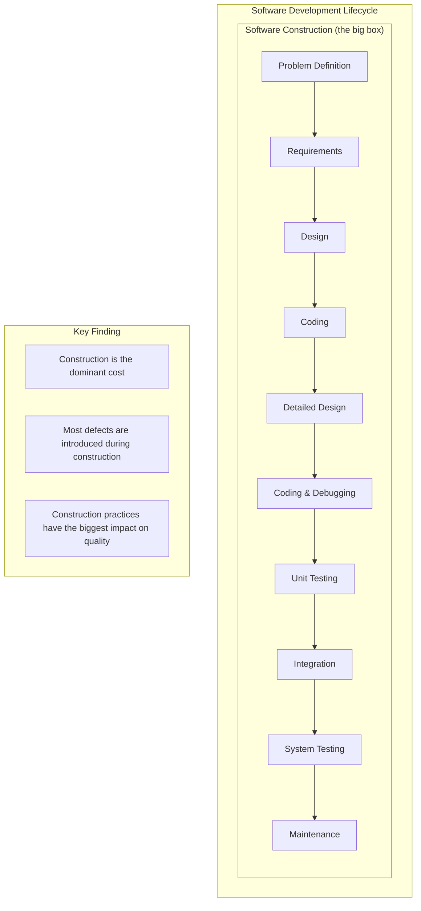
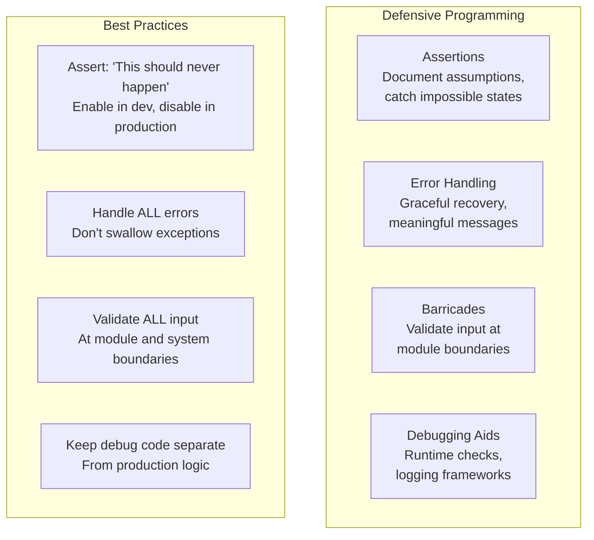

## The Central Role of Construction

McConnell's central argument: **software construction is the activity
where most of the software cost occurs**, yet it receives the least
systematic study in computer science curricula.

---

## Section 1: Foundations

**The Metaphor of Software Construction**

McConnell argues against the "building" metaphor (software is not like
building a house — it is more like gardening or writing). Better
metaphors help developers think more effectively:

| Metaphor | Insight |
|----------|---------|
| Writing Code | You can revise and restructure freely |
| Gardening | Code grows organically and needs tending |
| Building | Foundation must be sound (but change costs less in software) |
| Ship in a bottle | Some constraints are self-imposed by design choices |

**The Cost of Defects**

The book's most famous finding: **the cost of fixing a defect increases
exponentially over time.**

| Phase Introduced | Phase Fixed | Relative Cost |
|-----------------|-------------|---------------|
| Requirements | Requirements | 1x |
| Requirements | Design | 3-6x |
| Requirements | Coding | 10x |
| Requirements | Test | 15-40x |
| Requirements | Maintenance | 30-70x |
| Requirements | Post-release | 40-1000x |

Implication: invest in early defect prevention (design reviews, code
inspections) because the savings are enormous.

---

## Section 2: Design

Design is a series of heuristic decisions. Key heuristics:

| Heuristic | Description |
|-----------|-------------|
| Information Hiding | Hide complexity behind interfaces |
| Abstraction | Focus on essential properties, ignore details |
| Cohesion | Elements within a module should be functionally related |
| Coupling | Modules should depend on each other as little as possible |
| Layering | Organize into layers of abstraction |
| Inheritance | Define classes as specializations of parent classes |
| Polymorphism | Abstract behavior behind interfaces |

**Design checklist:**
- Has the design been structured to minimize complexity?
- Have you identified the parts that are likely to change and isolated
  them?
- Is the design cohesive and loosely coupled?
- Have you documented the design decisions and their rationale?

---

## Section 3: Variables

Variable naming is more important than most developers think.

| Rule | Bad Example | Good Example |
|------|-------------|--------------|
| Specific | `x` | `customerCount` |
| Searchable | `d` (single letter) | `distanceInMeters` |
| Pronounceable | `custCnt` | `customerCount` |
| Problem-oriented | `empRec` | `employeeRecord` |
| Length proportional to scope | `i` (3-line loop) | `accountIndex` (entire function) |

Scope and lifetime rules:
- Minimize variable scope — declare as close to first use as possible
- Limit variable lifetime — don't keep data around longer than needed
- Initialize variables as close to declaration as possible

---

## Section 4: Statements

**Conditionals:**
- Put the normal case first in if-else chains
- Simplify complex conditionals with boolean functions
- Use table-driven techniques instead of long if-else chains

**Loops:**
- Keep loop bodies simple (one page or less)
- Initialize loop variables immediately before the loop
- Use meaningful loop index names

**Case statements:**
- Default clause should handle unexpected cases
- Minimize fall-through

---

## Section 5: Code Quality

**Defensive Programming**

**Assertions:**
- Use to document assumptions that should always be true
- Enable during development and testing
- Compile out in production (or keep for critical checks)
- Example: `assert quantity > 0 : "quantity must be positive"`

**Error handling:**
- Don't use empty catch blocks
- Return status codes or throw exceptions — be consistent
- At the module boundary, validate and reject bad data
- Log errors with enough context to diagnose

---

## Section 6: Team Practices

**Code Reviews and Inspections**
- Inspections catch 60% of defects (highest of any single method)
- Formal inspections (checklists, trained moderators) are more
  effective than informal walkthroughs
- Reviews find different defects than testing — they complement each
  other

**Integration**
- Incremental integration (small pieces, integrated frequently) has
  lower defect rates than big-bang integration
- Continuous integration is the modern implementation of this pattern

---

## Section 7: Debugging

McConnell's systematic approach to debugging:
1. **Stabilize the error** — reliably reproduce it
2. **Locate the source** — use binary search (comment out half the
   code, test, then half again)
3. **Fix the defect** — fix the cause, not the symptom
4. **Verify the fix** — ensure it works and nothing else broke
5. **Look for similar errors** — the same pattern may exist elsewhere

**The scientific method:** formulate a hypothesis, design an experiment
to test it, run the experiment, update the hypothesis.

---

## Section 8: Refactoring

Refactoring is improving code structure without changing behavior.

**When to refactor:**
- Code is duplicated
- A routine is too long
- A class has too many responsibilities
- A change requires touching too many classes
- Conditional logic is too complex

**The key:** replace, don't pile on. When making changes, restructure
the code to accommodate the new feature cleanly.

---

## Key Lessons

- Construction is the central cost of software — treat it seriously
- Early defect prevention is exponentially cheaper than later fixes
- Design is heuristic, not algorithmic
- Variable naming and code formatting affect defect rates
- Defensive programming prevents defects before they happen
- Code inspections catch 60% of defects
- Refactoring is continuous, not episodic
- Developer skill varies 10x — and the difference is in practices
- High-quality code is cheaper to produce than low-quality code

---

## Practical Applications

### For Developers

- Use pseudocode before writing any complex routine
- Adopt a consistent naming convention
- Use assertions liberally in development
- Participate in code inspections

### For Teams

- Establish coding standards based on research
- Conduct regular code inspections
- Use incremental integration
- Invest in early defect detection

### For Managers

- Allocate time for design and code reviews
- Measure defect detection at each phase
- Invest in developer training on construction practices

---

## Action Plan

1. **Read the checklist at the end of each chapter** — they summarize
   the actionable practices
2. **Adopt pseudocode programming** for all non-trivial routines this
   week
3. **Start a code inspection program** — pick one module per iteration
4. **Track defect detection timing** — measure how many defects you
   find in design vs. coding vs. testing
5. **Read the research** — follow the footnotes to the primary studies
   McConnell cites
