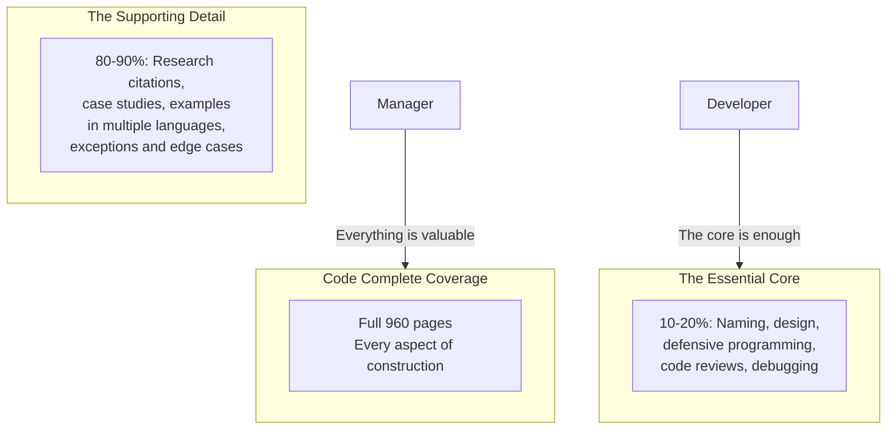

## Introduction

Welcome to BookAtlas. Today: *Code Complete* by Steve McConnell.
Second edition published 2004, Microsoft Press. 960 pages.

This is the most comprehensive, most researched book about actually
writing code ever published. It is not one person's opinion — it is a
synthesis of hundreds of research studies about what works and what
doesn't.

Today: a software engineering manager who makes this book required
reading for every new hire, and a startup developer who thinks the
advice is too academic and too heavy for modern web development.

---

## The Central Argument

**Manager:** McConnell's core insight is that construction — the actual
writing of code — is the dominant cost in software development. It is
also the most neglected in computer science education. Most CS programs
teach theory and algorithms; they don't teach how to write code that
other humans can read and maintain.

**Developer:** I agree construction is neglected. But 960 pages? The
core advice — write readable code, design before coding, test early —
can be summarized in 50 pages. The rest is academic context and
research citations that don't help me ship features.

---

## The Cost of Defects

**Manager:** This single fact is worth the price of the book: fixing a
defect in production costs 100 times more than fixing it during design.
This changes everything about how you run a project. Invest in design
reviews. Do code inspections. Write unit tests. The up-front cost is
tiny compared to the downstream savings.

**Developer:** The defect cost curve is real, but it assumes you know
what you are building. In a startup, requirements change every week.
Spending weeks on design would be wasted. The "invest early" advice
works for established products with known requirements, not for
exploratory development.

---

## Variable Naming

**Manager:** McConnell devotes an entire chapter to variable naming,
and it is justified. I have seen teams waste days debugging issues that
trace back to bad names. A variable called `x` that holds a customer
count is not just lazy — it is a defect waiting to happen.

**Developer:** I push back on the specificity. There is a point of
diminishing returns. `customerCount` is great. But `numberOfCustomers
InTheActiveSubscriptionList` does not improve clarity. McConnell's
advice is good but he does not emphasize enough that context matters —
a short name in a small scope is fine.

---

## Code Reviews

**Manager:** The evidence on code reviews is overwhelming. Inspections
catch 60% of defects. That is more than testing alone. And they find
different types of defects — design issues, logic problems, edge cases
— that tests often miss.

**Developer:** Code reviews are great when done well. But most teams do
them poorly — too many lines, too late, too adversarial. McConnell
describes formal inspections with checklists and trained moderators.
Most real-world code reviews are a quick scan before merging. The gap
between the research ideal and the real practice is wide.

---

## The Verdict: Reference or Relic?

**Manager:** *Code Complete* is still the most valuable reference a
professional developer can own. I don't expect anyone to read it cover
to cover. I expect them to use it — to look up the checklist before a
design review, to read the debugging chapter when they are stuck, to
refer a junior to the variable naming chapter.

**Developer:** I think the book is a masterpiece of its time. But its
time is passing. The examples are dated. The advice is general when
modern developers need specific. And the 960-page reference format is
at odds with how developers actually learn — through tutorials, videos,
and pair programming, not through reading research citations.

**Manager:** That is why the book should be a reference, not a
tutorial. When you have a real problem — a design that keeps breaking,
a bug you cannot find, a team that produces unreliable code — this is
the book that has the answer.

---

## Final Thoughts

*Code Complete* is the most evidence-based book on software
construction ever written. It is not a quick read, but it is a
permanent reference. Every professional developer should have it on
their shelf and know how to use it.

But it is a product of its era (2004). The examples are in C++ and
Java. The advice on agile, TDD, and DevOps is light. Read it for the
timeless principles — defect prevention, design heuristics, code
reviews — then supplement with modern sources for the practices.

This has been a BookAtlas narration of Code Complete by Steve
McConnell. Thanks for listening.
