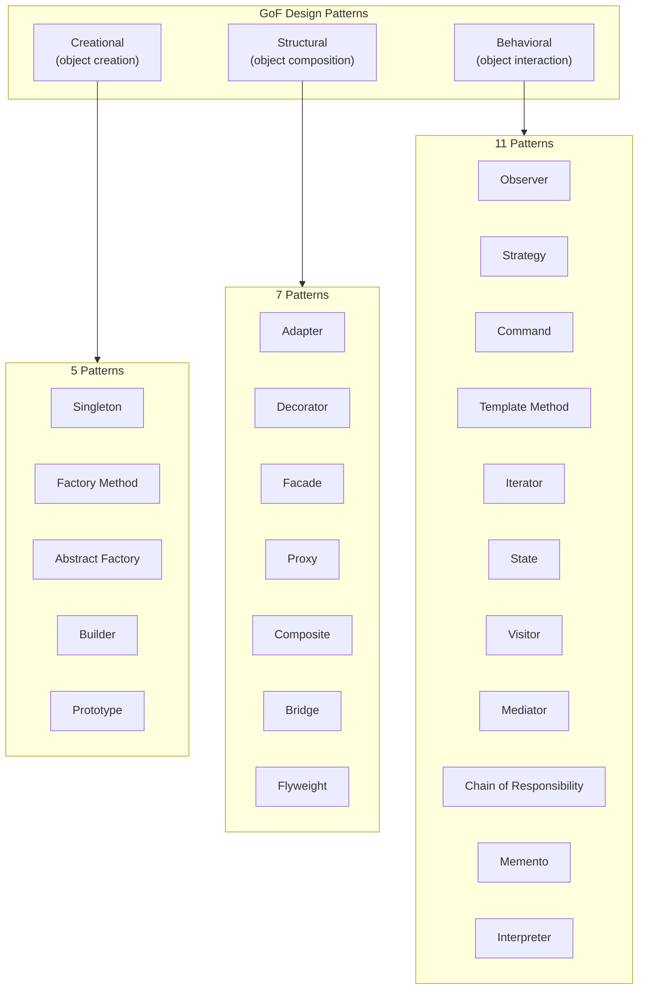
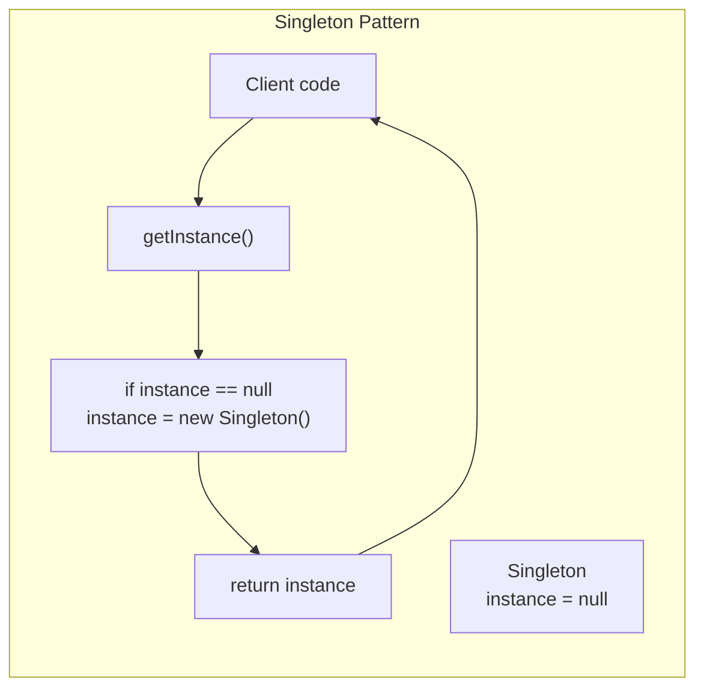
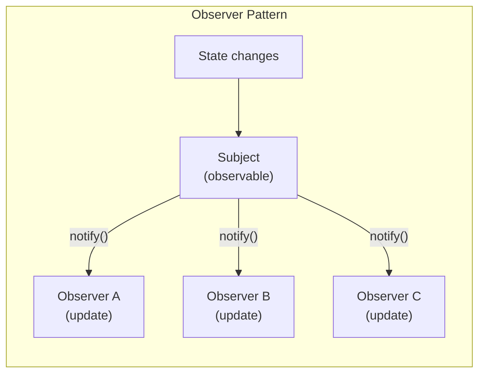
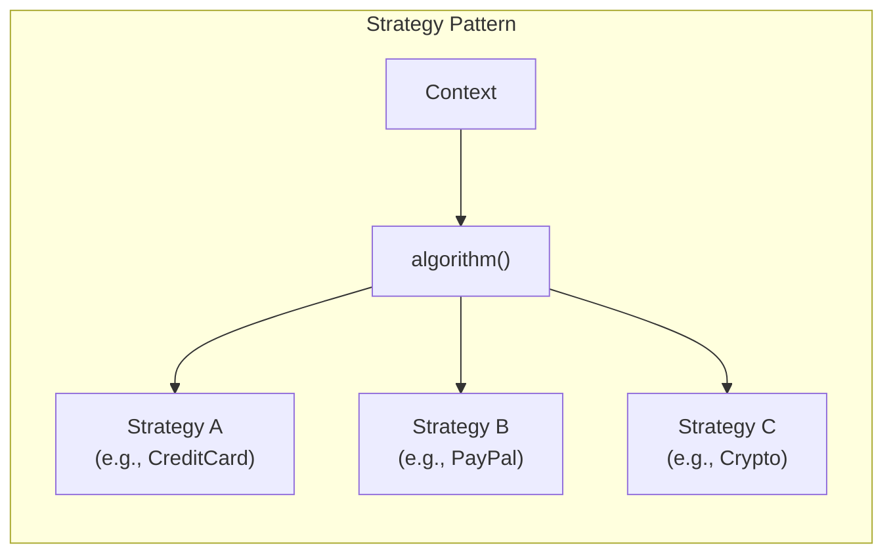
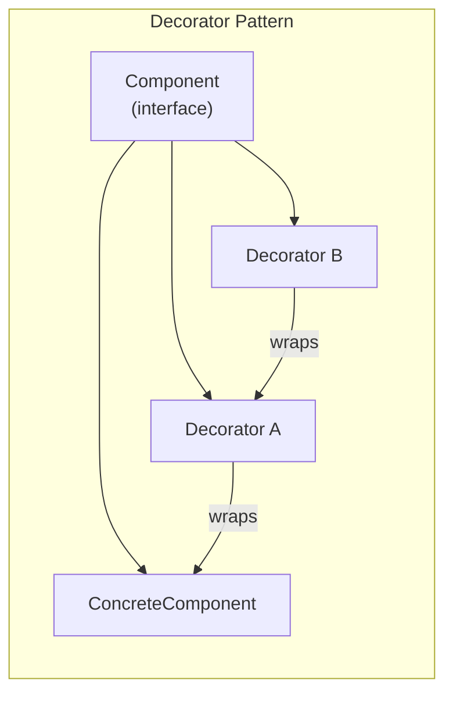

## Pattern Classification

---

## Singleton Pattern

Ensures a class has only one instance and provides a global point of
access. Controversial because it introduces global state, making
testing difficult.

---

## Observer Pattern

Defines a one-to-many dependency so that when one object changes state,
all its dependents are notified. Fundamental to event-driven
programming, UI frameworks, and reactive systems.

---

## Strategy Pattern

Defines a family of algorithms, encapsulates each one, and makes them
interchangeable. Strategy lets the algorithm vary independently from
the clients that use it.

---

## Decorator Pattern

Attaches additional responsibilities to an object dynamically.
Decorators provide a flexible alternative to subclassing for extending
functionality (Open/Closed Principle).

---

## Key Lessons

- **Patterns are not goals; they are tools.** The goal is clean,
  maintainable code. If a pattern makes things worse, do not use it.
- **Recognize when patterns are overused.** Singleton abuse,
  unnecessary factories, and Visitor for everything are common
  antipatterns.
- **Design for change.** Most patterns exist to isolate the impact of
  future changes. Identify what varies and encapsulate it.
- **The pattern form matters.** The GoF pattern template (Intent,
  Motivation, Applicability, Structure, Consequences) became the
  standard for documenting design knowledge.

---

## Practical Applications

- **Singleton:** Logging, configuration managers, thread pools (but
  prefer dependency injection in modern code)
- **Observer:** Event listeners, pub/sub systems, MVC architecture
- **Strategy:** Payment processing, sorting algorithms, validation
  rules
- **Decorator:** Java I/O streams, middleware pipelines, caching
  layers
- **Factory Method:** Object creation with unknown concrete types,
  framework hooks
- **Adapter:** Wrapping legacy code, making incompatible interfaces
  compatible
- **Facade:** Simplifying complex subsystem APIs (e.g., a
  `VideoConverter` class)
- **Command:** Undo/redo, job queues, transaction logging
