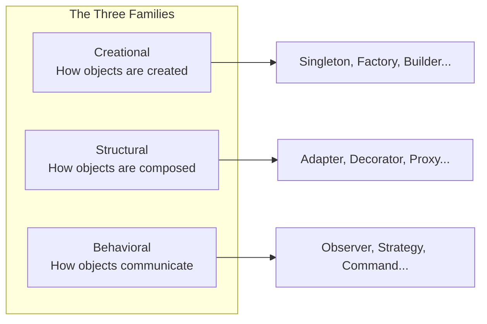

## Introduction

Welcome to BookAtlas. Today: *Design Patterns: Elements of Reusable
Object-Oriented Software*. The Gang of Four book. 1994. Addison-Wesley.
The book that gave software engineering a shared language.

Before this book, every developer invented their own names for common
solutions. You might call it a wrapper. I might call it an adapter.
We would waste time explaining ourselves. The GoF book fixed that.

---

## The Origin Story

**Engineer:** In the early 1990s, four authors noticed something.
Experienced developers kept using the same solutions to the same
problems. A way to structure a user interface. A pattern for
notification. A technique for creating objects without specifying
concrete classes. These solutions were not in any textbook. They were
tacit knowledge passed between developers.

**Skeptic:** So they wrote them down.

**Engineer:** They did more than that. They created a format — Intent,
Motivation, Applicability, Structure, Consequences — that became the
standard for documenting design knowledge. And they chose the name
"patterns" deliberately, borrowing from Christopher Alexander's work
on architectural patterns.

---

## The Three Families

**Engineer:** The 23 patterns are organized into three families.
Creational patterns handle object creation. Structural patterns handle
object composition. Behavioral patterns handle object communication.
Each family addresses a different source of complexity.

**Skeptic:** That is a lot of patterns. Do I need to know all 23?

**Engineer:** No. Most developers use 5-10 regularly. Singleton,
Factory, Observer, Strategy, Decorator, Adapter, Facade, Command,
Template Method — these are the workhorses. The others are more
specialized. The value is knowing they exist so you can recognize
when a problem fits a pattern.

---

## The Most Important Lesson

**Engineer:** Two principles from the book stand above everything
else. First: program to an interface, not an implementation. Code
against abstractions, and you can swap implementations without
ripping apart your system. Second: favor object composition over class
inheritance. Composition is flexible; inheritance is rigid.

**Skeptic:** These seem obvious now.

**Engineer:** They were not obvious in 1994. OOP was new. Inheritance
was seen as the primary reuse mechanism. The GoF book was the first
to systematically argue that composition is often better. That insight
shaped frameworks like the Java standard library and .NET.

---

## The Controversy: Singleton

**Engineer:** The Singleton pattern is the most controversial of the
23. It provides a global point of access to a single instance.
The problem? It is essentially a global variable, which makes testing
nearly impossible.

**Skeptic:** So do you use it or not?

**Engineer:** Modern practice says: avoid it. Use dependency injection
instead. But Singleton was designed for an era before DI was common.
The pattern itself is valid. But its popularity led to overuse. This
is a recurring theme with patterns — they are tools, not goals.

---

## The Verdict

**Engineer:** Design Patterns is not a book you read once. It is a
reference you return to. The examples are dated. But the concepts are
timeless.

**Skeptic:** What about modern patterns? Dependency injection.
Repository. CQRS. Event sourcing.

**Engineer:** Those build on the foundation the GoF laid. Once you
understand the original 23, you can learn any pattern. The GoF book
teaches you *how* to think in patterns. That skill does not age.

---

## Final Thoughts

Design Patterns by the Gang of Four is one of the most important
software books ever written. It has its flaws — dated examples,
dry prose, C++ — but its core insights are permanent fixtures of
software engineering. Every developer should read it, then supplement
it with modern resources.

This has been a BookAtlas narration of Design Patterns by the Gang of
Four. Thanks for listening.
