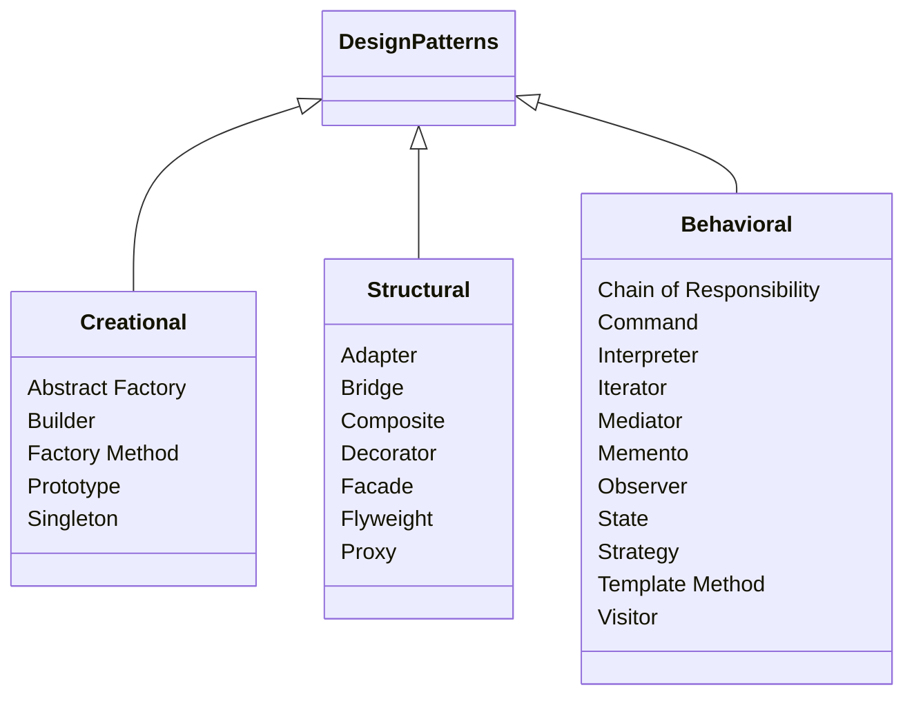

# Design Patterns: Elements of Reusable Object-Oriented Software

Spoken Narration Script · ~15 min listening time

---

## Prologue

In 1994, four software engineers quietly changed how the world thinks about code. 
They wrote a book. It had no marketplace allure — a dry academic title, dry 
academic authors, a cover showing a geometric lattice, entirely unremarkable.

What was inside was revolutionary.

Design Patterns: Elements of Reusable Object-Oriented Software would become the 
most influential programming book of the modern era. This is the story of that 
book, its authors, the patterns it contains, and why they still matter decades 
later.

---

## The Authors: The Gang of Four

Four men. Four careers that converged in a single moment.

**Erich Gamma**, Swiss, steeped in C++ and later the technical lead behind the
Eclipse Java environment. **Richard Helm**, Australian, a researcher at IBM\'s 
T.J. Watson Laboratory, deep in Smalltalk frameworks. **Ralph Johnson**, American,
a Smalltalk pioneer and then professor at the University of Illinois, one of the
first people to think seriously about what made a software framework reusable.
**John Vlissides**, American, another IBM researcher, who thought deeply about
how to make complex software understandable through visual modelling.

They were all at a 1990 OOPSLA conference in Ottawa. They began talking, kept
talking, and by 1991 they had published a paper. By 1994, they had a book. They
became known simply as the Gang of Four. Or the GoF.

John Vlissides died in 2005 at age 44. In his memory and in honour of their
shared work, the remaining three published a short retrospective.

---

## The Central Argument

Their core argument is straightforward:

Software engineers keep solving the same problems. Inheritance works until it
doesn\'t. Tight coupling is convenient until change rips through your codebase.
The GoF identified twenty-three recurring problems — and twenty-three named
solutions for each.

The book\'s first major contribution is not the patterns themselves. It is the
*catalogue*. By giving each solution a name — *Adapter*, *Strategy*, *Observer* —
they gave developers a shared vocabulary. After 1994, a discussion about
architecture could go like this: "Use a Factory Method there, wrap that behaviour
in a Strategy, and connect those modules through an Observer." Every word carried
precise technical meaning.

That compression of meaning is the book\'s real legacy.

---

## The Three Categories

The 23 patterns are split into three groups.

### Creational Patterns — five patterns

These patterns abstract *object creation*. The idea: rather than calling a
constructor directly, you route object creation through a separate mechanism.
That indirection lets the system remain flexible about *what* it creates and
*when*.

- Abstract Factory creates families of related objects.
- Builder lets you construct a complex object step by step.
- Factory Method lets subclasses decide what to instantiate.
- Prototype creates new objects by copying an existing one.
- Singleton ensures exactly one instance exists.

### Structural Patterns — seven patterns

These patterns concern *composition*: how objects and classes are assembled into
larger structures.

- Adapter makes incompatible interfaces work together.
- Bridge decouples an abstraction from its implementation.
- Composite lets you treat individual objects and compositions uniformly.
- Decorator adds responsibilities dynamically.
- Facade simplifies a complex subsystem behind a single interface.
- Flyweight shares objects to save memory at scale.
- Proxy controls access to another object.

### Behavioral Patterns — eleven patterns

These patterns govern *communication* and *responsibility* between objects.

- Chain of Responsibility passes a request along a handler chain.
- Command encapsulates a request as an object.
- Interpreter defines a grammar representation.
- Iterator provides sequential access without exposing internals.
- Mediator centralises complex communication.
- Memento captures and restores state.
- Observer notifies dependents of state changes.
- State lets an object change behaviour at runtime.
- Strategy encapsulates interchangeable algorithms.
- Template Method defines an algorithm skeleton.
- Visitor separates operations from the objects they operate on.

---

## The Philosophy: Flexible Over Rigid

The book\'s recurring through-line is the tension between flexible and rigid
design.

Rigid design hard-codes every relationship and every concrete class. Every
change rips through the call graph. Flexible design uses indirection — small,
focused classes with clear responsibilities — so that changing one piece does not
require rebuilding the whole.

The GoF were not ideologues. They never say "always use the Singleton" or
"always decompose into Decorators." They say: recognise this problem, and here is
a proven shape that solves it. The pattern is a tool, not a rule.

---

## The Singleton Debate

Few topics have provoked as much argument as the Singleton: ensure class has
exactly one instance and provide a global point of access.

The GoF describe it neutrally. They do not recommend it as a default. They place
it among 23 equals. But developers, eager for structure, ran with it.

Used well, Singleton models genuinely unique resources — a thread pool, a
configuration registry, a hardware interface. Used badly, it is an implicit
global variable. Hidden dependency. Untestable code. The GoF did not warn against
this explicitly, but their examples make the intended scope clear. The pattern
wins when you need exactly-one semantics. It loses when you use it as a shortcut
to avoid dependency injection.

Modern advice aligns uncomfortably well with what the book implies: use
Singleton sparingly, and prefer explicit dependency management.

---

## The Danger of Over-Applying Patterns

The book\'s most important implicit warning is about patterns as dogma. The phrase
"patternitis" appeared almost immediately after publication.

Developers, enthusiastic but inexperienced, began inserting patterns everywhere —
turning every small class into an Abstract Factory candidate, wrapping every
behaviour in a Decorator. The result was code that was technically elegant and
operationally opaque.

The GoF themselves contain the antidote in their introduction:

"Designing a reusable library is hard, and designers must take extra care to
design it well. Patterns can help."

"Can help" — not "must be used." A pattern solves a specific problem. Forcing
it onto a problem that does not require it is cargo cult engineering. The best
engineers know not just *how* to apply a pattern, but *when to skip one*.

---

## The Collective Authorship Model

The Gang of Four name is itself a model worth studying.

Four lead authors, each with their own specialisation, each writing drafts,
editing each other\'s work, debating naming and intent across months of
conversation. The result is a book with an unusual consistency of voice and
authority. The C++ and Smalltalk examples show mixed influences well-handled.
The structure reflects multiple perspectives refined into a single coherent whole.

This collaborative model became the template for how knowledge is documented in
software engineering. It is worth noting that Vlissides died in 2005, leaving
the surviving three to write a retrospective called "Design Patterns: 10 Years
Later." Reading that retrospective today is a reminder that the Gang of Four was
four real people, not a brand.

---

## Who Should Read This Book?

**Read it if:**
- You are an intermediate OOP developer ready to think in terms of object
  *relationships* rather than just class mechanics.
- You build frameworks, libraries, or large systems where extensibility matters.
- You want a shared vocabulary for architecture discussions and code review.

**Skip or skim if:**
- You are a complete beginner to object-oriented programming.
- You build small, simple CRUD apps where the complexity these patterns solve
  has not yet emerged.

For beginners, start with Head First Design Patterns. It teaches the same
patterns more gently, with vivid examples. Return to the GoF when you need an
authoritative reference.

---

## Closing

Design Patterns is not a perfect book. It is dense, occasionally verbose, and
its C++ examples are dated. But it is one of the few technical books whose
intellectual contribution is permanent. Every modern framework — Spring, React,
Angular, .NET, Django — contains GoF patterns at its foundation.

The Gang of Four gave the profession its most useful piece of jargon: patterns
themselves. Before them, expertise lived in the heads of senior engineers. After
them, it lived in a shared, named, documented catalogue that any engineer could
learn.

That is the gift of the book.
