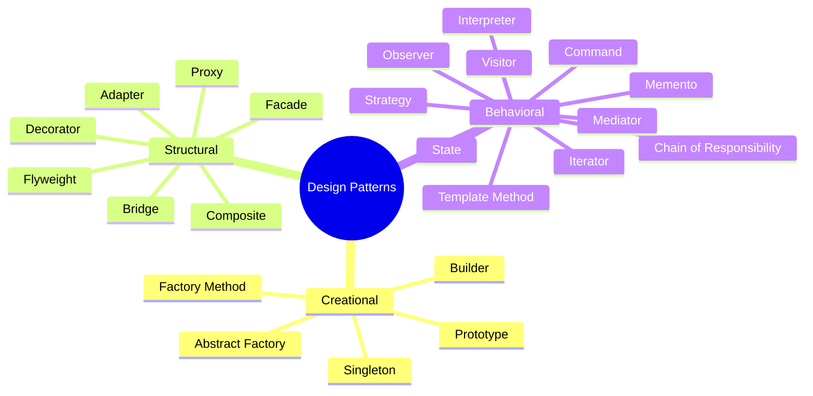
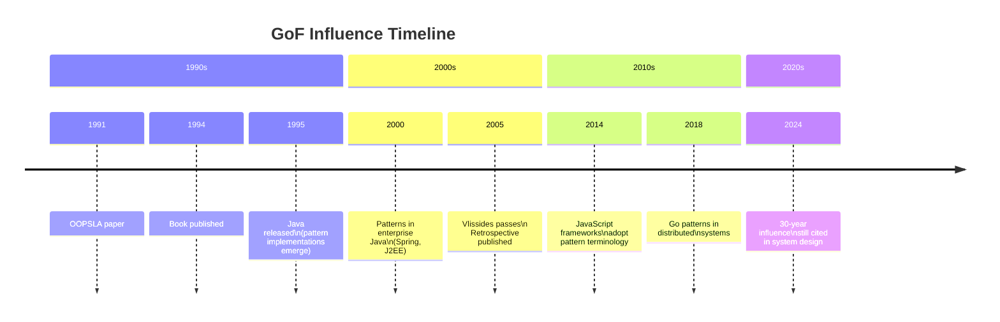

import { getBook } from '../../_data/books'

export const book = getBook('design-patterns-gang-of-four')!

export const sections = [
  {
    id: 'about',
    title: 'About This Book',
    items: [
      { href: '#at-a-glance', label: 'At a Glance' },
      { href: '#authors', label: 'The Gang of Four' },
      { href: '#legacy', label: 'Legacy & Impact' },
    ],
  },
  {
    id: 'patterns-overview',
    title: 'Patterns Overview',
    items: [
      { href: '#creational', label: 'Creational (5)' },
      { href: '#structural', label: 'Structural (7)' },
      { href: '#behavioral', label: 'Behavioral (11)' },
    ],
  },
  {
    id: 'resources',
    title: 'Resources',
    items: [
      { href: '#further-reading', label: 'Further Reading' },
    ],
  },
]

import BookLayout from '../../components/BookLayout.astro'
import PatternsOverview from './01-content.mdx'
import Analysis from './02-analysis.mdx'

<BookLayout
  book={book}
  sections={sections}
  coverSrc={book.coverImage}
  coverAlt={`Cover of ${book.title}`}
>

## At a Glance

Design Patterns: Elements of Reusable Object-Oriented Software (1994) is a
landmark book that systematized 23 recurring solutions to common software design
problems. Written by four authors who became collectively known as the **Gang of
Four (GoF)**, it drew from real-world C++ and Smalltalk codebases to distil
abstract principles into named, catalogued patterns.

| Detail | Value |
| ------ | ----- |
| **Authors** | Erich Gamma, Richard Helm, Ralph Johnson, John Vlissides |
| **Published** | 1994 (Addison-Wesley) |
| **Pages** | 395 |
| **ISBN** | 9780201633610 |
| **Language** | English |
| **Subject** | Object-Oriented Software Design |

## The Gang of Four

The four authors each brought distinct expertise:

- **Erich Gamma** (Switzerland) — Later led the Eclipse JDT project; co-created
  JUnit.
- **Richard Helm** (Australia) — Worked at IBM T.J. Watson Research; contributed
  to Smalltalk frameworks.
- **Ralph Johnson** (USA) — Pioneering Smalltalk developer; later a professor at
  University of Illinois; coined 'frameworks'.
- **John Vlissides** (USA, 1961–2005) — IBM researcher; known for work on
  software visualisation and cookbook-style pattern writing.

Their collaborative authorship model — first a 1991 OOPSLA paper, then the 1994
book — became a blueprint for how to document expert knowledge as shared,
consensus-driven artefacts. Vlissides died in 2005; the remaining three authored
a retrospective in 2005.

## Legacy & Impact

Design Patterns is widely regarded as one of the most influential software
engineering books ever written. It introduced a shared vocabulary that allowed
developers to discuss architecture at a higher level of abstraction. Phrases like
'use a strategy here' or 'wrap it in a decorator' became common professional
shorthand.

The book's C++ and Smalltalk examples cemented patterns as language-agnostic
solutions translatable into Java, C#, Python, and beyond. Decades later, most
modern frameworks — Spring, React, Angular, .NET — embed GoF patterns in their
skeleton. The Gang of Four book is the direct ancestor of today's component
architectures.

---

## Patterns Overview

<PatternsOverview />

## Further Reading

- [Pattern-Oriented Software Architecture](https://wikipedia.org/wiki/Pattern-Oriented_Software_Architecture) — Frank Buschmann et al.
- [Head First Design Patterns](https://www.oreilly.com/library/view/head-first-design/0596007124/) — Eric Freeman & Elisabeth Robson
- [Refactoring](https://martinfowler.com/books/refactoring.html) — Martin Fowler
- [Pattern Hatching](https://www.informit.com/store/design-patterns-elements-of-reusable-object-oriented-9780201633610) — John Vlissides

<Analysis />

</BookLayout>
