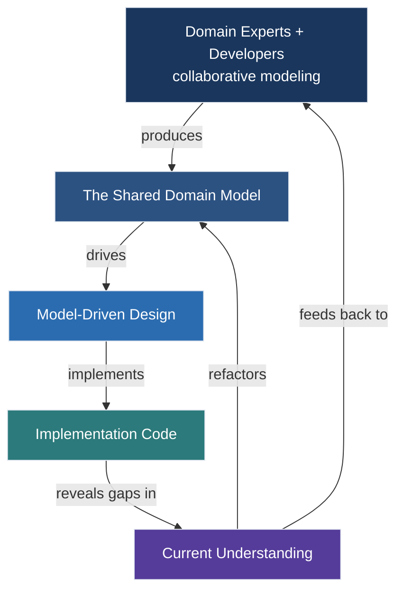
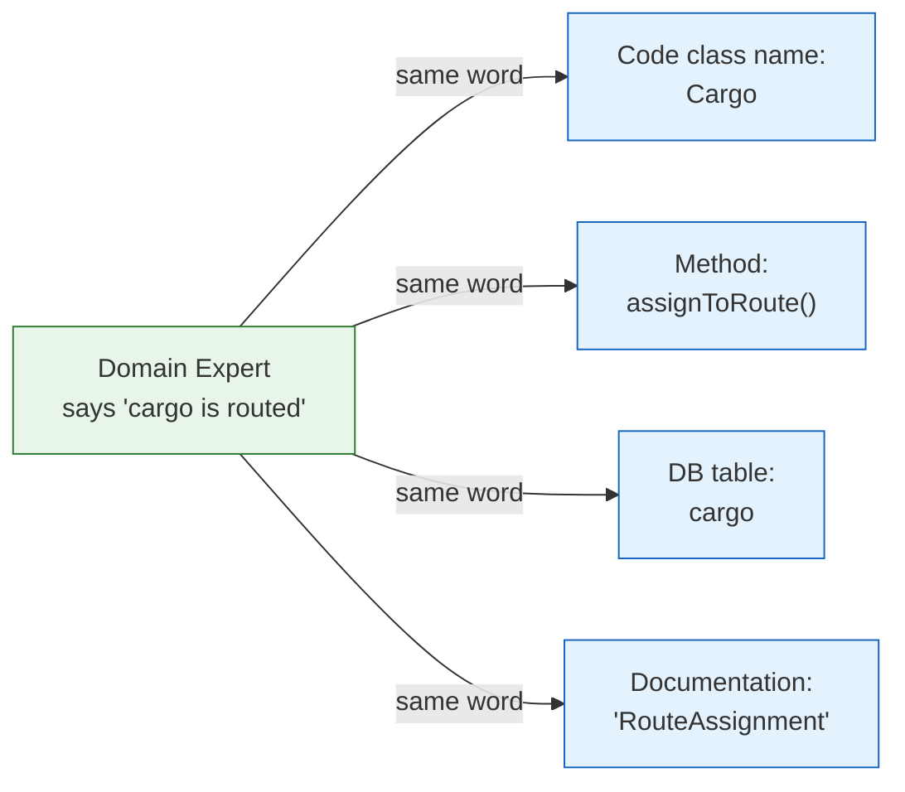
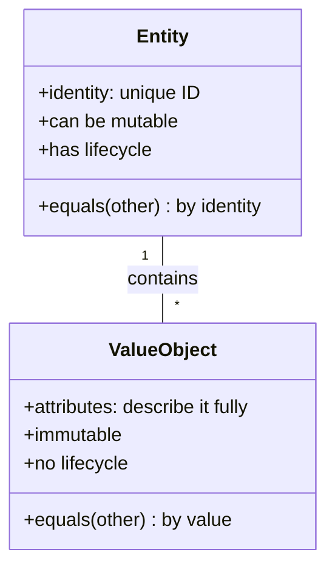
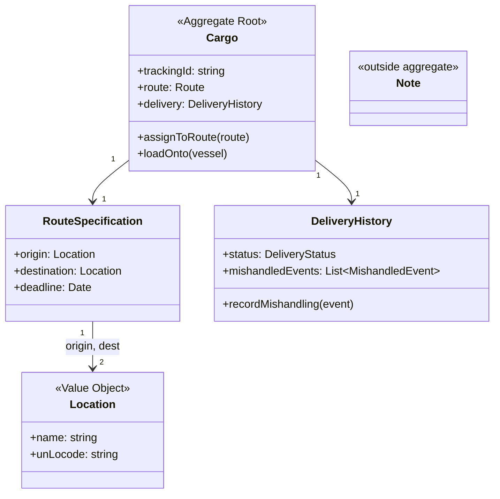
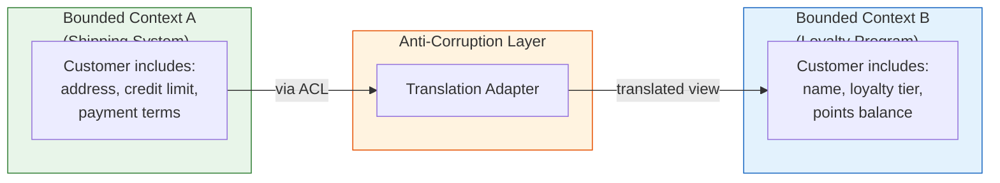
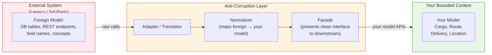
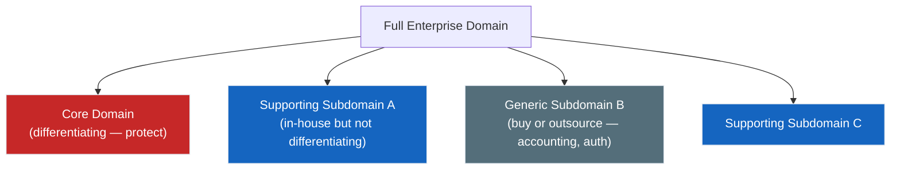

## The DDD Worldview

Domain-Driven Design is founded on a single conviction that runs
counter to most software project orthodoxy:

> The primary complexity of most software systems is *not* technical.
> It is *domain* complexity — the structure of the business problem,
> its rules, its exceptions, and its language.

A shipping company does not fail because it chooses the wrong ORM. It
fails because the model of how cargo moves through the system does not
capture what actually happens in the business — and the people who know
what actually happens (the domain experts) were only consulted once, at
the start, to produce a requirements document that was then implemented
mechanically.

Evans' counter-proposal is straightforward: make the domain model the
central artifact of the project. Everything else — the database schema,
the API surface, the UI — is derived from it and disciplined by it.

This is the **Model-Health Loop** — the central process of DDD. It is
not linear. It is iterative. It is the process by which a team's
understanding of the domain deepens over time, with the model serving as
the shared artifact that records and communicates that understanding.

---

## The Ubiquitous Language

The Ubiquitous Language is the single most important practical discipline
in DDD and the one with the broadest payoff even if you adopt nothing
else.

It is not a documentation exercise. It is a *team discipline*:

1. Observe the language domain experts actually use — not the sanitized
   version in a requirements document, but the messy, inconsistent,
   context-rich language of real business people doing real work.

2. Detect inconsistencies between the language used in code and the
   language used in business conversation. Every inconsistency is a
   model defect.

3. Force the *same word* to appear everywhere: in class names
   (`Cargo`), in method signatures (`Cargo.assignToRoute()`), in
   database columns, in documentation, in conversation with domain
   experts.

4. When a domain expert says something that does not match the code,
   the code is wrong, not the expert.

The discipline is hard. It requires developers to learn domain jargon
and domain experts to accept that code is not just an implementation
detail but a *language artifact*. The reward is enormous: when the code
*is* the model, and the model *is* the shared language, the gap between
developer understanding and domain expert understanding — the source of
most software defects in complex domains — closes.

---

## Model-Driven Design

Before DDD, the industry had split "analysis" and "design" into
separate phases with separate documents and often separate people. The
analyst produced a conceptual model. The designer drew class diagrams.
The programmer wrote SQL and Java. Each handoff degraded the model.

Model-Driven Design collapses those phases into one: a single model
used for analysis, design, and implementation. The model lives in code.
If the code does not express the model, the model does not exist.

The principle: **design the model to be implemented directly, and
implement it such that the code reveals the model.** If the code is
refactored, refactor the model. If the model is refactored, refactor
the code. Code that does not map cleanly to the model is a signal that
the model needs to be reconsidered, not a sign that the implementation
should be more clever.

---

## The Three Pillars of the DDD Argument

The book's argument rests on three ideas that are worth treating
separately because each justifies a different part of the practice:

| Pillar | Question it answers | What it produces |
|--------|--------------------|--------------------|
| **Ubiquitous Language** | How do domain experts and developers share understanding? | A shared vocabulary enforced in code |
| **Model-Driven Design** | How does the model connect to implementation? | Code that reveals the model |
| **Continuous Refactoring** | How does the model improve over time? | The Model-Health Loop |

If you have only the language without implementation discipline, you
have a nice glossary and a codebase that does not reflect it. If you
have implementation discipline without a shared language, you have code
that is internally consistent but communicates nothing to the business.
If you have both without continuous refactoring, you have a model that
starts accurate and steadily drifts away from the domain as the project
evolves.

All three are necessary.

---

## Strategic Design vs. Tactical Design

The single most common misunderstanding of DDD is that it is entirely
about the tactical patterns: entities, value objects, aggregates,
repositories, services. These are important and they receive most of
the attention in blog posts, conference talks, and community discourse.

Evans splits the book evenly. Part II covers tactical design in three
chapters. **Part IV — which takes up more than a third of the book —
covers strategic design.**

The distinction is sharp:

| Level | What it governs | Key patterns |
|-------|----------------|--------------|
| **Tactical design** | A *single* Bounded Context | Entity, Value Object, Aggregate, Repository, Factory, Domain Service, Module |
| **Strategic design** | *Multiple* Bounded Contexts in an organization | Bounded Context, Context Map, Core Domain, Subdomain, Anti-Corruption Layer, Published Language, Shared Kernel |

Strategic design is what makes DDD a *system design* methodology rather
than an *object-oriented design* methodology. A team that masters
tactical design without understanding strategic design produces a
well-modeled bounded context that is isolated and brittle. A team that
masters strategic design but skips tactical design produces a map of
boundaries without anything inside them.

Most teams reach for DDD when they reach the boundary. This is backward.

---

## Tactical Design: The Building Blocks

The tactical patterns are introduced in Part II and are the patterns
most people associate with DDD. They are the vocabulary for creating a
model inside a Bounded Context.

### Entities vs. Value Objects

These are the two fundamental types of domain objects.

**Entity:** defined by its identity, not its attributes. A `Cargo`
shipment is an Entity. If you change its route, it is the *same*
cargo. If you change a passenger's seat but they are still on the same
flight, it is still the same passenger. The internal state changes; the
identity persists.

**Value Object:** defined entirely by its attributes. A `Money` value
(50 USD) is a value object. An `Address` is a value object. If you
change the street, you have a new address — you have not mutated an
existing one into a different one. Value objects are immutable, are
compared by value (not identity), and have no lifecycle of their own.

The distinction matters operationally. Entities require identity
management, equality semantics, and lifecycle tracking. Value objects
can be freely shared, passed around, and duplicated without fear of
inconsistency.

### Aggregates

An Aggregate is a cluster of associated objects treated as a single
unit for data-change purposes. The Aggregate has a designated **root**
(always an Entity) and a **boundary**.

Rules of the aggregate:

- External objects may hold references to the **root only**.
- The root checks and enforces all invariants within the aggregate.
- Deletion of an object inside the boundary must delete everything
  within the boundary.
- When a change involves multiple aggregates, use eventual consistency
  via domain events rather than strong transactional consistency.

### Repositories and Factories

Once you have aggregates, you need two standard mechanisms:

**Repository** provides the illusion of an in-memory collection of all
objects of a certain type. Call `cargoRepository.findById("ABC123")`
and you get back a `Cargo` aggregate. Call `cargoRepository.save(cargo)`
and it persists. The repository shields the domain layer from the
mechanics of persistence: SQL queries, ORM sessions, caching layers.
Repositories belong to the *domain layer's interface* but are
implemented in the *infrastructure layer*.

**Factory** provides creation logic that is too complex or too
important to leave in the aggregate constructor. Complex aggregate
initialization — fetching reference data, validating cross-field
constraints, assembling sub-objects — belongs in a factory. Factories
like repositories belong to the domain interface but are implemented
outside the domain model.

---

## Strategic Design: The Large-Scale Structure

When a system exceeds what a single team can model or when an enterprise
has multiple interacting systems, tactical design alone fails. You need
to reason about the *boundaries* between models. This is strategic
design.

### Bounded Contexts

A Bounded Context is the boundary within which a single model is
valid and consistent. Every model has a boundary; the point of making
it explicit is to know where translation is needed.

Two teams using the word "customer" may mean completely different
things. Within Team A's Bounded Context, `Customer` is an entity with
a billing address, credit limit, and payment terms. Within Team B's
Bounded Context, `Customer` is a value object with a name and a
loyalty tier. Both are valid models for their respective contexts. The
problem arises when they try to share a "Customer" table or a shared
REST endpoint without translation.

### Context Map Patterns

Once you have identified your Bounded Contexts, you need to define
how they relate. The Context Map makes these relationships explicit.
The book defines eight patterns:

| Pattern | Relationship | When to use |
|---------|-------------|-------------|
| **Partnership** | Two contexts succeed or fail together; joint planning | Teams co-developing an integrated workflow |
| **Shared Kernel** | A small subset of the model is explicitly shared between teams | Tight integration with high R&D efficiency |
| **Customer/Supplier** | Upstream team supplies, downstream team consumes; negotiate SLA | Internal integrations with formal interface contracts |
| **Conformist** | Downstream team conforms to the upstream model; no custom interface | External vendor or legacy system where custom interface is unlikely |
| **Anticorruption Layer** | Build a translating layer between foreign model and your own | Foreign model is wrong for your needs; you cannot change upstream |
| **Open-host Service** | Publish a protocol for many downstream teams to integrate | You are a platform providing services to many consumers |
| **Published Language** | Use a well-documented standard format as the interchange medium | Industry-standard formats (EDI, SWIFT, HL7, etc.) |
| **Separate Ways** | No connection; each context solves the problem independently | Integration cost exceeds value; orthogonal concerns |

### The Anti-Corruption Layer

The Anti-Corruption Layer (ACL) is one of DDD's most important
practical patterns for enterprise integration. When you must integrate
with a system whose model is fundamentally incompatible with yours —
which is almost always — you do not let the foreign model pollute
yours.

The ACL is an isolating layer with two sides: an **adapter** that
understands the foreign system's model and protocols (its data formats,
its API contracts, its error semantics), and a **translator** that
converts between the foreign representation and your model's
representation. Everything inside your Bounded Context sees only your
model. The foreignness of the outside world is contained.

---

## The Core Domain and Distillation

Not all parts of a domain are equally important. The **Core Domain**
is the part that makes your system different from every other system.
The **Subdomains** are the parts that support it. The **Generic
Subdomains** are things that are important but not differentiating —
accounting, document management, authentication.

Distillation is the process of clarifying which is which, protecting
the core from subdomain pressure, and investing design effort where it
creates competitive advantage rather than where it simply enables
basic operations. A team that treats its entire codebase as equally
important will spend its most talented engineers maintaining authentication
logic instead of the routing algorithm that is its actual product.

---

## Why CRUD Architecture Fails for Complex Domains

The most common entry point for teams new to DDD is: "We have a CRUD
application and it is falling apart." Evans devotes significant
attention to why.

A CRUD architecture treats every entity as a data container with four
operations: create, read, update, delete. This works when the domain is
simple: a blog post, a product catalog, a user profile. In these
domains, the business rules are few, the invariants are simple, and
the value of the software is in the data it stores, not the logic it
applies.

But most enterprise domains are not simple. A cargo shipment has rules
about routing constraints, delivery deadlines, customs requirements,
manifest accuracy, regulatory compliance. These rules are not stored
in rows — they are *behavior*. A CRUD architecture stores them
incorrectly: either as out-of-process business logic (an accidental
script layer outside the ORM), as database constraints that cannot
express conditional logic, or as nothing at all — in which case the
rules are enforced by hope and convention.

The DDD alternative encodes those rules in the aggregate. The aggregate
root enforces all invariants. No path through the code can create an
invalid `Cargo` state. The rule is enforced by the model, not by
convention, not by a separately maintained script layer.

This is why CRUD architectures fail for complex domains: they have no
place to put the kind of rules that complex domains require.

---

## The Three Patterns of Tactical Design

Evans organizes the tactical patterns around three kinds of
responsibility:

**1. Objects that maintain continuity (Entities)**
Objects whose identity persists over time, even as their attributes
change. A `Cargo`, a `Customer`, an `Invoice`. These are the objects
that appear in associations and references across the broader system.
They need identity, equality semantics, and lifecycle management.

**2. Objects that describe things (Value Objects)**
Objects that describe a characteristic, quantity, or description. A
`MoneyAmount`, a `Location`, a `RouteSpecification`. These are
compared by value, not identity. They are immutable. They are cheap to
create and discard. They belong inside aggregates, defining the
characteristics of entities without requiring their own identity
management.

**3. Design mechanisms that manage object creation and access**
Once you have a model composed of entities and value objects, you need
mechanisms to *create* complex aggregates (Factories) and *retrieve*
them (Repositories) without exposing the persistence layer or
construction logic to the rest of the application. These are the two
standard patterns Evans introduces.
