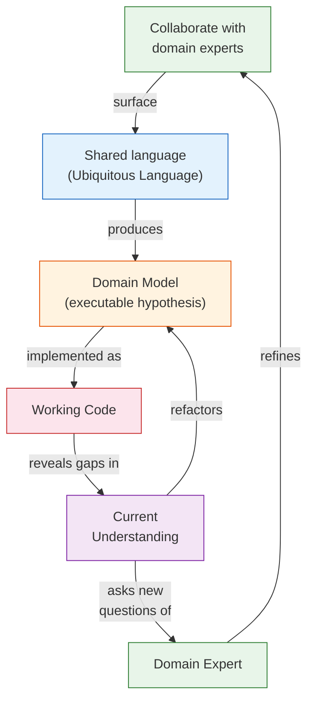

## Narration Script

This narration is designed to orient a first-time reader through the
argument of *Domain-Driven Design*. It walks through the central
problem, the three pillars of the argument, the tactical and strategic
patterns, and the Model-Health Loop. It is best read alongside
chapters 1–4 and then revisited as a reference after finishing the
full text.

---

### 1. The Problem: Why Software Fails at Complexity

Think about the last software project you were on that delivered late,
over budget, or missing the feature everyone expected. What was the real
cause?

Usually it was not a database choice. It was not a framework
bottleneck. It was that the software did not match the business.
Stakeholders looked at the delivered system and said: "this is not what
I described." Or: "yes, but in our case it works differently." Or:
"we need one more exception and then we'll be done" — and six months
later, the exception-driven architecture is a heap of special cases
held together by configuration.

Eric Evans opens the book with this tragedy and names its cause: the
**separation of analysis and implementation**. Analysts study the
domain and produce requirements. Designers turn requirements into
architecture. Programmers build the architecture. By the time code
exists, the model in the code has drifted from the model the analysts
first described, and from the model that exists in the heads of the
people who actually run the business.

The fix is not better documentation. It is not better project
management. It is not more upfront design. The fix is to collapse the
phases into one: build a model that is simultaneously analysis, design,
and implementation. Let the model be the product.

---

### 2. The Three Pillars

The argument rests on three interlocking ideas. Each is necessary. None
is sufficient alone.

---

**Pillar One: The Ubiquitous Language.**

The people who know the domain best — the shipping experts, the
underwriters, the operations managers — use words that mean something
specific in that domain. "Roll," "route," "customs," "manifest,"
"delay." These words carry concepts, rules, and exceptions. When
developers use "route" to mean a database reference and experts use it
to mean a sequence of waypoints with constraints and options, the gap
is invisible in conversation but lethal in code.

The Ubiquitous Language discipline says: one word, one concept, used the
same way everywhere. Class names. Method names. Variable names.
Database columns. Documents. Conversation. When a developer and a
domain expert disagree about what "routing" means in the system, one
of them is wrong. Usually it is the code.

This discipline is expensive. It requires developers to spend time
learning domain jargon and domain experts to engage with code. The
reward is that when the language is shared, the model converges. The
code becomes readable by the people who own the business.

---

**Pillar Two: Model-Driven Design.**

If the model lives only in documents, it is a hypothesis that was never
tested. Model-Driven Design says the model *is* the implementation.
The class hierarchy mirrors the conceptual hierarchy. The invariants
encoded in the aggregate root are the invariants the domain expert
described. When you refactor the model — really refactor it, not
just rename a variable — you are refining your understanding of the
domain.

This is a different way of thinking about code. A developer trained in
traditional architecture thinks of the domain model as one layer among
many, sandwiched between the UI and the database. A developer trained
in DDD thinks of the domain model as the *whole point*. The UI is an
adapter. The database is a persistence mechanism. The domain model is
the product.

---

**Pillar Three: Continuous Refactoring Toward Deeper Insight.**

Model-Driven Design only works if the model improves over time. It does
not emerge at the project's start and remain correct. It emerges
through conversation, through implementation, through running software
revealing gaps, through domain experts saying "well, in our case it's a
little different."

Evans describes this as the **Model-Health Loop**: a continuous cycle
where learning about the domain refines the model; refining the model
improves the software; running the software reveals new things about
the domain. This is not an accident or a process gap. It is the
primary mechanism of progress on complex domains. Deep understanding
takes time. The model must be allowed to grow.

This insight — that deep domain understanding arrives *during*
implementation, not before it — was controversial in 2003. It is now
one of the foundational assumptions of modern software development.

---

### 3. Strategic Design: The Map

Think about a medium-sized enterprise with ten internal systems.
`Customer` means something different in the billing system than it
does in the loyalty program. The shipping team uses "consignee" as a
concept the accounts team does not recognize. If you try to force a
single global `Customer` model to serve all ten systems, you will
create something that satisfies nobody.

This is where strategic design enters. The answer is not a single
global model. The answer is to *name the boundaries*.

A **Bounded Context** is the boundary within which a single model
applies. Inside the Cargo Shipping Context, `Cargo` is an entity with
a tracking ID, a route, and a delivery history. Inside the Accounting
Context, `Cargo` is a revenue object with an invoice, a payment
status, and an exchange rate. Both are correct within their own
contexts. What is needed is a *translation layer* between them.

The **Context Map** makes these boundaries and the relationships
between them explicit. Evans maps eight patterns of context
relationships:

**Partnership.** Two contexts are jointly responsible for a workflow.
They coordinate planning, integration, and failure handling together.
Team Shipping and Team Customs both need the same Cargo event at the
same time. They are partners.

**Shared Kernel.** Two teams agree to share a small subset of their
models — deliberately, with a contract, and with a small surface. The
kernel is versioned and evolves as a unit. This gives integration
leverage without the full cost of merging two entire models.

**Customer/Supplier.** One team's context (the supplier) feeds data
or services to another team's context (the customer). A formal
interface contract governs the exchange. The customer drives
requirements; the supplier delivers against them.

**Conformist.** When the upstream system is a vendor, a legacy
platform, or a team that will not negotiate, the downstream team
conforms to the upstream model without seeking translation. It is
frustrating but eliminates translation cost.

**Anti-Corruption Layer.** When the upstream model is semantically
wrong for your needs — when the shipping system thinks a route is a
list of port IDs and you need it as a graph with constraints — you do
not fight the upstream model. You build a translating layer that
converts *into* your model on input and *out of* it on output. The ACL
is an adapter. It insulates your model from foreign concepts.

**Open-host Service.** When you are a platform with many downstream
consumers, you publish a well-defined, stable protocol. Individual
translations happen *inside* the service; consumers see only your
surface.

**Published Language.** When an industry has an established interchange
standard — EDI for shipping documents, HL7 for healthcare, SWIFT for
banking — adopt it. The standard *is* the context map. You translate
between the standard and your internal model.

**Separate Ways.** When integration costs exceed value, draw a line.
Two models, no connection, each team solves the problem independently
in their own context. This is more common than teams admit.

---

### 4. Tactical Design: The Building Blocks

Now move from the large-scale map to the objects inside a single
Bounded Context. Here are the three building blocks Evans introduces:

**Entities** — objects defined by their identity, not their attributes.
A `Cargo` is an Entity. Its tracking ID identifies it across systems,
across time, across re-routing. Change its route, its delivery status,
its destination — it is still the same `Cargo`. Entities require
identity management and equality semantics. You do not compare
entities by field values. You compare them by identity.

**Value Objects** — objects defined entirely by their attributes. A
`MoneyAmount` of 500 USD is a value object. A `RouteSpecification`
with origin BOS and destination HKG is a value object. They are
immutable: you do not mutate a `MoneyAmount` from 500 to 600; you
create a new one for 600. They have no lifecycle. They are compared by
value, not identity.

Why does this distinction matter operationally? Entities are the things
that move through your system, referenced by other objects, tracked
between transactions. Value objects describe the characteristics of
entities. Value objects can be freely shared, duplicated, or replaced
because they carry no identity burden. Entities must be managed
carefully because their identity is load-bearing.

**Aggregates** — when entities are connected, the connections create
consistency obligations. A `Cargo` entity contains a
`DeliveryHistory` value object and a `RouteSpecification` value
object. These objects live and die together. The aggregate defines the
consistency boundary: everything inside must be in a valid state. No
object outside the aggregate can reach inside and modify a part of it
directly. All access goes through the aggregate root. This is the
mechanism that prevents an enterprise system from becoming a spaghetti
of partially updated, partially consistent objects.

The **Repository** gives you the illusion that aggregates live in a
collection. You do not think in terms of SQL queries when working with
a `Cargo`. You think: `cargoRepository.findById(trackingId)`. The
repository hides the storage mechanism.

The **Factory** gives you a clean way to create complex aggregates.
Constructing a valid `Cargo` with a valid `RouteSpecification` and
a valid `DeliveryHistory` is business logic, not just parameter
plumbing. Factories enforce that construction logic in one place, so
the aggregate's invariants are always established at creation time.

---

### 5. The Anti-Corruption Layer: Integration with Foreign Models

There will be a system in your enterprise that does not share your
model. It might be a legacy 30-year-old COBOL system. It might be a
third-party vendor whose data model reflects their product's
priorities, not yours. It might be a neighboring team with a different
definition of "customer."

The instinct in these situations is to adapt *your* model to *theirs*.
Evans is explicit: do not do this. Their model is foreign. Adopting
it corrodes yours.

Instead, build an **Anti-Corruption Layer** — an isolating adapter
between the two systems. Inside the ACL, you translate from their
representation to yours and back. Your system never sees their
concepts. Their idioms never leak into your codebase. The ACL is the
boundary: everything on your side uses your Ubiquitous Language.
Everything on their side is handled in the translator.

This has a cost: you are maintaining two models, with translation
overhead and potential inconsistency. But the alternative — a system
whose domain model is a compromise that satisfies nobody — is worse.

---

### 6. The Core Domain and Distillation

A large enterprise domain is too big to model in detail. Every
enterprise has many domains, and most of them are generic. The
accounting processes are standard. The authentication system is
generic. The email notification service is not differentiating.

The **Core Domain** is the piece that makes your system *your* system.
For a cargo shipping company, the Core Domain is how cargo is routed,
tracked, and delivered. Everything else — HR, invoicing, reporting —
supports it but is not it.

**Distillation** is the process of figuring out what the Core Domain
is, protecting it from being buried under generic infrastructure
concerns, and ensuring that the most capable engineers work on it
rather than on the generic subdomains. This requires organizational
effort. It requires explicitly naming the Core Domain in documentation,
in sprint planning, in team assignments.

Evans treats this as a *design* problem, not a project management
problem. The architecture should make the Core Domain visible —
distinct from the infrastructure it needs, structured so you can see
what is essential and what is supporting. A codebase where the Core
Domain is buried under 400 tables and 80 microservices has failed at
distillation.

---

### 7. Putting It Together: The Model-Health Loop in Practice

All of the above — Ubiquitous Language, model-driven design,
Bounded Contexts, tactical patterns, ACLs, distillation — converges
on a single operational practice: the process by which a team's
understanding of its domain deepens through building software for it.

The loop is not one you go through once. It is the rhythm of the
project. Every iteration of the model is better than the last — not
because you are a better developer, but because you now know more
about the domain. The software — the running, tested code — is the
mechanism that generates that knowledge.

This is why Evans says that learning about the domain is as likely to
happen at the end of the project as at the beginning. The model is
not a specification. It is a record of what you have learned so far.
The loop is the method.

---

### 8. When Not to Use DDD

The final piece of practical orientation is the question: when does
this not apply?

Evans is clear: for a CRUD application with no domain complexity, the
overhead of the methodology is not justified. A blog CMS. An internal
form submitter. A data entry tool for a reasonably simple schema. For
these, a clean schema, sensible naming, and thin controllers are
adequate. Introducing aggregates, repositories, and bounded contexts
adds structure without adding value.

The distinction is not about team size or project budget. It is about
*domain complexity*. A single developer working on a genuinely complex
domain (a legal reasoning system, a supply-chain optimization platform,
an insurance underwriting engine) can benefit enormously from even the
lightweight DDD disciplines: a Ubiquitous Language, named entities
with explicit invariants, and continuous model refinement. A ten-person
team working on a simple CRUD SaaS should not reach for the full
methodology.

Usejudgment. Apply the patterns to the parts of the system where the
domain is complex and the code will outlive the original developers.
Use simpler approaches where it is not.

---

### 9. Closing

*Domain-Driven Design* is a book about language and knowledge applied
to software. It is not about a framework, a language, or a stack. Its
patterns have survived two decades of technology change because they
are about something deeper than technology — they are about how human
beings build shared understanding and encode it in systems that last.

Read the first four chapters deeply. They are the intellectual core. Read
Parts II and IV as references. Return to the Model-Health Loop whenever
a project stalls because the team and the business are no longer
speaking the same language.

That is where the value lives.
