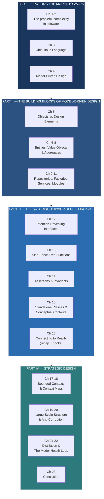

## Overview

*Domain-Driven Design: Tackling Complexity in the Heart of Software*
(August 2003) by **Eric Evans** is the book that invented a field.
Before it appeared, "domain modeling" existed as a practice — scattered
across object-oriented analysis textbooks, consultants' slide decks, and
the tacit knowledge of senior developers who had built complex enough
systems to feel the cost of getting it wrong. After it appeared, the
conversation had a name, a vocabulary, and a systematic argument.

This is not a book about technology. It makes almost no reference to
databases, web frameworks, messaging systems, or languages. It is a book
about *thinking*. Specifically, it is about how to align the structure
of your software with the structure of the business problem it is meant
to solve, so that the software encodes genuine understanding rather than
merely transporting data.

Evans wrote the book from direct experience. He is a practitioner, not
an academic. His consultancy, Domain Language, was formed to help
companies apply these ideas in practice, and the book's case studies —
the shipping-company cargo scheduling system that appears throughout —
come from his own engagements. The stories feel real because they are.

---

## About the Author

**Eric Evans** is an American software architect and the founder of
**Domain Language**, a consultancy that advises organizations on
domain-driven design and model-driven development. Before founding the
firm, he spent more than a decade working on complex object-oriented
systems, primarily in logistics and shipping. This direct experience
with domains where "get it wrong and the whole system breaks" is the raw
material of the book.

Evans coined the term "Ubiquitous Language" and developed the
conceptual framework of Bounded Contexts, Context Maps, strategic
design, and tactical design that is now considered standard professional
knowledge in software architecture. His influence extends far beyond
the DDD community: bounded contexts became the conceptual underpinning
of microservices architecture, the repository pattern is now common in
ORM frameworks, and event storming (developed by Alberto Brandolini
after the book) is used as a collaborative modeling technique at many
of the world's largest organizations.

After the 2003 book, Evans continued to refine DDD practice through
Domain Language and has published updated reference materials, including
*Domain-Driven Design Reference: Definitions and Pattern Summaries*
(2015). He is widely regarded as one of the key figures in the history
of object-oriented and model-driven software design alongside Martin
Fowler, Kent Beck, and the Gang of Four.

---

## The Central Problem

Software is built for domains — shipping, insurance, healthcare,
manufacturing, finance. These domains have structure, rules, processes,
and terminology. The tragedy of most software projects is that the
software does not reflect that structure. It reflects what was easy to
implement.

Evans identifies the root cause: the **separation of analysis and
design** that has been institutional in software engineering for decades.
Analysts study the domain and produce requirements documents. Designers
translate those documents into architecture. Programmers write code
against the design. Each handoff loses information. The resulting
software is a translation of a translation — accurate in detail, but
wrong in structure.

The alternative is **Model-Driven Design**: a single model that serves
both as analysis and design and implementation. One model, shared, used
by everyone from the domain expert to the programmer writing the class
names. The book's argument is that this is not just a methodology
preference. It is the only approach that scales to genuinely complex
domains.

---

## Executive Summary

The book has a clear four-part structure that is worth holding in mind.
Parts I and II establish the *intellectual case* for model-driven design
and then lay out the tactical patterns. Part III is a sustained
discussion of how to *improve* a model — refactoring not just code
but the underlying conceptual model. Part IV turns to the *strategic*
level: how to manage multiple models in a large organization, how to
integrate systems without letting their models pollute yours, and how to
define a core domain and protect it from the noise of an enterprise.

The proportions matter. The tactical patterns (entities, value objects,
aggregates, repositories, factories) receive about three chapters. That
is not a lot of space. Evans deliberately chose to devote the majority
of the book to the *process* of modeling and the *strategic* concerns
of large organizations — topics that no other book treated seriously at
the time and that remain underappreciated today.

---

## Key Takeaways

- **The domain is the heart of the software.** Evans' titular claim:
  the complexity that matters in most software projects is *domain*,
  not technical, complexity. The path to managing it is to engineer
  the domain model as the central artifact of the project.

- **Ubiquitous Language is not a glossary.** It is a rigorously
  enforced shared vocabulary between developers and domain experts. It
  appears in class names, method names, conversation, and
  documentation. If the word "cargo" means one thing to the shipping
  expert and another to the database schema, the model is already
  broken.

- **A model is a hypothesis, not a specification.** The model
  reflects your current understanding of the domain. As understanding
  improves — through conversation, through building, through running —
  the model must improve. Refactoring toward deeper insight is not
  accidental cleanup; it is the primary mechanism of learning in DDD.

- **Bounded Contexts are boundaries of consistency.** Inside a
  Bounded Context, a single model applies and is internally
  consistent. Outside it, the model is different. No model is
  universal. If you try to make one, you will get a confused, bloated
  model that serves no one.

- **Entities and Value Objects are fundamentally different kinds of
  things.** An Entity (a Cargo shipment, a bank account) has an
  identity that persists independent of its attributes. A Value Object
  (a money amount, an address) is defined purely by its attributes and
  is immutable. Getting this distinction wrong produces a model that
  cannot reason about change correctly.

- **Aggregates define transactional consistency boundaries.** An
  aggregate is a cluster of related objects with a designated root. All
  external references go to the root. The root enforces all invariants
  across the aggregate. This is the pattern that makes a complex domain
  tractable: you reason about consistency at the right scale.

- **Repositories abstract retrieval; Factories abstract creation.**
  Neither pattern belongs inside the domain model, but both make the
  model usable. Repositories give you the illusion of an in-memory
  collection of domain objects. Factories shield you from the
  complexity of constructing valid aggregates.

- **Strategic design is for large systems.** Four context-map
  patterns — Partnership, Shared Kernel, Customer/Supplier, Conformist
  — plus Corrosion, Open-host Service, Published Language, and
  Separate Ways — give teams a shared vocabulary for negotiating model
  boundaries and integration contracts across organizational lines.

- **The Anti-Corruption Layer protects your model from foreign
  concepts.** When integrating with a legacy system, a third-party API,
  or a team with a different model, do not let their abstractions leak
  into yours. Build an isolating adapter that translates *into* your
  model on entry and *out of* it on exit.

- **DDD is not a universal prescription.** It is heavy infrastructure
  — in knowledge, in conversation, in modeling effort. For a simple
  CRUD application, it is overkill. The book never claims otherwise.
  Apply it when the domain is genuinely complex; use lighter approaches
  when it is not.

---

## Who Should Read

| Read this |
| Skip this |
|-----------|-----------|
| Engineers building complex business software — logistics, insurance, finance, healthcare, SaaS | Teams building simple CRUD apps with no meaningful domain complexity |
| Software architects and tech leads on multi-team or multi-service projects | Junior developers with no exposure to OO or functional programming or production domains |
| Anyone who has felt the pain of a system that encodes no understanding of the business | People wanting a quick, prescriptive framework (this book teaches principles, not recipes) |
| Practitioners interested in event-driven, microservice, or bounded-context architecture | Developers with no access to real domain experts to collaborate with |
| Engineering managers who want a shared language with their business counterparts | Readers looking for a short, actionable introduction (this book rewards slow, patient reading) |

---

## Core Themes

**Everything is about the model.** Evans returns to this idea from
every angle. The model is not a diagram drawn by an analyst. The model
is the *actual shared understanding* — held in code, in names, in
conversation — that allows developers and domain experts to reason
together. If the model is wrong, you will know it the moment a domain
expert says "that's not how we think about it."

**Language is a design tool.** The Ubiquitous Language is not a
soft-skills nicety. It is a hard tool. The discipline of forcing that
one name onto every artifact — class names, method names, database
columns, documentation, conversation — is what catches inconsistencies
early. When developers and experts use the same word for the same
concept, conceptual gaps become detectable.

**Large systems need strategic design.** The second half of the book
is given over to problems most developers at the time had not even
framed: how do multiple teams, each with their own model, coexist in
one enterprise? What happens when your system must integrate with a
vendor whose model contradicts yours? How do you define what is
*essential* in a huge domain so you do not waste effort modeling
everything? These questions are more current now than they were in
2003.

**Refactoring the model is the path to deeper understanding.**
Innovation does not happen only upfront. It happens continuously, in
the interaction between the evolving implementation and the evolving
conversation with domain experts. Each iteration of the model — each
shallow bug fix that reveals a deeper pattern, each domain expert
correction that forces a class to be renamed — is progress. The
Model-Health Loop is not an add-on process. It is the process.

---

## Why This Book Matters

When DDD was published, it faced two obstacles. The first was
cultural: in 2003, object-oriented programming was at peak hype, but
object-oriented *modeling* was widely understood as something done
before coding, not during it. The second was practical: the tactical
patterns in Part II look a lot like the GoF design patterns, and some
readers stopped there — treating DDD as a pattern catalog and missing
the argument.

The book's actual argument is more radical. It says: the hardest
problem in software is not technology. It is *knowledge*. The team that
knows the domain best — the one with the deepest model — will produce
the best software. And the way to get that knowledge is not through
requirements documents. It is through a sustained, iterative conversation
between developers and domain experts, with the model as the shared
artifact in which that conversation is recorded and refined.

That argument has only grown more relevant. Bounded contexts became the
conceptual model for microservices. Event storming extended DDD to
collaborative workshop settings. CQRS and Event Sourcing both grew out
of DDD's tactical vocabulary. The book's treatment of strategic design —
a field that had almost no literature before 2003 — is still the most
accessible entry point for teams trying to navigate large-system
complexity.

The book is not easy. It is verbose, redundant, and slower than modern
readers are used to. The prose drifts. Some of the terminology is
opaque. But the ideas are worth the effort. Edmundaus said "a reader
who quarrels with a passage because they cannot understand it is like
someone who quarrels with a bridge because they cannot build one." DDD
is the bridge.

---

## Related Books

| Book | Author(s) | How It Connects |
|------|-----------|-----------------|
| **Implementing Domain-Driven Design** | Vaughn Vernon | The practical companion. Evans established the *ideas*; Vernon shows how to implement them in Java and CQRS/Event Sourcing patterns. |
| **Domain-Driven Design Distilled** | Vaughn Vernon | A short (~150pp) primer. Best entry point if DDD feels too large; read it before committing to the original. |
| **Building Microservices** | Sam Newman | Bounded contexts and the strategic patterns from Part IV of this book are the conceptual underpinning of microservices architecture. |
| **Patterns of Enterprise Application Architecture** | Martin Fowler | The 2002 GoF-adjacent catalog covering similar tactical patterns (Repository, Unit of Work, Service Layer) from Fowler's own OO perspective. |
| **Refactoring** | Martin Fowler | The model-refactoring side of DDD that Evans alludes to but does not detail. Fowler's mechanics apply directly to DDD model improvement. |
| **Clean Architecture** | Robert C. Martin | Layering, dependency inversion, boundaries — the structural patterns that DDD strategic design assumes as a deployment context. |
| **Working Effectively with Legacy Code** | Michael Feathers | How to introduce DDD concepts into an existing codebase that has no model. The boundary case DDD addresses badly. |
| **Analysis Patterns** | Martin Fowler | The precursor to DDD's tactical layer. Fowler catalogued *domain* patterns across industries; DDD supplies the *implementation* vocabulary. |

---

## Final Verdict

**Rating: 9.5/10**

*Domain-Driven Design* is the most important software design book of the
last thirty years. It is not the most readable. It is not the most
actionable. It does not deliver a framework, a cookbook, or a checklist.
What it delivers is a *way of thinking* about software that is
incompatible with the dominant paradigm of its era and that has
gradually become the consensus view of sophisticated engineering
organizations everywhere.

The strengths are the depth and originality of the argument. The term
"Ubiquitous Language" alone — a concept that now feels obvious — changed
how teams negotiate requirements. Bounded contexts, context maps, and
the strategic design vocabulary are now foundational to microservices
thinking. The Model-Health Loop is the right way to think about
iteration on complex systems.

The weaknesses are legitimate. The book is approximately twice as long
as it needs to be. Some chapter summaries repeat the previous chapter's
opening. The tactical pattern section is thin — three chapters for the
whole building-block vocabulary. The prose resists skimming. The CRUD
criticism (see below) is real in context.

But the argument is durable. Read it once to get the vocabulary. Read
it again, slowly, to understand what Evans is actually arguing about
*language, collaboration, and knowledge*. That is where the value is.
The patterns are the vehicle. The argument is the destination.

This is the blue book. It is on every serious developer's shelf. Read
it.
