## Strategy Pattern — Chapter 1

Defines a family of algorithms, encapsulates each one, and makes them
interchangeable. Strategy lets the algorithm vary independently from
clients that use it.

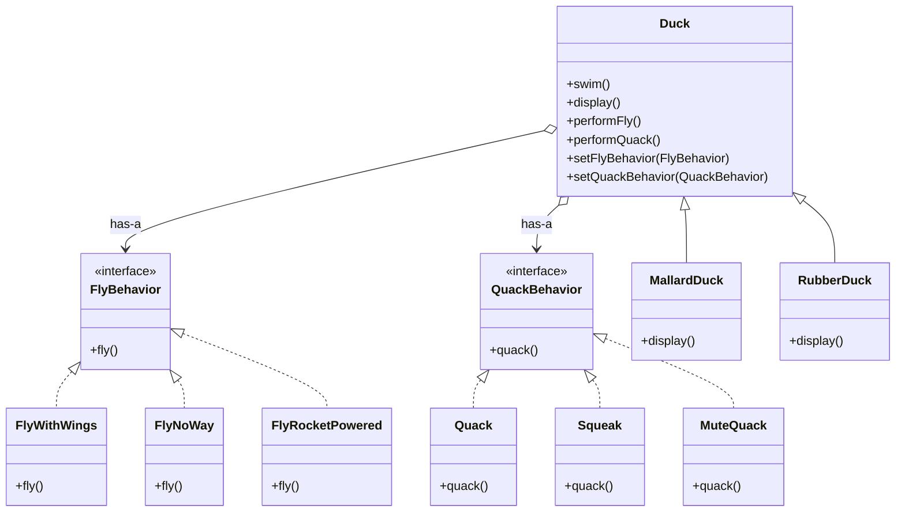

The classic Duck Simulator. What varies is fly and quack behavior, so
those are extracted into interfaces and composed into Duck. The result:
fly and quack behavior can change at runtime without touching Duck code.

---

## Observer Pattern — Chapter 2

Defines a one-to-many dependency between objects so that when one
object changes state, all its dependents are notified automatically.

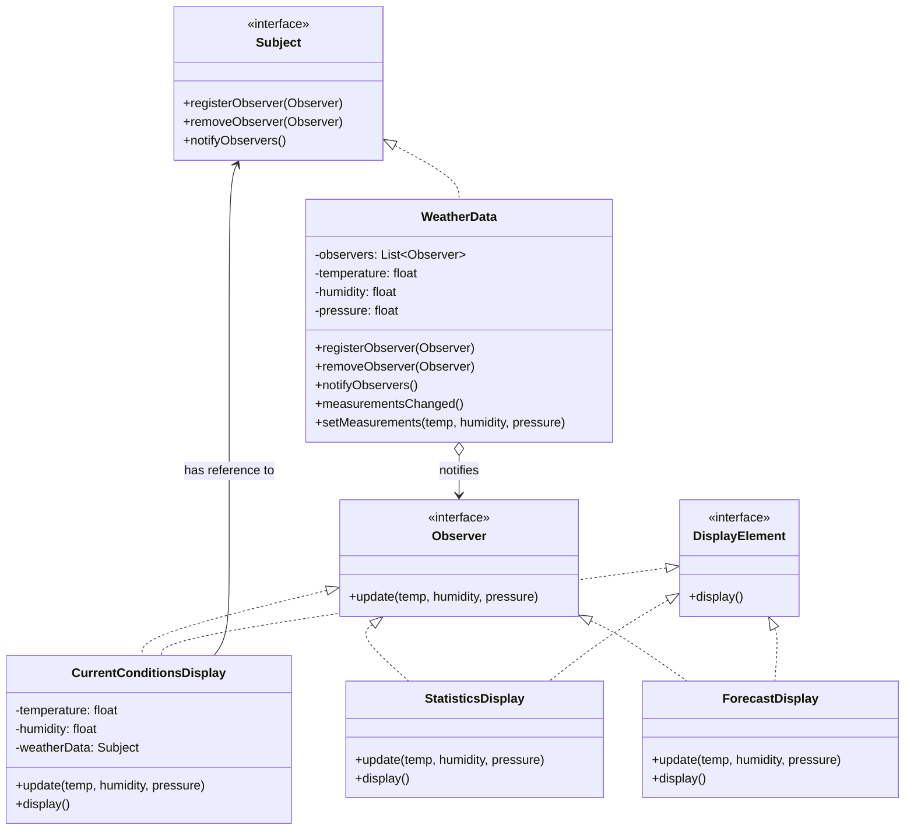

The Weather Monitoring station. Subject (WeatherData) pushes state
changes to all registered Observers. Subjects and Observers are loosely
coupled — they interact through interfaces alone.

---

## Decorator Pattern — Chapter 3

Attaches additional responsibilities to an object dynamically.
Decorators provide a flexible alternative to subclassing for extending
functionality.

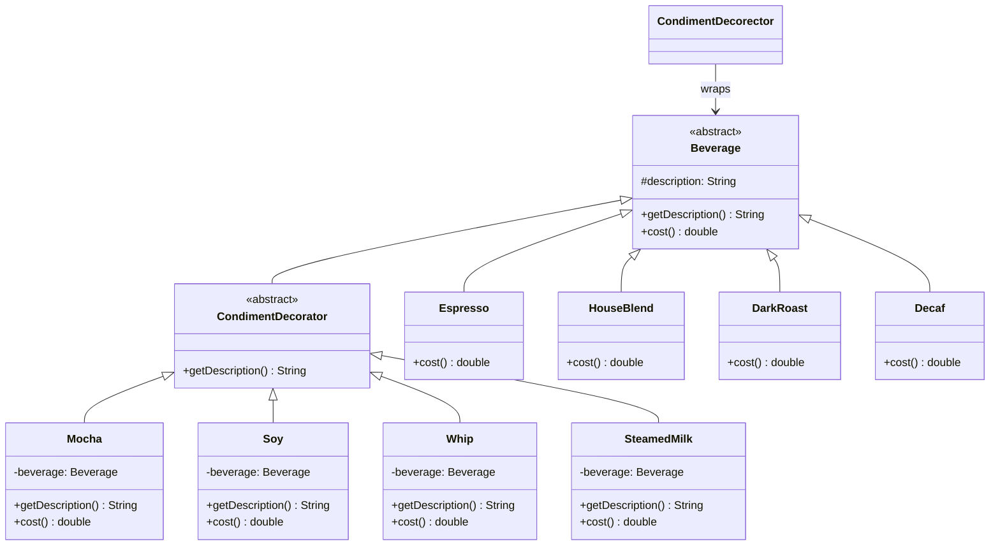

The Starbuzz Coffee example. Beverages are wrapped in Condiment-
Decorators, each adding its own cost and description. The Decorator
pattern demonstrates the Open-Closed Principle — beverages are closed
for modification but open for extension via decorators.

---

## Factory Method — Chapter 4

Defines an interface for creating an object, but lets subclasses decide
which class to instantiate. Factory Method lets a class defer
instantiation to subclasses.

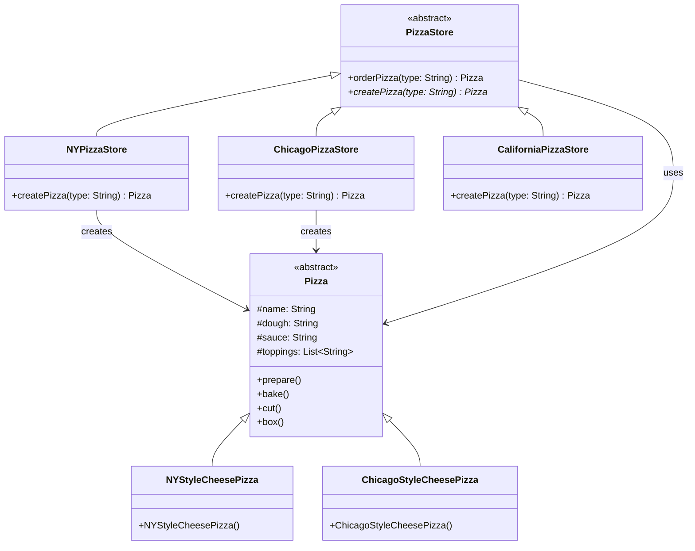

The Pizza Store franchise. The `orderPizza()` method in the abstract
superclass handles all the common pizza-making steps; subclasses
override `createPizza()` to supply region-specific pizzas. This
inverts the dependency — high-level code depends on an abstraction.

---

## Singleton Pattern — Chapter 5

Ensures a class has only one instance and provides a global point of
access to it.

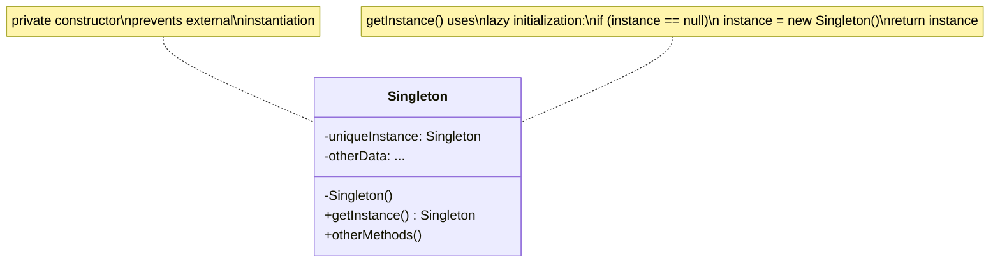

The Singleton pattern is the most controversial GoF pattern. It is
essential for thread pools, logging, and device drivers, but it
introduces global state that makes unit testing difficult. The 2nd
edition covers thread-safe implementations using `synchronized` and
the Bill Pugh Initialization-on-Demand Holder idiom.

---

## Command Pattern — Chapter 6

Encapsulates a request as an object, thereby letting you parameterize
clients with different requests, queue or log requests, and support
undoable operations.

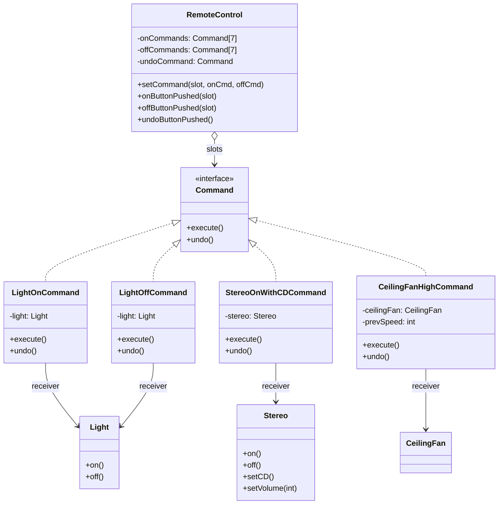

The Remote Control. Each button slot stores a Command object. Pressing
a button calls `execute()`, which delegates to the receiver's action.
Undo is supported by storing the last command — or by having each
command reverse its own operation.

---

## Adapter Pattern — Chapter 7

Converts the interface of a class into another interface the client
expects. Adapter lets classes work together that could not otherwise
because of incompatible interfaces.

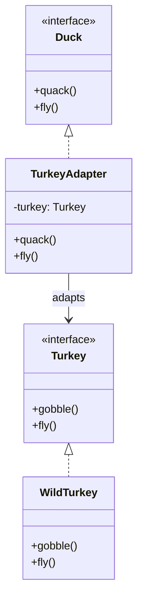

The TurkeyAdapter makes a Turkey look like a Duck. When the client
calls `quack()`, it delegates to `gobble()`. When it calls `fly()`,
it calls the Turkey's shorter `fly()` five times in a row. The Adapter
pattern is the essence of the "wrap it" mentality.

---

## Facade Pattern — Chapter 7

Provides a unified interface to a set of interfaces in a subsystem.
Facade defines a higher-level interface that makes the subsystem easier
to use.

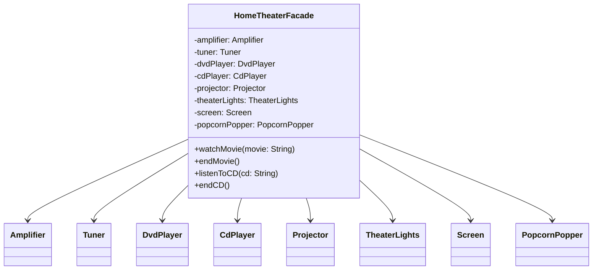

The Home Theater Facade. Instead of calling 8 subsystem objects in the
right order to watch a movie, the client calls `watchMovie()` on the
facade. The facade handles the complexity — the subsystem classes
remain fully available for direct use.

---

## Template Method Pattern — Chapter 8

Defines the skeleton of an algorithm in a method, deferring some steps
to subclasses. Template Method lets subclasses redefine certain steps
without changing the algorithm's structure.

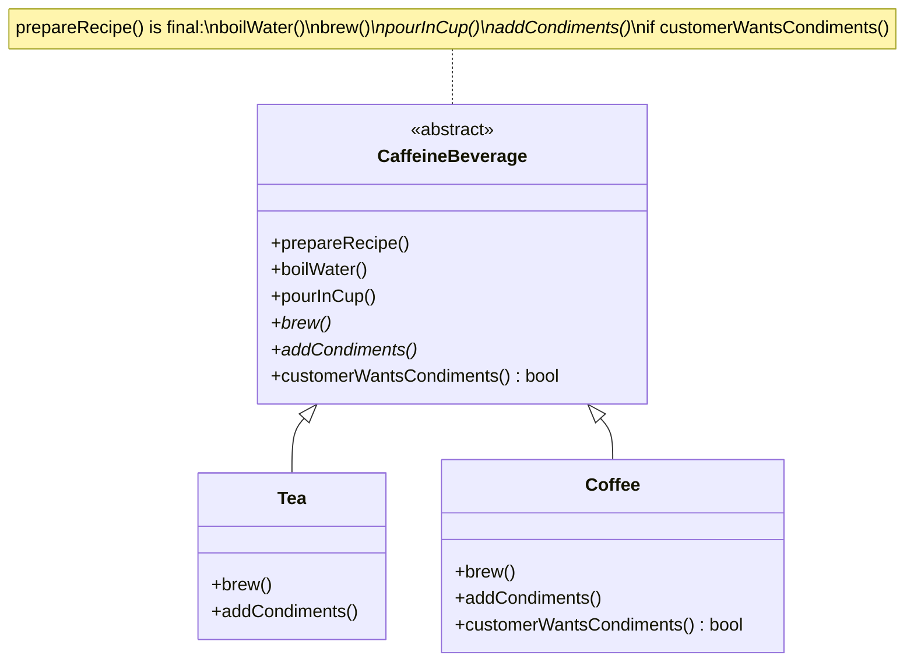

Tea and Coffee share the same algorithm skeleton. The `prepareRecipe()`
template method calls abstract `brew()` and `addCondiments()` that
subclasses implement. The hook method `customerWantsCondiments()`
lets subclasses optionally vary the algorithm.

---

## Iterator and Composite — Chapter 9

**Iterator:** Provides a way to access the elements of an aggregate
object sequentially without exposing its underlying representation.

**Composite:** Composes objects into tree structures to represent
part-whole hierarchies. Composite lets clients treat individual objects
and compositions uniformly.

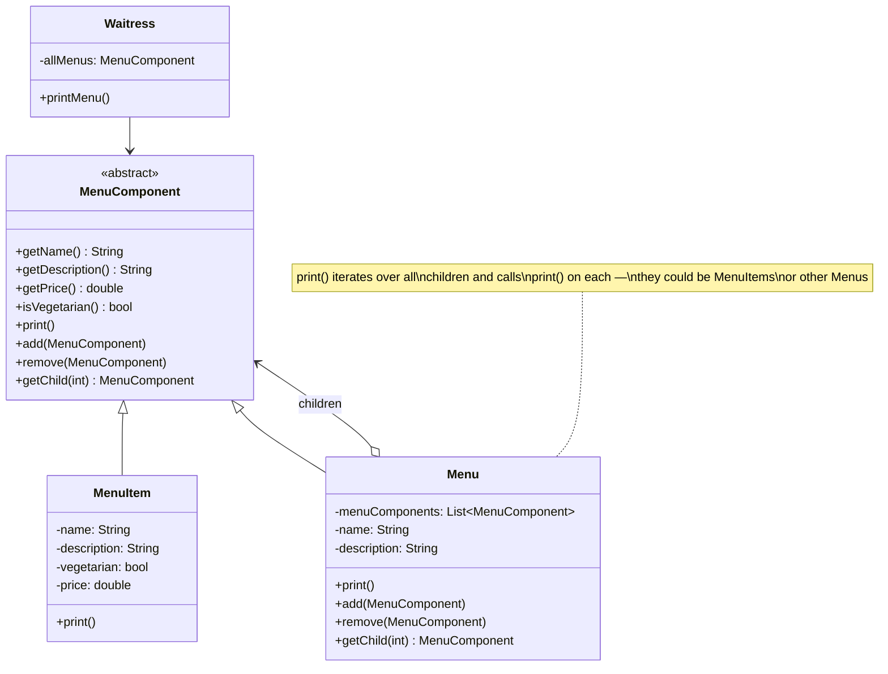

The Menus example combines Iterator and Composite. A Menu contains
MenuComponents — which can be MenuItems (leaf) or Menus (composite
node). The Waitress calls `print()` on the top-level Menu, which
recurses through the entire tree. The Iterator is used internally to
traverse children.

---

## State Pattern — Chapter 10

Allows an object to alter its behavior when its internal state changes.
The object will appear to change its class.

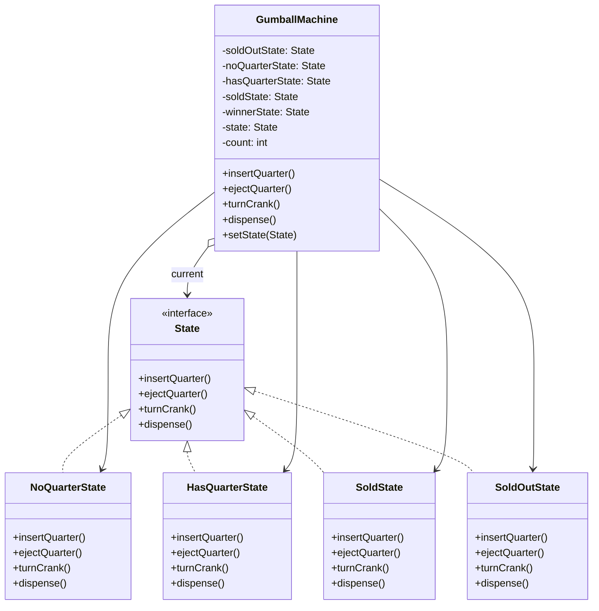

The Gumball Machine. Instead of if/else conditionals on a status
integer, each state is a class that implements State. The GumballMachine
delegates method calls to its current State object. State transitions
are handled inside the state classes, not in the machine.

---

## Proxy Pattern — Chapter 11

Provides a surrogate or placeholder for another object to control
access to it.

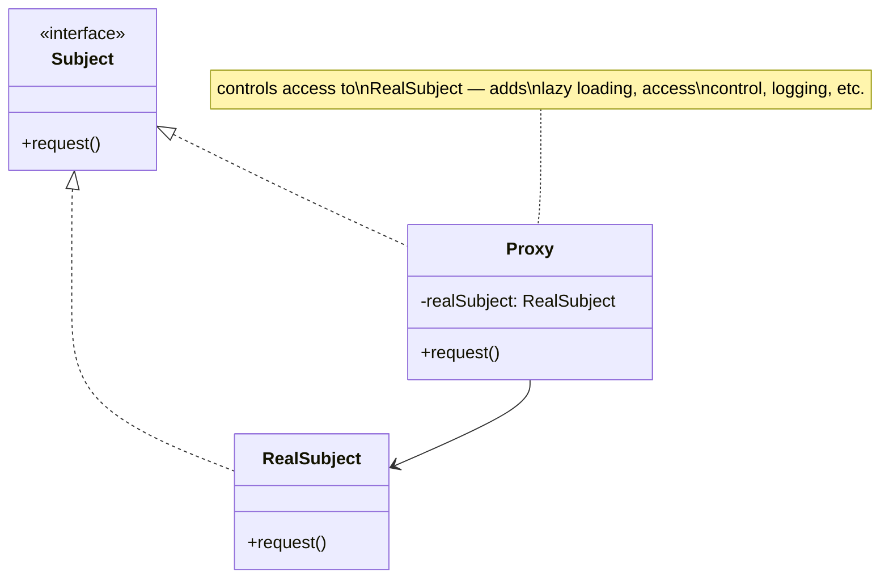

The Gumball Machine monitor uses a remote proxy. The Proxy pattern has
multiple variations: remote proxy (stub), virtual proxy (lazy load),
protection proxy (access control), and others. The proxy and the real
subject share the same interface so the client cannot tell them apart.

---

## Compound Patterns — Chapter 12 (MVC)

Model-View-Controller as a composition of multiple patterns: Observer,
Strategy, and Composite working together.

```mermaid
flowchart LR
    subgraph MVC["Model-View-Controller"]
        MODEL["Model\n(Observer Pattern)\nholds data & business logic"]
        VIEW["View\n(Composite Pattern)\ndisplays the UI"]
        CTRL["Controller\n(Strategy Pattern)\nhandles user input"]
    end

    USER["User"] -->|"interacts"| VIEW
    USER -->|"interacts"| CTRL
    CTRL -->|"changes"| MODEL
    MODEL -->|"notifies"| VIEW
    VIEW -->|"queries"| MODEL

    note for MODEL "Uses Observer — View\nobserves Model state changes"
    note for VIEW "Uses Composite —\nUI widgets are a tree"
    note for CTRL "Uses Strategy —\nController is the strategy\nfor handling input"
```

MVC is the ultimate compound pattern. The Model uses Observer to notify
Views of state changes. The View uses Composite to organize UI widgets.
The Controller implements Strategy — it encapsulates the input-handling
strategy for the View.

---

## Key Lessons

- **Patterns are not goals; they are tools.** The goal is maintainable,
  flexible code. If a pattern makes things worse, do not use it.
- **Principles over patterns.** The 9 OO design principles are more
  important than memorizing the 14+ patterns. Principles let you invent
  your own patterns when the catalog does not match.
- **Encapsulation is the running theme.** Every pattern encapsulates
  something: behavior (Strategy), object creation (Factory), algorithms
  (Template Method), iteration (Iterator), state (State), requests
  (Command), access (Proxy).
- **Start naive, then refactor.** The book's approach of showing a bad
  solution first, then introducing the pattern, mirrors real-world
  development better than presenting the pattern fully-formed.

---

## Practical Applications

- **Strategy:** Payment processors, validation rules, sorting algorithms
- **Observer:** Event systems, pub/sub messaging, reactive UI bindings
- **Decorator:** Java I/O streams, HTTP middleware, caching layers
- **Factory:** Object creation in frameworks, ORM repositories
- **Singleton:** Logging, configuration, thread pools (use sparingly)
- **Command:** Undo/redo, transaction logs, macro recording
- **Adapter:** Third-party library wrappers, legacy integration
- **Facade:** API simplification, service layers, library wrappers
- **Template Method:** JUnit test frameworks, algorithm families
- **Composite:** UI component trees, file systems, organizational charts
- **State:** Workflow engines, game character behaviors, connection states
- **Proxy:** Lazy loading, access control, caching, remote stubs
