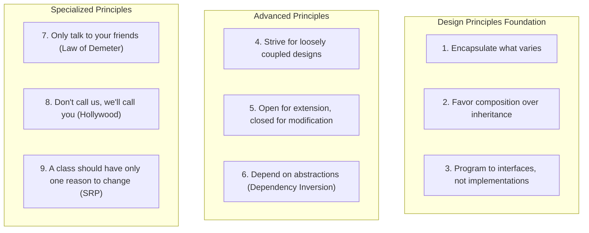

## Overview

*Head First Design Patterns* (2004, 2nd ed. 2020) by Eric Freeman,
Elisabeth Robson, Bert Bates, and Kathy Sierra — the most accessible
introduction to the Gang of Four design patterns ever written. Using
cognitive science and learning theory, the book delivers patterns
through visual richness, conversation, humor, and hands-on exercises.

---
{}
---|---------|------------|---------------|
| 1 | Welcome to Design Patterns | Strategy | Encapsulate what varies |
| 2 | Keeping Objects in the Know | Observer | Strive for loose coupling |
| 3 | Decorating Objects | Decorator | Open for extension, closed for modification |
| 4 | Baking with OO Goodness | Factory Method, Abstract Factory | Depend on abstractions |
| 5 | One-of-a-Kind Objects | Singleton | — |
| 6 | Encapsulating Invocation | Command | — |
| 7 | Being Adaptive | Adapter, Facade | Principle of Least Knowledge |
| 8 | Encapsulating Algorithms | Template Method | Hollywood Principle |
| 9 | Well-Managed Collections | Iterator, Composite | Single Responsibility |
| 10 | The State of Things | State | — |
| 11 | Controlling Object Access | Proxy | — |
| 12 | Patterns of Patterns | Compound (MVC) | — |
| 13 | Patterns in the Real World | — | Beyond GoF |
| 14 | Appendix | Bridge, Builder, Chain, Flyweight, Interpreter, Mediator, Memento, Prototype, Visitor | — |

---

## Key Takeaways

1. **Encapsulate what varies.** Identify the aspects of your application
   that change and separate them from what stays the same. This is the
   fundamental organizing principle behind all design patterns.

2. **Favor composition over inheritance.** Inheritance binds you at
   compile time; composition lets you change behavior at runtime.
   "HAS-A" is often better than "IS-A."

3. **Program to an interface, not an implementation.** Code against
   abstractions so you can swap implementations without rewriting
   everything.

4. **Strive for loosely coupled designs.** When objects know too much
   about each other, change ripples through the system. Loose coupling
   is the hallmark of maintainable OO software.

5. **Classes should be open for extension, closed for modification.**
   The Open-Closed Principle is the driving force behind the Decorator
   pattern and many others.

---

## OO Design Principles

---

## Who Should Read

| Reader Type | Why |
|---|---|
| Junior/mid-level developers | The best first book on design patterns |
| Experienced devs without patterns training | Finally understand what the GoF patterns are |
| Java developers | All examples in Java 8+ |
| Instructors teaching OO design | Proven pedagogical approach |
| Self-taught programmers | Fill the formal design knowledge gap |

---

## Who Should Skip

- Experts who already know all GoF patterns in depth (read GoF direct)
- Developers in purely functional/declarative paradigms
- Those wanting a quick reference catalog (buy the GoF book instead)
- Readers who dislike informal, visual learning styles

---

## Why This Book Matters

Head First Design Patterns transformed how an entire generation of
developers learned design patterns. Before it, the GoF book was the
only option — dense, academic, and intimidating. Freeman et al. proved
that complex software design concepts could be taught with humor,
pictures, and conversation without sacrificing depth. It made patterns
accessible to hundreds of thousands of developers who would have never
opened the original.

---

## Related Books

| Book | Author(s) | Connection |
|------|-----------|------------|
| **Design Patterns (GoF)** | Gamma, Helm, Johnson, Vlissides | The original — more formal, complete catalog |
| **Head First Object-Oriented Analysis & Design** | McLaughlin et al. | Prerequisite concepts in same style |
| **Refactoring to Patterns** | Joshua Kerievsky | How to introduce patterns into legacy code |
| **Patterns of Enterprise Application Architecture** | Martin Fowler | Enterprise-level patterns beyond GoF |
| **Clean Architecture** | Robert C. Martin | Applies design principles at system scale |

---

## Final Verdict

*Head First Design Patterns* is the best introductory book on design
patterns ever written. It is not a reference catalog — it is a learning
experience. The cognitive science approach genuinely works: you will
remember the duck simulator, the gumball machine, and the Starbuzz
coffee example years after reading. For anyone who needs to understand
patterns and OO design principles, this is the first book to read.

**Rating: 9/10** — The gold standard for learning design patterns.
Not a substitute for the GoF catalog, but the best on-ramp ever built.
