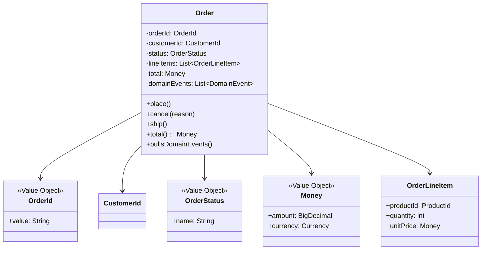
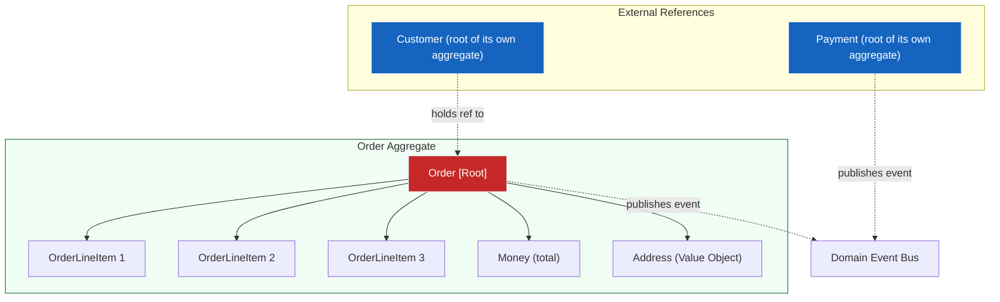
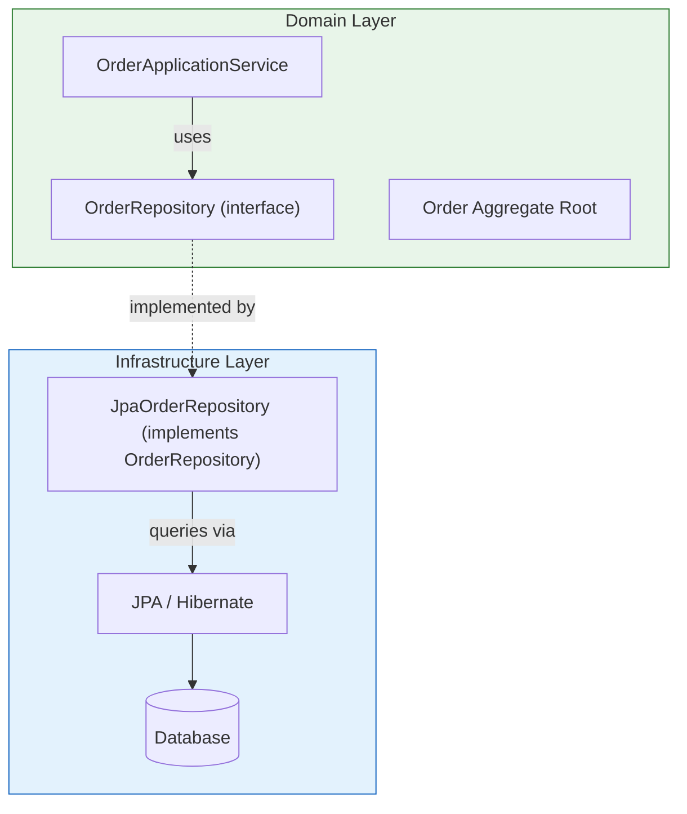
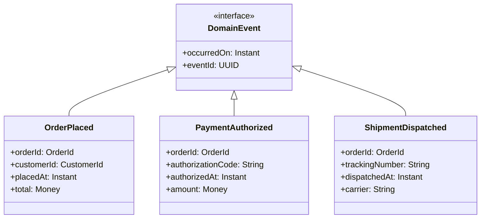
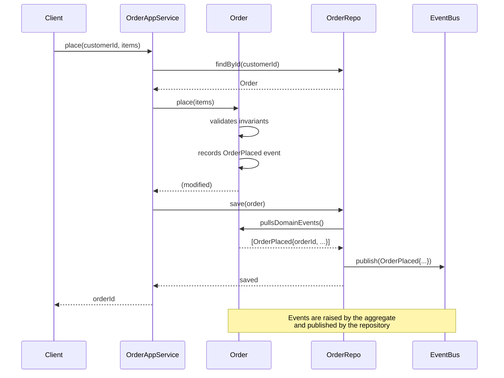
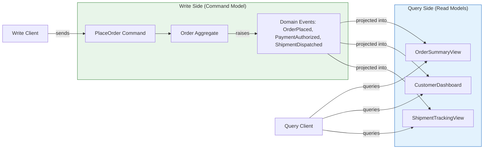
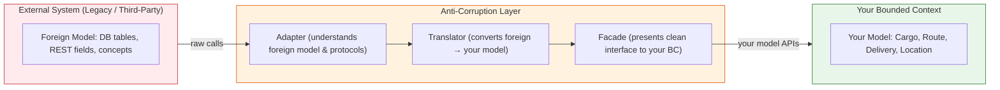
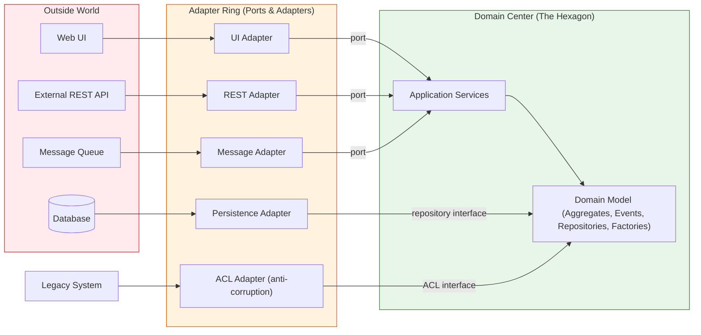

## From Theory to Implementation

Eric Evans' *Domain-Driven Design* (2003) gave the software world its conceptual vocabulary. Bounded Context, Aggregate, Anti-Corruption Layer, Ubiquitous Language, Domain Event — these terms are now standard professional knowledge. What Evans withheld by design was the implementation. His book is stack-neutral. It describes what an aggregate enforces and what a repository guarantees without showing a single line of Java.

Vernon's book supplies that missing layer. This file covers the core concepts as Vernon develops them: the behavior-rich domain model as the antidote to the anemic anti-pattern, the operational mechanics of aggregates and repositories, domain events as a modeling primitive rather than a messaging concern, the relationship between CQRS and DDD, Event Sourcing as a persistence strategy for event-producing aggregates, hexagonal architecture alignment, the practical mechanics of the anti-corruption layer, and how Spring and Akka fit into the picture.

---

## The Anemic Domain Model: The Silent Killer

Before teaching how to implement DDD correctly, Vernon spends significant space on what goes wrong. The single most common failure mode in DDD projects is the **anemic domain model**.

```mermaid
classDiagram
class AnemicOrder {
  +orderId: String
  +customerId: String
  +status: String
  +total: BigDecimal
  +setStatus(status)
  +setTotal(total)
  +getOrderId()
  +getCustomerId()
}
class OrderService {
  +placeOrder(customer, items)
  +cancelOrder(orderId)
  +shipOrder(orderId)
  +trackOrder(orderId)
}
OrderService --> AnemicOrder : operates on
note for AnemicOrder
  No behavior.
  Only getters and setters.
  Business logic lives in the service.
end note
```

An anemic domain model is a data structure wearing DDD branding. The `Order` class has fields — `orderId`, `customerId`, `status`, `total` — and getters and setters. No behavior. It cannot enforce its own invariants. It cannot validate its own transitions. It cannot reject an invalid state change. All the "domain logic" lives in a separate `OrderService`, which manipulates the Order as though it were a database row.

The consequences cascade:
- **Invariants cannot be enforced.** Who validates that an order cannot transition to `SHIPPED` before `PLACED`? The service. But every path to the service must apply the same checks independently. A missed check produces an invalid order, and the bug is distributed across the service layer rather than localized in the model.
- **The model is not a shared language.** The domain expert cannot look at the `Order` class and recognize their business. There is no `place()`, no `cancel()`, no `ship()` method — only `setStatus()`. The Ubiquitous Language is absent from the code.
- **The "domain" layer is not a layer.** In DDD the domain layer is the innermost circle — the part that knows the most about the business and depends on nothing else. An anemic model inverts this: the domain layer knows nothing, and everything else knows everything.

The DDD alternative is a **behavior-rich domain model**:



In this model the `Order` class enforces its own invariants. The `place()` method validates that line items exist and that the total is non-negative. The `cancel()` method validates that the order is in a cancellable state. The `ship()` method raises a domain event when it executes. The model *is* the business logic.

---

## The Ubiquitous Language: Operational Discipline

The Ubiquitous Language is Evans' most immediately practical contribution, and it is the easiest principle to adopt incrementally. You do not need to restructure your project to start using a shared vocabulary. You start by listening to the language domain experts actually use.

The discipline has four operational rules:

1. **Jettison the sanitized requirements document language.** Domain experts in a cargo shipping company use words like "roll," "route," "customs," "manifest," "leg," and "delay." These words carry embedded concepts, rules, and exception cases. When a requirements document describes a "routing option," the question is: does that phrase mean the same thing the domain expert means when they say "routing option" in conversation?

2. **Detect every inconsistency between code and conversation as a model defect.** If a developer says "we save the shipment record" and a domain expert says "we dispatch the shipment," the code word `saveShipment()` is wrong. The expert's language is authoritative. Rename the method to `dispatchShipment()`.

3. **Force the same word into every artifact.** Class names. Method names. Variable names. Database column names. Architecture diagram labels. Documentation headings. Conversation with stakeholders. The cost of inconsistency is not documentation debt — it is model drift that manifests as bugs, misaligned expectations, and developers and domain experts talking past each other in production-incident meetings.

4. **When a domain expert says something does not match the code, the code is wrong.** This rule sounds obvious but is consistently violated. Developers defend the code's vocabulary because "that's how the database table is named" or "the API spec was written that way." The code is wrong. Rename the table. Update the spec. The language must flow from the domain to the implementation, not the reverse.

---

## Model-Driven Design: Code Is the Model

Model-Driven Design collapses the traditional three phases — analysis, design, implementation — into one. The single resulting model is expressed directly in code. If the code does not reveal the model, the model does not exist.

The operational principle:

> **Design the model to be implemented directly. Implement it such that the code reveals the model.**

When you rename a class in the code, you rename a concept in the model. When you refactor `calculateTotal()` to `computeFreightCost()`, you clarify the model. When a domain expert says "that's not what we call that" and you rename the method, the model has just been refined by implementation.

This is why the domain model must be *behavior-rich*. A data structure with no methods cannot reveal the model. It reveals only a schema. The methods — `place()`, `cancel()`, `assignToRoute()` — are where the model lives. They surface the Ubiquitous Language. They enforce invariants. They are the implementation.

---

## Aggregates: Consistency Boundaries in Depth

Aggregates are the central tactical pattern in DDD's operational architecture. An aggregate is a cluster of related domain objects treated as a unit for data-change. It has a designated **root** (always an Entity) and a **boundary**. Everything inside the boundary must be consistent. Everything outside references only the root.

The rules are non-negotiable:

- The **root** is the only member of the aggregate that external objects may hold references to.
- The **root** checks and enforces all invariants within the aggregate.
- Deleting an object within the boundary cascades and deletes everything within the boundary.
- When a change involves multiple aggregates, use eventual consistency via domain events rather than spanning a transaction.



**Aggregate design is the most consequential modeling decision in DDD.** Get it wrong and you will either have transactions spanning too many objects or aggregates so small they produce excessive inter-aggregate coordination.

Vernon emphasizes that aggregates should be **designed small**. Many teams new to DDD model aggregates as sprawling clusters: an Order containing Customer, Payment, Shipment, and Invoice. This produces aggregates expensive to load, hard to persist atomically, and prone to performance failure under load. The correct approach is to identify the invariants the aggregate must enforce and size the boundary accordingly. An aggregate enforcing "an order cannot be shipped before it is paid" might include Order and Payment. An aggregate tracking "a customer's loyalty points across orders" is a separate aggregate entirely.

The aggregate boundary is the transactional boundary. If `Order` and `Payment` are in the same aggregate they update atomically. In separate aggregates, `Order.ship()` publishes a `PaymentAuthorized` domain event and the `Payment` aggregate reacts. Both are valid — the choice depends on whether the invariant is a true business requirement or a convenience assumption inherited from a shared-database architecture.

---

## Repositories: The Illusion of In-Memory Collections

Repositories provide the illusion of an in-memory collection of aggregate roots:

```java
public interface OrderRepository {
  Optional<Order> findById(OrderId id);
  void save(Order order);
  List<Order> findByCustomerId(CustomerId customerId, int page, int size);
}
```

The critical implementation rules:

1. **Repositories return full aggregates.** The method returns an `Order`, not `OrderData` or an `OrderRow`. The caller receives a fully-constructed aggregate root with all invariants intact.
2. **Repositories accept full aggregates.** `save()` receives an `Order` aggregate. It does not accept partial updates to aggregate members. The root mutates its own state.
3. **Repositories do not expose queries into aggregate internals.** A method like `findOrdersWithTotalGreaterThan()` that reaches into internals violates the aggregate boundary. Create a separate read model for that query.
4. **Repositories belong to the domain layer interface, implemented in the infrastructure layer.** The domain layer defines `OrderRepository` as an interface. Infrastructure provides the implementation backed by JPA, JDBC, or whatever persistence mechanism. This inversion keeps the domain layer independent of framework concerns.



---

## Factories: Construction Logic Outside the Aggregate

Complex aggregate construction — validating cross-field constraints, fetching reference data, assembling sub-objects that must be valid at creation — should not live in the constructor. Constructors should be simple. Creation logic complex enough to deserve its own name belongs in a factory:

```java
public interface OrderFactory {
  Order create(NewOrderCommand command);
}

public class StandardOrderFactory implements OrderFactory {
  private final CustomerRepository customerRepository;
  private final ProductRepository productRepository;

  public StandardOrderFactory(CustomerRepository customerRepository,
      ProductRepository productRepository) {
    this.customerRepository = customerRepository;
    this.productRepository = productRepository;
  }

  @Override
  public Order create(NewOrderCommand command) {
    Customer customer = customerRepository.findById(command.customerId())
      .orElseThrow(() -> new CustomerNotFoundException(command.customerId()));
    List<OrderLineItem> items = command.lineItems().stream()
      .map(item -> {
        Product product = productRepository.findById(item.productId());
        return new OrderLineItem(item.productId(), product.defaultPrice(), item.quantity());
      })
      .toList();
    return new Order(customer.id(), items);
  }
}
```

Like repositories, factories belong to the domain layer interface but are implemented in the infrastructure layer. The domain model defines the contract; infrastructure provides construction logic that may depend on other repositories or external services.

---

## Domain Events: A Modeling Tool, Not Just Notification

Domain events are the output of an aggregate's behavior. They describe something that *happened* in the domain. Vernon's key insight — which extends Evans' original tactical list — is that domain events are a *modeling tool*, not a messaging infrastructure choice.



The rules:

- **Name them in the past tense.** `OrderPlaced`, `PaymentAuthorized`, `ShipmentDispatched` — not `PlaceOrder`, `AuthorizePayment`. The past tense makes semantics unambiguous: events describe what *happened*. Commands describe what *should happen*. Keep them separate.
- **Make them immutable.** Once raised, an event never changes. If payment authorization was issued at 10:00:03 UTC, that fact is permanent.
- **Make them self-describing.** An event must contain all the information a downstream consumer needs. `OrderPlaced` carries `orderId`, `customerId`, `total`, and `placedAt` — not just an `orderId` reference that requires a lookup.
- **Aggregates collect and publish domain events.** Events are held in a collection within the aggregate. When the repository saves the aggregate, it publishes the collected events through a domain event dispatcher. This decouples the aggregate from the notification mechanism while ensuring events are always raised.



---

## CQRS: Natural Extension of DDD

CQRS separates the read model from the write model. The write model enforces invariants through aggregates. The read model serves application-specific queries optimized for the user's view of the data.

The connection to DDD is direct:

- **Commands** map to aggregate operations. `PlaceOrder`, `CancelShipment`, `AssignCustomer` — each command is an intent that the aggregate accepts or rejects based on its current state and invariants.
- **The write model** is the aggregate. It enforces all business rules. It publishes domain events. It is the source of truth.
- **The read model** is a projection of domain events into whatever shape the application needs. An order summary view, a customer dashboard, a tracking page — each is a separate projection denormalized and rebuilt independently.
- **Events** are the integration mechanism. Every domain event that the write model publishes is materialized into each relevant read model.



CQRS is not required for DDD. Most systems can run a single model and accept the cost of some queries being slightly less efficient. Vernon's contribution is identifying *when the cost of compromise exceeds the cost of separation*. The signal: when you find yourself adding read-optimized data structures to the write model — cached summaries, denormalized fields, pre-computed lookups — you have a read model trying to be born. Rather than corrupting the write model, separate them cleanly.

---

## Event Sourcing: Persistence via Domain Events

Event Sourcing stores the complete sequence of state-changing events that led to an aggregate's current state, rather than storing only the current state. To reconstruct the current state, you replay the event stream from the beginning.

The relationship to DDD is precise: if your aggregates already produce domain events, you are already halfway to Event Sourcing. The final step is to persist those events (rather than current-state rows) and to use event replay as the mechanism for reconstructing aggregate state on load.

```mermaid
flowchart TD
subgraph EventStore[("Event Store")]
  E1["OrderPlaced"]
  E2["PaymentAuthorized"]
  E3["ShipmentDispatched"]
  E4["DeliveryCompleted"]
end
subgraph AggregateReplay["Replay to Build State"]
  Replayer["Event Replayer"] -->|reads| E1
  Replayer -->|applies to| State["Current Aggregate State"]
  Replayer -->|reads| E2
  Replayer -->|applies to| State
  Replayer -->|reads| E3
  Replayer -->|applies to| State
  Replayer -->|reads| E4
  Replayer -->|applies to| State
end
Cmd["PlaceOrder Command"] -->|causes| E1
State -->|is read by| Repo["OrderRepository"]
style EventStore fill:#1565c0,color:#fff,stroke:#e2e8f0
style State fill:#2c5282,color:#fff,stroke:#e2e8f0
```

The benefits are substantial:
- **Complete audit log.** Every state change is recorded immutably with a timestamp and causal event identity — what many compliance frameworks require as a separate system.
- **Temporal queries.** "What did this order look like when it was placed?" is answered by replaying up to that event rather than querying snapshot and audit tables.
- **Rebuild projections.** Any read model can be completely rebuilt from the event stream. If a customer dashboard projection is corrupted, you drop and rebuild it from events.
- **Causal clarity.** Every state change is traceable to a specific event with a timestamp. Debugging an incorrect current state means tracing the event stream — often faster than reconstructing mutation history from database audit trails.

The trade-offs are real. Event stores are less familiar than relational databases. Debugging is harder when the current state is not a visible database row. Replay performance for large event streams requires periodic snapshots. Queries like "find all orders where total exceeded $10,000" require either a maintained projection or a scan of the event stream.

Vernon's position: Event Sourcing is a persistence mechanism, not a replacement for DDD. It is the right choice when the audit-log, temporal-query, or rebuild requirements provide genuine business value. It is not mandatory for DDD practice.

---

## The Anti-Corruption Layer: Mechanics of Translation

The ACL is the pattern for integrating with a system whose model is fundamentally incompatible with yours. Vernon's contribution beyond Evans' original description is the implementation-level detail: what an ACL actually consists of in code, how to size it, and how to maintain it.



The ACL has three components:
- **Adapter:** understands the foreign system's protocols and data formats. It is the only part of your system that knows about the outside world's specifics.
- **Translator:** converts between the foreign representation and your model's representation. It maps foreign field names to your Ubiquitous Language terms. It decides which fields matter for your bounded context — translating only what you need, not everything the external system exposes.
- **Facade:** presents a clean, stable interface to your bounded context. Your domain code calls `legacyCustomerRepository.findById()` and receives back a `Customer` in your model's vocabulary. It has no idea that behind the facade the legacy system stores customers as `CUST_REC` records with fields like `CUST_ID_NBR`.

The common mistake is making the ACL too thin — exposing foreign field names directly to the domain model and saying "we'll adapt later." Domain experts learn the foreign names, developers code against them, and the foreign model leaks into your bounded context. The other mistake is making it too thick — translating every field of every entity regardless of whether your bounded context uses it.

The right approach is iterative: start with the smallest translation that makes the integration work, then expand it as your bounded context's needs expand.

---

## Hexagonal Architecture: DDD and Ports-and-Adapters

Vernon devotes a chapter to connecting DDD to **Hexagonal Architecture** — placing the domain model at the center and treating the outside world — databases, APIs, message queues, UIs — as adapters on the periphery.



In the hexagonal model, the domain model has no dependencies pointing outward. It defines interfaces — `OrderRepository`, `CustomerRepository`, `DomainEventDispatcher` — and external adapters implement those interfaces. The domain layer is testable in isolation, substitutable, and protected from framework volatility.

Vernon demonstrates how to structure a Spring application to achieve this. The domain module defines interfaces. The infrastructure module defines JPA-backed implementations. The configuration module wires them together. The domain module has no dependency on Spring. The dependency points inward.

---

## Spring and Akka: Frameworks as Enablers

**Spring:** The domain model must be a POJO with no Spring annotations. Spring's role is to inject the infrastructure implementations that the domain layer's interfaces define:

```java
// Domain layer — no Spring annotations
public interface OrderRepository { ... }
public interface DomainEventPublisher { ... }
public class Order { ... } // pure POJO

// Infrastructure layer — Spring configuration
@Configuration
public class PersistenceConfig {
  @Bean
  public OrderRepository orderRepository(EntityManager em) {
    return new JpaOrderRepository(em);
  }
  @Bean
  public DomainEventPublisher eventPublisher(ApplicationEventPublisher springPublisher) {
    return new SpringDomainEventPublisher(springPublisher);
  }
}
```

The domain model is testable by constructing concrete implementations of its interfaces in memory. Spring is only involved at the application's composition root.

**Akka:** Akka's actor model maps cleanly to DDD's aggregate roots. Each actor is a persistent entity whose state changes only through message handling. The actor's mailbox serializes access — solving the concurrency problem that aggregate consistency requires. Akka Persistence provides event sourcing as a built-in feature. Vernon shows how to structure Akka actors as command handlers that validate intent, update state, and emit domain events — the exact lifecycle of a DDD aggregate.

---

## Bounded Contexts and the Deployment Boundary

The most strategically important practical insight in Vernon's book is that a **Bounded Context maps to a deployable unit**. This is the practical consequence of Evans' strategic design applied to modern architecture.

A bounded context has three boundaries:
- A **consistency boundary** (the aggregate cluster it owns)
- A **model boundary** (the Ubiquitous Language within it)
- A **team boundary** (the ownership responsibility)

All three boundaries align most cleanly when the bounded context is a single deployable unit: a service, a Spring Boot application, an Akka cluster. This alignment makes microservices and DDD natural partners. It also makes the DDD strategic vocabulary directly useful for teams attempting a microservices migration: the bounded context boundaries they need already exist as conceptual boundaries if they have done the modeling work.

Vernon is explicit: you do not need microservices to practice DDD. Bounded contexts can exist within a monolith — as modules, namespaces, or package structures with enforced internal boundaries.

---

## Common Implementation Mistakes

Vernon identifies the mistakes that destroy DDD projects in practice:

| Mistake | Symptom | Fix |
|---------|---------|-----|
| **Anemic domain model** | Domain objects have getters and setters; business logic lives in services | Move behavior onto aggregate roots; services orchestrate aggregates, not implement domain rules |
| **Over-sized aggregates** | One aggregate loads hundreds of objects; queries are slow | Identify the true invariants; split aggregates at the consistency boundary |
| **Repository that is really a DAO** | Repository has `update(order, "status", "SHIPPED")` methods that bypass the aggregate root | Repositories must accept and return full aggregates only |
| **Partial aggregate loading** | External code reaches into aggregate internals after loading from repository | Enforce aggregate encapsulation through access control |
| **Shared database between bounded contexts** | Two bounded contexts read and write the same tables | Each bounded context owns its own schema; translate via ACL |
| **Ignoring eventual consistency** | Synchronous calls block the entire workflow; system is brittle | Use domain events for cross-aggregate communication; design for eventual consistency |
| **Too-thin ACL** | Foreign field names leak into your context; Ubiquitous Language eroded | The ACL must translate everything that crosses the context boundary |
| **Framework as model** | Database schema or JPA entities become the de facto domain model | The domain model must be a pure in-memory construct; persistence and transport are adapters |
| **Everything is a domain event** | Domain events raised for trivial state changes that nothing cares about | An event should be raised only when something a different part of the system cares about has happened |
| **Skipping the Ubiquitous Language** | Developers use different terms in code than domain experts use in conversation | Enforce the language at the code-review level; rename without ceremony |
