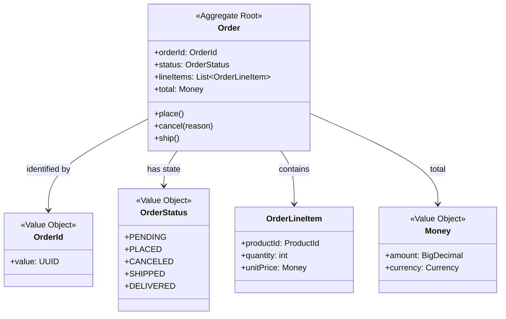
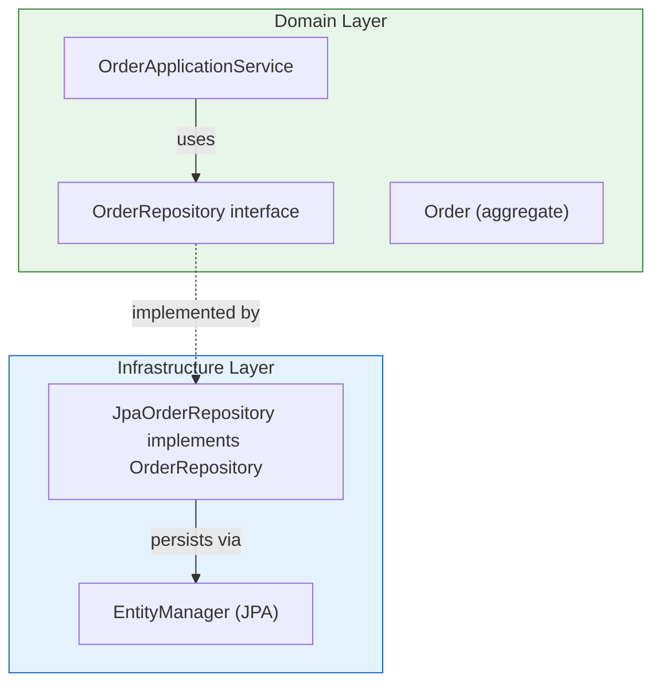
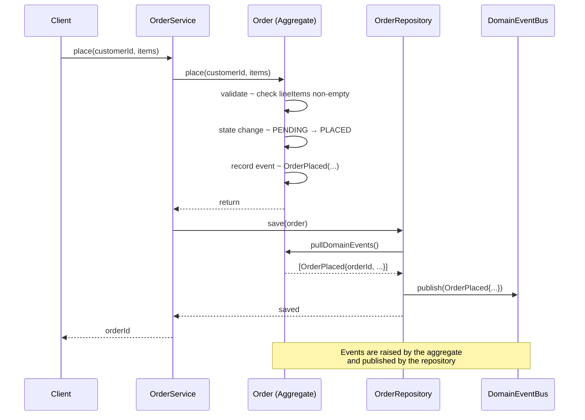
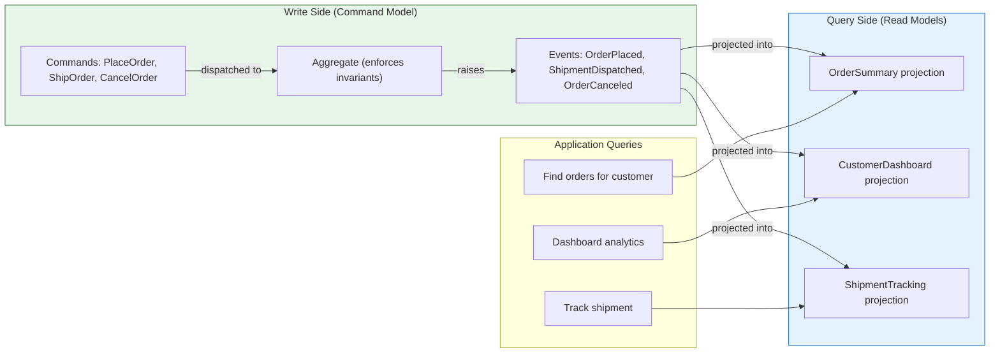
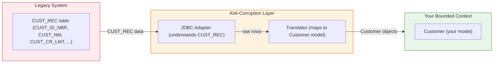
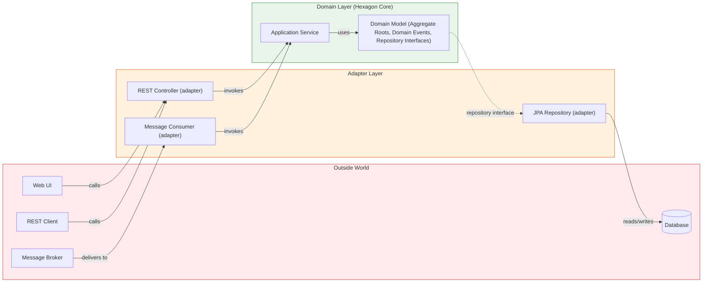

## Narration Script

This narration is designed to orient a first-time reader through *Implementing Domain-Driven Design* (2nd edition, 2020). It walks through the central problem, the tactical building blocks, the architectural frameworks, and the practical mechanics of a Spring-based DDD project. It is best read alongside the key chapters mentioned in each section.

---

### 1. The Problem: What Goes Wrong When Teams "Do DDD"

Think about the last Java enterprise project you saw that claimed to use DDD. The team had aggregates. They had repositories. They had a package structure that looked DDD-ish. And yet the code had no behavior. The `Order` class had `orderId`, `customerId`, `total`, and `getOrderId()` / `setTotal()` methods. The business rules — "an order cannot be canceled after shipment," "a customer who placed fewer than three orders is not eligible for wholesale pricing" — were scattered across a `@Service` class called `OrderBusinessLogicManager`.

This is the **anemic domain model**. It is the single most common failure mode in DDD projects, and Vaughn Vernon names it explicitly so that teams can recognize it and stop.

The symptom is easy to spot: when you open a domain class and find only getters and setters, the domain layer is not a layer — it is a data structure. The behavior is somewhere else, in services with no model discipline and no consistency boundary protection. Invariants can be missed on any code path. The Ubiquitous Language is absent from the code. And the team believes they have done DDD because they used the right class names.

The cure is also straightforward, Vernon argues: **put the behavior where the data lives**. The `Order` class should have a `cancel()` method that validates whether the cancellation is allowed and raises the appropriate domain event. The `Customer` class should have a method that computes eligibility for wholesale pricing. The domain object should be a *domain object*, not a row in a table wearing Java clothing.

This is harder than it sounds. It requires unlearning the JavaBeans convention that has shaped enterprise Java development for decades. It requires deciding what the aggregate's invariants actually are — which is harder than it looks when you have been writing database-centric code for years. And it requires taking responsibility for those invariants inside the model rather than delegating them to a service layer.

But once you have made that shift, everything downstream becomes simpler. The repository returns full, valid aggregates. The service orchestrates rather than validates. The domain model is testable in isolation. The code reads like the problem domain.

---

### 2. The Tactical Layer: Aggregates, Repositories, and Factories in Code

Vernon's contribution to the tactical patterns is detail — at a granularity that Evans' original did not provide. For each pattern, Vernon shows what it looks like in Java, what it must not look like, and what operational problems arise when implemented incorrectly.

**Aggregates and aggregate design.**

An aggregate is a consistency boundary. Everything inside must be valid at all times. Everything outside references only the root. Repositories must load and save the entire aggregate. Partial loading — reaching into an `Order` entity's `OrderLineItem` field from outside the aggregate — is the anti-pattern that silently breaks DDD's invariants. The rule is absolute: external code must not see inside an aggregate. It must interact only through the root's public interface.

Vernon also addresses aggregate sizing, the most consequential modeling decision a DDD team makes. Aggregates that are too large produce slow transactions, high database contention, and unclear invariants. Aggregates that are too small produce excessive inter-aggregate communication and an explosion of domain events. The sizing criterion: an aggregate's boundary should contain exactly the objects that must be consistent within a single transaction.

Value objects in the diagram are immutable: you do not change a `Money` from 500 to 600 USD. You create a new `Money` of 600 USD. This immutability is required for safe sharing inside and across aggregates. A `Money` value object can be passed in and out of aggregates without fear that another code path will mutate it while the aggregate holds a reference to it.

**Repositories.**

Repositories provide the *illusion* of an in-memory collection. `orderRepository.findById(orderId)` returns an `Order`. `orderRepository.save(order)` persists it. You do not think in SQL. You think in aggregates.

In code, a repository is an interface in the domain layer and an implementation in the infrastructure layer. The domain layer defines the contract using only domain vocabulary. The infrastructure layer satisfies it using JPA, JDBC, or any persistence mechanism.

**Factories.**

Factory pattern is used when aggregate construction is too complex for a constructor. When construction requires validation logic, fetching reference data, or cross-field constraint checking too involved for a constructor, a factory encapsulates that logic. Factories are part of the domain layer's interface but are implemented in the infrastructure layer — the same layering discipline as repositories.

---

### 3. Domain Events: Capturing What Happened

This is where Vernon's treatment becomes original. Domain events are not new — Martin Fowler introduced event-driven architecture, and DDD community discussions had mentioned domain events for years. What Vernon adds is the *modeling discipline*: treating domain events as a first-class part of the *domain model itself*, not just a messaging infrastructure.

The principle: every state-changing operation on an aggregate raises a domain event. The event describes *what happened* — in the past tense. It is immutable, self-describing, and consumable by any part of the system that cares.

The event is *pulled* from the aggregate by the repository at save time. The aggregate does not publish directly — it only records. This keeps the aggregate independent of the messaging infrastructure while ensuring events are always raised and always captured.

The practical consequence: if you are not raising domain events from your aggregates, you are not doing the full job of DDD. The domain events are the mechanism by which model changes propagate to other bounded contexts, to read models, to audit logs, and to integration points. They are the "nervous system" of the model.

---

### 4. CQRS: Separating the Read Side from the Write Side

CQRS is the pattern that emerges naturally when you realize the aggregate's write model — optimized for enforcing invariants — is structurally different from the query models your users and downstream systems need.

The write model is the aggregate. It lives at exactly one identity. It produces domain events. It is small, well-defined, and governs consistency.

The read models are projections. They are built from domain events (or materialized views updated on write). They serve the queries your application actually runs: "show me all orders placed by this customer in the last 30 days," "show me dashboard statistics by region," "show me the current tracking status." These queries often need joins, denormalization, or aggregation that the aggregate model cannot efficiently support without violating its consistency boundary.

CQRS is not required for DDD. Most systems can run a single model and accept the cost of some queries being slightly less efficient. Vernon's contribution is identifying *when the cost of compromise exceeds the cost of separation*. The signal: when you find yourself adding read-optimized data structures to the write model — cached summaries, denormalized fields, pre-computed lookups — you have a read model trying to be born. Rather than corrupting the write model, separate them cleanly.

---

### 5. Event Sourcing: State Derived from an Event Stream

Event Sourcing stores state changes as a sequence of immutable domain events rather than as current-state rows. To reconstruct the current state of an aggregate, you replay its event stream from the beginning.

This pattern aligns particularly well with DDD because your aggregates are already event sources — they are already deciding to raise domain events as outputs of state-changing operations. Event Sourcing says: instead of persisting current state, persist those events. Then rebuild current state by replaying them.

The operational benefits:

- **Free audit log.** Every state change is recorded immutably with a timestamp and causal event identity — what compliance frameworks often require as a separate system.
- **Temporal queries.** "What did the order look like when it was first placed?" requires replaying to that event rather than comparing snapshot and audit tables.
- **Rebuild capability.** Any projection derived from the event stream can be completely rebuilt if corrupted. This is a property that snapshot-based persistence does not provide.
- **Causal clarity.** Every state change is traceable to a specific event with a timestamp. Debugging an incorrect current state means tracing the event stream — often faster than reconstructing mutation history from database audit trails.

The operational costs are real: an event store schema must be managed (particularly upcasting older event formats as the aggregate evolves). Snapshot strategies are needed to avoid replaying a large event stream on every aggregate load. The event store is a critical dependency with its own failure modes.

Vernon's position: these trade-offs are real and specific. Event Sourcing is the right tool for domains where the audit-log or temporal-query requirements provide genuine business value. It is not a default mode, and treating it as one produces systems that are more complex than they need to be.

---

### 6. The Anti-Corruption Layer: Translation Between Models

The ACL is the implementation-layer mechanism for Evans' strategic design pattern. Where Evans described the ACL conceptually — an isolating layer protecting your model from a foreign system — Vernon shows what it looks like in code.

The ACL sits between your bounded context and a system whose model is incompatible with yours: a legacy system with naming conventions that predate your domain vocabulary, a third-party API whose data model reflects the vendor's priorities rather than yours, or a neighboring team whose bounded context uses a different definition of "customer."

The ACL has three implementation components:

- **An adapter** that understands the foreign system's protocol and data format. This is the only part of your system that knows about the outside world's specifics.
- **A translator** that converts between the foreign representation and your model's representation. It maps foreign field names to your Ubiquitous Language terms. Crucially, it translates *only what your bounded context needs* — not every field the foreign system exposes.
- **A facade** that presents a clean, stable interface to your bounded context. Your domain code calls `legacyCustomerRepository.findById(customerId)` and receives a `Customer` in your model's vocabulary. It has no idea that behind the facade, the legacy system stores customers as `CUST_REC` records with fields named `CUST_ID_NBR`, `CUST_NM`, and `CUST_CR_LMT`.

The common mistake in ACL design is making it too thin — exposing foreign field names directly to the domain model. The other mistake is making it too thick — translating every field regardless of whether your bounded context uses it. The right approach is iterative: start with the smallest translation that works, then expand as your model's needs expand.

---

### 7. Hexagonal Architecture: DDD and Ports-and-Adapters

Hexagonal Architecture — also called Ports-and-Adapters — places the application's core logic behind a boundary defined by interfaces. The outside world (databases, HTTP, message queues, UI) are adapters. The inside is the domain model.

The relationship to DDD is structural: both place the domain model at the center. Both treat the outside world as an adapter on the periphery. The domain model depends on nothing except its own interfaces.

In a hexagonal-structured Spring application, the domain layer contains zero Spring annotations. It defines interfaces — `OrderRepository`, `CustomerRepository`, `DomainEventPublisher` — and the infrastructure layer provides implementations. Spring's dependency injection connects interfaces to implementations. The domain layer can be tested with in-memory implementations without Spring, without a database, without anything external.

Vernon provides the Spring `@Configuration` structure that achieves this: the domain module defines interfaces; infrastructure defines JPA-backed implementations; the configuration module wires them together. The domain module has no dependency on Spring. The dependency points inward.

---

### 8. The Bounded Context and the Microservices Connection

The most strategically important practical insight in Vernon's book — and the one that made it essential reading as microservices became the dominant paradigm — is that a **bounded context maps to a deployable unit**. This is not accidental. A bounded context has three boundaries:

- A **model boundary** — the Ubiquitous Language that applies within it
- A **consistency boundary** — the aggregates that share transactional consistency
- A **team boundary** — the ownership and responsibility

These three boundaries align most cleanly when the bounded context is deployed as a single unit: a service, a Spring Boot application, an Akka cluster. When a bounded context is deployed across multiple services, the model boundary between contexts becomes a network boundary. When multiple bounded contexts are deployed as a single service, they share a transaction boundary.

Vernon is explicit: you do not need microservices to practice DDD. Bounded contexts can exist within a monolith — as modules, as namespaces, as package structures with enforced internal boundaries.

---

### 9. Putting It Together: From Theory to a Java Project

Vernon closes with a chapter that shows how the pieces fit together in a running Java application. The domain model is behavior-rich and framework-independent. The application service orchestrates aggregate operations through repositories. The infrastructure layer provides implementations. Spring wires everything together. Domain events flow through the event bus. The hexagonal boundary keeps the domain layer pure.

The reading experience of this chapter is instructive: DDD is not a set of abstract principles applied retroactively to a project. It is a project structure — a way of organizing code, interfaces, layers, and dependencies — that produces a system whose running behavior matches the domain model. The code reveals the model. The model reflects the Ubiquitous Language. The language reflects what the domain experts actually say.

---

### 10. When DDD Is Not Worth the Investment

The most important practical section of Vernon's book may be the parts that explain when *not* to apply the full methodology. DDD is infrastructure — in knowledge, in collaborative modeling, in project structure, in team discipline. It pays for itself when the domain is genuinely complex and the software will outlive its original developers.

For a CRUD application with 20 entity types and no differentiating domain logic, introducing aggregates, repositories, domain events, and bounded contexts adds structure without adding value. The team will spend its time managing DDD infrastructure rather than delivering features.

For a single-developer project where the domain is genuinely complex — a legal reasoning system, a supply-chain optimization platform, an underwriting engine — the lightweight DDD disciplines (Ubiquitous Language, named invariants, continuous model refinement) pay for themselves immediately even without the full strategic design overhead.

Vernon's recommendation: apply judgment. Use the DDD patterns to the depth that the domain complexity demands. Do not use all of them all the time for all projects. A team that has built a clean CRUD application and is wondering if they should "add DDD" probably should not.

---

### 11. Closing: The Book Vernon Made Us Need

*Implementing Domain-Driven Design* is the book Eric Evans' audience needed but Evans did not write. Evans described a problem and a vocabulary. Vernon supplied the implementation. Together, they form the most complete DDD reference available: Evans for the why, Vernon for the how and the when.

Read Evans first. Then read Vernon with a real project in mind — a bounded context you are designing, an anemic model you are refactoring, an ACL you need to build. The book's value accumulates when you apply it. It is not a book to read passively. It is a book to have open while you code.

---

## Reading Map

| Phase | Chapters | Focus |
|-------|----------|-------|
| **Orientation** | 1–3 | DDD overview, Ubiquitous Language, Model-Driven Design |
| **Strategic Design** | 4–6 | Bounded Contexts, Context Maps, Core Domain identification |
| **Tactical Building Blocks** | 7–12 | Entities, Value Objects, Aggregates, Repositories, Factories, Domain Services |
| **Model Factoring** | 13–16 | Domain Events, Modules, Aggregate Design depth, Factory + Repository patterns |
| **Advanced Patterns** | 17–18 | CQRS, Event Sourcing |
| **Integration** | 19–20 | Bounded Context communication, ACL implementation |
| **Architecture** | 21–22 | Hexagonal Architecture, Spring wiring, Akka aggregate modeling |
