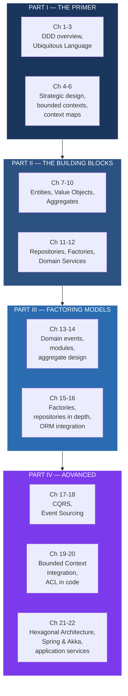

## Overview

*Implementing Domain-Driven Design* by **Vaughn Vernon** (Addison-Wesley, March 2020, 2nd ed.) is the most comprehensive practical companion to Eric Evans' influential *Domain-Driven Design*. Where Evans' blue book established the conceptual vocabulary — Ubiquitous Language, Bounded Contexts, Aggregates, Anti-Corruption Layers — Vernon's red book takes those concepts into the world of production Java code, showing exactly how to implement them, where the easy path leads to anemic models, and how modern frameworks like Spring and Akka can either help or undermine your DDD efforts.

This is not a book about DDD theory. Vernon does not re-explain Evans' patterns from first principles. It is a book about *building* DDD — the thousand small decisions about package structure, repository interfaces, aggregate persistence, domain event naming, and context boundaries that determine whether a DDD project succeeds or silently degrades into a CRUD architecture with better class names.

Vernon is uniquely qualified to write it. He is a DDD practitioner and consultant who has applied these patterns in large enterprise systems, primarily in Java. His approach is grounded in real failures: the anemic domain model, the over-sized aggregate, the shared database that collapses a bounded context's boundary, the repository that becomes a generic DAO. The book reads like a field manual written by someone who has been in the trenches.

---

## About the Author

**Vaughn Vernon** is an American software architect, consultant, and DDD practitioner. He is the founder of **Dynamic Systems**, a consultancy specializing in domain-driven design and reactive architecture. Vernon is widely recognized as the practitioner who translated Eric Evans' conceptual work into the most detailed implementation guide available, particularly for the JVM ecosystem.

Vernon's expertise spans Java, Scala, and Akka, and his consulting work focuses on helping engineering teams adopt DDD and reactive patterns in large enterprise environments. He is a frequent speaker at DDD and software architecture conferences and has become one of the primary voices bridging the gap between DDD theory and production practice. After *Implementing Domain-Driven Design*, he went on to write *Domain-Driven Design Distilled* (2016), a short (~150pp) primer intended as the modern entry point to DDD before tackling the full Evans or Vernon volumes.

---

## The Gap This Book Fills

When Evans published *Domain-Driven Design* in 2003, it defined the concepts but left implementation largely as an exercise for the reader. The tactical patterns — entities, value objects, aggregates, repositories, factories, domain services — were introduced conceptually but without the depth of operational detail that practitioners needed. The strategic patterns — bounded contexts, context maps, anti-corruption layers — were visionary but had almost no production implementation history to point to.

Ten years later, the DDD community had grown enormously. Bounded contexts had become the conceptual foundation of microservices architecture. Event storming had emerged as a collaborative modeling technique. CQRS and Event Sourcing — patterns that align naturally with DDD's tactical vocabulary — had entered the mainstream. What was missing was a single volume that connected all of this: that showed the implementation layer, explained the relationship between CQRS/Event Sourcing and DDD, demonstrated how to structure a real Java project around a behavior-rich domain model, and warned about the specific mistakes that derail DDD projects in practice.

That is what Vernon wrote.

---

## Executive Summary

The book has four parts that progress from foundational concepts to advanced implementation patterns. Part I re-establishes the DDD argument and introduces strategic design. Part II covers the tactical building blocks in detail with Java code examples. Part III goes deeper into aggregate design, domain events, and the mechanics of persistence. Part IV is the distinctive contribution: CQRS, Event Sourcing, bounded context integration code, and how to structure a real application using Spring's dependency injection and Akka's actor model as enablers of, rather than obstacles to, a behavior-rich domain model.

---

## Key Takeaways

- **The original DDD defined the vocabulary; this book defines the implementation.** A team that has read Evans but does not know how to implement repositories correctly, how to design aggregate boundaries for persistence, or how to name domain events is precisely the audience Vernon wrote for.

- **Aggregates define transactional consistency boundaries.** The aggregate pattern is not just about grouping related objects. It is about defining what can change atomically. Loading an entire aggregate for every operation — the correct implementation — is expensive. Vernon shows how to manage that cost without breaking the boundary.

- **Repositories return full aggregates. Always.** Partial loading of aggregate internals — loading an entity from a repository and then letting external code reach into its private state — is the most common implementation mistake that silently destroys DDD's consistency guarantees.

- **CQRS is a natural fit with DDD but is often misapplied.** Not every system needs CQRS. But when read models genuinely diverge from write models — when the queries your users run are structurally different from the operations your domain rules enforce — separating the two keeps both clean.

- **Event Sourcing pairs with DDD because domain events already exist in the model.** An aggregate that generates domain events (ShipmentDispatched, CargoRerouted) is halfway to Event Sourcing. The final step is persisting those events rather than current state, which gives you a complete audit log and the ability to rebuild any past state.

- **Domain Events should be named in the past tense and treated as immutable facts.** `ShipmentRerouted` is an event. `RerouteShipment` is a command. Naming events in the past tense makes their semantics unambiguous: they describe something that happened, not something that should happen.

- **The Anti-Corruption Layer is a specific adapter with a translation boundary.** It is not a generic "integration layer." It has two sides: an adapter that understands the foreign system's model, and a translator that converts only what your bounded context actually needs. Everything on your side uses your Ubiquitous Language.

- **Hexagonal Architecture and DDD are complementary, not competing.** Uncle Bob's ports-and-adapters model places the domain model at the center with no dependencies outward. DDD's anti-corruption layer is one specific adapter that translates between two hexagons. The two ideas fit together cleanly.

- **Spring and Akka can serve DDD, not subvert it.** Configured correctly, Spring's dependency injection isolates the domain layer from infrastructure concerns. Akka's actor model maps cleanly to aggregate roots: each actor is an aggregate, messages are commands and events, and persistence is handled by the Akka persistence plugin.

- **Anemic domain models are the silent failure mode.** When domain objects are POJOs with getters and setters and no behavior — when the "model" is just a data structure with a DDD-sounding name — the project has the appearance of DDD without any of the substance. Vernon identifies this pattern explicitly and shows how to avoid it.

- **Bounded Contexts are deployable units.** The practical insight that makes DDD relevant to microservices: a bounded context's boundary maps to a deployment boundary. This is the thread that connects Evans' strategic design to modern architecture.

- **You do not need microservices to practice DDD.** Bounded contexts can exist within a monolith, isolated by Java packages or Maven modules. The strategic design patterns — bounded contexts, context maps, anti-corruption layers — apply at any scale of deployment.

---

## Who Should Read

| Read this | Skip this |
|-----------|-----------|
| Engineers implementing DDD in Java who need the operational detail Evans omitted | Teams building simple CRUD apps that have no meaningful domain complexity |
| Architects and tech leads who understand DDD theory but cannot translate it to project structure | Developers who have not read Evans' original — this book assumes the DDD vocabulary |
| Teams building CQRS or Event Sourced systems who want the DDD framing for their approach | Readers looking for DDD coverage in C#, Python, or other non-JVM languages |
| Developers who have built anemic models and are ready to make the domain model behavior-rich | Practitioners looking for a quick, prescriptive implementation checklist |
| Spring developers who want to isolate a real domain model from framework coupling | Teams under such severe deadline pressure that they cannot invest in collaborative modeling |
| Akka practitioners who want to model their actors as DDD aggregates | Developers who prefer minimal abstraction and want to stay close to SQL |
| Practitioners integrating legacy systems via anti-corruption layers and need code-level guidance | Teams working in functional-first languages without the OO concepts DDD assumes |

---

## Core Themes

**Implementation is the discipline.** Vernon's central argument is that DDD is only as good as its implementation. A correctly-designed aggregate that is loaded partially from a repository is worse than no aggregate at all — it gives the team the false confidence of DDD structure while silently violating its consistency guarantees. The book treats implementation correctness as a first-class concern, not an afterthought.

**The framework is not the model.** Spring, Hibernate, Akka — these are tools. Used correctly, they isolate and protect the domain model. Used incorrectly, they become the model, and the domain logic gets smeared across controllers and anemic POJOs. Vernon devotes significant attention to showing how to *structure* a Spring application so the domain layer is a true inner circle with no outward dependencies.

**CQRS and Event Sourcing extend DDD, they do not replace it.** These patterns emerged from the DDD community precisely because they solve problems that DDD's tactical vocabulary identifies but does not fully resolve. The command side enforces aggregate invariants. The query side serves application-specific read models. Events capture the output of every state change. Together they make DDD's domain events into a first-class architectural artifact.

**Anti-corruption is iterative and contextual.** Building the ACL is not a one-time translation layer. It evolves as your model deepens and as the external system changes. Vernon advocates building the ACL iteratively, mapping only what you need, and being willing to refactor the translation as both models evolve.

**The bounded context boundary is also a team boundary.** This is the practical implication of Evans' strategic design that Vernon emphasizes most strongly: if you cannot name the team responsible for a bounded context, the boundary is not real. Organizational design and software design must advance together.

---

## Why This Book Matters

With the 2nd edition published in 2020, the DDD community was at an inflection point. Evans' blue book was seventeen years old — long enough for the concepts to have been tested in production and for the community to discover what was missing: not the theory, but the implementation depth. Teams that tried to apply DDD foundered not because the concepts were wrong, but because the leap from "entities and aggregates" to "a Java project structure that actually enforces those boundaries" was huge and largely undocumented.

Vernon closed that gap at exactly the right moment. Microservices were about to become the dominant architectural style, and bounded contexts — Evans' term for the boundary within which a single model applies — became the conceptual underpinning for service boundaries. Teams attempting microservices without an understanding of context boundaries produced distributed monoliths: services that shared data models, called each other synchronously for every operation, and had no clear ownership of domain logic.

Vernon's timing was also fortunate regarding CQRS and Event Sourcing. These patterns had been discussed in the DDD community for years but had few production references. Vernon provided one of the most thorough practical treatments available, showing how CQRS's command-query split maps onto DDD's write-model (the aggregate enforcing invariants) and read-model (optimized query structures), and how Event Sourcing's event store is a natural persistence mechanism for aggregates that already produce domain events.

The book's most lasting contribution is probably the Java project structure examples. By showing concrete package layouts, interface designs, and integration points for Spring and Akka, Vernon gave teams a template they could adapt directly. This is the kind of practical guidance that most conceptual books omit and that most cookbooks get wrong because they prioritize recipes over principles.

The weaknesses are notable. The book is heavily Java-centric, and while the DDD principles are language-independent, the implementation examples require Java literacy. Some framework coverage (particularly the Akka chapter) is already dated. The Spring examples assume Spring MVC and XML-based configuration in places, which modern Spring Boot developers will need to mentally translate. And at 440 pages, it is a significant commitment — the kind of book where the value accumulates over multiple reads.

---

## Related Books

| Book | Author(s) | How It Connects |
|------|-----------|-----------------|
| **Domain-Driven Design** | Eric Evans | The conceptual foundation. Read this first; Vernon builds on Evans' vocabulary and does not re-explain it. |
| **Domain-Driven Design Distilled** | Vaughn Vernon | A 150-page primer. Best entry point if you are new to DDD or want to refresh before tackling this or the Evans original. |
| **Patterns of Enterprise Application Architecture** | Martin Fowler | The 2002 catalog covering Repository, Unit of Work, Service Layer from Fowler's OO perspective. Complementary to Vernon's DDD-framed implementations. |
| **Clean Architecture** | Robert C. Martin | Ports-and-adapters (hexagonal) architecture. Vernon devotes a chapter to showing how DDD and hexagonal architecture fit together; this book is the source for the architecture itself. |
| **Building Microservices** | Sam Newman | Bounded contexts as service boundaries, shared database anti-patterns, and organizational alignment. Newman provides the microservices angle on the same strategic design concepts. |
| **Monolith to Microservices** | Sam Newman | The migration patterns (Strangler Fig, ACL, shared kernel) applied to existing systems. Direct practical complement to Vernon's bounded context implementation material. |
| **Domain Storytelling** | Stefan Hofer and Henning Schwentner | A collaborative modeling method for discovering bounded contexts and ubiquitous language in workshops. The practice-side complement to Vernon's implementation focus. |
| **Reactive Design Patterns** | Roland Kuhn and Jamie Allen | Akka-specific patterns that Vernon references. If you are implementing Vernon's Akka chapter, this provides the deeper actor-model vocabulary. |
| **Versioning in a Service-Oriented Architecture** | Michael T. Nygard | The practical problem that emerges once you have multiple bounded contexts in production. Covers API versioning strategies for context-to-context communication. |

---

## Final Verdict

**Rating: 9/10**

*Implementing Domain-Driven Design* is the book that made DDD a production practice rather than an architectural aspiration. Vernon's achievement is to take Evans' conceptual vocabulary — which read like philosophy in the original — and show, chapter by chapter, how it becomes the structure of a real Java codebase. The coverage of aggregates and persistence, the explanation of why partial repository loading breaks DDD, the careful treatment of domain events as a modeling tool rather than a notification mechanism, and the chapter on hexagonal architecture connecting DDD to Uncle Bob's architecture are each worth the price of the book individually.

The CQRS and Event Sourcing material is the most accessible practical treatment available anywhere. Vernon explains why these patterns emerged from DDD practice (not as alternatives to DDD but as natural extensions), shows how they connect to the tactical vocabulary Evans introduced — commands as operations on aggregates, events as the output of those operations, the read model as a projection of those events — and provides Java code that is clear enough to adapt without being so detailed that it becomes a Spring tutorial.

The weaknesses are real but manageable. The Java focus is unavoidable given the JVM ecosystem's centrality to enterprise architecture, but it means non-Java readers need to mentally translate. The framework coverage is uneven: the Spring chapters are good but dated for Spring Boot developers; the Akka chapter is conceptually clear but short and would benefit from an update reflecting Akka's recent evolution. At 440 pages, the book demands focused study, and some chapters (particularly those on factory and ORM integration) could have been tightened.

The anti-patterns material is perhaps the most valuable section for practitioners who have tried DDD and watched it degrade. Vernon identifies the anemic domain model, the over-sized aggregate, the repository-that-is-really-a-DAO, the shared database that hollows out a bounded context's boundary, and the ACL that is too thin (leaking foreign concepts) or too thick (becoming a full modeling effort in itself). Naming these patterns is half the work of avoiding them.

<split roles="null">
