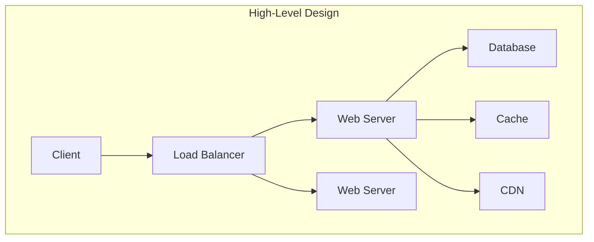
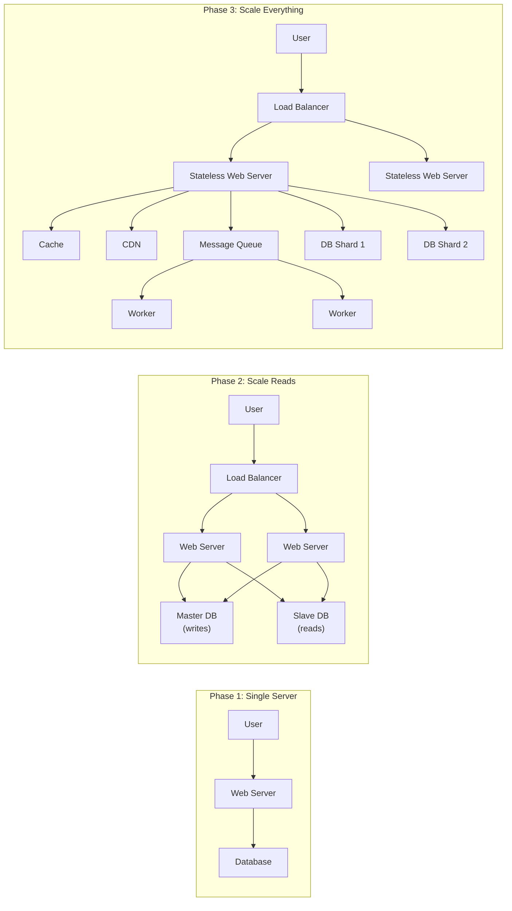
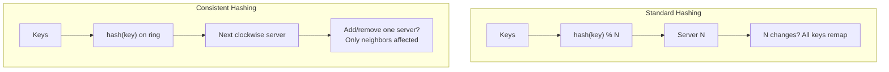
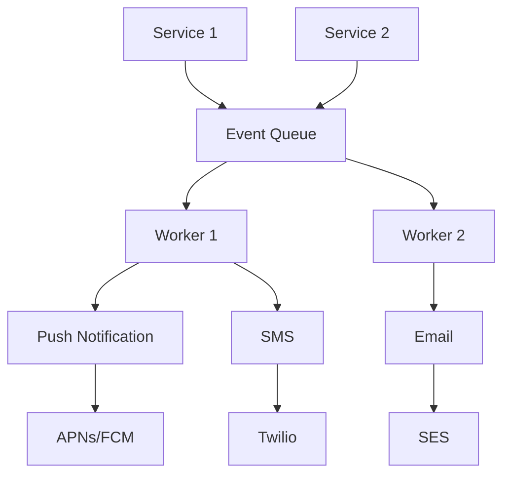

## The 4-Step Framework

The book's central contribution is a repeatable process for any system
design interview question.

---

### Step 1: Understand the Problem

Clarify requirements before proposing anything. Key questions to ask:

| Question | Why It Matters |
|----------|----------------|
| What features does the system need? | Defines scope |
| What is the expected scale? | QPS, DAU, storage requirements |
| What is the latency target? | Drives architectural choices |
| Is consistency or availability more important? | CAP trade-off |
| What is the tech stack? | Existing constraints |

---

### Step 2: Propose High-Level Design

Build a blueprint and get buy-in before diving into details.

Estimate rough numbers:
- Daily active users → peak QPS (usually 2x average)
- Storage = number of objects × average size × replication factor
- Bandwidth = average response size × QPS

---

### Step 3: Design Deep Dive

Prioritize the most interesting component and dive into its details.
The interviewer usually directs this — follow their signal.

Common deep-dive areas:
- Data model and schema design
- API design (REST or RPC)
- Caching strategy
- Consistency model
- Failure handling

---

### Step 4: Wrap Up

Don't stop mid-design. Close with:
- Identify bottlenecks and how to fix them
- Discuss failure modes and recovery
- Propose future improvements
- Summarize the final architecture

---

## Scaling Foundations (Chapters 1-2)

### From Single Server to Millions

Key layers added incrementally:
1. **Load balancer** — distributes traffic, handles server failure
2. **Database replication** — master for writes, slaves for reads
3. **Cache** (Redis/Memcached) — in-memory for hot data
4. **CDN** — static assets served from edge locations
5. **Stateless web tier** — session data moved to shared storage
6. **Multi-data center** — geo-routing via DNS
7. **Message queue** — decouples producers from consumers
8. **Sharding** — horizontal database partitioning

---

### Back-of-the-Envelope Estimation

| Metric | Rule of Thumb |
|--------|---------------|
| QPS (peak) | ~2x average QPS |
| Storage per user | Average data generated × retention period |
| Bandwidth | Average response size × QPS |
| Memory | 80% cache hit rate reduces DB reads 5x |
| Power of 2 | 2^10 ≈ 10^3 (KB), 2^20 ≈ 10^6 (MB), 2^30 ≈ 10^9 (GB) |
| Latency numbers | L1 cache 0.5ns, mutex lock 100ns, memory read 100ns, disk seek 10ms, network 100ms |

---

## Building Blocks (Chapters 4-7)

### Design a Rate Limiter

Algorithms compared:

| Algorithm | Pros | Cons |
|-----------|------|------|
| Token Bucket | Simple, allows bursts | Hard to tune bucket size/rate |
| Leaky Bucket | Smooths request flow | Cannot handle bursts |
| Fixed Window | Easy to implement | Traffic spikes at window boundaries |
| Sliding Window | Accurate, smooth | Requires more memory |
| Sliding Window Log | Precise | Expensive to store all timestamps |

Distributed rate limiting uses Redis sorted sets or a centralized
counter. Recommendation: token bucket per user/IP.

---

### Consistent Hashing

Standard hashing fails when the server pool changes — most keys need
re-mapping. Consistent hashing places servers and keys on a unit
circle (hash ring). Each key is assigned to the next clockwise
server. Adding or removing a server only affects its immediate
neighbors.

Virtual nodes (multiple positions per physical server) improve load
distribution.

---

### Design a Key-Value Store

Architecture for a write-optimized KV store:

1. **Write path**: Append to commit log (disk) → write to MemTable
   (in-memory skip list) → flush to SSTable when full
2. **Read path**: Check MemTable → Bloom filter → SSTable index →
   binary search in data blocks
3. **Compaction**: Merge SSTables in background to remove stale data

Components: SSTable (sorted string table), LSM-tree, Bloom filter,
WAL (write-ahead log), Merkle tree for anti-entropy.

---

### Distributed Unique ID Generator

Requirements: unique, time-sortable, 64-bit, high throughput.

Twitter Snowflake format:

| Bits | Purpose |
|------|---------|
| 1 | Sign bit (reserved, always 0) |
| 41 | Timestamp in ms (69 years of epoch) |
| 10 | Datacenter ID + machine ID |
| 12 | Sequence number (4096 IDs per ms) |

Alternative approaches: UUID (too long, not sortable), database auto-
increment (bottleneck, not globally unique), ticket server.

---

## Case Studies (Chapters 8-15)

### URL Shortener (TinyURL)

- Generate short key via base-62 encoding of a unique ID
- Key length: 7 characters → 62^7 ≈ 3.5 trillion combinations
- Redirect: permanent (301) or temporary (302) — 301 for most use
  cases (browser caches it, reduces load)

### Web Crawler

- BFS with a URL frontier prioritizing by page rank or crawl recency
- Deduplication using Bloom filters (space-efficient set membership)
- Politeness: respect robots.txt, delay between requests per domain
- HTML parsing extracts links → adds to frontier → back to queue

### Notification System

### News Feed

- **Fan-out on write (push)**: Pre-compute feeds when a post is
  created. Fast reads, but heavy writes for celebrities with millions of
  followers.
- **Fan-out on read (pull)**: Compute feed on request. Light writes, but
  slow reads under load.
- **Hybrid**: Push for regular users, pull for celebrities.

### Chat System

- **One-on-one**: WebSocket connection, store messages in key-value
  store keyed by conversation ID
- **Group**: Fan-out message to all online members via their WebSocket
  connections; offline members poll on reconnect or receive push
  notifications

### Search Autocomplete

- **Trie (prefix tree)**: Store frequent queries as nodes. Each node
  tracks frequency.
- **Top-K**: At each node, cache the top K (e.g., 5) completions to
  avoid traversing the full subtree.
- **Build**: Aggregate query logs → build trie offline → update
  periodically

### YouTube

1. **Upload**: Video → preprocessing → chunking → encode in multiple
   resolutions → store in blob storage → generate thumbnails
2. **Stream**: CDN at edge serves chunks; adaptive bitrate selects
   resolution based on bandwidth
3. **Metadata**: Stored in relational DB alongside user/channel data

### Google Drive

- **Upload flow**: File → block-level delta sync → compress → encrypt
   → upload chunks to blob storage
- **Sync**: Local daemon watches file changes → computes diff →
   sends only changed blocks
- **Conflict handling**: CRDT or last-writer-wins with version history
   for recovery

---

## The Learning Continues (Chapter 16)

The final chapter is a curated reading list of foundational resources:

- Papers: Google File System, MapReduce, Bigtable, Spanner, Dynamo,
  Kafka, Chubby
- Topics: gossip protocol, Paxos/Raft consensus, leader election,
  eventual consistency, CRDTs
