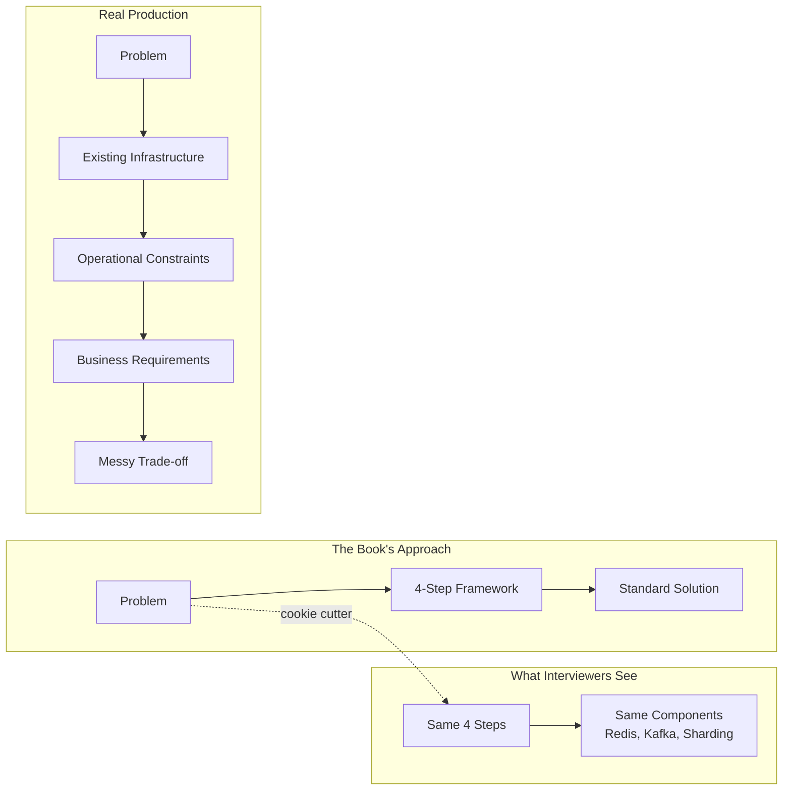

## Introduction

Welcome to BookAtlas. Today: *System Design Interview – An Insider's
Guide, Volume 1* by Alex Xu. Published 2020, Byte Code LLC. 320 pages.

This is the book that turned system design interview prep from a
scavenger hunt into a structured discipline. Over a million copies
sold, a sequel, and a newsletter empire later — it is the most
influential interview-prep book in tech.

Today: a hiring manager who has conducted 300+ system design
interviews at a FAANG company, and a self-taught senior engineer who
used this book to get their first big-tech offer.

---

## The Value of Structure

**Manager:** I've interviewed maybe 400 candidates over eight years.
The ones who panic and the ones who have a process — I can tell within
the first 90 seconds. This book gives candidates a process. That
alone makes it valuable.

**Engineer:** It gave me a script. Before reading it, system design
interviews felt like being asked to build a house with no blueprint.
After, I had a checklist: understand the problem, estimate scale,
design the high-level, deep dive, wrap up. I didn't invent great
architecture — but I looked like I knew what I was doing.

**Manager:** That is exactly the point. In a 45-minute interview, I
am not evaluating your ability to build a production system. I am
evaluating whether you can think through an unfamiliar problem in a
structured way. The framework demonstrates that skill regardless of
whether the specific design is optimal.

---

## Depth vs. Breadth

**Engineer:** A year after getting the job, I started working on our
notification system. I went back to Xu's notification chapter. It
was... not helpful. The real system had subtly different requirements,
existing infrastructure constraints, and operational concerns the
book never mentions.

**Manager:** Of course. The book is not a textbook. It is not
Kleppmann's DDIA. It is a survey designed for a specific purpose.
Would you criticize a driver's education manual for not covering race
car engineering?

**Engineer:** But here is the issue: candidates who read only this
book tend to produce formulaic answers. Interviewers at my company
joke about "the Alex Xu answer" — the same diagram, the same
structure, the same three paragraphs. It works for junior candidates.
For senior roles, it is a signal of shallowness.

---

## Who Is This Book For?

**Manager:** I recommend it to every mid-level engineer who asks how
to prepare. It is the single best 20-hour investment you can make
before a system design interview. But I also tell them: this is the
starting line, not the finish.

**Engineer:** I agree with that framing. For someone who has never
thought about distributed systems — who has been building Rails
monoliths or React frontends — this book is revelatory. It opens
your eyes to the universe of possibilities. But you need to keep
reading after.

**Manager:** The biggest risk is thinking you are done after reading
it. I've had candidates draw perfect consistent hashing rings and
then not know what happens when a node fails. The book shows the
happy path. Real systems live in the failure cases.

---

## The Trade-off Problem

**Engineer:** Here is my biggest criticism. The book presents
solutions as if they have no downsides. "Use Redis for caching" —
without discussing memory limits, eviction policies, cache
invalidation, or what happens during a cache stampede. "Use message
queues" — without discussing ordering guarantees, exactly-once
delivery, or backpressure.

**Manager:** That is a fair criticism, but also an unfair expectation.
Each chapter is about 20 pages. An engineer who needs a three-page
introduction to message queues cannot also absorb a full treatment of
Kafka's log compaction.

**Engineer:** But should a senior candidate need an introduction to
message queues?

**Manager:** Good senior candidates won't. And good interviewers
probe deeper. When I ask "what happens when the cache misses?" and
the candidate answers with textbook caching, I know they read the
book. When they start talking about thundering herd, adaptive
expiration, and circuit breakers, I know they've been in production.

---

## The Diagram Strategy

**Engineer:** The diagrams are the best part of the book. Every
chapter has a visual template. I memorized the key diagrams — the
single-server to multi-tier progression, the load balancer with two
servers and a master-slave database, the CDN flow. In the interview,
I can draw those from memory and then talk through the details.

**Manager:** I notice that. Diagrams that appear identical across
candidates. It is not a negative — it shows preparation. But what
distinguishes strong candidates is what they add to the diagram. The
weak ones draw Xu's diagram and stop. The strong ones add their own
annotations: "here is where we need a circuit breaker," "this is
where the write path gets complex."

---

## Final Thoughts

**Manager:** This book is a force multiplier for interview prep. Read
it. Use it. Recommend it. But know it for what it is: a framework for
structuring your thoughts, not a compendium of distributed systems
knowledge.

**Engineer:** The book got me the job. I will always be grateful for
that. But my first year on the job was humbling — I had to unlearn
the idea that there are "right" designs and learn to embrace trade-offs.
The book is a great first step, but it should not be the last.

**Manager:** To paraphrase: the book teaches you how to answer the
question. Experience teaches you how to ask it.

---

## Recommended Companion Reading

The final chapter (16) points to the canonical sources that Xu
himself synthesized. If the case studies piqued your interest:

| Topic | Resource |
|-------|----------|
| Distributed systems foundations | Designing Data-Intensive Applications (Kleppmann) |
| Consistent hashing | The original Chord paper (Stoica et al.) |
| Dynamo-style KV stores | Dynamo: Amazon's Highly Available Key-value Store |
| Real-time streaming | Kafka: A Distributed Messaging System (Kreps et al.) |
| Large-scale video | YouTube's production infrastructure blog posts |

This has been a BookAtlas narration of System Design Interview –
An Insider's Guide, Volume 1 by Alex Xu. Thanks for listening.
