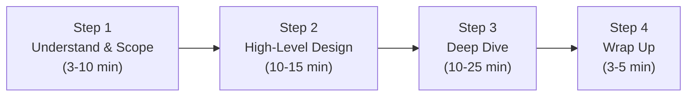

## Overview

*System Design Interview – An Insider's Guide, Volume 1* (2020) by
Alex Xu has become the de facto resource for engineers preparing for
system design interviews at top tech companies. With over 188 diagrams
and 15 case studies, it provides a structured approach to a traditionally
ambiguous interview format.

The book is organized in three parts: foundational scaling concepts
(Chapters 1-3), distributed systems building blocks (Chapters 4-7), and
complete system design case studies (Chapters 8-15). It closes with a
chapter on continued learning.

---
{}
---------|----------|-----------|
| Foundation | 1-3 | How to scale from a single server to millions of users, estimation techniques, and the 4-step framework |
| Building Blocks | 4-7 | Rate limiter, consistent hashing, key-value store, distributed ID generator |
| Case Studies | 8-15 | URL shortener, web crawler, notification system, news feed, chat, autocomplete, YouTube, Google Drive |

---

## Key Takeaways

1. **Clarify before you design.** The 4-step framework starts with
   understanding the problem and establishing scope. Never jump to
   solutions without requirements.

2. **Estimate first.** Quick calculations for QPS, storage, and
   bandwidth prevent impractical designs and show the interviewer you
   think about scale.

3. **Start simple, then layer.** Begin with single-server, add load
   balancer, database replication, cache, CDN, and message queues
   iteratively — mirroring how real systems evolve.

4. **Building blocks matter.** Rate limiting, consistent hashing,
   key-value stores, and distributed ID generation are reusable
   patterns that appear across multiple case studies.

5. **There is no perfect design.** Every system involves trade-offs
   between consistency, availability, latency, and cost. The book
   teaches you to articulate those trade-offs.

6. **Push vs pull trade-off.** News feeds, notifications, and chat all
   face the fan-out-on-write vs fan-out-on-read decision. The book
   shows when to use each and why hybrid approaches win.

7. **Preprocessing is power.** YouTube encodes video in multiple
   formats before serving. Autocomplete builds trie data offline. The
   heavy lifting happens before the user request arrives.

8. **Communication matters as much as architecture.** The book
   positions system design as a collaborative conversation, not a
   solo whiteboard exercise.

---

## Who Should Read

| Reader Type | Why |
|---|---|
| Interview candidates | The only book that teaches a repeatable process for system design interviews |
| Mid-level engineers | Fills the gap between coding skills and architectural thinking |
| Career changers | Structured introduction to distributed systems concepts |
| Self-taught developers | Covers fundamentals (sharding, replication, caching) that formal CS programs teach |

---

## Who Should Skip

- Engineers who already know distributed systems deeply and need
  advanced topics (use Kleppmann's DDIA instead)
- Readers looking for production-ready implementation details
- Anyone who dislikes interview-centric material

---

## Core Themes

| Theme | Description |
|-------|-------------|
| 4-Step Framework | Understand → Estimate → Design → Deep Dive → Wrap Up |
| Iterative Scaling | Start single-server, add components as requirements grow |
| Building Block Reuse | Rate limiter, consistent hashing, KV store appear in multiple designs |
| Trade-off Literacy | Every design decision involves explicit trade-offs |
| Communication | Interviewing as collaboration, not examination |
| Read-World Patterns | Solutions grounded in how companies like Twitter, YouTube, Uber work |

---

## Why This Book Matters

Before this book, system design interview preparation meant reading
scattered blog posts, Google Papers, and hoping for the best. Xu
organized the chaos into a repeatable framework.

The book democratized system design preparation. For the first time,
engineers without access to senior architects or distributed systems
experience could systematically learn how to approach these questions.
Its success spawned a Volume 2, a ByteByteGo newsletter with millions
of subscribers, and a YouTube channel — making Alex Xu the most
influential educator in the system design interview space.

---

## Related Books

| Book | Author | Connection |
|------|--------|------------|
| **System Design Interview Vol. 2** | Alex Xu | 13 more advanced case studies including proximity service, Google Maps, and payment system |
| **Designing Data-Intensive Applications** | Martin Kleppmann | The deep-dive on distributed systems foundations that Xu's book deliberately avoids |
| **Designing Distributed Systems** | Brendan Burns | Container-native patterns for building distributed applications |

---

## Final Verdict

*System Design Interview Vol. 1* is the right book for the right
audience at the right time. It is not a deep book — each chapter
skims topics that entire books are written about — but that is the
point. It teaches a *process* and a *vocabulary*, not depth.

The book's biggest contribution is making system design interviews
approachable. It replaces panic with a checklist. For engineers who
need to pass an interview in 2-4 weeks, that is exactly the right
trade-off.

**Rating: 7/10** — Indispensable for interview preparation, but
supplement with DDIA if you want to understand *why* things work,
not just what to draw on a whiteboard.

---

## Reference: 4-Step Framework

