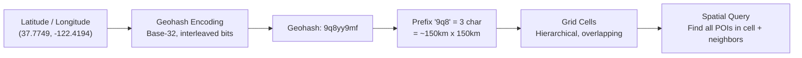
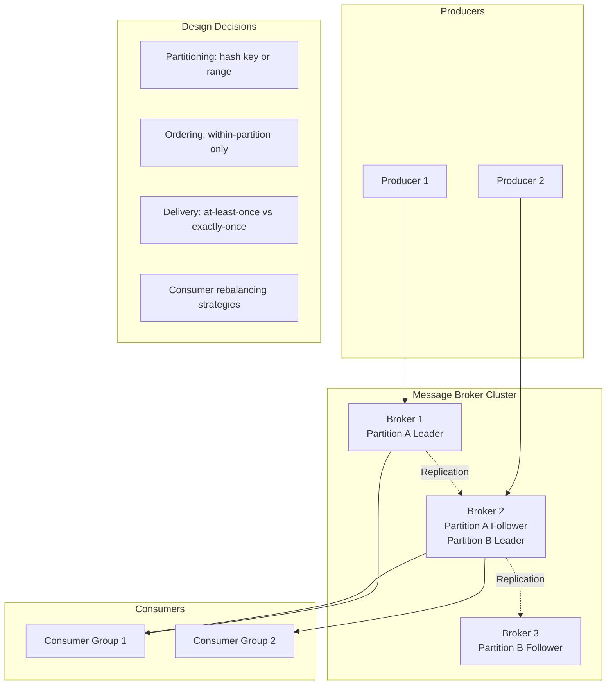
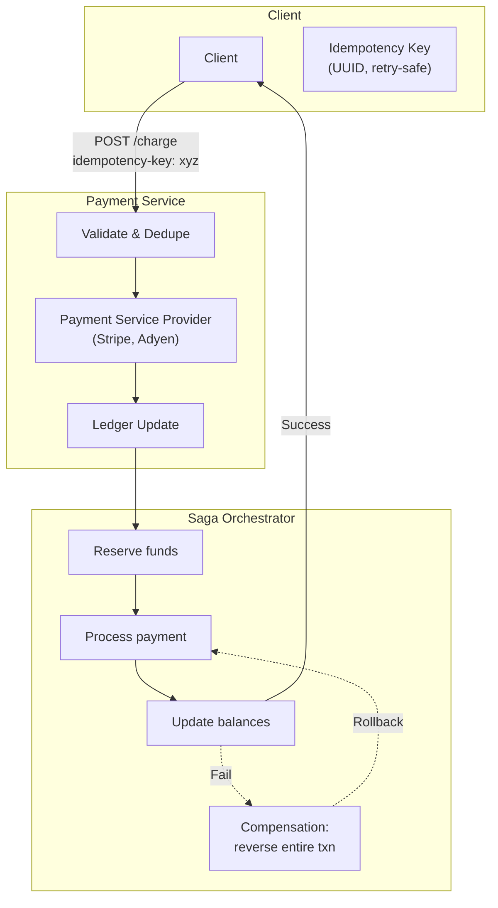
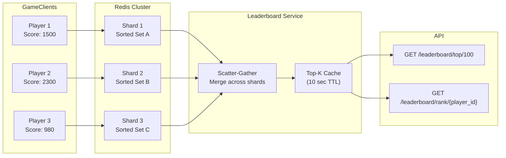
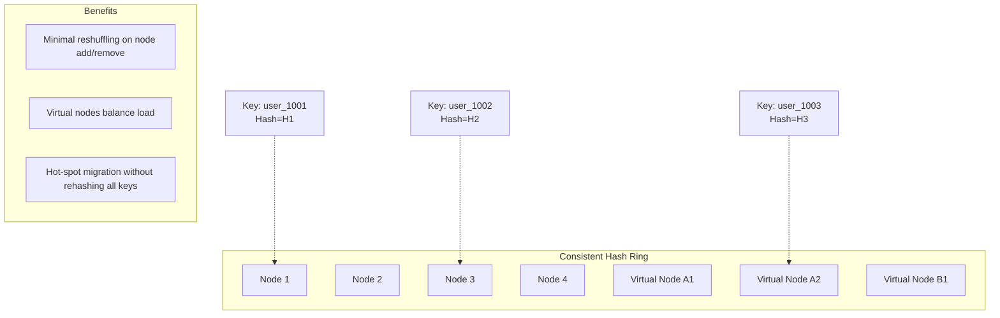
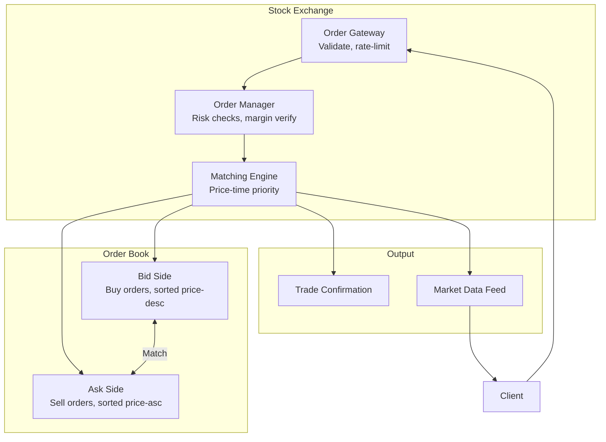

# Core Concepts

## The 4-Step Framework

Every chapter applies the same structured approach, reflecting real
interview expectations.

### Step 1 \u2014 Understand and Scope

Before drawing a single box, clarify:
- What are the core features? (functional requirements)
- What non-functional properties matter? (availability, latency,
  durability, consistency)
- What is explicitly out of scope?

Good candidates spend 5\u201310 minutes here before proposing anything.

### Step 2 \u2014 Back-of-the-Envelope Estimation

Size the system with rough numbers:
- Daily active users, peak QPS, average payload size
- Total storage (hot + cold), network bandwidth
- Cache hit ratios, number of reads vs. writes

This step prevents over-engineering and reveals the real bottlenecks
before architecture begins.

### Step 3 \u2014 High-Level Design

Draw the block diagram: clients, CDN, load balancers, API gateway,
application services, data stores, caches, queues. Label protocols
(REST, WebSocket, gRPC) and data flow direction.

### Step 4 \u2014 Deep Dive

Zoom into the bottlenecks the estimation step exposed:
- Database hotspots? Introduce sharding, caching, or read replicas.
- Write contention? Use a message queue or partition the write path.
- High latency? Add CDN, edge compute, or rebalance data placement.

---

## Geohashing and Spatial Indexing

Chapters 1\u20133 all depend on geohashing \u2014 encoding lat/lng into
a string where longer prefixes mean finer granularity.

Key insight: proximity services precompute business IDs per geohash
cell. A user query locates the user\u2019s current cell, fetches IDs
from that cell and its eight neighbors, then computes exact distances.
This trades storage for query speed.

---

## Distributed Message Queues

Chapter 4 builds a partitioned, replicated queue similar to Kafka:

The design decisions contrast pull-based (Kafka/Kinesis) and push-based
(RabbitMQ) architectures. Volume 2 argues pull-based wins for
high-throughput because consumers control their read rate.

---

## Payment System \u2014 Idempotency and Sagas

Chapter 11 covers the hardest part of real-world payment design:

The chapter introduces the **orchestrated Saga pattern**: a coordinator
issues sequential commands and fires compensating actions on failure.
Two-phase commit (2PC) is presented as an alternative, then rejected for
most payment systems because it blocks participants during the
prepare phase.

---

## S3-like Object Storage

Chapter 9 designs a blob store with the following architecture:

| Concern | Solution |
|---------|----------|
| Data partitioning | Hash of object key -> partition (bucket \u00d7 prefix) |
| Durability | 3-way replication or erasure coding (12+4 Reed-Solomon) |
| Consistency | Read-after-write for new objects; eventual for overwrites |
| Metadata | Separate SQL/NoSQL store for object catalog |
| Multi-part upload | Break large files into 5\u2013100 MB chunks |
| Lifecycle | Hot tier \u2192 warm tier \u2192 cold/archive |

The book compares erasure coding (space-efficient, write-heavy) with
full replication (simple, read-optimized), noting that systems like S3
use erasure coding for the durability tier and replication for the
hot tier.

---

## Real-time Gaming Leaderboard

Chapter 10 uses Redis sorted sets (ZADD/ZRANK/ZREVRANGE) for
sub-millisecond leaderboard lookups:

More partitions distribute write load but complicate the scatter-gather
merge step. The book recommends 16\u201364 partitions and a cached
top-K to absorb read spikes.

---

## Consistent Hashing Ring

While Volume 1 introduced consistent hashing, Volume 2 provides an
enhanced treatment with virtual nodes to handle uneven load:

---

## Hotel Reservation Concurrency

Chapter 7 tackles race conditions in room booking:

| Strategy | Mechanism | Throughput | Drawback |
|----------|-----------|------------|----------|
| Pessimistic lock | SELECT ... FOR UPDATE | Low | Blocking, deadlock risk |
| Optimistic lock | Version column + CAS | Medium | Retries on conflict |
| Inventory buffer | Pre-allocate room pool per service | High | Wasted capacity |
| Queue-based booking | Single worker per hotel | High | Added latency |

The book recommends a hybrid: optimistic locking for most bookings, with
a gated inventory pool for popular dates to reduce conflict rate.

---

## Stock Exchange Order Book

Chapter 13 models an in-memory order book using price-time priority:

The matching engine uses a linked hash map for constant-time peek/pop
at the best bid/ask. The system requires strict ordering of incoming
orders and a dropped-order detection mechanism.
