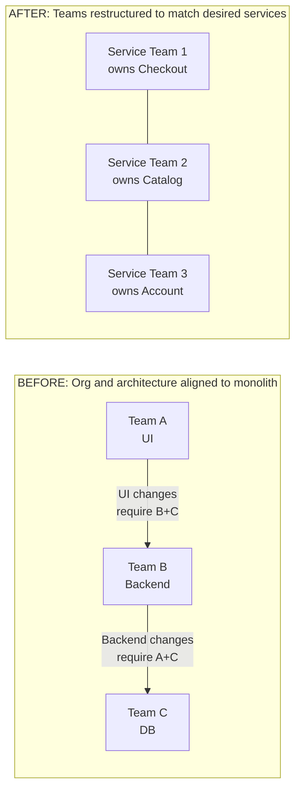

## The AKF Scale Cube

The framework that organizes the entire book. Most teams think of
"making the system faster" as a single problem. Abbott and Fisher
argue it is three independent problems along three orthogonal axes.

```mermaid
flowchart TB
    subgraph X["X-AXIS — Horizontal Duplication"]
        X1["Application instance 1"]
        X2["Application instance 2"]
        X3["Application instance N"]
        X1 --- X2 --- X3
        X4["Load balancer"]
        X4 --> X1
        X4 --> X2
        X4 --> X3
    end

    subgraph Y["Y-AXIS — Functional Decomposition"]
        Y1["Service: Auth"]
        Y2["Service: Catalog"]
        Y3["Service: Search"]
        Y4["Service: Checkout"]
        Y1 --- Y2
        Y2 --- Y3
        Y3 --- Y4
    end

    subgraph Z["Z-AXIS — Data Partitioning"]
        Z1["Shard A<br/>customers 0-1M"]
        Z2["Shard B<br/>customers 1-2M"]
        Z3["Shard C<br/>customers 2-3M"]
        Z1 --- Z2 --- Z3
        Z5["Lookup service<br/>hash on customer_id"]
        Z5 --> Z1
        Z5 --> Z2
        Z5 --> Z3
    end
```

### X-Axis: Horizontal Duplication

The simplest and most common form of scaling. Clone the entire
application stack behind a load balancer. Each instance is
identical and stateless. The load balancer distributes requests
across them.

**Solves:** read and write throughput for stateless workloads.
**Does not solve:** data set size, database write contention,
function-level hotspots, memory pressure in a single instance.

**When to use:** Always. X-axis scaling is the cheapest, most
reversible, and most universally applicable form of scaling. It
is the default. If you are not sure what to do, do X.

**When it stops working:** when the bottleneck is shared state
(the database), or when one feature in the monolith consumes
disproportionate resources.

### Y-Axis: Functional or Service Decomposition

Split the application by *what it does* — by service, by
subsystem, by bounded context. Each service owns its own code, its
own data, and its own deploy pipeline. This is the conceptual
ancestor of microservices.

**Solves:** team autonomy, independent deployment, independent
scaling per function, alignment with Conway's Law.
**Does not solve:** cross-service queries, cross-service
consistency, network latency between services.

**When to use:** when team size, deploy frequency, or function-
level hotspots make a single deployable unit impractical. The
authors cite a rough rule: if the team is larger than the
"two-pizza team" (10-12 people), or if the deploy cycle is longer
than a week, consider Y-axis.

**Trade-offs:** Y-axis is not free. You trade simplicity (one
process, one transaction, one database) for autonomy
(independent deploys, independent scaling, independent failure
domains). Most systems do not need Y-axis until they are at least
hundreds of thousands of users.

### Z-Axis: Data Partitioning

Split the data, not the function, by some attribute of the
request — typically customer, tenant, geography, or hash key.
Each shard serves a subset of the data; the application routes
requests to the right shard based on a lookup.

**Solves:** write throughput, data set size, multi-tenancy.
**Does not solve:** cross-shard queries (which become expensive
or impossible), uneven shard sizes ("hot shards"), and the
operational complexity of running many databases.

**When to use:** when a single database cannot hold the data, or
cannot sustain the write load, or when tenants must be physically
isolated for compliance reasons. The authors are explicit: Z-axis
is hard. Defer it as long as possible.

**The hardest scaling step.** Z-axis is the last resort, and the
most expensive to retrofit. Most companies that reach Z-axis do
so after years of deferred decisions. The book is unsparing
about the cost of waiting.

### Combining the Axes

Real systems use all three. A typical e-commerce platform might:

- Run X-axis clones of each service behind a load balancer.
- Decompose into Y-axis services (catalog, cart, checkout,
  search, account).
- Shard the catalog and account databases on Z-axis (by
  customer, or by category, or by geography).

The axes are orthogonal, but the *decisions* are not. Each
combination has a cost. The book's job is to make those costs
explicit before you commit.

---

## The Twelve Principles of Scalability

The second foundational framework. Each principle is a heuristic
that, when violated, almost always produces a system that cannot
scale.

| # | Principle | What it means |
|---|---|---|
| 1 | **N+1 Design** | Always have at least one more instance, switch, or path than you need, so a single failure does not take you down |
| 2 | **Design Using Commodity** | Use cheap, interchangeable hardware; do not bet the system on proprietary boxes |
| 3 | **Design to Scale Out** | Architect for horizontal growth, not vertical; never assume you can buy a bigger machine |
| 4 | **Split-Tier** | Each layer of the stack should be able to scale independently of the others |
| 5 | **Design to Be Monitored** | Observability is not an afterthought; instrument the system from day one |
| 6 | **Design for Failure** | Assume every component will fail; build the system to survive that |
| 7 | **Keep It Simple** | Complexity is the enemy of scalability; fight it at every step |
| 8 | **Choose the Right Tool** | One-size-fits-all stacks fail; pick the right database, queue, and cache for each workload |
| 9 | **Use Tools** | Automate everything: deployment, monitoring, recovery, capacity planning |
| 10 | **Automate** | Manual processes do not scale; if a human is in the loop, you have a bottleneck |
| 11 | **Design to Be Flexible** | Avoid vendor lock-in where the cost of switching is low; embrace it where the cost of switching is high |
| 12 | **Fail Fast** | Detect failures quickly, surface them clearly, recover quickly; do not hide errors behind retries and timeouts |

These are not independent. **Design for failure** is meaningless
without **design to be monitored**: you cannot detect a failure
you cannot see. **Design to scale out** is meaningless without
**split-tier**: you cannot scale the database independently of
the application if they are coupled. The principles form a web,
not a list.

The authors are explicit that these are heuristics, not laws.
A system can violate one or two and still scale. A system that
violates most of them will not.

---

## The Twenty-Plus Antipatterns

The second edition's most operational contribution. Each
antipattern is a recurring failure mode that the authors have seen
in nearly every system they have audited. The list is the heart
of the book for working engineers.

### The Four Most Common

**1. Single Points of Failure (SPOFs).** A component whose
failure takes down the entire system. The most common culprit
in modern architectures is the database — a single primary
that, if lost, stops all writes. The cure is redundancy at
every level: multiple databases, multiple switches, multiple
data centers. SPOFs hide in unlikely places: a single DNS
provider, a single authentication service, a single cron
job.

**2. Tight Coupling.** When a change in one part of the system
requires coordinated changes in another part, the system cannot
evolve independently. Tight coupling appears in shared
databases, shared schema, synchronous remote calls, and shared
configuration. The cure is well-defined service boundaries,
asynchronous communication, and a strict separation of concerns.

**3. Lack of Capacity Planning.** Operating without a model of
how much traffic, data, and load the system can handle, and
without a plan for what to do when it hits the limit. The
authors are blunt: if you do not have a capacity model, you
do not have a system, you have a prayer.

**4. Lack of Monitoring and Alerting.** Running a system you
cannot see. Most companies discover they need monitoring on
the day the system goes down and they do not know why. The
cure is to instrument the system from day one and to alert on
*symptoms* (latency, error rate, saturation) not *causes* (CPU,
memory, disk).

### The Remaining Antipatterns

5. **Synchronous Chains of Calls** — a request that traverses
   many services in series, each blocking on the next
6. **Hotspots** — uneven load that defeats horizontal scaling
7. **Single Database Bottleneck** — every service shares one DB
8. **Single Thread of Execution** — bottlenecks at serialization
9. **Lack of Caching** — recomputing expensive results
10. **Over- and Under-caching** — caching the wrong things
11. **No Versioning** — schema and API changes that break
    consumers
12. **Lack of Documentation** — knowledge in heads, not in
    repositories
13. **Lack of Automation** — manual deploys, manual recoveries
14. **Failure to Use Tools** — reinventing what the ecosystem
    already provides
15. **Vendor Lock-in Without Abstraction** — coupling tightly to
    a vendor's APIs
16. **Insufficient Testing** — particularly load and chaos
    testing
17. **Lack of Failure Testing** — never testing what happens
    when something breaks
18. **Shared Resources** — contention for a single resource
    across many consumers
19. **Growth Assumptions** — scaling for today's load, not
    tomorrow's
20. **Scaling Throughput, Not Capacity** — optimizing the wrong
    thing
21. **Inverse Performance Pyramid** — too much in the UI,
    too little in the data layer

The list is intentionally a list, not a hierarchy. The
authors point out that most systems in production contain at
least five of these antipatterns; many contain a dozen. The
goal is to make these patterns *legible* so they can be
spotted in design review and addressed before they become
outages.

---

## Conway's Law and the Reverse Conway Maneuver

The book's most underappreciated contribution. **Conway's Law**
(1968): "Organizations which design systems are constrained to
produce designs which are copies of the communication structures
of these organizations."

The corollary: if you want a particular architecture, you must
first structure the organization to match it. This is the
**Reverse Conway Maneuver**: intentionally reshape the team
structure, then let the architecture follow.

Most monoliths persist not because the technology is impossible
to break apart, but because the team structure does not permit
breaking them apart. The engineering director owns the monolith
because the engineering director's team *is* the monolith.
Reverse Conway says: split the team first, and the architecture
will follow.

This is one of the few ideas in the book that is genuinely
novel. The other content — the Scale Cube, the Twelve Principles,
the antipatterns — is synthesis of well-known industry practice.
The Reverse Conway Maneuver is the authors' own framework, and
it has aged remarkably well. It is also a recurring theme of
modern platform engineering and team-topology literature.

---

## The Three Rs of Data

A practical heuristic for database selection, based on workload
characteristics:

- **Ridge**: relational, normalized, transactional. Use for
  data that requires strong consistency, joins, and complex
  queries. Examples: order history, account information,
  inventory.
- **Rough**: NoSQL, key-value, eventually consistent. Use for
  data that requires scale-out writes, flexible schema, or
  simple access patterns. Examples: session state, shopping
  carts, product catalogs.
- **Resources**: binary blobs, object storage. Use for
  unstructured data. Examples: images, videos, PDFs,
  backups.

The heuristic is not "pick one." Most systems use all three,
each for the workload that suits it. The mistake is to pick
*one* (usually Ridge, out of familiarity) and try to force all
workloads into it.

---

## Microservices

The second edition's expanded treatment. Microservices are the
natural endpoint of Y-axis scaling: small services, each
owning its own data, each deployable independently, each
communicating over the network. The book's treatment is
notably *cautious*. The authors do not advocate microservices
as a default. They are explicit that microservices introduce
their own complexity: distributed transactions are hard,
network calls are unreliable, deployment is harder, debugging
is harder. Microservices are appropriate when:

- The team is too large for a single deployable unit
- Different functions have different scaling profiles
- Different functions have different change frequencies
- Conway's Law demands it

If none of these apply, the book argues, a well-structured
monolith is better than a poorly-implemented microservice
architecture. The principle is the same as the rest of the
book: choose the simplest tool that solves the problem.

---

## Vendor and Platform Lock-In

The second edition's most candid discussion. Lock-in is
unavoidable. Every choice of cloud provider, database, queue,
or framework creates some form of lock-in. The question is not
*whether* to lock in, but *how much*.

The authors propose a useful distinction:

- **Lock in where the cost of switching is high.** Cloud
  providers, payment processors, identity providers. The
  switching cost is real but the productivity gain is also
  real.
- **Avoid lock in where the cost of switching is low.** File
  formats, queue interfaces, build tools. The switching cost
  is low, so abstract the dependency.

The mistake is to treat all lock-in the same. Treating file
storage as if it were the same level of commitment as your
cloud provider leads to over-engineering. Treating your cloud
provider as a swappable commodity leads to operational pain.

The principle, in the authors' words: *"Lock in to vendors
that let you move fast; keep an eye on the exit."*
