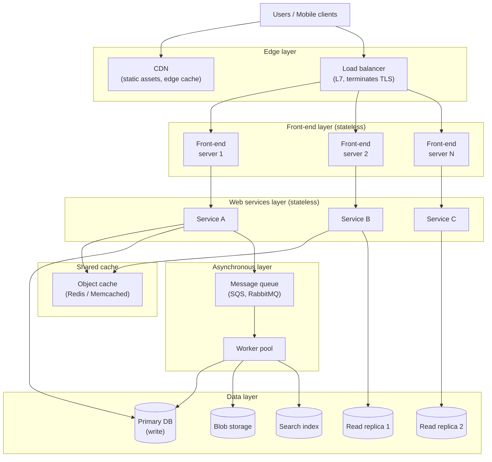
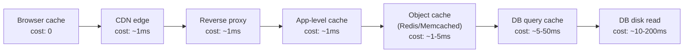

## What Scalability Actually Means

Ejsmont opens with a sharp distinction that the rest of the book
depends on. Three properties get confused constantly:

| Property | Definition | Failure mode |
|---|---|---|
| **Performance** | How fast a single request completes | Slow page loads |
| **Availability** | What fraction of requests succeed | Outages, 5xx errors |
| **Scalability** | The ability to absorb more load without proportional cost or redesign | System collapses under traffic |

A system can be fast and unavailable (a sports car that will not
start). It can be available and unscalable (handles 100 requests per
second perfectly, dies at 101). It can be scalable but slow (every
request takes 4 seconds, but the cluster grows linearly with load).

Ejsmont's working definition of scalability:

> The ability of a system to accommodate growth — in users, data,
> traffic, complexity — without a proportional increase in cost or a
> ground-up redesign.

The crucial phrase is **without redesign**. A system that requires a
rewrite at every 10x of growth is not scalable; it is a sequence of
unscalable systems.

---

## The Reference Architecture

The book is organised around a layered reference architecture that
Ejsmont treats as the default starting point for any web product. It
is deliberately boring. Every component is replaceable.

Each layer scales by adding identical instances. Each layer talks to
the layer below through a narrow contract. State lives only in the
data layer and the shared cache. **Nothing important is held in a
single process.**

---

## Principle 1: Statelessness

This is the most repeated word in the book. A service is stateless
when any instance can handle any request, because no instance retains
data that another instance needs.

Concrete consequences:

- **Sessions** go in Redis or a signed cookie, not in process memory.
- **Uploads** go directly to object storage, not to a local disk
  waiting to be flushed.
- **Counters and rate limits** go in Redis, not in a class-level map.
- **Feature flags and config** are fetched from a central store and
  cached briefly, not loaded once at startup.

The payoff: any instance can crash, be replaced, or be added without
draining sessions, copying state, or coordinating with siblings.
Auto-scaling becomes a configuration change rather than an engineering
project.

A useful diagnostic question Ejsmont returns to: *if I kill this node
mid-request, does any user notice anything beyond a single failed
request?* If yes, the node holds state that should not be there.

---

## Principle 2: Cache at Every Layer

Caching is the book's second-favourite tool. The rule is simple:
serve every request as close to the user as physically possible.

Each layer that misses pushes the cost to the next. Ejsmont's
heuristic: **a request that reaches your database is a request you
failed to cache somewhere cheaper.**

The book classifies caches by scope:

| Cache type | Lives in | Best for |
|---|---|---|
| Browser cache | The user's browser | Static assets, immutable resources |
| CDN cache | Edge POPs | Public, geographically distributed assets |
| Reverse proxy cache | Nginx / Varnish | Full-page or fragment HTTP caching |
| Application cache | App process memory | Hot config, short-lived computed values |
| Object cache | Redis / Memcached | Shared session, query results, fragments |
| Database cache | Inside the DB | Query plans, buffer pool — managed for you |

The trap to avoid: **stale or inconsistent caches caused by missing
invalidation**. Ejsmont recommends short TTLs over clever invalidation
schemes whenever the data tolerates it, and version-keyed cache entries
when it does not.

---

## Principle 3: Asynchronous Processing

Synchronous request handlers are expensive: they hold an open
connection, a thread or fiber, and the user's attention. Any work that
does not need to complete before the response should be moved off the
request path.

The pattern is uniform:

1.  Web request arrives.
2.  Service validates the request, persists a minimal record.
3.  Service publishes a message to a queue.
4.  Service returns 202 (or a success page) immediately.
5.  A separate worker pool consumes the queue and does the work.

Examples Ejsmont uses: sending email, generating image thumbnails,
indexing for search, billing, webhook delivery, video transcoding,
generating reports, sending push notifications.

Building blocks the book treats as core infrastructure:

- **Message queues** (SQS, RabbitMQ, Kafka). Pick one, treat it as a
  managed dependency.
- **Topics and subscriptions** for pub/sub fan-out.
- **Worker pools** that scale independently of the web tier.
- **Dead-letter queues** for messages that fail repeatedly.

### Idempotency

The single non-negotiable requirement for any message consumer.
Networks fail. Workers crash. Queues redeliver. A consumer that
debits a card twice on retry is worse than one that does nothing.

> Every message consumer must produce the same result whether it
> processes a message once, twice, or ten times.

Practical techniques: a `processed_messages` table keyed by message
ID; a natural deduplication key (`order_id + step_name`); upsert
semantics in the data store.

---

## Principle 4: Front-End and Web Services

Ejsmont splits the application layer into two:

- **Front-end servers** handle browser HTTP, render HTML (or serve a
  SPA), terminate sessions, route to services.
- **Web services** expose narrow APIs to front-end servers, mobile
  apps, and other services.

The reason for the split: they have different scaling profiles. Front-
ends are user-facing, latency-sensitive, often I/O-bound. Services
are internal, throughput-sensitive, often CPU-bound. Scaling them
separately lets each be sized for its actual workload.

Ejsmont is careful here. He is *not* prescribing microservices. The
front-end and the web services may share a deployment, a database,
even a process at first. The split is a logical one that becomes
physical when scaling needs diverge.

### When to actually split a service

Ejsmont's rules of thumb for promoting a logical service into a
physically separate one:

1.  Its **scaling profile** differs sharply from the rest (e.g., a
    media-processing service is CPU-heavy; the rest is I/O-heavy).
2.  Its **deployment cadence** differs (a fraud detection service
    needs daily updates; everything else is weekly).
3.  Its **failure domain** must be isolated (a recommendations
    outage must not take down checkout).
4.  Its **team ownership** justifies the operational overhead.

In the absence of these, Ejsmont prefers a well-factored monolith.

---

## Principle 5: The Data Layer

The hardest layer to scale. Ejsmont walks through the techniques in
order of pain:

### Vertical scaling

Buy a bigger database server. Always the first option because it
requires no application change. Ends when single-machine limits are
hit, typically at low millions of users.

### Read replicas

Send writes to the primary; send most reads to replicas. Trivially
scales reads. Requires the application to tolerate **replication
lag** — a write may not be visible on a replica for a few hundred
milliseconds. Read-your-own-writes is a common subtlety to handle.

### Functional partitioning

Move different tables or domains to different databases. The users
database, the orders database, the analytics database. Buys headroom;
breaks cross-database joins; requires application-level coordination
for transactions that span domains.

### Data partitioning (sharding)

Split rows of a single table across multiple databases by a
**partition key**. Each shard holds a slice of the data. Ejsmont
treats sharding as the most important architectural decision the
book covers, because:

1.  The partition key is hard to change later.
2.  Queries that do not include the key become expensive (scatter-
    gather across shards).
3.  Re-sharding requires either application support from day one
    (consistent hashing, virtual buckets) or downtime later.

His advice: **decide on a partitioning strategy before you need it**,
even if you do not implement it yet. Make sure every important table
has a defensible candidate key (user ID, account ID, tenant ID).

### NoSQL — when, not whether

Ejsmont's position on NoSQL is unfashionable for 2015 but has aged
well: most startups do not need it. A relational database with sane
indexing and read replicas handles enormous load. Reach for NoSQL when
you have a specific data model that fits poorly — wide column stores
for time-series, document stores for schema-less user content, key-
value stores for sessions and counters.

Avoid the trap of choosing a data store because it is fashionable and
then bending the data model to fit.

---

## Principle 6: Search, Counters, and Other Specialised Stores

Some workloads do not belong in the primary database at all:

- **Full-text search** belongs in Elasticsearch / Solr / OpenSearch.
- **Counters and leaderboards** belong in Redis.
- **Session storage** belongs in Redis or signed cookies.
- **Object data** (images, video, attachments) belongs in object
  storage (S3 and similar), never on the application disk.

The pattern is the same in every case: write asynchronously from the
primary, accept eventual consistency, treat the secondary store as a
derived view.

---

## Principle 7: Observability and Capacity Planning

Ejsmont closes the playbook with the part most startup teams skip:
measuring what is actually happening.

### The three pillars

| Pillar | Tool examples | Question it answers |
|---|---|---|
| **Metrics** | Prometheus, CloudWatch, Datadog | How is the system behaving right now and over time? |
| **Logs** | ELK, Splunk, Loki | What exactly happened in this request? |
| **Tracing** | Zipkin, Jaeger, OpenTelemetry | Where did the time go across services? |

### RPS budgeting

For every endpoint that matters, write down:

- Expected requests per second at current load
- Expected RPS at 10x and 100x current load
- Latency budget (p50, p95, p99)
- Cost budget (CPU, memory, DB calls per request)

These numbers turn architectural arguments into arithmetic. "Can we
add this feature?" becomes "the new endpoint will add 200 RPS at peak,
each request hits two DB queries, the primary is at 60% CPU — yes,
with headroom."

### Performance testing

Ejsmont recommends realistic load tests against staging environments
that mirror production topology, not benchmarks on a laptop. The
results feed back into the RPS budget and inform scaling decisions
before traffic forces them.

---

## The Lean Scalability Mindset

Threaded through the entire book is a worldview that distinguishes
Ejsmont from most scalability authors:

> Build the simplest system that can grow to handle the next order
> of magnitude. When you reach it, build the simplest system that
> can grow to the next.

This rejects two opposite errors:

| Error | Why it fails |
|---|---|
| **Big architecture upfront** — design for 1000x today | You ship slowly; you guess wrong about which dimensions actually grow; you spend a year building infrastructure for traffic that never comes |
| **Scale later** — ignore scaling entirely until it hurts | You ship statefully; you couple services that should have been separate; you wake up at 3 a.m. with no path forward and a rewrite as the only option |

The middle path is **disciplined defaults**: stateless services,
cacheable responses, queued background work, partitionable data,
measured throughput. These are nearly free to apply from day one. They
are extraordinarily expensive to retrofit. That economic asymmetry is
the entire argument of the book.
