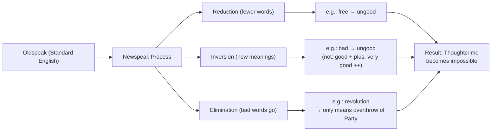
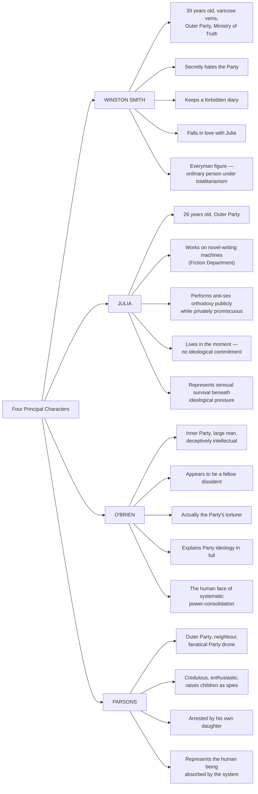

```mermaid
flowchart TB
    subgraph Oceania ["The World of 1984"]
        direction TB
        SYS["Three Interlocking Systems of Control"] --> LANG["Linguistic Control<br/>(Newspeak)"]
        SYS --> SURV["Surveillance Control<br/>(Telescreens, Informers)"]
        SYS --> MIND["Mental Control<br/>(Doublethink, Room 101)"]
    end

    LANG --> L1["Shrink the vocabulary<br/>eliminate rebellious thought"]
    LANG --> L2["Doublethink:<br/>hold contradictions simultaneously"]
    LANG --> L3["Vaporize the past:<br/>rewrite all records"]

    SURV --> S1["Telescreens in every home<br/>and public space"]
    SURV --> S2["Thought Police —<br/>arrest before the crime"]
    SURV --> S3["Children as informers<br/>(Spies org)"]
    SURV --> S4["Two Minutes Hate<br/>— emotional surveillance"]

    MIND --> M1["Confession under torture"]
    MIND --> M2["Room 101:<br/>confront worst fear"]
    MIND --> M3["Shattered spirit:<br/>genuine love for Big Brother"]

    Oceania --> CLASS["The Three Classes"]
    CLASS --> C1["Inner Party (2%)<br/>absolute power, absolute loyalty tested"]
    CLASS --> C2["Outer Party (18%)<br/>executed, controlled, disposable"]
    CLASS --> C3["The Proles (80%)<br/>pacified by entertainment and lottery"]
```

## The Setting: Airstrip One, Oceania, 1984

The novel opens on what Orwell calls "Airstrip One" — Britain, renamed, as part of Oceania. The date is deliberately ambiguous: Orwell titled the novel in 1948 by reversing the last two digits, but the Party keeps the calendar deliberately uncertain. The world is divided into three superstates — Oceania, Eurasia, Eastasia — locked in perpetual, shifting alliances of total war. Each state consumes the surplus production of its own economy through war, which is why peace is structurally impossible.

The Party governs through four ministries whose names are their inversions:

| Ministry | Real Function | Newspeak Name | Orwell's Irony |
|----------|---------------|---------------|----------------|
| Ministry of Truth | Propaganda, history falsification, censorship | Minitrue | Truth is literally its opposite |
| Ministry of Peace | Conduct of perpetual war | Minipax | Peace only exists as an ideological slogan |
| Ministry of Plenty | Rationing, starvation economics | Miniplenty | Abundance is a memory, not a reality |
| Ministry of Love | Torture, surveillance, political imprisonment | Miniluv | Love is the weapon used to break the human spirit |

---

## The Three Classes

### Inner Party (The High)

The Inner Party holds power, privilege, and immunity from the worst privations. Membership is hereditary but not strictly so — some Outer Party members rise to Inner Party status, and some Inner Party members "vaporize" when they fall from grace. Inner Party members live in cleaner flats, have real coffee and tea, servants, and automobiles. Their loyalty is constantly tested: every member lives under the permanent threat of being next on O'Brien's arrest list.

The Inner Party's ideology is expressed through O'Brien and is chilling in its frankness: power is the goal, and the Party seeks power only because it is the nature of power to seek more power.

### Outer Party (The Middle)

Winston Smith lives here. The Outer Party performs the bureaucratic and administrative functions of the state. They receive slightly better rations than the proles, but live in constant deprivation: Victory Gin, Victory Cigarettes, dull brown clothing, unappetizing food. The Outer Party is the primary object of Party surveillance and discipline. Miniplenty deliberately keeps them at subsistence — a hungry, exhausted population is less likely to rebel.

The Outer Party member's entire existence is shaped by the Two Minutes Hate, the daily ritual of manufactured rage against Goldstein and the Party's enemies. This is not just propaganda; it is emotional engineering, designed to redirect natural human aggression outward and destroy individual solidarities.

### The Proles (The Low)

The proles — "proletarians" — constitute 85% of the population and do the actual productive work: agriculture, manual labor, service jobs. The Party barely governs them. There are no telescreens in prole homes (or fewer of them). They are allowed sexuality, alcohol, gambling, lotteries, sexual promiscuity, sentimental songs, and low-quality pornography. They are not expected to think.

Orwell writes through Winston: "Until they become conscious they will never rebel, and until after they have rebelled they cannot become conscious." This is the novel's most pessimistic argument: the revolutionary class has no revolutionary consciousness, and the revolutionary consciousness has no class.

---

## Newspeak: The Architecture of Controlled Thought

Newspeak is the most intellectually sophisticated element of the novel and the one that has been most thoroughly validated by later cognitive science. Orwell, writing in 1948 before the Sapir-Whorf hypothesis was widely known, intuited what linguistics would confirm: vocabulary constrains thought. If you do not have a word for a concept, you cannot sustain that concept across generations.

### Newspeak Vocabulary Principles

| Rule | Example | Effect |
|------|---------|--------|
| Compound words | Bellyfeel = blind, instinctive enthusiasm | Fuse complex feelings into single, non-reflective units |
| Inversion (prefix) | Ungood = bad; Plusgood = good; Doubleplusgood = excellent | Eliminate positive/negative value gradation |
| Elimination | No word for "freedom" (only "free" as in unenslaved) | Remove category of thought entirely |
| Abbreviation | Minitrue, Miniluv | Reduce conceptual complexity; brand the institution |
| Rhyme and rhythm | "War is Peace, Freedom is Slavery, Ignorance is Strength" | Slogans bypass critical thinking via aesthetic repetition |

### The Three Newspeak Slogans (Ingsoc)

| Slogan | Meaning | Function |
|--------|---------|----------|
| WAR IS PEACE | Perpetual war maintains internal stability by directing anger outward | Justify both war and social stability simultaneously |
| FREEDOM IS SLAVERY | Seeking individual freedom leads to personal isolation and failure | Make submission the rational choice |
| IGNORANCE IS STRENGTH | Uninformed populations are more cohesive and resistant to destabilizing ideas | Control information flows |

---

## Doublethink: The Psychology of Self-Deception

Doublethink is the novel's central psychological concept: "To know and not to know, to be conscious of complete truthfulness while telling carefully constructed lies, to hold simultaneously two opinions which cancelled out, knowing them to be contradictory and believing in both of them."

Doublethink is not hypocrisy. Hypocrisy involves knowing the truth and choosing to act against it. Doublemean involves genuinely *not knowing* — making contradictory beliefs coexist in the mind without cognitive dissonance.

| Component of Doublethink | Description |
|--------------------------|-------------|
|**Crimestop**| The instinctive stopping-place before dangerous thought arises; like a blink-reflex for heresy |
|**Blackwhite**| Absolute, unquestioning belief in Party doctrine, regardless of evidence or contradiction |
|**Doublethink itself**| Holding two contradictory beliefs simultaneously as both true, applied to any central Party claim |

The Party trains doublethink through continuous contradiction: the daily papers contradict yesterday's papers, the Two Minutes Hate demands you feel rage at enemies who a week ago were allies, past confessions contradict current loyalties. The mind finds it easier to stop tracking contradictions than to hold them, and with practice, it stops tracking entirely.

---

## The Characters

### The Paperweight

The glass paperweight that Winston buys from Mr. Charrington's junk shop is the novel's most loaded symbol. Purchased for $2.50 (a fortune by Winston's standards), it contains a piece of coral inside a sealed, unreachable world — a fragment of a past the Party has tried to eliminate. It represents: connection to a real, pre-Party past, beauty and permanence in a destroyed world, and the impossibility of holding onto anything the Party wants back.

When the Thought Police burst in, a boot crushes the paperweight. It shatters, just as Winston and Julia's world shatters. The coral, once unreachable within its glass prison, is now scattered — unreachable in a different way.

---

## Perpetual War: The Economic Function of Endless Conflict

One of Orwell's most specific and often-overlooked insights is that perpetual war in Oceania serves an explicitly economic purpose. The Party deliberately consumes surplus production through military expenditure to prevent rising living standards, which would increase literacy, political consciousness, and the risk of revolution.

| Wartime Reality | Party Function |
|----------------|----------------|
| Overproduction in consumer economy | War absorbs the surplus |
| High living standards | Rising literacy and political awareness |
| Peace would allow reform movements to organize | Perpetual crisis legitimizes emergency powers |
| Peace would allow people time for private reflection | Perpetual mobilization keeps populations exhausted |

The alliances are deliberately shifting and meaningless: Oceania can be at war with Eastasia and allied with Eurasia one week, then suddenly at peace with Eastasia and at war with Eurasia the next — with no acknowledgment that the previous alliance existed. Memory holes erase yesterday's newspapers. The Party makes this explicit: war is not about territory or ideology. It is about consuming human labor and preventing social peace.

---

## The Novel as Warning

Orwell wrote 1984 as prophylaxis, not prediction. His purpose is stated directly: to describe the "worst possible world" he could imagine, so that readers would resist real-world tendencies that lead toward it. The novel's power lies precisely in it being an exaggeration — Orwell pushed existing totalitarian features to their logical conclusion, making visible the endpoint before any society has explicitly chosen it.

The Appendix, "The Principles of Newspeak," is the novel's quietest political act. Written in full English, it demonstrates that the narrator (and Orwell) are operating from outside Newspeak — from a language the Party never conquered. The essay treats Newspeak as a historical artifact of a defeated regime. Orwell is not writing inside Oceania's world. He is writing from a future where it lost.
