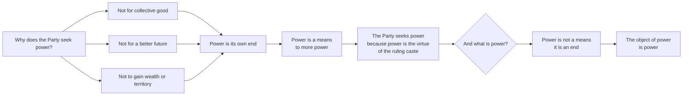

**Note**: This section assumes familiarity with the core concepts in 01-content. It does not re-explain Newspeak, doublethink, the three classes, or the characters.

---

## Literary Craft: How the Novel Works

### Point of View and Narrative Distance

Orwell uses a limited third-person perspective that stays almost entirely inside Winston's head. The prose is deliberately unstylish — Orwell was attacking totalitarianism, not showing off literary technique. What sounds like flatness is a choice: the prose mirrors Winston's exhausted, defeated consciousness precisely. The reader experiences Oceania not as a vivid dystopia but as a place where vividness has been deliberately extinguished.

### Temporal Structure

The novel compresses time: from Winston's first rebellious thought through the entire arc of rebellion and destruction takes less than a year of narrative time. Orwell's time jumps early in Part I create the sense that Winston has been waiting for years — his hatred of the Party has ripened over an indeterminate span of private suffering.

### The Novel-within-the-Novel Device

Goldstein's *The Theory and Practice of Oligarchical Collectivism* is a 152-page political tract that Orwell inserts into the middle of a novel. This is structurally audacious: a third of Part II is a non-fiction argument embedded inside fiction. The effect is twofold: it gives the reader the analytical framework to understand Oceania intellectually, and it creates dramatic tension by placing our analytical understanding in the hands of O'Brien, who is manipulating Winston at exactly this moment.

---

## The Philosophical Core: Power and Its Logic

The most philosophically ambitious part of the novel is the conversation between Winston and O'Brien in the Ministry of Love. O'Brien explains why the Party seeks power — in terms that explicitly reject ideology, utilitarianism, and reformism.

This passage makes 1984 a far more morally unsettling novel than most dystopias. Most fictional tyrants seize power to achieve some goal — even a twisted one. O'Brien's Party seeks power *because* power is what power-seekers do. The endless war exists because it must. The slogans exist because they must. The torture exists because it must. The Party is the final case study in what Hannah Arendt would later call the "banality of evil" — not aLeader with a plan, but a bureaucracy with a logic.

---

## The Sapir-Whorf Hypothesis and Newspeak: Was Orwell Right?

Newspeak is a prescient hypothesis about linguistic relativity, the idea that language constrains the thoughts available to a speaker. This idea, controversial when Orwell wrote, has received empirical support from cognitive science.

| Empirical Finding | Relevance to Newspeak |
|-------------------|----------------------|
| Color perception studies (Winawer et al., 2007) show that speakers of languages with more color terms discriminate colors more finely | Demonstrates vocabulary shapes perceptual categorization |
| Spatial reasoning studies show that languages with absolute direction terms (north/south) produce better navigational ability | Shows linguistic structure shapes cognitive habits |
| Pormpuraawans (Kuuk Thaayorre) speakers reorder photographs by cardinal direction — a concept absent in English | Demonstrates conceptual availability varies by language |
| English speakers struggle with grammatical gender effects present in Spanish/German | Shows language encodes associations that shape memory |
| Neurodivergent cognitive styles (particularly autistic cognition) can operate semi-independently of linguistic constraints | Orwell's pessimism may be calibrated for neurotypical cognition |

**Verdict**: Orwell was directionally correct — vocabulary and syntax shape thought — but he overstated Newspeak's speed and completeness. Total language replacement takes generations. Orwell's Newspeak operates over decades, which is roughly accurate. But the persistence of Oldspeak in the novel's Appendix — and the existence of un-Party dialects — suggests even Orwell understood that total thought-control requires more than vocabulary reduction.

---

## Reinterpretations and Critical Readings

### Feminist Reading: Julia and the Personal as Political

Winston's rebellion begins as an intellectual act (keeping a diary). Julia's begins as a sensual one: an extra ration of chocolate, a furtive sexual encounter in a hidden corner, a note saying "I love you." For Winston, sex becomes ideological — he believes the Party cannot touch this. For Julia, the act is personal, immediate, apolitical: she rebels because she wants to feel alive, not because she has read Goldstein's tract.

This disjunction is the novel's most sophisticated treatment of rebellion. Intellectuals look for systems; people who have been systematically denied consciousness rebel through their bodies.

---

### Marxist Reading: The Prole Question

The most sustained Marxist reading asks why Winston does not reach out to the proles. Orwell seems to argue that the proles are irredeemably depoliticized — they have no class consciousness, no revolutionary organization, no leadership. Yet the novel simultaneously hints that prole humanity is preserved precisely where Party humanity has been destroyed. Winston believes liberation must come through some kind of prole uprising, yet he can imagine no mechanism for it.

Critics from the left have read 1984 as expressing Orwell's own despair with the working class he sought to represent — and with the intellectual's inability to organize mass politics.

---

### Post-Colonial Reading: Airstrip One as Empire's End

Orwell wrote 1984 after five years of imperial service in Burma. Airstrip One is not simply "Britain" — it is the debased remnant of the British Empire, a settler state whose population has been reduced to ruled subjects within a larger apparatus. The colonial police state Orwell documented in *Burmese Days* (1934) is the domestic template for the novel's surveillance logic. Reading 1984 as post-colonial fiction illuminates why Orwell's Oceania already *has* its internal colony: the reader is expected to know this system from the margins of empire.

---

### Reception History

| Period | Key Critical Reception | 
|--------|------------------------|
| 1949 (initial) | Mixed-to-positive; some leftists criticized anti-communist reading; Lionel Trilling called it "more frightening than Brave New World" |
| 1950s (Cold War) | Became the defining anti-totalitarian text; used by both liberals and conservatives |
| 1960s (New Left) | Criticized as anti-communist propaganda; student radicals had mixed response |
| 1970s–80s (dissident era) | Hailed as prophetic; translated and circulated underground in USSR, China, Eastern Bloc; Solzhenitsyn cited it |
| 1984 (title year) | Massive media attention; "Orwellian" entered the permanent vocabulary; televised dramatizations |
| 2000s (digital era) | Surveillance capitalism debates brought fresh readers; NSA revelations made it contemporary again |
| 2010s (post-truth) | Rise to top of bestseller lists under Trump and Brexit; teaching as civic education |
| 2020s (AI/social media era) | Re-framed as early warning about algorithmic control and manufactured reality |

---

## Adaptations

| Adaptation | Medium | Year | Notable Feature |
|------------|--------|------|-----------------|
| *1984* (Rudolph Cartier, BBC TV) | Television | 1954 | First screen adaptation; controversial |
| *1984* (Michael Radford) | Film | 1984 | John Hurt, Richard Burton (final role); Orwell's widow sued over changes |
| *Nineteen Eighty-Four* (Michael Radford) | Opera | 2005 | Premiered at Royal Opera House, London |
| *1984* (various stage) | Theater | Multiple | Ubiquitous stage adaptation; frequently politically charged |
| *Orwell: 1984* (game) | Video Game | 1984 | Early text adventure adaptation |
| *1984* (Timo Puustei) | Graphic Novel | Multiple | Comic/manga adaptations in several languages |

---

## The Orwell Problem: Why Adaptations Fail

All interpretations of 1984 share the same structural challenge: the novel is deliberately anti-cinematic. Orwell's prose is flat on purpose. The world is grey and deliberately ugly — Orwell wanted the reader to feel exhaustion, not spectacle. Adaptation requires visual drama, but Oceania's drama is internal (thoughtcrime, confession, the crumbling of will). Radford's 1984 film succeeds visually precisely because it *avoids* making Oceania look spectacular — its horror is mundane.

No adaptation has ever captured the central horror: that the Party wins because resistance is not externally defeated but internally dissolved. The camera can show a man being tortured. It cannot show a man genuinely coming to love Big Brother.

---

## Linguistic Innovations and Their Legacy

| Term | Source | Current Usage |
|------|--------|---------------|
| Orwellian | 1984 | Any official deception, surveillance, or historical revisionism |
| Big Brother | 1984 | Authority figure who monitors everything; also reality TV franchise |
| Thoughtcrime | 1984 | Criminalized thinking; "hate crime" as a category |
| Newspeak | 1984 | Deliberately obfuscating political language |
| Doublethink | 1984 | Holding contradictory beliefs simultaneously |
| Memory hole | 1984 | Institutional deletion of inconvenient information |
| Room 101 | 1984 | The worst possible thing; personalized torture |
| Two Minutes Hate | 1984 | Ritualized mass anger; used in pop culture |
| Prole | 1984 | Dismissed, depoliticized working class |
| Unperson | 1984 | Someone whose existence has been erased from records |
| Crimestop | 1984 | Instinctive self-censorship |
| Bellyfeel | 1984 | Unthinking, instinctive loyalty |
| Facecrime | 1984 | Facial expressions that reveal unorthodox emotion |

---

## Final Verdict — Structural Assessment

As literature, 1984 has genuine weaknesses. Julia never develops as a full character — she is a symbol of amorality and physical rebellion rather than a person. The Goldstein tract is dry political science embedded inside a novel, and it slows the narrative. The prose, for all its rhetorical precision, lacks the warmth and specificity that make Orwell's non-fiction and his other novels memorable.

As political argument, 1984 is overwhelming. No other novel has so completely dissected the logic of totalitarian power and made its mechanisms visible and felt simultaneously. It is the novel the liberal democratic world needed in 1949, and it is the novel the liberal democratic world keeps needing again, in every generation.

**Structural Rating: 9/10** — (End of structural assessment; see index.chapters for the complete literary judgment.)
