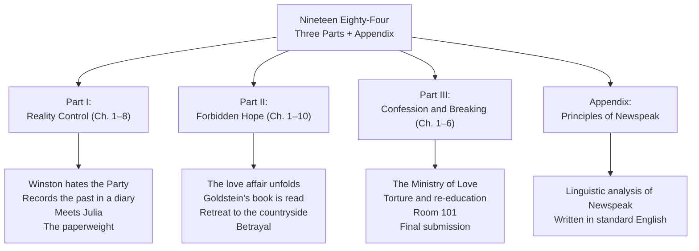

**Note**: This document summarizes plot events chapter by chapter. It does not include critical analysis, reception history, or thematic interpretation (those appear in 02-analysis). No narration format here — this is a structured chapter guide.

---

---

## Part I: Reality Control (Chapters 1–8)

### Chapter 1

The novel opens in Victory Mansions, April 4th, 1984. The clocks are striking thirteen. Winston Smith — 39, frail, with a varicose ulcer above his right ankle — returns to his flat, ascends seven flights (the lift is broken, as the elevators always are), and tries to avoid the telescreen in his hallway.

The opening pages establish the sensory texture of Oceania: Victory Gin, the smell of boiled cabbage and old rag mats, the perpetual cold, the posters of Big Brother everywhere ("BIG BROTHER IS WATCHING YOU"), and the slogans of the Party that are painted on every available surface.

Winston's crime begins here, silently. He sits in a "niche" in his flat that is just outside the telescreen's field of vision and begins to write in a blank diary he has somehow acquired. He writes: *DOWN WITH BIG BROTHER.* He does this knowing it is punishable by death or by twenty-five years of forced labor in a labor camp. He does it because he has to.

The chapter ends with Winston's sense that he is writing to O'Brien — someone he half-believes may be a secret fellow-dissident — and with his first encounter with the Parsons children next door, who have already been trained as members of the Spies Organization.

---

### Chapter 2

Winston is woken by the Parsons children bursting into his room, eager to report their own father for thoughtcrime (he muttered "Down with Big Brother" in his sleep, they claim; whether true is never resolved). Winston helps Mrs. Parsons save face with a sarcastic comment to the children about their superior vigilance.

Two neighborhood patrols process through: the Two Minutes Hate is about to begin. The telescreen shows the presentation of Emmanuel Goldstein — the enemy of the state, former Inner Party member, alleged leader of the Brotherhood — and the Two Minutes Hate begins. The audience is worked into a frenzy: screaming, throwing things, attacking the image. Parsons is the most frenzied. Winston keeps his face in a mask of appropriate hatred, but internally he cannot sustain it — the emotion is manufactured and he feels it as manufactured.

Winston notices O'Brien watching him during the Two Minutes Hate — or thinks he does. O'Brien is an Inner Party member, well-dressed, physically powerful, with an oddly arresting face that seems to be simultaneously intimidating and intellectually sympathetic.

---

### Chapter 3

Winston dreams. In the first dream, he is watching his mother and baby sister sinking beneath a green, luminous surface — they die so he might live. He wakes with the name "Shakespeare" sounding in his ears. In the second dream, a voice says: "We shall meet in the place where there is no darkness" — O'Brien's voice.

The chapter explores the Party's control of memory and the concept of *crimestop*. Winston has a memory of stealing a piece of chocolate from his mother and sister, and of his mother's face as they died — the chocolate was rationed, and there was not enough for everyone. The Party insists that you are a good Comrade if you have always been a good Comrade, that one's past is only worthwhile if it aligns with Party doctrine. Memory of genuine human feeling is a liability.

The phrase "place where there is no darkness" — O'Brien's words — hooks forward to the novel's most important turn: Winston's faith that O'Brien is a secret ally.

---

### Chapter 4

Winston works at the Records Department of the Ministry of Truth. His job: he alters newspaper articles from the past so they align with the Party's current version of events. Yesterday, a party comrade in India was a hero; today, he is an enemy. Winston physically goes to the archives, finds the old articles, and creates replacement pages that obliterate the previous truth. The old versions go into memory holes — chutes that lead, rumor has it, to furnaces.

Winston now meets a girl with dark hair working in the Fiction Department, a young woman who passes him in the corridor. He immediately fears her — suspects she is a member of the Thought Police, a spy. She looks at him, and something in her expression makes him certain: she is an enemy of the Party. She has, he thinks, recognized his criminality in his face.

---

### Chapter 5

Winston's neighbour Parsons visits to ask for help with a volunteer campaign subscription. The talk turns to Hate Week — the annual festival of manufactured violence against Goldstein and the Party's enemies. Parsons is enthusiastic. His children, Winston thinks, will one day denounce him for thoughtcrime.

Later, Syme, a philologist working on the Eleventh Edition of the Newspeak Dictionary, dines with Winston at the canteen. Syme is a true Party believer, too intelligent to keep his job for long — broadcasting his enthusiasm too openly is a form of self-condemnation. Over lunch, Syme talks about Newspeak with genuine passion: the elimination of words, the reduction of thought, the final elimination of thoughtcrime by making the thoughts impossible to formulate. "Don't you see that the whole aim of Newspeak is to narrow the range of thought?" he says. "In the end we shall make thoughtcrime literally impossible, because there will be no words in which to express it."

Winston recognizes Syme will be vaporized — "too intelligent" is now a liability in Oceania. This is the core Party dynamic: the people who can see through the system are the first eliminated.

---

### Chapter 6

Winston sits writing in his diary. He remembers life before the revolution: the shortages, the underground movements, the warm human connections he cannot reconcile with Party doctrine. He thinks about the three Party slogans — WAR IS PEACE, FREEDOM IS SLAVERY, IGNORANCE IS STRENGTH — and reflects on how the first slogan in particular is actually true, if you understand it on the Party's terms.

He writes in his diary several times: "To run for your life, to be hounded into a corner, to feel you know you have been betrayed, and to hear from a great distance the crowd roaring with laughter..." — the kind of recollection Party members are supposed to have suppressed.

The chapter establishes the systematic falsification of the past as not just a policy but a total environment: every record, every photograph, every newspaper, every statistic has been or will be adjusted. The past does not exist objectively in Oceania. It exists only in the Party's current version of it.

Winston ends the chapter thinking: "Freedom is the freedom to say that two plus two makes four. If that is granted, all else follows."

---

### Chapter 7

Winston looks out over London from his rented room in the junk shop. He reflects on the mutability of the past in a way that reveals the paradox that the Party cannot fully solve: if the Party controls all records, how do they know what happened in 1960, or 1950? They have erasers, but the original events happened to people who were there. The human mind holds memories the Party cannot reach — but memory, unlike written records, decays.

The logical problem that haunts Winston: the Party claims to have always been right. But to have always been right, they must have falsified everything — including their own records of falsification. The Party's power requires continuous active effort. It cannot reach into private memory completely, only into written history. The effort to maintain this control requires perpetual energy that the system must keep consuming.

Winston concludes that the Party cannot reach into the past of *every* human being — only into the written record. This is Winston's glimmer of hope. He does not articulate it yet, but it is what the diary, the affair, and Goldstein's book are all built on: human memory, however depleted, is not fully tractable.

---

### Chapter 8

Winston rents the room above Mr. Charrington's junk shop in the prole district — a room with no telescreen, a corner where a glass paperweight sits. Mr. Charrington is an old man with a face like a "carved stone," selling relics of a pre-Party world: old paperweights, engravings, a painted glass paperweight with embedded coral.

The room represents the past that the Party has tried to eliminate: genuine beauty, private objects, personal narratives. Winston buys the paperweight for $2.50 — a fortune for an Outer Party member.

The chapter's emotional weight comes from the description of the prole district as a different world: the proles sing, gamble, brawl, have sex, argue with vendors, argue with each other — in short, *live*. During the Two Minutes Hate earlier in the novel, the proles could not be reached — they had not been trained to hate on command, and the broadcast meant nothing to them. To Winston, watching them live their unstructured, ungoverned lives, they seem almost free.

---

## Part II: Forbidden Hope (Chapters 1–10)

### Chapter 1

Winston is walking in a corridor at work when the dark-haired girl from the Fiction Department stumbles and falls, handing him a note. He reads it later in the bathroom: **I LOVE YOU.** 

This is Winston's first moment of genuine hope since the novel opened. Jeffers has always feared her — he has regarded her as a spy, a threat, the woman who will turn him in. The note collapses that fear and substitutes an entirely different uncertainty: what if she is real? What if this is not a trap?

Winston's internal conflict in this chapter is extraordinary — he oscillates between desire and terror, between hope and the certainty that any expression of feeling will be monitored and punished. The Party controls every public behavior, but Winston's private terror is that the Party is beginning to control even his most private reactions.

---

### Chapter 2

Winston arranges to meet Julia in Victory Square, in a shadowed spot amid Chestnut Tree Café crowds. She has given him instructions — leave books, leave messages, meet her here. Her face, when she appears, is unexpectedly warm: she is not the ideological automaton he has assumed all young Party women to be.

The chapter recounts their first sexual encounter — in a rented room above a junk shop in the prole district, in the room above Mr. Charrington's shop that has no telescreen. Julia produces real sugar (a luxury), real coffee (an Outer Party rarity), and a stolen lipstick tube. Winston is overwhelmed — the Party has systematically eliminated private pleasure, and Julia's body is the first real experience of private, spontaneous joy he has ever known.

The chapter's key moment: after the act, lying together, Winston says "We are the dead" — and Julia says "We are not dead yet." Her physical presence is their first claim against the Party's domain.

---

### Chapter 3

Winston and Julia arrange a second meeting. This time, in the room above the shop, they talk — rather than act. Winston tells Julia about the past, about his mother, about what it was like before the revolution. Julia, characteristically, is not interested in ideology or history — she is interested in him, and in the body.

Julia explains that she has been a sexual dissident since she was sixteen. She is not intellectually rebellious — she has never read Goldstein's book, she doesn't articulate a political program. She rebels through the body: love, desire, sex for its own sake, small thefts, casual pleasures. She is not a philosopher; she is a practitioner. As she puts it: "I'm good at games. I'm a good Party member. I'm not interested in the Brotherhood. I hate the Party. I could get away with it if I was careful."

This is the chapter that most completely separates Winston's intellectual rebellion from Julia's sensual rebellion. The two are incompatible within the Party's logic — the Party attacks both, but its response to each is different. For Winston, torture will try to convert him ideologically. For Julia, the Party uses the fact that she cannot be ideologically motivated — she is, in Party terms, broken by instinct rather than conviction.

---

### Chapter 4

The room above Mr. Charrington's shop becomes a regular meeting place. Winston and Julia develop a system of signals — a certain tiling on the pavement, a particular song from a prole — to arrange meetings. The room is a private world: no telescreen, real glass paperweight, real coffee, prole music drifting through the shutters.

Winston reads Goldstein's book to Julia in passages. Though Julia does not read it, the emotional function of the book is to validate that what they feel is not unique — that what they are doing is part of a historical struggle. Winston reads passages about perpetual war, about the Party's economic logic, about the family as a site of surveillance.

The chapter also introduces the song they hear from the prole singing voice below, the recurring theme of "St. Clement's Church" — a half-remembered nursery rhyme that represents an older England, a world before the Party, where ordinary citizens had ordinary lives.

---

### Chapter 5

This chapter contains Winston's reading of Goldstein's key theoretical argument — the long tract that is the novel's embedded political argument. (This is where readers accustomed to ordinary narrative may feel the novel slowing down. The thrust: the three superstates are locked in perpetual war to consume surplus production; each is organized as a highly stratified society; the elites of each system know they do not really oppose each other.)

After reading, Winston dreams again: he is in the Golden Country — a landscape from his childhood, warm, golden, uncorrupted. He is with his mother (dead long ago) and with Julia (alive, warm, beside him), and the dream is a homecoming he knows he can never have.

In the dream, he hears O'Brien's voice: "We shall meet in the place where there is no darkness." Winston awakes convinced — as convinced as a Party member can be of anything — that O'Brien is a secret ally.

---

### Chapter 6

Winston and Julia arrange a meeting with O'Brien. Winston walks to O'Brien's flat, a journey that passes through corridors where each step feels like treason. O'Brien greets him warmly, and reveals — in coded language, through a shared understanding — that he is a member of the Inner Party, a member of the Brotherhood, and wants to recruit them.

O'Brien gives them Goldstein's book. "We shall want it again in a few days," he says. The meeting is an elaborate deception: O'Brien is not a dissident. The Brotherhood may not even exist as Winston imagines it.

The chapter's horror is not that O'Brien is the antagonist. It is that O'Brien can act the dissident so perfectly that Winston's deepest conviction — that O'Brien is a secret ally — is confirmed *by the enemy*.

---

### Chapter 7

Winston is alone at the room, waiting for Julia to return from her day's work. He is reading Goldstein's book slowly, working through the argument about perpetual war, about class structure, about the Party's self-reproducing logic. The book's explanation of perpetual war as an economic tool is a particular shock — Winston has always assumed the war was real, a defense against external enemies. Goldstein shows it is self-sustaining, shifting enemy designations designed to maintain internal order.

Winston reflects on the Party's final claim: that reality exists only inside the skull. Two plus two is whatever the Party says it is. And he thinks: in the end, the Party cannot force you to believe what you know is false — they can kill you, torture you, exile you, but you retain the inner conviction.

Orwell has set up the novel's central horror: Winston now believes his inner conviction is inviolable. The next part of the novel will methodically dismantle that belief.

---

### Chapter 8

Julia arrives. She has news: she has seen a paperweight in a junk shop in the prole district — a small item, five dollars, that Winston would like. She also reports that Parsons' son has been playing "war" games that the Party has not even taught him yet — he is a natural Party member, already thinking in slogans.

Winston and Julia pilgrimage to O'Brien's flat. They present themselves formally as members of the Brotherhood. O'Brien switches on the telescreen and reveals he has been monitoring them the entire time. The soldiers who come down the corridor to arrest them are hidden behind O'Brien's picture of St. Clement's Church — the very picture that Mr. Charrington was standing in front of earlier.

"Room 101," O'Brien says. The chapter ends with the arrest and the recognition that the room above the shop, the paperweight, the love affair — everything — was being watched, was never private, never safe.

---

## Part III: Confession and Breaking (Chapters 1–6)

*Note: The shifts in Part III are deliberately disorienting. Winston's time sense breaks down. We have moved from the chronological and spatial clarity of Parts I and II into the labyrinth of the Ministry of Love.*

---

### Chapter 1

Winston is in a cell in the Ministry of Love — Miniluv. He is lying on a plank bed, unable to move. He can hear someone screaming in the cells nearby. He thinks about his arrest, his confession under pressure — he confessed to counter-revolutionary activities, the murder of Party comrades, intelligence activities — whether true or false he is no longer certain.

He sees other prisoners arrive and be taken away. He sees a man, Rutherford, in the cell opposite, who Winston knows from old Newspeak photographs — an old Inner Party member now disgraced. Rutherford briefly recovers consciousness and says something to Winston about "Room 101," then vanishes.

Key concept embedded in this chapter: the Party does not need evidence, or truth, or proof. Confession is the procedural endpoint. The violation exists in the Party's designation; the act of naming it makes it real.

---

### Chapter 2

Party prisoners are brought into a large canteen for lunch. Winston sees several faces from Parts I and II — including Syme, who Winston expected to be vaporized — but Syme acts as if they have never met. The Party has rewritten not just the external record but the internal one; Syme has been required to forget Winston except in a formal sense.

In this canteen, Winston experiences what is essentially a reorientation meeting: three Party members from his past are made to testify against him, publicly and formally, calling him a thought-criminal and a foreign agent. Winston knows the testimony is false — he was never a foreign agent, was never in contact with any foreign power. The Party does not care. Public confession by others creates the social context in which his own confession becomes plausible.

This chapter shows the Party's most insidious practice: the destruction of personal loyalty. People who knew Winston when he was a loyal Party member are required to say he was always a thought-criminal. Each declaration makes the world Winston knew *unreal*.

---

### Chapter 3

O'Brien visits Winston's cell. He speaks to Winston with genuine warmth — the same warmth he showed in the Brotherhood meeting. O'Brien explains the Party's actual purpose, in detailed, calm language, exactly as Goldstein's book described in Part II, but from the Party's perspective.

O'Brien holds up four fingers. Winston sees four fingers. O'Brien demands that Winston see *five*. Winston cannot. O'Brien begins to administer what is described only as "pain" — systematic, escalating, never-ending pain that the Party controls perfectly. It is a demonstration of absolute physical power: "If you want a vision of the future, imagine a boot stamping on a human face — forever."

The chapter's philosophical core: the Party does not want obedience. Part of the purpose has been obedience. But the final purpose is transcendence of the human — getting the subject to *sincerely believe* reality is whatever the Party says it is.

---

### Chapter 4

Winston is released from the cell and moved to a new cell that is, by comparison, luxurious: a real bed, clean clothes, good food. O'Brien visits and explains, in detail, why the Party must control the past, must control reality, must control even the past in the mind of its subjects. The dialogue is the clearest articulation of the Party's ideology in the novel:

> "We are the priests of power," O'Brien says. "God is power. But at present power is only a word. It is time for you to gather some conception of what power is. The Party seeks power entirely for its own sake. We are not interested in the good of others. We are not interested in happiness. We are interested solely in power, pure power."

> "How can you know," Winston says, "that two and two make four?"

> "Of course. Sometimes it is four. Sometimes it is five. Sometimes it is both."

Winston is being broken. The logic is self-moving: if the Party can say two plus two is five, and force you to agree, then the Party controls what is real in your own mind. That is power. Complete power.

---

### Chapter 5

Julia visits Winston. She is broken, aged beyond recognition. She has been in the Ministry of Love longer than Winston; her body has not been irreparably harmed, but something has: she no longer loves him, she no longer hates the Party, she has simply accepted. "I betrayed you," she says. "I betrayed you, Winston." She speaks evenly, without apology. She also says: "What you do or fail to do is of no importance. We are the dead."

Winston and Julia go to a park to talk about their love affair — whether it mattered, whether good or bad came of it. Julia concludes: yes, it was good, in itself, though it did not change anything. She accepts the Party's verdict on the world.

This is the moment of the shattered hope. Not death, not torture, but honest acceptance of the system's reality by a person who once genuinely rebelled. Orwell makes this close to unbearable.

---

### Chapter 6

The final chapter. Winston is in the Chestnut Tree Café, drinking Victory Gin, watching the news. All rebellions have been crushed. The chocolate ration has been raised. The war is about to end (or continue, the party never tells).

Winston has been restored to the Party. He sits watching a chess problem on the telescreen — a demonstration that every move he might make has been accounted for, every path foreclosed. He knows, with perfect certainty, that the Party's victory is total.

And then: he feels the warmth of tears on his nose. He has been thinking of Julia — the room above the shop, the smell of her real coffee, the paperweight — and he feels genuine, spontaneous love for her. The thought is a crime. He clamps it down. He replaces Julia in his mind with an image of Big Brother. The novel's final sentence:

"**He had won the victory over himself. He loved Big Brother.**"

---

## Appendix: The Principles of Newspeak

The Appendix is not a narrative chapter — it is a scholarly essay, presented as an academic article written in standard English about a language that did not, in the novel's timeline, succeed. The essay explains:

| Feature | Function |
|---------|----------|
| B vocabulary (compounds) | Fuse complex emotions and thoughts into single non-reflective words ("goodthink," "crimestop," "bellyfeel") |
| C vocabulary (technical terms) | Make technical language Party-controlled so scientific dissent is impossible |
| Elimination of Oldspeak | Systematic removal of words that are ideologically dangerous until speakers have no concept to rebel from |
| Goodthink | The ideological equivalent of thoughtcrime: having thoughts designated as "goodthink" |

The essay's rhetorical turn: it describes Newspeak using standard English, in the past tense, as if from a future time when Newspeak has been defeated. This is Orwell's quietest, most powerful act of resistance in the entire novel: he writes Newspeak's obituary in a language Newspeak never accomplished eliminating. The regime's defeat is built into the text that describes it.
