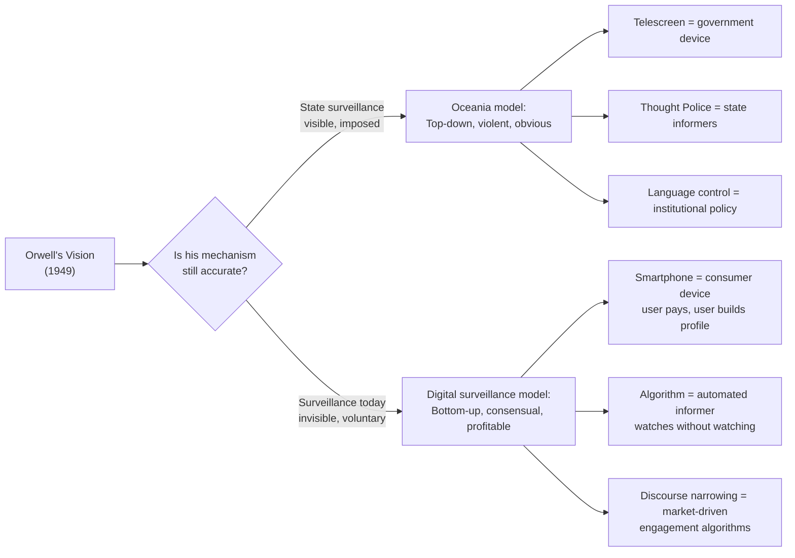
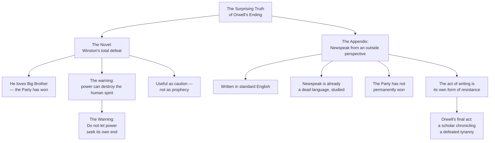

**[Host]**: Welcome to BookLab. Today we're talking about *Nineteen Eighty-Four* by George Orwell, published in 1949, the same year the Cold War began in earnest and the year before Orwell died. Our guests couldn't be more different in their reading of this book. Dr. Nadia Mbeki is a professor of political theory at the University of Cape Town. She studies surveillance, digital authoritarianism, and post-colonial state formation. Welcome, Dr. Mbeki.

**[Nadia]**: Thank you. I teach this book every year, and every year I begin by telling my students it is not about the past — it is about the tools that concentrate power, and those tools have only gotten better since 1949.

**[Host]**: And joining us from London is Matthew Cole, a technology journalist who has covered social media, algorithmic content moderation, and AI policy for the past decade. Matthew, you've written that Orwell underpredicted surveillance — not that he was wrong, but that he got the mechanism wrong. Welcome.

**[Matthew]**: That's right. Orwell imagined a state watching you from above. The reality in 2026 is that we pay for the privilege of being watched. We carry the telescreen in our pocket. And we don't just consent — we ask for it.



---

## On the Mechanism of Surveillance

**[Host]**: Let's start there. Dr. Mbeki, where do you think Matthew is wrong — or where does Orwell's model still hold?

**[Nadia]**: Orwell is still right about the *destination*, but wrong about who's driving. In Oceania, the driver is the state. In our world, the driver is capital — corporations, platforms, data brokers — and the state is a customer. The mechanism of control is different, but the effect on the citizen subject is the same: you no longer have a private self that the power structure cannot see. What distinguishes the two systems is not the outcome — it is the *bargain*. Orwell's subjects have no bargain. Ours do: we traded privacy for convenience, and most of us are fine with that trade.

**[Matthew]**: But here's what Orwell missed, and this matters critically: he assumed surveillance would be *visible* and would generate *resentment*. The genius of the current system is that it is invisible and generates gratitude. When Google Maps reroutes you around traffic, you feel served, not watched. When Facebook recommends a friend or a product, you feel helped, not manipulated. The telescreen in *1984* created hatred of the watcher. The smartphone creates love for the platform.

**[Nadia]**: And that love is more effective, yes. But I want to push back slightly: the smartphone also generates anxiety that Orwell would recognize. The pressure to be always available, to maintain a curated self, to perform productivity — these generate chronic stress that mirror the exhaustion levels Winston describes. The mechanism of psychological control has changed, but the *outcome* — a population too tired and too distracted to organize — is the same.

---

## On Language Control: Is Newspeak Already Here?

**[Host]**: Let's talk about Newspeak. Orwell's most specific claim was that reducing vocabulary would reduce thought. Where do we see that now?

**[Matthew]**: Twitter. The platform that defined public discourse for a decade flat-out eliminated the possibility of complex argument. Character limits made paragraph-level thinking impossible. Thread-style argument is not equivalent to careful prose. The shift from long-form to algorithmic feed — where the median post length in 2024 is under ten words — has produced exactly the kind of degraded discourse Newspeak was designed to produce. People have lost the muscle memory for sustained argumentation.

**[Nadia]**: And it is not just social media. Corporate language in HR, in advertising, in political manifestos has been hollowed out in the same way. Orwell's critique of bureaucratic language in his 1946 essay "Politics and the English Language" was a direct predecessor to Newspeak. He was diagnosing this process before he dramatized it. We are living it now.

**[Host]**: The answer to this, some say, is speech itself. Free speech as a technology of resistance. Is that the right analogy?

**[Nadia]**: Free speech as a technology only works when there is approximately symmetrical power of access. If you and I have equal megaphones, free speech is a genuine contestation. When one megaphone belongs to a state and the other to an individual citizen, free speech is a rhetorical device государства, not a genuine equalizer. Orwell understood this. In 1984, the Party gives you the illusion of free speech — Winston writes in his diary and is immediately, efficiently found out. Speech under totalitarianism is the *pretext* for punishment, not its cure.

---

## On Doublethink in Contemporary Politics

**[Host]**: Doublethink — holding two contradictory beliefs simultaneously and believing both. Do we see this now?

**[Nadia]**: Doublethink is the modal condition of contemporary political discourse. Voters simultaneously believe the election was rigged *and* that their candidate won fair and square. They believe government is incompetent *and* that government must expand its surveillance powers. They believe in free markets *and* want industrial policy. This is not hypocrisy — Orwell was careful to distinguish doublethink from hypocrisy. What we have is a population trained by algorithmic feeds, soundbite politics, and managed opposition to hold contradictory commitments without experiencing them as contradictions.

**[Matthew]**: Social media's engagement algorithm *encourages* doublethink. If posts that provoke identity-confirming outrage perform better, the system evolves to maximize outrage rather than coherence. A coherent political position is less engaging than a contradictory one. The algorithm has no preference for logical consistency; it has a preference for high-arousal emotion.

```mermaid
flowchart TB
    A["Doublethink in Modern Life"] --> B["Political Claims"]
    A --> C["Corporate Language"]
    A --> D["Personal Cognition"]

    B --> B1["Election was rigged<br/>AND my candidate won fairly"]
    B --> B2["Government is incompetent<br/>AND government must spy on citizens"]

    C --> C1[""Freedom" in marketing =<br/>controlled choice within options"]
    C --> C2[""Transparency" = data extraction<br/>made legible to corporations"]

    D --> D1["I am autonomous<br/>AND I follow algorithmic recommendations"]
    D --> D2["I value privacy<br/>AND I share everything online"]
    D --> D3["I distrust institutions<br/>AND I trust my favorite influencer"]
```

---

## On the Party and Power as Its Own End

**[Host]**: Hannah Arendt, who was writing at roughly the same historical moment, identified a "banality of evil" — that totalitarian evil does not require a fanatical ideologue, only an efficient bureaucrat. Does O'Brien confirm or contradict that?

**[Nadia]**: Both. O'Brien is himself a fanatical ideologue — he genuinely believes in power for power's sake, he has internalized the full Party logic. But the Party bureaucrats beneath him — the ones who rewrote yesterday's newspaper, who filed the arrest warrant, who administered the torture — they are mostly just doing their jobs efficiently. Orwell combined both forms: a philosophical core of power-worship at the top, and banal administrative machinery at every level below. That combination is what makes Oceania so durable in the novel and so recognizable today.

**[Matthew]**: What's struck me in covering tech policy is that the people building AI systems, content moderation infrastructure, and surveillance tools are rarely evil in the O'Brien sense. They are, mostly, well-educated liberals who genuinely believe they are building helpful things. They are doing what the economic system rewards them to do. That's the banal part. But the *output* of their labor — the system's capacity to control and predict and shape human behavior — is exactly what Orwell was warning about at the level of political architecture.

---

## On Human Connection as the Ultimate Rebellion

**[Host]**: One of the claims I want to push back on: Winston and Julia believe that sex and love are acts of political rebellion — that the Party cannot touch private feeling. They turn out to be wrong. But is love still, in some form, the most threatening act a citizen can perform against an authoritarian system?

**[Nadia]**: It is always the first thing to be regulated. The Junior Anti-Sex League, the encouragement of family betrayal through child informers, the eradication of sexual pleasure outside state-sanctioned purposes — all of these appear in 1984, and all of them appear in every actual totalitarian system. Why? Because love, especially erotic love, is a private loyalty that the state cannot command. A person who loves someone outside the system has a loyalty that supersedes the state's claim.

**[Matthew]**: In the West, the system does something smarter: it commodifies sexuality rather than suppressing it. Sexual liberation becomes a product you can purchase — through platforms, through dating apps, through advertising that makes desire integral to consumption. The private loyalty that threatens the system is absorbed into the market. It does not generate resistance against the system; it generates market engagement *within* the system.

**[Nadia]**: And that's exactly why Orwell set the novel when he did — he saw this coming too. In the novel, the Party has entirely eliminated the commodification of desire. Sex is a duty, a Party function, or a brief illicit act. What Orwell is showing us is the spectrum: the Party's extreme (suppression) and our system's extreme (commodification) both destroy the same thing — love as a private, unowned, and unconsumable act.

---

## On the Appendix: Is There Hope?

**[Host]**: Let's end on the Appendix — "The Principles of Newspeak." Written in English, not Newspeak. It is a quiet, scholarly essay. It does not belong in a novel about totalitarian victory. Why is it there?

**[Nadia]**: I have taught this novel for fifteen years and I still get emotional discussing the Appendix. Orwell wrote it *last*. Not last in publication order — but last in the writing. After the torture scenes, after the final humiliation, after "he loved Big Brother." Then he stopped, and he wrote a linguistic essay about a constructed language that has already defeated Oceania.

The Appendix says: Newspeak's extinction is inevitable. Language is not just a tool of power — it is a site of struggle, and the struggle continues beyond the state's apparent victory. Orwell put the victory of the human spirit in the only place a dying man could put it: in a footnote he knew no totalitarian bureaucracy could ever fully eliminate.

**[Matthew]**: That's beautiful, and I want to add something computationally specific to that insight. The Internet Archive already contains millions of scanned books, including texts that regime after regime has tried to burn. Orwell's fundamental optimism — that technology created for oppression can be repurposed for memory — is now a fact. We have, in fact, built the memory Orwell said the Party must destroy. That does not mean we've won. It means the battle is now technical and ongoing, not finished.

**[Nadia]**: And that's the lesson worth carrying forward. Orwell's warning is not a prophecy. It is a set of instructions: watch for linguistic degradation, watch for the erosion of objective truth, watch for power that seeks power for its own sake. The novel ends in defeat, but the Appendix ends in scholarly determination. The struggle over language is the struggle over civilization. It never ends.



---

**[Host]**: That's where we're going to leave this conversation. George Orwell's *Nineteen Eighty-Four* sounds dated to no one who has watched the news in the last five years. It is not a relic. It is a diagnostic instrument.

Dr. Nadia Mbeki, thank you. Matthew Cole, thank you. And for everyone listening: the book is short. Read it — or re-read it — this month.
