## Overview

*Nineteen Eighty-Four* is George Orwell's final and most devastating novel — a work of political fiction so prescient that its phrases have become part of the language every democratic society uses to describe its deepest fears. Published in June 1949, less than a year before Orwell died of tuberculosis, the book imagines a permanently militarized superstate called Oceania, ruled by the Party and watched over by its face-in-every-poster leader, Big Brother.

The novel follows Winston Smith, a low-ranking member of the Outer Party, as he quietly rebels against the Party's crushing control over thought, memory, language, and human feeling. What makes 1984 extraordinary is not the originality of the surveillance trope — Orwell was synthesizing existing totalitarian practices into a single logical endpoint — but the completeness of his moral imagination. He understood that to control a people permanently, a regime must control not just their actions but the very architecture of their thinking.

---

## Executive Summary

```mermaid
graph TD
    A["Nineteen Eighty-Four"] --> B["The World of Oceania"]
    A --> C["The Three Superstates"]
    A --> D["The Three Social Classes"]
    A --> E["The Three Tools of Control"]
    A --> F["The Arc of the Novel"]
    A --> G["The Final Horror"]

    B --> B1["Airstrip One<br/>(formerly Britain)<br/>Year: 1984-ish"]
    B --> B2["Capital: London<br/>Ministries govern all"]
    B --> B3["War is perpetual<br/>Peace is impossible"]

    C --> C1["Oceania<br/>(Party of this novel)"]
    C --> C2["Eurasia<br/>(contested ally/enemy)"]
    C --> C3["Eastasia<br/>(contested ally/enemy)"]
    C --> C4["Alliances shift<br/>Alliances are fabricated"]

    D --> D1["Inner Party<br/>~2% of population"]
    D --> D2["Outer Party<br/>~18% of population"]
    D --> D3["The Proles<br/>~80% of population"] 
    D --> D4["Each class controlled<br/>differently"]

    E --> E1["Surveillance<br/>(Telescreens, Thought Police)"]
    E --> E2["Language Control<br/>(Newspeak — shrinking thought)"]
    E --> E3["Psychological Control<br/>(Doublethink, Room 101)"]

    F --> F1["Part I — Reality Control"]
    F --> F2["Part II — Forbidden Hope"]
    F --> F3["Part III — Confession and Breaking"]
    F --> F4["Appendix — Principles of Newspeak"]

    G --> G1["Winston and Julia arrested"]
    G --> G2["Winston meets O'Brien"]
    G --> G3["Torture in Ministry of Love"]
    G --> G4["Room 101 — the worst fear"]
    G --> G5["Winston's spirit is shattered"]
    G --> G6["He loves Big Brother"]
```

### Book Structure

| Part | Chapters | Focus |
|------|----------|-------|
| I: Reality Control | 1–8 | Setting, worldbuilding, Winston's growing hatred, encounter with Julia |
| II: Forbidden Hope | 1–10 | The love affair, Goldstein's book, retreat to the countryside, growing paranoia |
| III: Confession and Breaking | 1–6 | Arrest, the Ministry of Love, torture, Room 101, final submission |
| Appendix | The Principles of Newspeak | Linguistic anthropology: how destroying words destroys thought |

---

## Key Takeaways

1. **Surveillance is most effective when internalized**. The genius of Oceania's system is that most surveillance is performed by citizens on each other. Children spy on parents. Neighbours report neighbours. The Party does not need to watch everyone — they train everyone to watch themselves.

2. **Controlling language controls thought**. Newspeak is not just propaganda. It is a deliberate reduction of the English vocabulary to eliminate the possibility of rebellious thought — if there is no word for "freedom," the concept cannot be conceived. Orwell understood what cognitive science would later confirm: language shapes thought.

3. **The past is a political instrument**. The Party slogan "Who controls the past controls the future. Who controls the present controls the past." is the operating principle of governance. Memory holes rewrite newspapers, photographs, and records. Objective truth is replaced by the Party's current narrative.

4. **Doublethink is not hypocrisy — it is a cognitive skill**. Holding two contradictory beliefs simultaneously and accepting both is required of every loyal Party member. Doublethink is not accidental confusion. It is the deliberate destruction of the capacity for critical thought through self-deception.

5. **Power is an end in itself**. O'Brien explains it directly: the Party seeks power not for the good of the people, not for a utopian future — power purely and simply. Perpetual war exists to consume surplus production and maintain the class hierarchy. The war is not meant to be won.

6. **Love and sexual desire are political acts**. In Oceania, the Junior Anti-Sex League has institutionalized anti-feeling. Winston and Julia's love affair is the most radical possible act of rebellion because it preserves something the Party cannot touch: private, spontaneous, unowned human connection.

7. **The Proles are kept pacified, not oppressed**. The Party barely surveils the proles — the vast idle mass that performs manual labor. They are distracted by lottery wins, cheap entertainment, beer, and sexual freedom. As Orwell writes, "until they become conscious they will never rebel, and until after they have rebelled they cannot become conscious."

8. **Freedom is the freedom to say that two plus two makes four**. The final test of totalitarian power is not physical compliance but intellectual submission — getting a person to sincerely believe what they know is false. The Party's ultimate goal is not obedience but the conquest of the human soul.

9. **Every utopian revolutionary movement carries the seeds of tyranny**. Orwell drew on Spain, Nazi Germany, Stalin's USSR, and wartime Britain simultaneously. The novel is not a prophecy. It is a warning about certain tendencies inherent in centralized power, wherever they appear.

10. **The Appendix is not a footnote — it is a counter-argument**. The scholarly essay on Newspeak appended to the novel is written in *standard English*, suggesting that Newspeak was defeated, that the object of study survives, and that Oceania did not win permanently.

---

## Who Should Read

| Reader Type | Why |
|---|---|
| Anyone concerned with civil liberties | The foundational text of modern surveillance discourse |
| Political science and history students | The clearest literary distillation of totalitarian logic |
| Linguists and cognitive scientists | Newspeak as a test case in the Sapir-Whorf hypothesis |
| Writers and journalists | Orwell's precision and economy of language are unmatched |
| People living under democratic backsliding | A calibrated warning, not a hysterical one |
| Students of propaganda | The operation of doublethink as a real psychological mechanism |
| Anyone who believes power corrupts | The most complete argument that absolute power seeks absolute power |

---

## Who Should Skip

- Young readers under 14 who may find the psychological horror and sexual content disturbing without adequate context
- Readers looking for an action-adventure dystopia — this is a slow-burn psychological novel, not a thriller
- Anyone seeking comfort reading — the novel's emotional arc ends in near-total bleakness
- Those who believe fiction should provide hopeful resolution — Orwell offers none

---

## Historical Context

| Date | Event |
|------|-------|
| 1903 | Eric Arthur Blair (Orwell) born in Motihari, Bihar, India |
| 1927 | Returns from Burma; begins writing career |
| 1936 | Fights in Spanish Civil War; wounded by sniper |
| 1941 | Begins BBC Eastern Service broadcasts to India |
| 1944 | Reports on Bergen-Belsen liberation as war correspondent |
| 1945 | Publishes *Animal Farm*; ill with TB |
| 1947–48 | Writes *Nineteen Eighty-Four* on Isle of Jura while gravely ill |
| 4 Feb 1949 | Published in UK by Secker & Warburg |
| 13 Jun 1949 | Published in US by Harcourt Brace |
| 21 Jan 1950 | Orwell dies of tuberculosis, age 46 |

Orwell wrote 1984 while dying of tuberculosis in a remote cottage on the Isle of Jura, with barely two years to live. The manuscript was completed in late 1948 — hence the title. His wife Sonia Brownell edited it for publication. Orwell had tried every treatment available, including streptomycin (which nearly killed him), and knew his health was terminal. The book is a dying man's final statement to the world.

---

## Core Themes

| Theme | Description |
|------|---|
| Totalitarian Control | All dimensions of human life subordinated to the Party's will |
| Surveillance as Self-Policing | Telescreens, child spies, and the psychology of always-being-watched |
| Newspeak and Linguistic Relativity | Reducing vocabulary to make rebellious thought literally unthinkable |
| Doublethink | Holding contradictory beliefs simultaneously as a survival skill |
| The Mutability of the Past | History as a continuously rewritten tool of state power |
| Power as Pure Power | Ruling for the sake of ruling; no ideological foundation needed |
| Individual Happiness as Threat | Love, loyalty, and intimacy outside Party control are treason |
| The Prole Question | Whether liberation will come from the masses or the intelligentsia |
| Love as Political Act | Winston and Julia's affair as the most revolutionary possible act |
| The Shattering of Hope | How systematically destroying the human spirit is possible |
| The Novel as Warning | Orwell's purpose is prophylactic: prevent this future, not predict it |

---

## Why This Book Matters

*Nineteen Eighty-Four* is the most important political novel ever written in the English language. Its influence extends far beyond literature: "Orwellian" is an adjective; "Big Brother" is a cultural reference understood in every language; "Newspeak," "doublethink," "thoughtcrime," "Room 101," and "memory hole" have become part of the ordinary political vocabulary.

But its importance lies not in its vocabulary but in its logic. Orwell provides, for the first time, a complete working model of how totalitarianism *functions as a system* — not as caricature or fiction, but as a technically coherent set of interlocking controls. The surveillance, the propaganda, the war, the history-revision, the language-control, the torture, the family dissolution — none of these are random, and none are optional. Each depends on the others.

The novel has been repeatedly misread. It is not a prophecy of the Soviet future (though Stalin's USSR was clearly a major inspiration). It is not about "communism" as such. It is about *power itself* — and the observation that power, once insulated from accountability, seeks its own endless continuity. The warning is directed at every system of concentrated authority, left or right.

Orwell's 1946 essay "Why I Write" lists four great motives for writing, and the last of them — "political purpose" — is the one that drove 1984. He wanted to make political writing into an art. He succeeded. No political argument in the 20th or 21st century has been as effectively made in fiction.

---

## Related Books

| Book | Author | Connection |
|------|--------|------------|
| **Brave New World** | Aldous Huxley | Competing dystopia; Huxley predicted pleasure-based control, Orwell fear-based — both correct |
| **Animal Farm** | George Orwell | Orwell's allegorical precursor to 1984; same political diagnosis, simplified form |
| **We** | Yevgeny Zamyatin | Ur-dystopia that Orwell explicitly acknowledged as primary influence |
| **The Handmaid's Tale** | Margaret Atwood | Gendered totalitarianism; Atwood cites Orwell as a key influence |
| **Fahrenheit 451** | Ray Bradbury | Censorship through book-burning; complementary vision of thought control |
| **The Origins of Totalitarianism** | Hannah Arendt | Non-fiction philosophical companion; explains the phenomenon Orwell dramatized |
| **Darkness at Noon** | Arthur Koestler | Stalinist show-trial drama written by a disillusioned communist |
| **The Gulag Archipelago** | Aleksandr Solzhenitsyn | First-hand testimony of totalitarian reality |
| **Propaganda** | Edward Bernays | The non-fiction manual behind modern propaganda; Orwell read and reacted against it |
| **Amusing Ourselves to Death** | Neil Postman | Argues Huxley's vision (as in Brave New World) has proven more accurate post-1984 |

---

## Final Verdict

*Nineteen Eighty-Four* is not a perfect novel. Julia is more symbol than person. The Goldstein tract is a lecture, not literature. The prose, while always clear and purposeful, lacks the lyrical quality of *Animal Farm* or *Down and Out in Paris and London*. The ending is bleak beyond most readers' patience, though it is the ending the logic demands.

And yet: no novel has been more right. Orwell's analysis of how language, surveillance, propaganda, perpetual war, and psychological manipulation combine to produce total domination has been repeatedly confirmed by post-Cold War scholarship. Milan Kundera called 1984 "the most important novel of the 20th century." He was not exaggerating.

The Appendix is a quiet act of defiance at the last possible moment: Orwell writes the Principles of Newspeak *in English*, not in Newspeak. The system he is describing does not — finally — survive. The act of writing the novel is its own rebuttal.

**Rating: 10/10** — Not a flawless novel, but the single most consequential English-language political novel ever written. It rewires the way you read every newspaper, every political speech, and every claim of national security.
