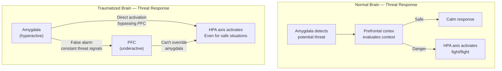

## The Traumatized Brain

Van der Kolk describes three key brain regions affected by trauma:

- **The Amygdala:** The smoke detector. In trauma survivors, it becomes hyperactive — detecting threats where none exist. The system meant to protect you becomes a source of constant alarm.
- **The Prefrontal Cortex:** The watchtower. This is the executive center — attention, planning, impulse control, self-awareness. Trauma suppresses its activity. When the amygdala screams FIRE, the PFC goes offline.
- **The Hippocampus:** The time stamper. It contextualizes memories — "this happened THEN, not NOW." Trauma shrinks the hippocampus. Without it, the past feels present.

The result: trauma survivors live in a state of permanent threat readiness. Their brains cannot distinguish between a real danger in the present and a memory of danger from the past.

## Dissociation: Leaving the Body

When fighting or fleeing is impossible, the organism defaults to a third response: freezing, or dissociation. The mind "leaves" the body to escape the unbearable. This is the classic response to childhood abuse — the child cannot fight or flee, so she goes somewhere else mentally.

Dissociation becomes a habit. The survivor learns to disconnect from bodily sensations, emotions, and even identity. This is adaptive during the trauma but devastating in the long run. It makes intimate relationships impossible, blocks access to emotions, and creates a sense of unreality.

## The Body Keeps Score

Van der Kolk reviews the physiological evidence:

- Chronically elevated cortisol and/or norepinephrine
- Altered heart rate variability
- Heightened startle response
- Chronic muscle tension patterns
- Increased inflammation markers
- Altered immune function

These changes persist even in people who have "dealt with" the trauma cognitively. The body remembers even when the mind has tried to forget. This explains why trauma survivors often have unexplained physical symptoms — chronic pain, gastrointestinal problems, autoimmune conditions.

## Attachment and Trauma

Secure attachment to caregivers is the best predictor of resilience to trauma. Children who have a "secure base" — a caregiver who responds sensitively to their distress — develop better emotion regulation, stronger stress-response systems, and greater capacity to cope with adversity.

Insecure attachment patterns (avoidant, anxious, disorganized) increase vulnerability. The disorganized attachment pattern is particularly relevant to trauma: it develops when the caregiver is simultaneously the source of safety and the source of threat. The child's brain cannot make sense of this contradiction, leading to lasting fragmentation.

## Treatment Approaches

### EMDR (Eye Movement Desensitization and Reprocessing)

EMDR involves recalling traumatic memories while engaging in bilateral stimulation (typically eye movements or taps). Van der Kolk explains the theory: bilateral stimulation helps the brain process the memory, moving it from "hot" (emotionally charged, feel-like-it's-happening-now) to "cold" (remembered but not relived). EMDR has strong evidence for PTSD treatment.

### Neurofeedback

Neurofeedback trains the brain to regulate itself. The client watches a computer display of their own brain activity and learns to shift it toward healthier patterns. Van der Kolk's research shows that neurofeedback can reduce hyperarousal and improve executive function in trauma survivors.

### Yoga and Body-Based Approaches

Since trauma is stored in the body, body-based approaches are essential. Yoga teaches interoception — the ability to sense what is happening inside the body. For trauma survivors who have learned to ignore bodily sensations, this is a crucial skill. Van der Kolk's studies show that yoga significantly reduces PTSD symptoms.

### Theater and Psychodrama

The Trauma Center uses theater as treatment. Survivors act out scenarios, inhabiting different roles and practicing new ways of being in the world. The safety of the theatrical frame allows experimentation with emotions and behaviors that feel too dangerous in real life.

### MDMA-Assisted Psychotherapy

Van der Kolk discusses the promising research on MDMA (ecstasy) as a tool for trauma treatment. The drug reduces fear while increasing trust and social bonding, creating a window of opportunity for therapy. Phase 3 trials have shown remarkable results for treatment-resistant PTSD.

## Practical Applications

- If you have experienced trauma, understand that your body's responses are not signs of weakness — they are adaptations that kept you alive.
- Do not expect talk therapy alone to resolve trauma. Look for therapists trained in EMDR, somatic experiencing, or other body-based approaches.
- Learn to recognize dissociation: the feeling of being "not really here," of watching yourself from outside. Grounding techniques (focusing on physical sensations, orienting to the present) can help.
- For parents: provide a secure base for your children. Responsive caregiving builds resilience.
- For clinicians: assess for trauma in every patient, especially those with unexplained physical symptoms or treatment-resistant conditions.
