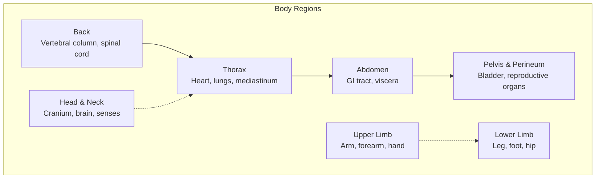
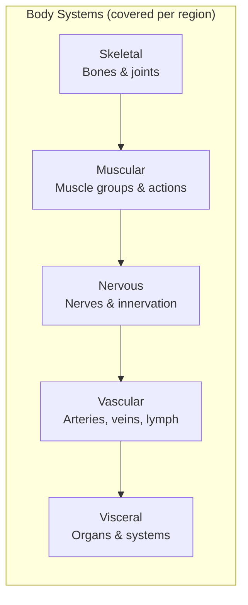

# Core Concepts

## Regional Anatomy

Each chapter follows a consistent sequence: **surface anatomy → osteology → muscles → nerves → blood supply → lymphatics → clinical correlations**. This repetition builds a predictable learning rhythm.

## Anatomical Terminology

The book establishes a precise vocabulary on which all subsequent knowledge rests:

| Term | Definition | Example |
|------|------------|---------|
| Anatomical position | Standing erect, palms forward, feet shoulder-width | Reference for all directional terms |
| Sagittal plane | Divides body into left and right | Median sagittal = midline |
| Coronal plane | Divides body into anterior and posterior | Frontal section |
| Transverse plane | Divides body into superior and inferior | Cross-section |
| Proximal / Distal | Closer to / farther from trunk | Shoulder is proximal to elbow |
| Medial / Lateral | Toward / away from midline | The heart is medial to the lungs |
| Superficial / Deep | Toward / away from body surface | Skin is superficial to muscle |

## Body Systems Overview

Unlike systemic textbooks that track a single system across the entire body, this book teaches **all systems within one region**. When studying the thorax, you learn the ribs, intercostal muscles, phrenic nerve, thoracic aorta, and lungs together — as they exist in reality.

## Clinical Correlates

> **Clinical Blue Box** — Each box presents a real clinical scenario. For example, in the upper limb chapter: "A 45-year-old presents with wrist drop after a humeral fracture. Which nerve is injured?" The answer (radial nerve) is followed by the mechanism, relevant anatomy, and typical presentation.

The boxes cover: common fractures, nerve compressions, vascular emergencies, congenital anomalies, radiologic findings, and surgical approaches. They are the bridge between rote memorization and clinical reasoning.

# Chapter Insights

## Chapter 1: The Back

Introduces the vertebral column, spinal cord, and back muscles. Key concepts include vertebral anatomy (body, arch, processes), intervertebral discs, spinal nerve roots, and the erector spinae group. Clinical focus: herniated discs, spinal stenosis, and scoliosis.

## Chapter 2: The Thorax

Covers the thoracic cage, lungs, heart, and mediastinum. Detailed coverage of cardiac anatomy (chambers, valves, coronary vessels) and the bronchopulmonary segments. Clinical focus: myocardial infarction, pneumothorax, and cardiac tamponade.

## Chapter 3: The Abdomen

Presents the abdominal wall, GI tract, liver, biliary system, pancreas, spleen, and kidneys. Includes peritoneal relationships (intraperitoneal vs retroperitoneal) and the portal venous system. Clinical focus: appendicitis, hernias, and referred pain patterns.

## Chapter 4: The Pelvis and Perineum

Covers pelvic bones, pelvic floor muscles, urinary bladder, rectum, and reproductive organs in both sexes. Clinical focus: pelvic fractures, childbirth mechanics, and prostate hypertrophy.

## Chapter 5: The Lower Limb

Details the bones and joints of the hip, knee, ankle, and foot. Major muscle groups (gluteal, quadriceps, hamstrings, calf) and the lumbosacral plexus. Clinical focus: hip fractures, ACL tears, and compartment syndrome.

## Chapter 6: The Upper Limb

Covers the shoulder, arm, elbow, forearm, wrist, and hand. The brachial plexus receives special attention — a notoriously challenging topic. Clinical focus: carpal tunnel syndrome, rotator cuff tears, and Colles fracture.

## Chapter 7: The Head and Neck

The largest chapter. Covers the skull, cranial nerves, brain, eye, ear, pharynx, larynx, and major vessels. Clinical focus: facial nerve palsy, trigeminal neuralgia, and lymph node metastases.

# Practical Applications

## For Medical Students

- **Before lab**: Read the relevant chapter section to understand what structures you will dissect. Study the illustrations to build a mental map.
- **During lab**: Use the atlas photographs and radiologic images to correlate what you see with textbook anatomy.
- **After lab**: Work through the review questions and clinical cases. If you cannot explain why a structure matters, you have not learned it.

## For Study Groups

- **Peer teaching**: Each member presents one region using the chapter's sequence (bones → muscles → nerves → vessels).
- **Clinical case discussions**: Use the Clinical Blue Boxes as starting points for differential diagnosis practice.
- **Image quizzes**: Project illustrations without labels and identify structures aloud.

## Study Strategy

| Phase | Activity | Time |
|-------|----------|------|
| Preview | Skim chapter objectives and illustration list | 15 min |
| Deep read | Study text alongside illustrations, annotate | 2 hrs |
| Clinical connect | Read all Blue Boxes in the chapter | 30 min |
| Review | Answer chapter review questions | 30 min |
| Reinforce | Use online question bank (Student Consult) | 30 min |

# Actionable Lessons

- **Draw before you look.** Before studying a region, sketch what you expect to find. Compare your drawing to the book. This exposes gaps in your mental model.
- **Learn nerves by territory, not by name.** Understand which muscles and skin areas a nerve serves. The name becomes a label for territory, not a isolated fact.
- **Palpate everything.** Surface anatomy is not abstract. Find your own landmarks: the spine of the scapula, the ASIS, the inguinal ligament. Touch reinforces visual memory.
- **Connect anatomy to imaging.** When you learn a structure, find it on a radiograph, CT, or MRI. This is how you will use anatomy in practice.

# Reading Guide

## Sufficiency Assessment

This summary captures the core organizational principles and highlights of each regional chapter. It covers the pedagogical approach and key features but omits the thousands of individual structural details, illustrations, and clinical scenarios that fill the full text.

## Recommended Reading Path

| Reader Type | Time | What to Read |
|---|---|---|
| Casual | 30 min | This summary |
| Interested | 8–10 hrs | Summary + Chapter 2 (Thorax), Chapter 6 (Upper Limb), Chapter 7 (Head & Neck) |
| Scholar/Practitioner | 80–100 hrs | Full book — all 7 chapters cover to cover |

## Chapters to Read in Full

- **All 7 chapters** are interdependent. The book is designed to be read as a complete course.

## What You'll Miss by Not Reading the Full Book

- The 1,000+ illustrations that train your visual-spatial understanding of anatomy.
- The Clinical Blue Boxes that connect structure to medical practice.
- The dissection photographs that prepare you for the cadaver lab.
- The online question bank and interactive review tools.
