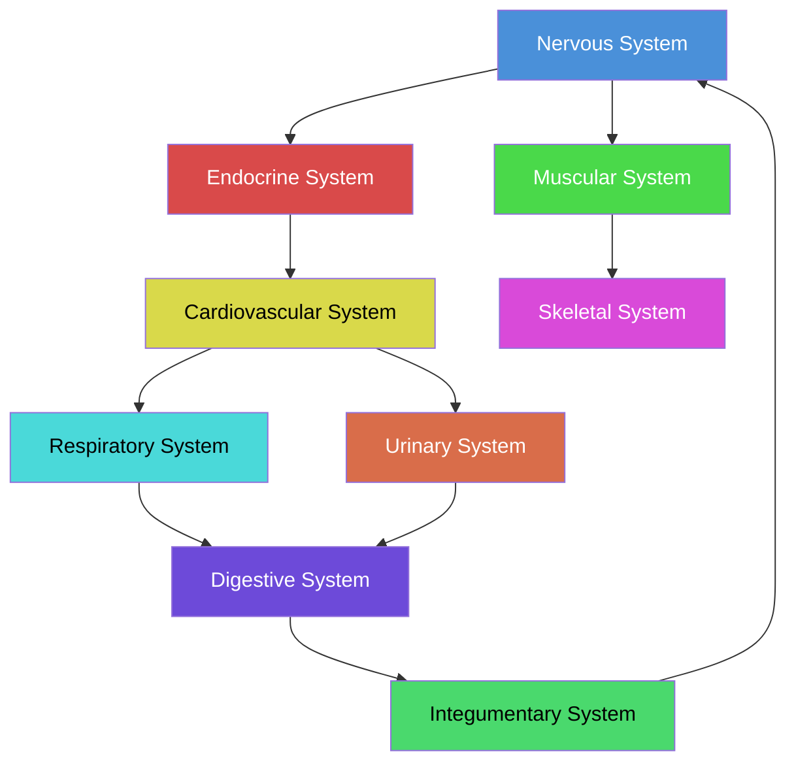

## Core Concepts

### Homeostasis

Homeostasis — the maintenance of a stable internal environment — is the central organizing principle of the textbook. The authors devote an early chapter to feedback mechanisms, distinguishing between negative feedback (the dominant mode, counteracting deviation) and positive feedback (amplifying change, as in childbirth and blood clotting). Every subsequent chapter revisits homeostasis to show how each organ system contributes to — or is regulated by — the body's equilibrium.

### Anatomical Terminology

The textbook establishes a universal language for describing the body: anatomical position, directional terms (superior/inferior, anterior/posterior, medial/lateral), body planes (sagittal, frontal, transverse), and regional terms. This foundation ensures precise communication about location, an essential skill for clinical practice.

### Body Systems Overview

### Structure-Function Principle

A recurring theme: every anatomical structure is shaped by its physiological function. Compact bone provides leverage; spongy bone reduces weight. Cardiac muscle cells branch and interlock for coordinated contraction; skeletal muscle fibers run parallel for forceful shortening. The text consistently pairs gross anatomy with microscopic histology, reinforcing this relationship.

## Chapter Insights

The 28 chapters follow a logical progression. An introduction to anatomy, physiology, and homeostasis is followed by the chemical and cellular levels of organization. The histology chapter bridges to organ-level coverage. The remaining chapters proceed by system: integumentary, skeletal, muscular, nervous (including special senses), endocrine, cardiovascular (blood, heart, vessels), lymphatic/immune, respiratory, digestive, metabolism/nutrition, urinary, fluid/electrolyte/acid-base balance, and reproductive systems. A capstone chapter on development and inheritance closes the volume.

Notable strengths include the detailed treatment of the nervous system (four chapters covering neural tissue, the CNS, the PNS, and special senses) and the cardiovascular system (three chapters on blood, the heart, and vessels/hemodynamics). Each chapter opens with learning objectives and closes with key terms, review questions, critical thinking exercises, and clinical correlations.

## Practical Applications

Every chapter includes **Clinical Connections** boxes linking anatomy to real medical scenarios — fractures and bone repair, cardiovascular disease, asthma, kidney stones, and more. The **Interactive Links** feature directs readers to online animations and simulations that reinforce dynamic processes like muscle contraction, nerve impulse propagation, and cardiac cycling. A glossary of more than 2,000 terms provides continuous reference support.

## Reading Guide

| Chapter Group | Systems Covered | Estimated Hours |
|---|---|---|
| 1-3 | Foundations, chemistry, cells | 10-12 |
| 4 | Tissues / histology | 4-5 |
| 5-6 | Integumentary, skeletal | 6-8 |
| 7-8 | Skeletal system details | 6-8 |
| 9-11 | Muscular system | 8-10 |
| 12-15 | Nervous system, senses | 10-12 |
| 16-17 | Endocrine, cardiovascular (blood) | 6-8 |
| 18-20 | Heart, vessels, lymphatic | 10-12 |
| 21-24 | Respiratory, digestive, metabolism, urinary | 10-12 |
| 25-27 | Fluids/electrolytes, reproductive | 6-8 |
| 28 | Development / inheritance | 3-4 |
