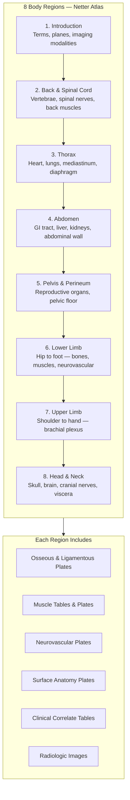

## The Netter Approach

Netter's atlas is built on a distinct pedagogical philosophy: the
illustration is the primary teacher, text is secondary. Each plate is
designed as a self-contained visual lesson — arteries in red, veins in
blue, nerves in yellow — so that at a glance the viewer understands
spatial relationships that would take paragraphs to describe. The 9th
edition preserves every one of Netter's original paintings while adding
radiologic correlations (CT, MRI, ultrasound) alongside the traditional
views.

### Regional vs. Systemic Organization

Unlike systemic atlases that trace a single system (e.g., all arteries)
across the entire body, Netter's regional approach presents everything
within one body region at once: bones, muscles, vessels, nerves, and
viscera as they appear during dissection. This mirrors clinical
examination — a surgeon does not think about "the arterial system" when
operating on the neck; they think about the carotid sheath, its
contents, and nearby nerves.

---

## Atlas Structure: Eight Regions

### 1. Introduction
Anatomic position, planes (sagittal, coronal, transverse), directional
terms, and a survey of imaging modalities (plain film, CT, MRI,
ultrasound). Sets the vocabulary for the entire atlas.

### 2. Back & Spinal Cord
Vertebral column from atlas to coccyx, intervertebral discs, spinal
cord segments, the meninges, dermatomes, and the intrinsic muscles
of the back. Key clinical correlates: herniated nucleus pulposus,
spinal stenosis, and vertebral fracture patterns.

### 3. Thorax
Thoracic cage, lungs and bronchopulmonary segments, the heart in situ,
coronary vessels, conducting system, mediastinum (superior, anterior,
middle, posterior), diaphragm, and thoracic wall. Surface anatomy of
cardiac auscultation points and lung fissures.

### 4. Abdomen
Anterolateral abdominal wall (inguinal region and hernias), peritoneal
cavity and mesenteries, GI tract from stomach to rectum, liver and
biliary tree, pancreas, spleen, kidneys and suprarenal glands, posterior
abdominal wall. Key tables on abdominal vasculature and the segments
of the liver.

### 5. Pelvis & Perineum
Bony pelvis and pelvic joints, pelvic diaphragm, male and female
reproductive organs, bladder and urethra, rectum and anal canal,
perineum and pudendal neurovasculature. Clinical: pelvic organ prolapse,
episiotomy landmarks, prostate examination.

### 6. Lower Limb
Bones and joints from hip to foot, muscles of the gluteal region,
thigh compartments, leg and foot, the lumbar and sacral plexuses,
femoral triangle, popliteal fossa, and tarsal tunnel. Clinical:
sciatic nerve compression, ankle sprains, compartment syndrome.

### 7. Upper Limb
Shoulder girdle and joint, rotator cuff, arm compartments, cubital
fossa, forearm (flexor and extensor compartments), wrist and hand,
the brachial plexus in full detail. Clinical: Erb-Duchenne palsy,
carpal tunnel syndrome, Colles fracture.

### 8. Head & Neck
Skull (exterior and interior views), cranial nerves and their foramina,
brain and brainstem, orbit and eye, ear, nasal cavity and paranasal
sinuses, oral cavity, pharynx, larynx, thyroid, and cervical viscera.
Clinical: cavernous sinus thrombosis, facial nerve palsy,
lymphadenopathy levels.

---

## Surface Anatomy

One of the atlas's most practical features is its surface anatomy plates.
These illustrations overlay palpable landmarks on the living body —
bony prominences, muscle bellies, tendon insertions, and vascular
pulsations. For each region, Netter illustrates:

- **Palpable bony landmarks** (spinous processes, iliac crest, patella)
- **Muscle contours** (deltoid, biceps brachii, gastrocnemius)
- **Arterial pulses** (carotid, brachial, radial, femoral, popliteal,
  dorsalis pedis)
- **Injection and access sites** (central line insertion, lumbar
  puncture, joint aspiration)

---

## Clinical Tables

Every region includes structured tables that summarize clinically
relevant information. Representative examples:

| Feature | Purpose |
|---------|---------|
| Muscle Origin/Insertion/Innervation | Quick reference for physical exam and nerve injury assessment |
| Arterial Supply & Venous Drainage | Surgical planning and vascular pathology |
| Nerve Root & Peripheral Nerve | Dermatome maps and motor innervation |
| Common Fracture & Dislocation Patterns | Radiographic correlation |
| Hernias & Weak Points | Inguinal, femoral, diaphragmatic, hiatal |

---

## Practical Applications

### For Medical Students
- Use the atlas alongside dissection — identify each structure on the
  plate before locating it in the cadaver
- Focus on the "Blue Box" clinical correlates — these are high-yield
  for board exams
- Memorize muscle tables by region, not by system

### For Surgical Residents
- Review the relevant regional plates the night before a case
- Pay close attention to neurovascular relationships — the complications
  of surgery are usually complications of anatomy
- Use the surface anatomy plates to plan incision placement

### For Clinicians
- Keep the atlas accessible for patient education — showing a Netter
  plate to a patient explains their condition faster than words
- Use regional plates to refresh anatomy before procedures (central
  lines, joint injections, lumbar puncture)

### For Medical Educators
- The online image bank allows you to build lectures around individual
  plates
- Labeled and unlabeled versions support self-assessment
- Incorporate the radiologic correlates to bridge classic anatomy to
  modern imaging

---

## Reading Guide

| Approach | How to Use |
|----------|------------|
| **Course-aligned** | Follow the region your anatomy course is covering — read plates, review muscle tables, test with unlabeled versions |
| **Board review** | Focus on clinical correlate tables and nerve injury patterns |
| **Procedural prep** | Study the relevant region's surface anatomy and cross-sectional plates |
| **Deep study** | Work through the atlas front-to-back, one region per week — approximately 6-8 weeks total |
