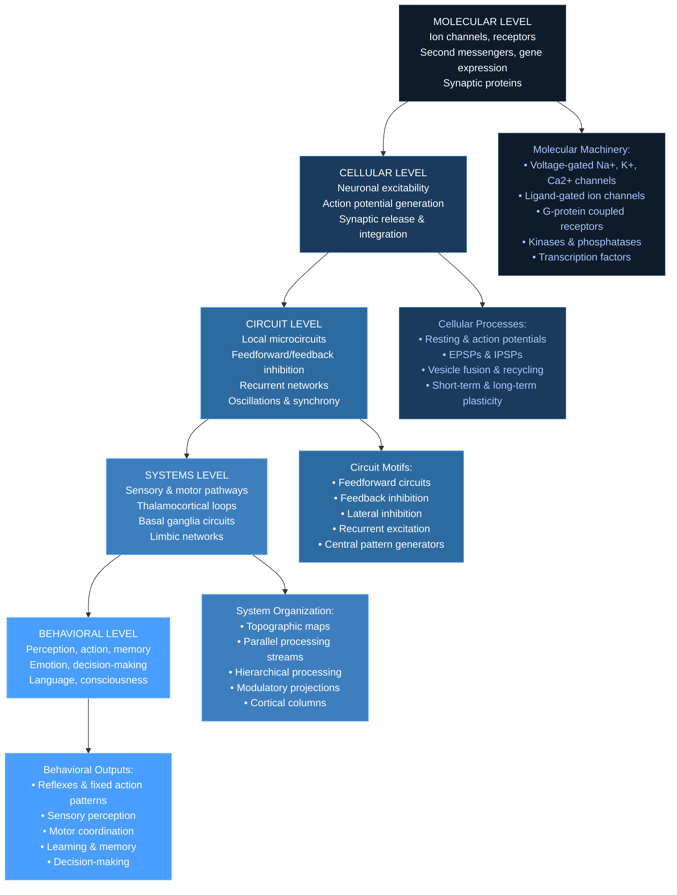

# Core Concepts

## The Neuron Doctrine

The neuron doctrine — the principle that the neuron is the fundamental structural and functional unit of the nervous system — provides the conceptual foundation for the entire book. Santiago Ramón y Cajal's histological work, using Golgi's silver stain to reveal individual neurons in all their dendritic and axonal glory, demonstrated that the nervous system is composed of discrete cells that communicate at specialized junctions called synapses. This principle, established in the late nineteenth century, remains the bedrock of modern neuroscience. The sixth edition traces the doctrine's evolution from Cajal's camera lucida drawings to modern electron microscopy and serial-section electron microscopy connectomics, which have confirmed and extended the basic insight: the nervous system is a network of individual cells whose connections define the architecture of neural computation.

## Synaptic Transmission

Synaptic transmission is the mechanism by which neurons communicate with each other and with target cells such as muscle fibers and glands. The book devotes extensive chapters to both electrical and chemical synapses. Electrical synapses, mediated by gap junctions, allow direct ionic current flow between neurons, enabling rapid, synchronous firing. Chemical synapses are far more numerous and functionally diverse: neurotransmitter synthesis, vesicle packaging, calcium-dependent release, receptor binding, and postsynaptic signal transduction are each dissected at molecular resolution. The major neurotransmitter systems — glutamate (excitatory), GABA and glycine (inhibitory), acetylcholine, dopamine, norepinephrine, serotonin, and neuropeptides — are each treated in dedicated chapters that cover synthesis, release, receptor pharmacology, and physiological roles. The book's treatment of synaptic transmission is arguably its single strongest section, reflecting Kandel's own research legacy.

## Neural Circuits and Systems

Neural circuits — ensembles of interconnected neurons that perform specific computations — represent the bridge between cellular mechanisms and behavior. The book presents canonical circuit motifs including feedforward excitation and inhibition, feedback inhibition, lateral inhibition, recurrent excitation, and oscillatory networks. These motifs recur across sensory, motor, and cognitive systems. The cerebellar circuit, with its precisely organized Purkinje cells, granule cells, and climbing fibers, serves as the best-understood example of how circuit architecture shapes computation. The hippocampal circuit, with its trisynaptic pathway and entorhinal connections, is presented in the context of spatial navigation and memory formation. More complex cortical circuits in the neocortex — with their layered organization, columnar architecture, and diverse interneuron types — are described as the substrate of higher cognition.

## Sensory Processing

Sensory systems transform physical energy — light, sound, pressure, chemical molecules — into neural signals that the brain interprets as perceptions. The book treats each sensory modality in depth: vision (phototransduction, retinal processing, geniculostriate pathway, extrastriate visual areas), audition (cochlear mechanics, tonotopic organization, brainstem and cortical processing), somatosensation (mechanoreceptors, proprioception, pain and temperature pathways), olfaction (olfactory receptor gene family, glomerular organization, piriform cortex), and gustation (taste receptor cells, labeled-line coding, insular cortex). A unifying principle across modalities is the concept of the receptive field: each neuron responds to a specific region of sensory space, and the brain reconstructs the external world from the distributed activity of millions of feature-detecting neurons.

## Motor Systems

Motor control is organized hierarchically. At the lowest level, spinal cord circuits generate reflexes and coordinate rhythmic movements such as locomotion. The brainstem provides postural control and orienting movements. The cerebral cortex — primary motor cortex, premotor cortex, supplementary motor area — plans and executes voluntary movements. The cerebellum coordinates timing and precision, detecting errors and updating motor commands. The basal ganglia gate movement initiation and suppress unwanted movements. Each level receives continuous sensory feedback, and damage at any level produces characteristic motor deficits. The book presents the motor system not as a simple command hierarchy but as a set of interacting loops: cortex-basal ganglia-thalamus-cortex and cortex-pons-cerebellum-thalamus-cortex, each subserving different aspects of motor learning and control.

## Learning and Memory

The book's treatment of learning and memory — the capstone of its core concepts — reflects Kandel's lifelong research program. Memory is not a single faculty but multiple systems served by distinct neural circuits: declarative memory (facts and events) depends on the medial temporal lobe, including hippocampus and entorhinal cortex; procedural memory (skills and habits) involves the striatum and cerebellum; emotional memory engages the amygdala; priming reflects changes in neocortical processing. At the cellular level, all forms of memory involve activity-dependent changes in synaptic strength. The molecular cascade from short-term memory (modification of existing proteins) to long-term memory (gene expression and new protein synthesis) is described in extraordinary detail, from cAMP and PKA to MAP kinase, CREB, and structural changes at the synapse. This molecular account of memory — the crowning achievement of Kandel's career — is presented as one of neuroscience's great success stories: a complete causal chain from behavior to molecules and back.

# Chapter Insights

The book is organized into nine parts spanning 67 chapters. Part I (The Cell Biology of Neurons) covers the neuron doctrine, ion channels, membrane potential, action potentials, and synaptic transmission at molecular resolution. Part II (The Physiology of Nerve Cells) deepens the cellular perspective with chapters on synaptic integration, modulation, and plasticity. Part III (Sensory Systems) surveys vision, audition, somatosensation, olfaction, and taste, each with detailed accounts of transduction, pathway organization, and cortical processing. Part IV (Motor Systems) follows the neural control of movement from spinal cord to cortex, including chapters on posture, locomotion, eye movements, reaching, and grasping. Part V (Development and the Emergence of Behavior) covers neural induction, patterning, axon guidance, synapse formation, critical periods, and experience-dependent development. Part VI (The Neural Basis of Cognition) addresses language, attention, emotion, motivation, decision-making, and consciousness — the book's most speculative and rapidly evolving sections. Part VII (Learning and Memory) is the intellectual heart of the volume, with detailed chapters on memory systems, synaptic plasticity, and the molecular biology of memory storage. Part VIII (Speech, Language, and Thought) examines neural mechanisms of language production and comprehension, including aphasias and the organization of language in the brain. Part IX (The Principles of Neurology in Clinical Context) translates basic neuroscience into clinical practice, covering stroke, epilepsy, neurodegenerative diseases, psychiatric disorders, and spinal cord injury.

# Practical Applications

For researchers, the book provides the theoretical and methodological foundation for designing experiments, interpreting data, and generating hypotheses. For clinicians, it offers mechanistic accounts of neurological and psychiatric disease — from Alzheimer's disease (amyloid plaques, tau tangles, synaptic loss) to schizophrenia (dopamine dysregulation, prefrontal dysfunction) — that inform diagnosis and treatment. For educators, it is the definitive teaching resource, though its density requires careful syllabus design and supplementary materials. For advanced students, systematic reading of selected chapters builds an integrated understanding that piecemeal study cannot provide. The book's extensive references — thousands of citations spanning the history of neuroscience — make it an unparalleled entry point into the primary literature.

# Reading Guide

**For maximum efficiency**, readers with molecular biology backgrounds should begin with Parts III and IV (sensory and motor systems), which demonstrate the explanatory power of the cellular approach, then return to Parts I and II for deeper mechanistic understanding. **Medical students** should prioritize Parts I–IV and IX, using the clinical chapters to anchor basic science concepts. **Psychology and cognitive science researchers** will find Parts VI–VIII most directly relevant, but should read Parts I and II for the cellular foundation. **Graduate students in neuroscience** should read the entire volume in sequence over a semester or two, using it as the backbone of a comprehensive course. **The book rewards repeated reading:** each pass reveals new connections between topics that seemed unrelated on first encounter.
