# Core Concepts

## The Mirror Neuron System

Mirror neurons are the conceptual heart of The Tell-Tale Brain. Discovered in the 1990s by Giacomo Rizzolatti and his colleagues at the University of Parma, these neurons in the premotor cortex and inferior parietal lobule fire both when a monkey performs a goal-directed action and when it observes the same action performed by another. Ramachandran seizes on this discovery as the key to understanding what makes humans unique, arguing that mirror neurons are far more developed in humans than in other primates and that their evolution triggered a cascade of uniquely human capabilities.

The book proposes that mirror neurons provide the neural substrate for imitation, which is the foundation of cultural transmission. A monkey can learn from observation, but only humans can precisely imitate novel sequences of actions — the capacity that allows skills, tools, and traditions to accumulate across generations. Ramachandran further argues that mirror neurons underpin language evolution: the ability to map observed movements onto one's own motor repertoire is a precursor to the mapping of sounds onto meanings. Most provocatively, he suggests that mirror neurons are the basis of empathy — when we see someone in pain, our mirror neuron system activates the same neural circuits as if we were experiencing the pain ourselves, providing a direct, embodied route to understanding others' emotions.

## Phantom Limbs and Body Mapping

Phantom limbs — the vivid sensation that an amputated limb is still present — provide some of the book's most compelling clinical material. Ramachandran describes patients who can feel their missing hand clenching in painful spasms, who reach for objects with their phantom arm, and who experience referred sensations when different parts of their face are touched. Through elegant experiments using mirror visual feedback — in which a patient places both the intact and phantom limb into a mirror box, creating the illusion that the phantom is moving — Ramachandran demonstrates that phantom pain can be relieved by providing the brain with visual evidence that the "paralyzed" phantom is capable of movement.

These phenomena reveal the brain's body map — the homunculus in the somatosensory and motor cortices — as a dynamic, plastic representation rather than a fixed template. When an arm is amputated, the adjacent cortical territory representing the face expands into the now-vacant hand area, producing referred sensations and, Ramachandran argues, contributing to phantom pain. The mirror box works because visual input overrides the mismatch between motor commands and sensory feedback, allowing the brain to "unlearn" the painful clenched posture.

## Synesthesia

Synesthesia — a condition in which stimulation of one sensory modality triggers involuntary experiences in another — occupies a special place in Ramachandran's argument. Synesthetes might see colors when hearing music, taste shapes, or feel textures when looking at smooth surfaces. Rather than treating synesthesia as a curious anomaly, Ramachandran uses it as a window into the normal organization of the brain.

His theory holds that synesthesia results from a genetic mutation that causes incomplete pruning of connections between adjacent brain areas during development. The fusiform gyrus, which processes color and faces, lies next to the area that processes numbers and letters; excess cross-activation between these regions produces grapheme-color synesthesia, the most common form. Crucially, Ramachandran argues that all humans are born with these cross-wired connections and that they are normally pruned away. Synesthesia thus represents the persistence of a primitive neural organization that may have played an important role in the evolution of metaphor and abstract thought.

```mermaid
graph TD
    MN["MIRROR NEURON SYSTEM<br/>Premotor & parietal cortex"] --> IM["Imitation & Social Learning<br/>Foundation of culture"]
    MN --> EM["Empathy<br/>Understanding others' emotions"]
    MN --> LG["Language Evolution<br/>Gesture → speech"]
    MN --> TM["Theory of Mind<br/>Inferring others' intentions"]

    PL["PHANTOM LIMBS<br/>Somatosensory cortex"] --> BP["Body Map Plasticity<br/>Dynamic cortical reorganization"]
    PL --> MB["Mirror Box Therapy<br/>Visual feedback alleviates pain"]
    BP --> RS["Referred Sensations<br/>Face maps invade hand territory"]

    SY["SYNESTHESIA<br/>Cross-modal cortex"] --> GW["Cross-Wired Brain<br/>Incomplete pruning of connections"]
    SY --> MT["Metaphor & Abstraction<br/>Linking disparate concepts"]
    GW --> SH["Synesthesia → Hemispheric<br/>Specialization → Language"]

    NA["NEURAL AESTHETICS<br/>Visual & limbic cortex"] --> PB["Peak Shift Principle<br/>Preference for exaggerated features"]
    NA --> GR["Grouping & Ordering<br/>Brain seeks patterns"]
    NA --> IS["Isolation<br/>Singling out one visual cue"]

    EV["HUMAN UNIQUENESS<br/>Prefrontal & temporoparietal"] --> SA["Self-Awareness<br/>Narrative self constructed by brain"]
    EV --> MT2["Mental Time Travel<br/>Past & future simulation"]
    EV --> AB["Abstract Representation<br/>Symbolic thought"]

    IM --> CL["CUMULATIVE CULTURE<br/>Ratchet effect of human progress"]
    CL --> HU["HUMAN UNIQUENESS"]

    style MN fill:#1a1a2e,color:#fff,stroke:#2d2d5e
    style PL fill:#2d2d5e,color:#fff,stroke:#4a4a8e
    style SY fill:#3a3a6e,color:#fff,stroke:#5a5aae
    style NA fill:#4a4a8e,color:#fff,stroke:#7a7ace
    style EV fill:#5a5aae,color:#fff,stroke:#9a9aee
    style HU fill:#7a7ace,color:#fff,stroke:#b0b0ff
    style IM fill:#3a3a6e,color:#c0c0ff,stroke:#5a5aae
    style EM fill:#3a3a6e,color:#c0c0ff,stroke:#5a5aae
    style LG fill:#3a3a6e,color:#c0c0ff,stroke:#5a5aae
    style TM fill:#3a3a6e,color:#c0c0ff,stroke:#5a5aae
    style BP fill:#3a3a6e,color:#c0c0ff,stroke:#5a5aae
    style MB fill:#3a3a6e,color:#c0c0ff,stroke:#5a5aae
    style RS fill:#3a3a6e,color:#c0c0ff,stroke:#5a5aae
    style GW fill:#3a3a6e,color:#c0c0ff,stroke:#5a5aae
    style MT fill:#3a3a6e,color:#c0c0ff,stroke:#5a5aae
    style SH fill:#3a3a6e,color:#c0c0ff,stroke:#5a5aae
    style PB fill:#3a3a6e,color:#c0c0ff,stroke:#5a5aae
    style GR fill:#3a3a6e,color:#c0c0ff,stroke:#5a5aae
    style IS fill:#3a3a6e,color:#c0c0ff,stroke:#5a5aae
    style SA fill:#3a3a6e,color:#c0c0ff,stroke:#5a5aae
    style MT2 fill:#3a3a6e,color:#c0c0ff,stroke:#5a5aae
    style AB fill:#3a3a6e,color:#c0c0ff,stroke:#5a5aae
    style CL fill:#5a5aae,color:#fff,stroke:#9a9aee
```

## Neural Aesthetics

One of the most original sections of the book extends Ramachandran's clinical insights to the question of artistic beauty. Why do we find certain visual patterns, colors, and forms universally appealing? Ramachandran proposes eight universal principles of art that tap into the brain's processing architecture. The peak shift principle explains why caricatures — exaggerated versions of faces or forms — are often more appealing than realistic depictions: they activate the same neural detectors as the original stimulus but with greater intensity. Grouping explains the pleasure we derive from perceiving coherent patterns in scattered elements. The principle of isolation suggests that singling out a single visual cue — a contour drawing, a silhouette — enhances its aesthetic impact by focusing the brain's attention on one processing channel.

Ramachandran argues that these principles are not culturally acquired but built into the structure of the visual brain. Art, in this view, is a form of "super-stimulus" — a deliberate exaggeration of features that the brain is already wired to detect, designed to produce maximal activation of the brain's reward circuitry. This evolutionary approach to aesthetics challenges the notion that beauty is purely subjective, proposing instead that there are universal neural constraints on what we find beautiful.

## Language Evolution

The book's most speculative arguments concern the evolution of language. Ramachandran rejects the Chomskyan view that language is an innate, encapsulated module, arguing instead that it emerged from the repurposing of existing brain structures — particularly the mirror neuron system and the circuits underlying gesture and tool use. He points to the proximity of the Broca's area (language production) to the premotor cortex (hand movements) and the fact that the same area activates during both speech and object manipulation tasks.

The book also proposes a synesthetic theory of the origins of sound symbolism — the non-arbitrary mapping between sound and meaning seen in onomatopoeia and in cross-linguistic patterns like the "bouba/kiki" effect, where subjects consistently associate round shapes with the sound "bouba" and spiky shapes with "kiki." Ramachandran suggests this cross-modal mapping reflects the neural connections between visual shape areas and auditory cortex, connections that may have provided the bridge from gesture to vocalization in language evolution.

# Chapter Insights

The book's ten chapters move from specific clinical syndromes to broad evolutionary conclusions. The opening chapters introduce phantom limbs and the mirror box, establishing Ramachandran's method of learning about normal brain function from neurological anomalies. Chapters on the limbic system and emotional disorders explore the neural basis of emotion and its disorders. A chapter on synesthesia builds the case for the cross-wired brain. The discovery of mirror neurons is presented in a chapter that extends the phenomenon from motor cognition to empathy, imitation, and culture. Later chapters tackle aesthetics and art, the evolution of language, and the neural basis of self-awareness. The final chapter synthesizes the evidence into a speculative account of human uniqueness, arguing that a few key neural innovations — mirror neurons, cross-modal connections, and a hypertrophied prefrontal cortex — explain the gulf between human and animal minds.

# Practical Applications

For clinicians, the mirror box technique for phantom limb pain remains Ramachandran's most directly applicable contribution — a simple, cost-free intervention that can dramatically reduce chronic pain in amputees. For educators, the book's emphasis on imitation and mirror neurons suggests that learning environments that leverage observation, demonstration, and social interaction are deeply aligned with the brain's wiring. For artists and designers, Ramachandran's principles of neural aesthetics offer a framework for understanding why certain visual choices resonate universally. For the general reader, the book provides a new lens through which to understand everyday experiences — why music feels emotional, why metaphors work, why we are drawn to faces and stories — as products of a brain shaped by evolution to connect, imitate, and create meaning.
