# Core Concepts

## Neural Signaling

The book opens with a systematic treatment of cellular and molecular neuroscience. The resting membrane potential arises from the unequal distribution of ions across the neuronal membrane, maintained by the Na+/K+ ATPase and selective ion permeability. The action potential is an all-or-none regenerative event driven by voltage-gated sodium channels (depolarization) and voltage-gated potassium channels (repolarization), with the absolute and relative refractory periods ensuring unidirectional propagation. Synaptic transmission converts the electrical signal of the action potential into a chemical message: calcium influx through voltage-gated calcium channels triggers vesicle fusion, neurotransmitter release, and postsynaptic receptor activation. The major neurotransmitter systems — glutamate (excitatory), GABA and glycine (inhibitory), acetylcholine, dopamine, norepinephrine, serotonin, and neuropeptides — are each introduced with their synthesis pathways, receptor families, and physiological roles. The book's treatment of this material is distinguished by its consistent pedagogical approach: each concept is introduced at the simplest useful level, then progressively refined across subsequent chapters, with abundant diagrams and clinical correlations.

## Sensory Processing

Sensory systems transform physical energy into neural signals that the brain interprets as perceptions. The book treats each modality with a standard framework: transduction (how the sensory organ converts physical energy into neural signals), pathway organization (the chain of nuclei from periphery to cortex), and cortical processing (how higher areas extract increasingly complex features). The visual system receives the most extensive treatment — two full chapters covering the eye (phototransduction, retinal circuitry, receptive fields of retinal ganglion cells) and the central visual system (lateral geniculate nucleus, primary visual cortex orientation and ocular dominance columns, extrastriate visual areas, and the ventral and dorsal processing streams for object recognition and spatial vision). The auditory and vestibular systems cover cochlear mechanics, hair cell transduction, tonotopic organization, and the vestibular apparatus for balance. The somatic sensory system presents mechanoreception, proprioception, thermoreception, and nociception, including the gate control theory of pain. The chemical senses — olfaction and gustation — are treated with attention to receptor families, glomerular organization, and the unique features of each system.

```mermaid
graph TD
    SS["SENSORY SYSTEMS<br/>Transduction → Pathways → Cortex"] --> V["VISUAL SYSTEM<br/>Retina → LGN → V1 → V2 → IT/PP"]
    SS --> A["AUDITORY SYSTEM<br/>Cochlea → CN → SOC → IC → MGB → A1"]
    SS --> S["SOMATOSENSORY<br/>Skin → DRG → DC/STT → VPL → S1 → S2"]
    SS --> O["OLFACTION<br/>Olfactory epithelium → OB → Piriform ctx"]
    SS --> G["GUSTATION<br/>Taste buds → NTS → VPM → Insula"]

    V --> VENTRAL["VENTRAL STREAM<br/>Object recognition<br/>(What pathway)"]
    V --> DORSAL["DORSAL STREAM<br/>Spatial vision<br/>(Where pathway)"]

    MS["MOTOR SYSTEMS"] --> CTX["CORTICAL<br/>M1, PM, SMA<br/>Voluntary movement"]
    MS --> BS["BRAINSTEM<br/>Posture, gait<br/>Orienting reflexes"]
    MS --> SC["SPINAL CORD<br/>Reflexes, CPGs<br/>Local circuits"]
    MS --> CB["CEREBELLUM<br/>Coordination, timing<br/>Motor learning"]
    MS --> BG["BASAL GANGLIA<br/>Movement selection<br/>Action gating"]

    MEM["MEMORY SYSTEMS"] --> DECL["DECLARATIVE<br/>Hippocampus & MTL<br/>Facts & events"]
    MEM --> PROC["PROCEDURAL<br/>Striatum & cerebellum<br/>Skills & habits"]
    MEM --> EMOT["EMOTIONAL<br/>Amygdala<br/>Fear conditioning"]

    PLAS["SYNAPTIC PLASTICITY"] --> LTP["LTP<br/>Strong → persistent<br/>NMDA → CaMKII → AMPA"]
    PLAS --> LTD["LTD<br/>Weak → persistent<br/>mGluR/VDCC → phosphatases"]
    PLAS --> HOME["HOMEOSTATIC<br/>Scaling up/down<br/>Stabilizes network"]

    style SS fill:#1a3a5c,color:#fff,stroke:#2d6a9f
    style V fill:#1e4d7a,color:#fff,stroke:#3d8ecf
    style A fill:#1e4d7a,color:#fff,stroke:#3d8ecf
    style S fill:#1e4d7a,color:#fff,stroke:#3d8ecf
    style O fill:#1e4d7a,color:#fff,stroke:#3d8ecf
    style G fill:#1e4d7a,color:#fff,stroke:#3d8ecf
    style VENTRAL fill:#2d6a9f,color:#fff,stroke:#4a9eff
    style DORSAL fill:#2d6a9f,color:#fff,stroke:#4a9eff
    style MS fill:#1a3a5c,color:#fff,stroke:#2d6a9f
    style CTX fill:#1e4d7a,color:#fff,stroke:#3d8ecf
    style BS fill:#1e4d7a,color:#fff,stroke:#3d8ecf
    style SC fill:#1e4d7a,color:#fff,stroke:#3d8ecf
    style CB fill:#1e4d7a,color:#fff,stroke:#3d8ecf
    style BG fill:#1e4d7a,color:#fff,stroke:#3d8ecf
    style MEM fill:#1a3a5c,color:#fff,stroke:#2d6a9f
    style DECL fill:#1e4d7a,color:#fff,stroke:#3d8ecf
    style PROC fill:#1e4d7a,color:#fff,stroke:#3d8ecf
    style EMOT fill:#1e4d7a,color:#fff,stroke:#3d8ecf
    style PLAS fill:#1a3a5c,color:#fff,stroke:#2d6a9f
    style LTP fill:#1e4d7a,color:#fff,stroke:#3d8ecf
    style LTD fill:#1e4d7a,color:#fff,stroke:#3d8ecf
    style HOME fill:#1e4d7a,color:#fff,stroke:#3d8ecf
```

## Motor Control

The motor system transforms neural plans into coordinated action through a hierarchy of control structures. Spinal circuits generate reflexes (the stretch reflex, the flexion withdrawal reflex) and contain central pattern generators for rhythmic behaviors like locomotion. The brainstem provides postural control, orienting eye and head movements, and descending pathways (corticospinal, rubrospinal, vestibulospinal, reticulospinal) that modulate spinal activity. The cerebral cortex — primary motor cortex (M1), premotor cortex (PM), and supplementary motor area (SMA) — encodes movement parameters and sequences. The cerebellum, with its precisely organized laminar circuit, detects errors between intended and actual movement, updating motor commands through the dentate nucleus and thalamus. The basal ganglia — caudate, putamen, globus pallidus, subthalamic nucleus, substantia nigra — form a series of parallel loops that gate movement initiation and suppress unwanted movements, with dopamine modulating the balance between the direct and indirect pathways. The clinical cases are exceptionally well chosen: Parkinson's disease (akinesia, rigidity, tremor from nigrostriatal dopamine loss), Huntington's disease (chorea from striatal degeneration), cerebellar ataxia, and cortical stroke each illustrate specific principles of motor organization.

## Brain Development and Plasticity

Development of the nervous system proceeds through defined stages. Neural induction begins with the notochord signaling the overlying ectoderm to form the neural plate, which folds into the neural tube. Cell proliferation, migration, and differentiation follow precise genetic programs. Axon guidance relies on guidance cues — netrins, semaphorins, ephrins, slits — that attract or repel growing axons through specific receptors. Synapse formation involves the assembly of presynaptic and postsynaptic specializations, guided by cell adhesion molecules and activity. Critical periods — windows of heightened plasticity during which sensory experience shapes neural circuits — are best understood in the visual system, where monocular deprivation during a critical period leads to ocular dominance column shifts and permanent amblyopia. The molecular mechanisms of critical period plasticity involve the balance of excitation and inhibition, perineuronal nets, and myelin-associated inhibitors. Throughout life, the brain retains a capacity for plasticity: long-term potentiation and depression refine synaptic strength, adult neurogenesis in the hippocampus and olfactory bulb adds new neurons, and rehabilitation after brain injury demonstrates the brain's capacity for functional reorganization.

## Learning and Memory

Bear's own research on synaptic plasticity informs the book's treatment of memory, which is among its strongest sections. The discovery that lesions of the medial temporal lobe produce profound anterograde amnesia in patient H.M. established that memory is a distinct cognitive function with specific neural substrates. The book traces the subsequent identification of multiple memory systems: declarative memory depends on the hippocampus and surrounding cortical areas for encoding and consolidation; procedural memory involves the striatum and cerebellum; emotional memory engages the amygdala; priming reflects changes in neocortical processing. At the cellular level, long-term potentiation (LTP) — discovered by Bliss and Lømo in the hippocampus — provides the leading model for how memory works. The molecular cascade is presented with admirable clarity: high-frequency stimulation activates NMDA receptors, calcium influx triggers CaMKII autophosphorylation (a molecular memory switch), AMPA receptors are inserted into the postsynaptic membrane (enhancing synaptic strength), and gene expression through CREB consolidates the change into long-term memory. Long-term depression (LTD) reverses these changes through phosphatase activation and AMPA receptor endocytosis. The book presents LTP and LTD not as laboratory curiosities but as the fundamental mechanisms through which experience physically alters the brain.

# Chapter Insights

The enhanced fourth edition is organized into 25 chapters across five parts. Part I (Foundations) covers the history of neuroscience, neuronal and glial structure, the resting membrane potential, the action potential, synaptic transmission, neurotransmitter systems, and the gross organization of the nervous system. Part II (Sensory and Motor Systems) treats the chemical senses, the eye, the central visual system, the auditory and vestibular systems, the somatic sensory system, spinal control of movement, and brain control of movement. Part III (The Brain and Behavior) explores the chemical control of the brain (hypothalamus, autonomic nervous system, neuroendocrine system), motivation, sex and the brain, brain mechanisms of emotion, brain rhythms and sleep, language, attention, and mental illness. Part IV (The Changing Brain) covers early brain development, memory systems, and the molecular mechanisms of learning and memory. Part V (Complex Brain Functions) addresses higher cognitive functions including executive function, decision-making, creativity, and consciousness. Each chapter begins with a chapter outline and ends with a summary, key terms, review questions, and recommended reading — a pedagogical structure that supports systematic study.

# Practical Applications

For students, the book provides the foundation for advanced work in neuroscience, medicine, psychology, and related fields. Each clinical correlation connects basic science to patient care: understanding LTP explains why NMDA receptor antagonists might treat Alzheimer's disease; understanding the basal ganglia explains why L-DOPA alleviates Parkinson's symptoms; understanding critical periods explains why amblyopia must be treated in childhood. For educators, the book's clear organization, abundant illustrations, and ancillary materials (test bank, lecture slides, animations) make it an ideal course backbone. For self-learners, the systematic progression from foundations to complex brain functions provides a structured path through a vast field, though the nearly 1,000 pages require discipline and time.

# Reading Guide

**Undergraduates in a semester course** should read the book in sequence, as each chapter builds on previous material. Part I is essential for all subsequent understanding. **Medical students** may prioritize Parts I and II (cellular and systems foundations), then select clinical topics from Parts III–V. **Psychology students** will find Parts III and IV most directly relevant but should read at least Chapters 2–6 for the cellular foundation. **Self-learners** should treat the book as a semester-long course, reading one chapter per week with time for review and reflection. Chapters best read in full include Chapters 4 (The Action Potential), 5 (Synaptic Transmission), 9 (The Eye), 10 (The Central Visual System), 14 and 15 (Spinal and Brain Control of Movement), 23 (Memory Systems), and 24 (Molecular Mechanisms of Learning and Memory). Chapters that can be skimmed if time is limited include Chapter 1 (historical overview), Chapter 7 (neuroanatomy overview — use as reference), and selected clinical chapters based on interest.

**What You'll Miss by Not Reading the Full Book:** The "Brain Discovery" boxes that highlight classic and recent experiments, the "Path of Discovery" biographical sketches (including Bear's own account of discovering LTD), and the cumulative understanding that comes from seeing each system presented in the same consistent framework — from molecules to behavior.
