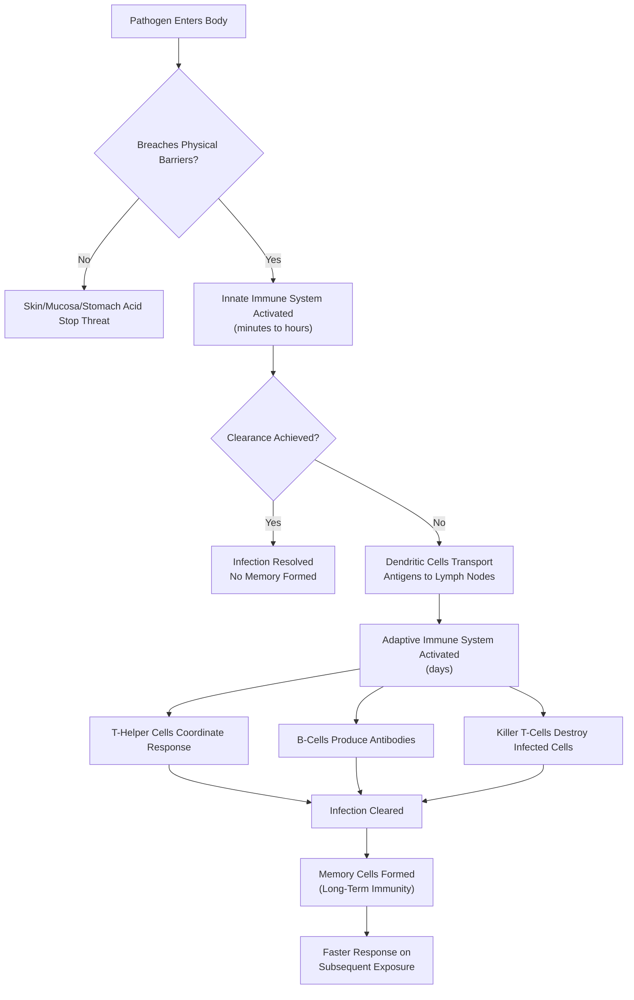

## Core Concepts

### The Castle Metaphor

The immune system is best understood not as a single entity but as a layered defense network, and Dettmer's medieval castle analogy is the book's central organizing device. The analogy works on four levels: the outer fortifications, the standing army, the special forces, and the intelligence network.

**Level 1 — The Moat and the Walls (Physical Barriers).** Your skin is a 2-square-meter fortress wall of dead, keratin-packed cells that most pathogens cannot penetrate. Your mucosa — the lining of your respiratory, digestive, and reproductive tracts — produces mucus that traps invaders and contains antimicrobial enzymes. Stomach acid is a chemical moat that destroys most ingested pathogens. These barriers stop 99.9% of threats before the immune system even knows they exist.

**Level 2 — The Standing Army (Innate Immunity).** When a pathogen breaches the outer walls, the innate immune system responds within minutes to hours. This is the body's rapid-response force: macrophages (big eaters that engulf and digest invaders), neutrophils (the most abundant white blood cells, arriving by the millions to form pus), dendritic cells (sentinels that patrol tissues and raise the alarm), and natural killer cells (hunters of virus-infected and cancerous cells). The innate system is fast but blunt — it cannot distinguish between specific threats.

**Level 3 — The Special Forces (Adaptive Immunity).** If the innate system cannot clear an infection, dendritic cells carry samples of the pathogen to the lymph nodes and spleen, where they present these samples to T-cells and B-cells. This is where the immune system becomes precise. T-cells come in two main types: killer T-cells (cytotoxic) that destroy infected cells, and helper T-cells that coordinate the entire immune response. B-cells produce antibodies — custom-shaped proteins that lock onto specific pathogens like a key in a lock.

**Level 4 — The Intelligence Network (Immune Memory).** After an infection is cleared, some T-cells and B-cells persist as memory cells. These are the immune system's intelligence archives, enabling a faster, stronger response if the same pathogen ever returns. This is why you only get chickenpox once, and why vaccines work.

### The Immune Response: From Cut to Cure

A paper cut provides the perfect illustration of the immune system in action. When you cut your finger, three things happen simultaneously: blood platelets form a clot to seal the wound; bacteria entering through the cut trigger pattern recognition receptors on local immune cells; and damaged cells release alarm signals (cytokines) that call for reinforcements. Within minutes, neutrophils arrive at the scene, engulfing bacteria and dying in the process — their corpses form pus. If the infection persists, dendritic cells carry bacterial fragments to the nearest lymph node, where they activate the adaptive immune system. Within three to five days, T-cells and B-cells mount a targeted response that eliminates the remaining bacteria, and memory cells remain behind in case of future infection.

### Chapter Insights

**Part 1 — The Innate Immune System.** Dettmer begins with the oldest and most universal layer of immunity. He introduces the complement system — a cascade of proteins that tags pathogens for destruction — and explains how inflammation works as both a signal and a weapon. The chapter on fever reveals that raising body temperature is a deliberate evolutionary strategy: many pathogens replicate poorly at higher temperatures, while immune cells work more efficiently. A key insight is that the innate system already knows what "danger" looks like through pattern recognition receptors that detect molecules common to bacteria and viruses but absent from human cells.

**Part 2 — The Adaptive Immune System.** This is the book's heart. Dettmer explains the extraordinary process by which T-cells and B-cells are created: random gene recombination generates millions of unique receptors, then a brutal selection process in the thymus kills any cells that react to the body's own tissues (thus preventing autoimmunity). The surviving cells are naive — they have never encountered their specific target — but once activated by a dendritic cell, they proliferate into an army of clones. This is clonal selection, the principle for which immunologists won the Nobel Prize. The chapter on antibodies explains the five classes (IgG, IgA, IgM, IgE, IgD) and their different roles, from neutralizing toxins to coating pathogens for easier engulfment.

**Part 3 — The Immune System in Action.** Dettmer walks through real-world scenarios: how a flu virus evades the immune system through rapid mutation (antigenic drift), how HIV specifically attacks helper T-cells to cripple the entire immune response, and how the immune system handles a massive breach during surgery. The pandemic chapter discusses COVID-19 and cytokine storms — the dangerous overreaction where the immune system damages the body more than the virus itself.

**Part 4 — When the Immune System Goes Wrong.** Allergies are explained as a misfiring of the IgE antibody system against harmless environmental substances like pollen or peanut proteins. Autoimmune diseases — rheumatoid arthritis, type 1 diabetes, multiple sclerosis — result from failures in the self-tolerance mechanisms that normally prevent T-cells from attacking the body. The cancer chapter explores immunosurveillance: how the immune system normally detects and eliminates cancerous cells, and how tumors evolve mechanisms to hide (immune checkpoint pathways). This section makes the logic of modern immunotherapy — drugs that "release the brakes" on T-cells — immediately comprehensible.

### Practical Applications

While *Immune* is not a self-help book, it offers actionable insights grounded in immunological science. Sleep is when your body produces most of its cytokines and T-cells — chronic sleep deprivation directly impairs immune function. Stress management matters because cortisol (the primary stress hormone) suppresses inflammation and weakens the innate immune response. Nutrition supports immunity not through magical superfoods but by providing the raw materials (amino acids, vitamins, minerals) that immune cells need to proliferate. Vaccination remains the single most effective intervention for building adaptive immunity without the cost of disease.

Understanding the immune system also changes how you interpret common experiences. A fever is not a problem to be suppressed at the first sign — it is a deliberate immune strategy that should be allowed to run its course unless it becomes dangerous. Inflammation following an injury is not a complication but evidence that your healing machinery is working. And feeling terrible when you are sick — the fatigue, the aches, the loss of appetite — is largely caused by cytokines acting on your brain, a coordinated behavioral response that forces you to conserve energy for fighting infection.
