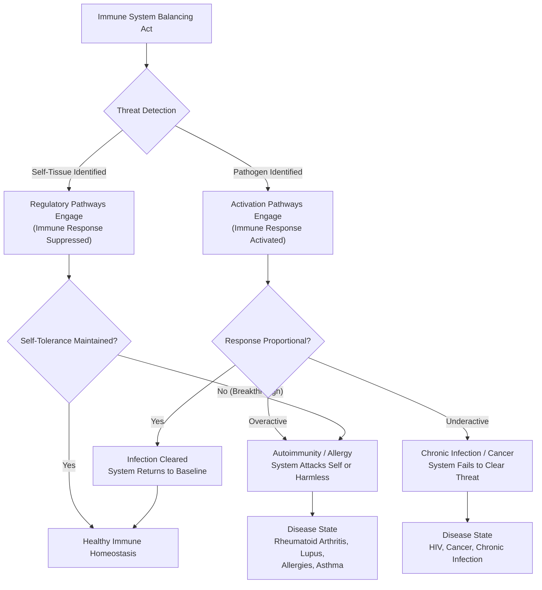

## Core Concepts

### The Four Patient Narratives

Richtel's central innovation is using four patient stories as the organizing structure for the book. Each story illuminates a different facet of immune function, and together they create a complete picture of the immune system's capabilities and vulnerabilities.

**Bob Hoff — The Man Who Lives with HIV.** Bob was diagnosed with HIV in the 1980s, at the height of the AIDS crisis. His story illustrates what happens when a virus systematically targets and destroys the immune system's command center: the CD4 helper T-cell. HIV hijacks these cells, uses them to replicate, and then destroys them, gradually dismantling the adaptive immune response. Bob's journey through the early days of the epidemic — when an HIV diagnosis was a death sentence — to the era of antiretroviral therapy, which transformed HIV into a manageable chronic condition, mirrors the broader history of immunology's war against the virus. His story makes concrete the abstract concept of immune deficiency: the body cannot fight infections, not because it lacks weapons, but because its general staff has been assassinated.

**Linda Segre — The Autoimmune Puzzle.** Linda was a healthy, active woman until a tick bite gave her Lyme disease. After treatment, she developed a mysterious autoimmune condition — her immune system, having been activated against the Lyme bacteria, could not fully shut down and began attacking her own tissues. Her story illuminates autoimmunity: the immune system's failure to maintain self-tolerance. Richtel uses Linda's case to explore the hygiene hypothesis, the role of molecular mimicry (where pathogen proteins resemble human proteins, causing cross-reactivity), and the diagnostic odyssey that autoimmune patients endure. Linda's story is the book's emotional center, showing the frustration of living with a disease that doctors struggle to diagnose, name, or treat.

**Meredith Brinster — The Allergic Life.** Meredith has severe allergies to a wide range of foods and environmental triggers. Her story demonstrates what happens when the immune system misclassifies harmless substances as deadly threats. Allergies are driven by IgE antibodies and mast cells — the same system that evolved to fight parasitic worms. In the modern environment, with fewer parasites and more novel proteins, this ancient defense system has become a source of misery for millions. Meredith's story explores the rise of allergies in developed countries, the role of the microbiome, and emerging treatments like oral immunotherapy.

**Jason Greenstein — Cancer and Immunotherapy.** Jason was diagnosed with Stage IV Hodgkin's lymphoma. His story is the book's most hopeful thread, chronicling his treatment with checkpoint inhibitor immunotherapy — drugs that release the brakes on T-cells, allowing them to recognize and attack cancer cells. Richtel uses Jason's journey to explain the immune system's relationship with cancer: how tumors evolve mechanisms to evade immune detection (by expressing PD-L1, which turns off T-cells), and how modern immunotherapy drugs like pembrolizumab (Keytruda) work by blocking that evasion. Jason's remarkable recovery illustrates the transformative potential of immunotherapy.

### The Immune System's Balancing Act

The book's title — *An Elegant Defense* — refers to the immune system's fundamental paradox. It must be simultaneously aggressive and restrained, powerful and precise, ready to attack any invader but disciplined enough not to destroy the body it protects. This balancing act is maintained by an intricate network of checks and balances: activating signals that say "attack" and inhibitory signals that say "stand down." When this balance breaks — when the system is too aggressive, too weak, or too confused — disease results.

### Chapter Insights

**Part 1 — The Discovery of the Immune System.** Richtel opens with a historical tour of immunology's pioneers: Edward Jenner and the first smallpox vaccine, Louis Pasteur and germ theory, Paul Ehrlich and the concept of the "magic bullet," and the mid-20th-century discovery of T-cells and B-cells. He introduces the central metaphor of the immune system as a "beautiful machine" that must balance defense with restraint. The history is structured to show how each discovery revealed a new layer of the immune system's complexity, with each answer generating deeper questions.

**Part 2 — Bob: Living with HIV.** Bob's story spans three decades, from the terror of the early AIDS epidemic to the modern era of antiretroviral therapy. Richtel uses Bob's trajectory to explain the architecture of the immune system: the role of CD4 helper T-cells as the system's generals, the difference between HIV infection and AIDS, and how antiretroviral drugs work by blocking different stages of the viral life cycle. The narrative captures both the scientific triumph of turning HIV from a death sentence into a chronic condition and the ongoing tragedy of the global HIV epidemic.

**Part 3 — Linda: The Autoimmune Puzzle.** Linda's struggle with post-Lyme autoimmune disease becomes a vehicle for exploring the hygiene hypothesis, molecular mimicry, and the gut microbiome. Richtel introduces Dr. Tom McDade, an anthropologist who studies how early-life microbial exposure shapes immune development. McDade's research suggests that reduced exposure to microbes — due to C-sections, antibiotics, formula feeding, and sanitation — may be leaving modern immune systems undertrained and prone to overreaction. Linda's case also illustrates the diagnostic challenges of autoimmune disease, where symptoms are real but lab tests are often inconclusive.

**Part 4 — Meredith: The Allergic Life.** Meredith's story explores the biology of allergies: the role of IgE antibodies, mast cells, and histamine. Richtel connects the rise of allergies to the hygiene hypothesis, noting that allergies are virtually nonexistent in populations with high parasite burdens. He explains the "old friends" hypothesis — the idea that humans co-evolved with certain microbes and parasites that train the immune system's regulatory pathways, and that removing these "old friends" from our environment has disrupted immune regulation.

**Part 5 — Jason: Cancer and Immunotherapy.** Jason's battle with Hodgkin's lymphoma and his treatment with checkpoint inhibitors forms the book's dramatic climax. Richtel explains how cancer evades the immune system through immune checkpoint pathways — particularly the PD-1/PD-L1 axis — and how drugs like pembrolizumab work by blocking these pathways. He also covers CAR-T cell therapy, where a patient's T-cells are harvested, genetically engineered to recognize cancer, and reinfused. Jason's recovery is presented as both a personal miracle and a harbinger of a new era in cancer treatment.

**Part 6 — The Elegant Defense in Balance.** The final section synthesizes the four patient stories into broader lessons about immune health. Richtel discusses the impact of stress, sleep, diet, and exercise on immune function, the role of chronic inflammation in aging and disease, and the promise and limitations of immune-boosting supplements and interventions. He concludes with a meditation on the immune system's elegance — a system of extraordinary complexity that operates without our conscious awareness, balancing attack and restraint in an endless dance of survival.

### Practical Applications

*An Elegant Defense* is primarily a work of narrative journalism rather than a self-help guide, but it offers actionable insights grounded in immunology. The hygiene hypothesis suggests that judicious use of antibiotics, allowing children to play outdoors and interact with pets, and dietary diversity that supports a healthy gut microbiome may all contribute to proper immune development. The chronic inflammation research underscores the importance of stress management, adequate sleep, and anti-inflammatory diets (rich in plants, fiber, and omega-3 fatty acids). The immunotherapy chapters provide a framework for understanding the latest cancer treatments and why they work. Richtel also emphasizes that the immune system cannot be "boosted" in any simple way — it is a complex system that requires balance, not amplification.
