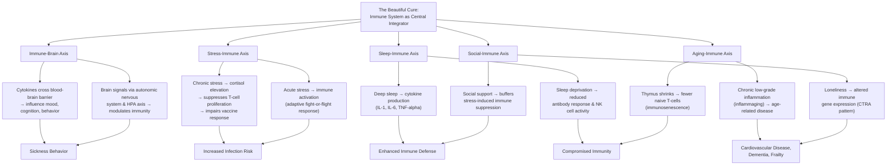

## Core Concepts

### The Immune Revolution — A New Framework for Health

Davis's central argument is that the immune system is undergoing a revolution in how scientists understand it, and that this revolution has profound implications for how we think about health. The old view — that the immune system is a specialized defense network that fights pathogens — has been replaced by a new understanding: the immune system is a pervasive sensing and regulatory network that communicates with every organ system, including the brain. This revolution has five pillars: the immune-brain connection, the stress-immune axis, sleep-dependent immune maintenance, immunosenescence and inflammaging, and the social modulation of immunity.

### The Immune-Brain Connection

One of the most surprising discoveries of modern immunology is that the immune system and the brain are in constant, bidirectional communication. Cytokines — the signaling proteins of the immune system — cross the blood-brain barrier and influence mood, cognition, and behavior. This explains why you feel tired, depressed, and socially withdrawn when you are sick: cytokines are acting on your brain to produce sickness behavior, an adaptive response that conserves energy for fighting infection. Conversely, the brain signals to the immune system through the autonomic nervous system and the hypothalamic-pituitary-adrenal (HPA) axis. This two-way street means that psychological states — stress, depression, loneliness — have direct, measurable effects on immune function.

### The Stress-Immune Axis

Chronic stress suppresses immune function through a well-understood biological pathway: stress activates the HPA axis, which releases cortisol, a hormone that dampens inflammation and inhibits the proliferation of T-cells. This is adaptive in the short term — cortisol prevents the immune system from overreacting during a stressful encounter — but chronically elevated cortisol impairs the immune system's ability to respond to genuine threats. Davis reviews studies showing that stressed individuals have lower antibody responses to vaccines, slower wound healing, and higher susceptibility to infectious diseases. The stress-immune connection is not metaphorical; it is a precisely characterized molecular pathway with measurable health consequences.

### Sleep and Immune Function

Sleep is the immune system's maintenance window. During deep non-REM sleep, the body produces cytokines — particularly IL-1, IL-6, and TNF-alpha — that regulate immune responses. T-cells and other immune cells are also produced and released into the bloodstream during sleep. Davis discusses landmark studies showing that sleep deprivation reduces antibody production after influenza vaccination, increases susceptibility to the common cold, and impairs the activity of natural killer cells that fight cancer. He also explores the reverse relationship: immune activation during infection increases sleep, suggesting that sleep evolved in part to support immune function.

### Immunosenescence and Inflammaging

The immune system changes dramatically with age. The thymus — the organ where T-cells mature — begins shrinking after puberty and continues to decline throughout life, reducing the production of new, naive T-cells. This immunosenescence means that older adults have a less diverse T-cell repertoire and a diminished ability to respond to novel pathogens. At the same time, aging is associated with a chronic low-grade inflammatory state called inflammaging, driven by accumulated cellular damage, senescent cells, and dysregulated cytokine production. Inflammaging is linked to nearly every age-related disease, including cardiovascular disease, type 2 diabetes, Alzheimer's, and frailty. Davis discusses interventions — including caloric restriction, exercise, and drugs like metformin — that may slow immunosenescence and reduce inflammaging.

### The Social Immune System

Perhaps the most surprising theme in the book is the immune system's sensitivity to social environment. Davis reviews research showing that loneliness and social isolation are associated with altered immune gene expression — specifically, increased expression of inflammatory genes and decreased expression of antiviral genes. This pattern, called conserved transcriptional response to adversity, is mediated by the sympathetic nervous system and can be detected in the blood of chronically lonely individuals. Conversely, strong social support, positive relationships, and even the presence of a trusted partner during a stressful experience can buffer the immune system against the effects of stress. The immune system, it turns out, is profoundly social.

### Chapter Insights

**Chapter 1: The Inner Universe.** Davis opens with a history of the immune revolution, from Edward Jenner's smallpox vaccine through Paul Ehrlich's "magic bullet" theory to the discovery of T-cells and B-cells in the 1960s and 1970s. He emphasizes that each generation of scientists thought they had understood the immune system, only to discover new layers of complexity. The chapter culminates in the modern view of the immune system as an integrated sensing network rather than a standalone defense system.

**Chapter 2: The Immune Brain.** This chapter dives deep into the bidirectional communication between the immune system and the brain. Davis explains the discovery of cytokine receptors in the brain, the role of microglia (the brain's resident immune cells), and the implications for understanding depression, neurodegenerative disease, and the link between inflammation and mental health. He discusses the emerging field of immunopsychiatry and the potential for anti-inflammatory treatments for depression.

**Chapter 3: The Stressed Immune System.** Davis provides a comprehensive tour of how stress — particularly chronic stress — alters immune function. He covers the HPA axis, cortisol signaling, and the role of the sympathetic nervous system. He reviews studies on caregivers of Alzheimer's patients, medical students during exams, and unemployed workers, all showing measurable immune changes in response to stress. The chapter also addresses the concept of allostatic load — the cumulative wear and tear of chronic stress on the body's regulatory systems, including the immune system.

**Chapter 4: The Sleeping Immune System.** This chapter explores the intimate relationship between sleep and immunity. Davis discusses the circadian regulation of immune function — how immune cells follow daily rhythms, with certain cells peaking during the day and others at night. He reviews the evidence that shift work and chronic sleep disruption are associated with increased risk of infection, cardiovascular disease, and cancer. He also covers the role of melatonin as an immune modulator and the effects of sleep on vaccine efficacy.

**Chapter 5: The Aging Immune System.** Davis explains immunosenescence and inflammaging in detail, drawing on epidemiological and mechanistic studies. He discusses why older adults respond poorly to vaccination, why they are more susceptible to infections like influenza and COVID-19, and why their risk of cancer increases with age. The chapter also covers interventions — including exercise, caloric restriction, and senolytic drugs — that may slow immune aging.

**Chapter 6: The Social Immune System.** This chapter explores the fascinating connection between social relationships and immune function. Davis reviews the evidence that loneliness alters immune gene expression, that marriage supports better immune health (especially for men), and that social integration is associated with lower levels of inflammation. He discusses the evolutionary logic: the immune system may have evolved to be sensitive to social context because in ancestral environments, social isolation was a cue of increased infection risk.

**Chapter 7: The Cancer-Fighting Immune System.** Davis tells the story of immunotherapy's development, from William Coley's failed bacterial toxins in the 1890s to the Nobel Prize-winning discovery of checkpoint inhibitors by James Allison and Tasuku Honjo. He explains how tumors evade the immune system — through PD-L1 expression, regulatory T-cell recruitment, and antigen escape — and how modern immunotherapies work by blocking these evasion mechanisms. The chapter covers checkpoint inhibitors, CAR-T cell therapy, and cancer vaccines, with an emphasis on both their remarkable successes and their current limitations.

**Chapter 8: The Future of Immunology.** Davis looks ahead to the next frontiers: personalized immune monitoring, immune-modulating drugs for chronic disease, the microbiome's role in shaping immune development, and the potential for immune-based treatments for Alzheimer's, autoimmune disease, and even aging itself. He argues that the immune revolution is in its early stages and that the next decade will bring discoveries as transformative as any in the history of medicine.

### Practical Applications

While *The Beautiful Cure* is primarily a work of scientific explanation rather than self-help, it offers actionable insights grounded in the research it presents. The stress-immune connection suggests that stress management — through mindfulness, exercise, social connection, or therapy — is not merely a matter of mental well-being but a direct modulator of immune function. The sleep-immunity link means that prioritizing sleep hygiene is one of the most effective things you can do to support immune health. The research on social connection implies that investing in relationships is a genuine health behavior with measurable biological effects. The inflammaging research suggests that anti-inflammatory diets (rich in plants, fiber, and omega-3s), regular exercise, and avoiding smoking and excessive alcohol are the most evidence-backed strategies for maintaining immune function across the lifespan. Davis does not offer simplistic "boost your immune system" advice — he emphasizes that the immune system is a complex, balanced network that responds best to consistent, long-term healthy patterns rather than quick fixes.
