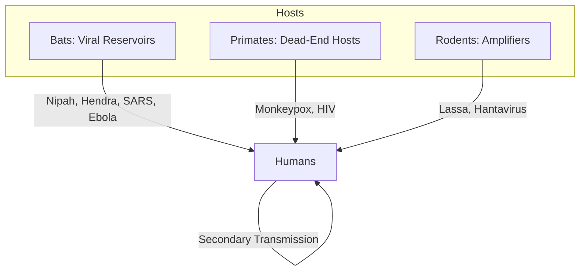

# Core Concepts

The foundational ideas in spillover ecology and emerging infectious disease.

## The Spillover Concept

A pathogen must complete a chain of events to jump from its natural reservoir host into humans: the reservoir must shed the pathogen, the pathogen must survive environmental transit, a human must be exposed to a sufficient dose, and the pathogen must successfully infect, replicate in, and transmit from the new host. Each link in this chain is a barrier; spillover occurs only when all barriers are breached simultaneously.

## Reservoir Host Dynamics

Not all animals are equal as reservoirs. Bats host an extraordinary diversity of viruses—including Nipah, Hendra, SARS-like coronaviruses, Marburg, and Ebola—without showing symptoms. Their unique immune systems tolerate viral persistence through a dampened inflammatory response and constitutive interferon activation. Primates, by contrast, are poor reservoirs because they tend to sicken and die from the same pathogens that infect humans.

## Ecological Drivers of Emergence

Spillover risk is a function of ecological proximity. Deforestation pushes wildlife into human settlements. Agricultural intensification creates dense livestock populations that serve as intermediate amplifiers. Wildlife trade concentrates stressed animals from multiple species in crowded markets. Climate change shifts vector and reservoir ranges. These drivers are multiplicative, not additive.

## The Heisenberg Principle of Virus Hunting

Quammen observes that the act of looking for emerging viruses influences where and how they are found. Researchers concentrate on known hot spots—Central Africa for filoviruses, South China for coronaviruses, Southeast Asia for influenza—potentially missing novel pathogens emerging elsewhere. Surveillance bias shapes our understanding of the viral universe.

# Chapter Insights

## Part One: Pale Horse

**Chapter 1: The Flight of the Golden Bird** — Opens with the 1999 Nipah virus outbreak in Malaysia, which killed 105 pig farmers. Quammen traces the investigation to the discovery that Nipah originated in fruit bats (*Pteropus* species), transmitted through pigs to humans. The chapter establishes the spillover paradigm: bat → amplifying host → human.

**Chapter 2: The Great Arc of the Flying Fox** — Explores the ecology of flying foxes, the bats that carry Hendra and Nipah viruses in Australia. Quammen travels to Queensland to observe these animals and reports on the ecological disruption forcing them into suburban areas, creating new human-animal interfaces.

**Chapter 3: The Night Roost** — Deep dive into bat immunology and why bats are such effective viral reservoirs. Quammen interviews bat immunologists who explain that bats' ability to fly—which generates metabolic heat and oxidative stress—selected for unique DNA repair and immune tolerance mechanisms.

## Part Two: The Coral Reef

**Chapter 4: The Henipavirus Hunter** — Portrait of Linfa Wang, the virologist who has spent decades studying bat viruses at CSIRO's Australian Animal Health Laboratory. The chapter explores the tension between fundamental virology and the urgent practical goal of pandemic prediction.

**Chapter 5: A Chimp Called Jefi** — Transitions to Ebola, following the 1994 outbreak in Tai Forest, Ivory Coast, where a researcher was infected while performing a necropsy on a chimpanzee. Quammen explores the mystery of Ebola's reservoir host, which remained unknown for decades.

**Chapter 6: The Hidden Reservoir** — The search for Ebola's natural reservoir eventually led to fruit bats. Quammen travels to Gabon and the Republic of Congo with researchers collecting bat samples, finding molecular evidence of Ebola in three bat species. The chapter captures the painstaking nature of reservoir hunting.

**Chapter 7: The Compensation** — Examines the social and economic dimensions of Ebola outbreaks in Central Africa. Quammen reports on how communities mistrust government health interventions and how traditional funeral practices involving contact with deceased bodies amplify transmission.

## Part Three: The Crash

**Chapter 8: The Parrot Fever** — A surprising chapter on *Chlamydia psittaci* (psittacosis), a zoonotic disease transmitted by parrots. This serves as Quammen's entry point to discuss the global wildlife trade—millions of animals transported annually under conditions that promote pathogen shedding and cross-species transmission.

**Chapter 9: The SARS Paradox** — Detailed investigation of the 2002-2003 SARS outbreak, which infected 8,096 people and killed 774. Quammen examines the Chinese wet market system, the role of civet cats as amplifying hosts, and the eventual identification of horseshoe bats as the natural reservoir. SARS was contained by classic public health measures—isolation and quarantine—before it had a chance to become endemic.

**Chapter 10: The Intermediate Host** — Discussion of influenza, focusing on the H5N1 avian influenza outbreak. Quammen explores how poultry farming practices in Southeast Asia create environments where avian influenza can adapt to mammals, including humans. The chapter introduces the concept of reassortment—when two influenza strains co-infect a cell and swap gene segments.

**Chapter 11: The Chimera** — On HIV/AIDS as the worst zoonotic spillover in history. Quammen traces the origin of HIV-1 (Group M) to chimpanzees in southeastern Cameroon and the likely transmission event around 1908—a single spillover from butchering bushmeat that changed the world.

## Part Four: The Messenger

**Chapter 12: The Bridge** — Quammen reflects on what unifies these stories. The common thread is human ecological disruption creating interfaces where novel pathogens can emerge. He argues that the question is not if another spillover pandemic will occur, but when and how prepared we will be.

**Chapter 13: The Instructions** — The closing chapter is a sobering assessment of pandemic preparedness. Quammen profiles researchers building early warning systems based on viral discovery in wildlife and argues for sustained investment in surveillance at the human-animal interface rather than reactive vaccine development after emergence.

# Real World Examples

**Nipah Virus in Malaysia (1999):** Industrial pig farming concentrated in an area also inhabited by fruit-bearing trees that attracted bats created a perfect spillover scenario. Pigs served as amplifying hosts—they became much sicker than the bats but transmitted the virus efficiently to humans. The outbreak required culling over one million pigs, devastating the Malaysian pig farming industry.

**SARS in Southern China (2002-2003):** The globalized wildlife trade in Guangdong province brought masked palm civets, raccoon dogs, and other species into crowded markets where they shed SARS-CoV into droplets and aerosols that infected market workers. The virus spread internationally within weeks, carried by air travelers to Hong Kong, Toronto, Singapore, and Hanoi.

**Ebola in West Africa (2013-2016):** The outbreak that killed 11,325 people began when a two-year-old boy in Meliandou, Guinea, played near a hollow tree housing a colony of Angolan free-tailed bats. Deforestation and population movement in the Mano River region had created the conditions for spillover, and delayed international response allowed the outbreak to spiral.

# Practical Applications

- **Wildlife surveillance programs**: Systematic sampling of high-risk reservoir species (bats, primates, rodents) in spillover hot spots to catalog viral diversity and detect novel pathogens before they emerge
- **Wet market reform**: Separate live animal species in markets, improve ventilation and sanitation, reduce density, and separate animal holding from food preparation areas
- **Land-use planning**: Incorporate health impact assessments into deforestation and agricultural development projects
- **One Health training**: Cross-train veterinarians, wildlife biologists, and public health officials to work as integrated surveillance teams

# Actionable Lessons

1. **Pandemic prevention is cheaper than pandemic response** — Estimates suggest spending $20-30 billion annually on surveillance and prevention would cost far less than the trillions lost to COVID-19
2. **Early detection systems work** — Countries with robust surveillance and laboratory capacity detected SARS, MERS, and novel influenza subtypes early enough to implement containment
3. **Community engagement is essential** — The most sophisticated surveillance system fails without trust between communities and health authorities
4. **Bat conservation matters** — Preserving natural bat habitats reduces the likelihood of bats congregating in human-dominated environments, reducing spillover risk

# Action Plan

## Reading Guide

### Sufficiency Assessment

This summary captures the book's core thesis on zoonotic spillover and pandemic emergence. It covers all major case studies and conceptual frameworks but omits the rich observational detail and character development that make Quammen's narrative so compelling.

### Recommended Reading Path

| Reader Type | Time | What to Read |
|---|---|---|
| Casual | ~15 min | This summary |
| Interested | ~2-4 hr | Summary + Chapters 1, 4, 9, 12 |
| Scholar/Practitioner | ~10-15 hr | Full book |

### Chapters to Read in Full

- **Chapter 1 (The Flight of the Golden Bird)** — The Nipah story is the perfect spillover case study
- **Chapter 9 (The SARS Paradox)** — Essential for understanding coronavirus emergence
- **Chapter 12 (The Bridge)** — Quammen's synthetic argument about what causes pandemics

### Chapters to Skim or Skip

- **Chapter 7 (The Compensation)** — Social context important but less scientifically dense
- **Chapter 8 (The Parrot Fever)** — Interesting but less central to the main argument

### What You'll Miss by Not Reading the Full Book

- Quammen's vivid character portraits of the scientists hunting viruses in remote field sites
- The procedural detail of how reservoir hunting actually works—the logistics, the failures, the lucky breaks
- The sense of place—Central African forests, Australian outback, Chinese markets—that grounds the science
