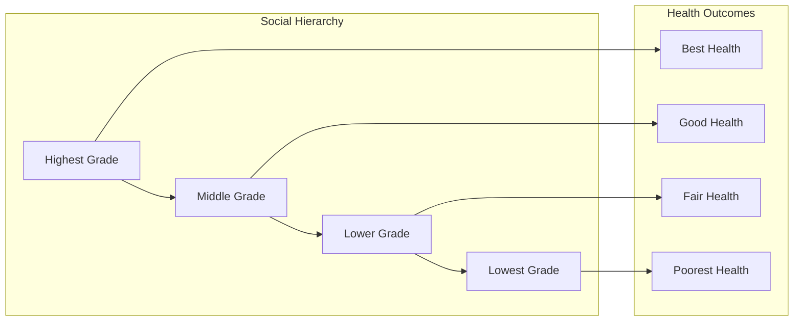
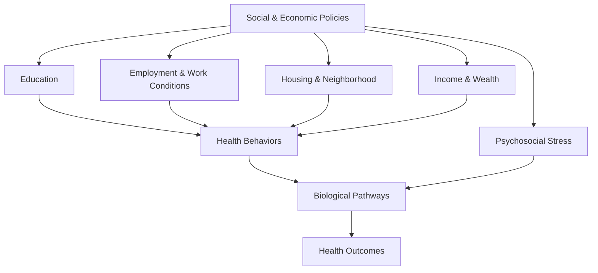

# Core Concepts

The foundational frameworks for understanding health inequalities.

## The Social Gradient in Health

Marmot's central finding from the Whitehall Studies is that health improves at every step up the social hierarchy, not just at the poverty line. Among British civil servants, those in the highest grade lived longer and had less chronic disease than those in the grade below, who in turn were healthier than those in the grade below that. This gradient exists in every society with data, persists after controlling for smoking, diet, and exercise, and reveals that health inequality is not confined to the poor.

## The Causes of the Causes

Marmot argues that conventional risk factors—smoking, diet, exercise, blood pressure—are proximate causes. The real drivers are the "causes of the causes": the social conditions that shape how people live and the choices available to them. A person's education, occupation, income, housing quality, neighborhood safety, and social connections determine their exposure to health-damaging factors and their access to health-promoting resources.

## The Psychosocial Pathway

Material deprivation matters, but so does psychosocial stress. The Whitehall Studies found that civil servants in low-grade jobs had worse health not because they smoked more or exercised less (though they did), but because they experienced less control over their work and less autonomy in their lives. This lack of control triggers chronic stress responses—elevated cortisol, inflammation, hypertension—that accumulate over decades through a process called allostatic load.

## Relative Deprivation

Absolute material poverty causes poor health, but Marmot demonstrates that relative deprivation—how your position compares to others in your society—also matters independently. In rich countries where basic material needs are met for most people, the steepness of the health gradient correlates with the degree of income inequality. More unequal societies have larger health gaps, even at equivalent absolute income levels.

# Chapter Insights

## Part One: The Problem

**Chapter 1: The Health Gap** — Opens with the stark fact that a man in the Glasgow suburb of Lenzie lives 28 years longer than a man in the Glasgow suburb of Calton, only a few miles apart. Marmot establishes that health gradients exist everywhere and that explaining them requires looking beyond medical care.

**Chapter 2: The Gradient** — Detailed presentation of Whitehall Study data showing the stepwise relationship between civil service grade and mortality from cardiovascular disease, cancer, and all causes. Marmot demonstrates that this pattern is not unique to Britain and persists across countries, time periods, and diseases.

**Chapter 3: The Causes of the Causes** — Introduces the conceptual framework that organizes the book. Marmot argues that health behaviors are socially patterned, and the question is why. Education, occupation, income, and neighborhood conditions are presented as the structural drivers of health.

## Part Two: The Factors

**Chapter 4: Stress** — Explores the biology of chronic stress. Marmot presents evidence from the Whitehall Studies that low job control predicts cardiovascular disease, and from Michael Meaney's rat studies that maternal behavior programs stress responses in offspring. The chapter connects social hierarchy to physiological wear and tear.

**Chapter 5: The Body in Society** — Examines how social position gets "under the skin." Discussion of the social determinants of obesity, inflammation, and immune function. Marmot argues that the body registers social inequality at a cellular level through chronic activation of stress pathways.

**Chapter 6: The Power of Early Childhood** — Presents evidence from the British birth cohort studies that health disparities are present in early childhood and track into adult life. Marmot advocates for early intervention—prenatal care, early childhood education, family support—as a high-leverage strategy for reducing health inequalities.

**Chapter 7: Education and Health** — Education shapes health through multiple pathways: it affects employment prospects, income, health literacy, social networks, and sense of control. Marmot argues that improving educational equity is one of the most powerful health interventions available.

**Chapter 8: Work and Health** — Examines how employment conditions affect health. The chapter presents evidence that unemployment is harmful to health, but so is poor-quality work—low control, high demand, job insecurity. Marmot advocates for improving working conditions as a public health strategy.

**Chapter 9: Income and Health** — Income affects health through material pathways (better housing, nutrition, healthcare) and psychosocial pathways (status, security, control). Marmot shows that the relationship between income and health is curvilinear—most steep at the bottom and flattening at the top.

**Chapter 10: The Good Society** — Argues that social cohesion, trust, and community participation are health-promoting. Countries with higher social capital and lower inequality achieve better health outcomes for their populations.

## Part Three: The Solutions

**Chapter 11: Fair Society, Healthy Lives** — Presents the recommendations of the Marmot Review (the Strategic Review of Health Inequalities in England post-2010). Six policy objectives include giving every child the best start in life, enabling all to maximize capabilities, creating fair employment, ensuring healthy standard of living, building sustainable communities, and strengthening the role of prevention.

**Chapter 12: Health Equity in an Unequal World** — Global perspective on health inequalities between and within countries. Marmot discusses the WHO Commission on Social Determinants of Health, the Millennium Development Goals, and the need for global action on the social determinants of health.

**Chapter 13: The Challenge of an Unequal World** — Concludes with a call to action. Marmot argues that health equity is a matter of social justice and that closing the health gap requires political will, not just evidence. The question is not what to do but whether we have the collective resolve to do it.

# Real World Examples

**Kenilworth Road, London:** A single street in London where life expectancy varies by 17 years between the wealthy and deprived ends. The difference is not explained by healthcare access—both ends have the same NHS GP—but by housing quality, employment opportunities, and the accumulated experience of social advantage or disadvantage.

**Glasgow's Health Gap:** The most extreme health inequalities in Western Europe exist in Glasgow, where the difference in life expectancy between affluent and deprived neighborhoods exceeds 28 years for men. Marmot traces this to deindustrialization, poor housing stock, high crime rates, and low social mobility—all consequences of policy choices.

**Finland's North Karelia Project:** A community-based intervention that reduced cardiovascular mortality by 80% over 35 years, not primarily through medical treatment but through changing social norms, food availability, and community structures. The project demonstrated that population health can be transformed through social action.

# Practical Applications

- **Progressive universalism**: Deliver services universally but at a scale proportionate to need (the inverse care law in reverse)
- **Early childhood investment**: Targeted prenatal, early childhood education, and family support programs
- **Workplace health**: Increase employee control over work schedules and tasks, reduce job insecurity
- **Minimum income standards**: Ensure that social protection systems guarantee a health-compatible standard of living

# Actionable Lessons

1. **Don't focus only on the poorest** — Health gradients affect everyone below the top; interventions must be universal but proportionate
2. **Start early** — The foundations of adult health are laid in early childhood; investing in early years yields the highest returns
3. **Look beyond healthcare** — The biggest health gains come from improving conditions where people live, work, learn, and age
4. **Measure what matters** — Routine data collection on social determinants (education, employment, income, housing) is essential for monitoring progress

# Action Plan

## Reading Guide

### Sufficiency Assessment

This summary captures the book's core framework on social determinants, the gradient, and the Marmot Review recommendations. It covers all major conceptual sections but omits the detailed statistical evidence and historical case studies that support the argument.

### Recommended Reading Path

| Reader Type | Time | What to Read |
|---|---|---|
| Casual | ~15 min | This summary |
| Interested | ~2-3 hr | Summary + Chapters 2, 4, 6, 11 |
| Scholar/Practitioner | ~10-13 hr | Full book |

### Chapters to Read in Full

- **Chapter 2 (The Gradient)** — The foundational evidence
- **Chapter 6 (The Power of Early Childhood)** — Highest-leverage intervention point
- **Chapter 11 (Fair Society, Healthy Lives)** — The policy recommendations

### Chapters to Skim or Skip

- **Chapter 12 (Health Equity in an Unequal World)** — Global perspective that overlaps with other sources
- **Chapter 8 (Work and Health)** — Detailed but can be summarized

### What You'll Miss by Not Reading the Full Book

- The statistical detail of the Whitehall Studies and British birth cohort data
- The biographical context—Marmot's own intellectual journey from clinician to social epidemiologist
- The specific policy case studies from countries that have reduced health inequalities
