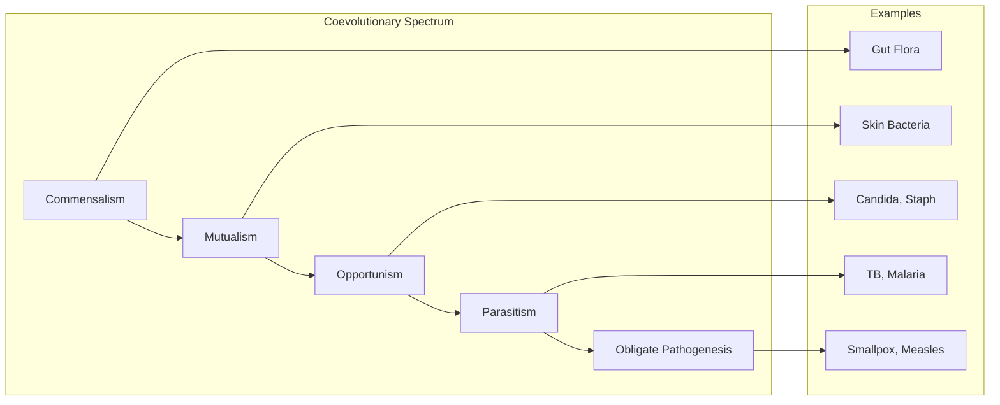
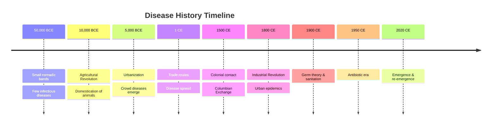

# Core Concepts

The foundational ideas in human-microbe coevolution and infectious disease history.

## The Coevolutionary Spectrum

Crawford describes human-microbe relationships as existing on a spectrum. At one end are commensal microbes that live harmlessly on or in our bodies (the human microbiome). In the middle are opportunistic pathogens that cause disease only in immunocompromised hosts. At the other end are obligate pathogens that require a susceptible host to complete their life cycle. Understanding this spectrum reveals that pathogenicity is not fixed but context-dependent.

## The Agricultural Revolution as Disease Event

Before agriculture, human populations were small, mobile, and scattered—too sparse to sustain the crowd diseases that require dense host populations. The Neolithic transition (c. 10,000 BCE) changed everything: sedentary farming communities grew large enough for epidemic diseases to establish endemic transmission, while domestication of animals provided a constant source of novel zoonotic pathogens.

## The Germ Theory Revolution

Crawford emphasizes how recent and transformative the germ theory of disease is. Before Pasteur, Koch, and Lister in the late 19th century, the dominant explanations for disease were miasma (bad air), humoral imbalance, and divine punishment. The discovery that microorganisms cause disease opened the door to rational prevention through sanitation, vaccination, and antibiotics—but also created the illusion that infectious diseases were a solved problem.

## The Epidemiological Transition

The 20th century saw a dramatic shift in cause of death from infectious to non-communicable diseases in wealthy countries—the epidemiological transition. This shift was driven by sanitation, vaccination, antibiotics, and improved nutrition, not primarily by medical innovation. Crawford argues that this transition was always fragile and is now reversing due to antimicrobial resistance, emerging diseases, and the globalization of vectors and pathogens.

# Chapter Insights

## Chapter 1: The Invaders

Introduces the microbial world and the basic biology of bacteria, viruses, fungi, and parasites. Crawford explains that most microbes are harmless or beneficial, that pathogenicity is a rare and evolutionarily costly trait, and that the decision to cause disease depends on complex host-pathogen interactions. She establishes that even "deadly" microbes are not malicious but simply pursuing their evolutionary interests.

## Chapter 2: Climate and Disease

Examines how climate and geography shape infectious disease distribution. The tropics harbor the greatest diversity of human pathogens because warm, wet conditions support more vector and reservoir species. Malaria, dengue, and yellow fever are constrained to tropical and subtropical zones by the ranges of their mosquito vectors. Crawford uses this chapter to argue that climate change will expand the geographic range of vector-borne diseases.

## Chapter 3: The First Humans

The Paleolithic era (before 10,000 BCE) was relatively free of infectious disease. Small, isolated bands of hunter-gatherers faced primarily zoonotic infections from hunting and scavenging, but population densities were too low to sustain the crowd diseases that require continuous transmission. Crawford estimates that pre-agricultural humans hosted perhaps a dozen or so infectious diseases, compared to the hundreds that later affected agricultural civilizations.

## Chapter 4: The Agricultural Revolution

The pivotal chapter in the book. The domestication of animals brought humans into close, prolonged contact with livestock carrying pathogens that could cross the species barrier. Measles evolved from rinderpest (a cattle virus). Smallpox may have diverged from a rodent poxvirus. Influenza originates in waterfowl, passing through pigs to humans. Tuberculosis likely jumped from cattle (M. bovis). Population density in early farming villages reached levels sufficient to sustain endemic transmission of these new pathogens.

## Chapter 5: The First Cities

Urbanization amplified disease in two ways: higher population densities increased transmission efficiency, and trade routes connected previously isolated disease pools. Crawford traces the disease history of ancient Mesopotamia, Egypt, Greece, and Rome, showing how urban centers were demographic sinks that required constant in-migration to maintain population levels due to disease mortality. Rome's aqueducts and baths are presented as early—and effective—public health infrastructure.

## Chapter 6: The Great Plagues

The Black Death (1346-1353) killed an estimated 30-50% of Europe's population, making it the deadliest pandemic in human history. Crawford discusses *Yersinia pestis* biology, the role of black rats and fleas in transmission, and the social and economic consequences of the plague. She argues that plague was not a single event but a recurring pattern—Europe experienced plague cycles for centuries after the initial outbreak.

## Chapter 7: The Columbian Exchange

The European colonization of the Americas was the greatest demographic catastrophe in history, but the primary killers were not swords or guns but infectious diseases to which Native Americans had no immunity. Smallpox, measles, influenza, and typhus killed 80-90% of indigenous populations in some regions. Crawford analyzes why the exchange of diseases was so asymmetrical: Old World populations had developed immunity through centuries of exposure to domesticated animals and crowd diseases, while the New World had few domesticated animals and thus no equivalent disease pool.

## Chapter 8: The Germ Theory

Traces the history of microbiology from Leeuwenhoek's discovery of microorganisms (1676) through the work of Pasteur, Koch, Lister, and Ehrlich. Crawford emphasizes that the germ theory was revolutionary because it changed the object of intervention: rather than trying to balance humors or purify air, physicians could now target specific microorganisms. The chapter covers the development of the first vaccines (Jenner's smallpox vaccine), antisepsis, and the beginnings of chemotherapy.

## Chapter 9: The Sanitary Revolution

Before antibiotics, the most effective public health interventions were environmental. The sanitary revolution of the 19th century—clean water, sewage systems, food hygiene, housing reform—dramatically reduced mortality from cholera, typhoid, and diarrheal diseases. Crawford argues that sanitation was more important than medicine in achieving the historical mortality decline, a lesson that remains relevant for low-income countries today.

## Chapter 10: The Antibiotic Era

The discovery of penicillin (1928, mass-produced by 1944) inaugurated the antibiotic era, which transformed medicine and created the widespread belief that infectious diseases were conquered. Crawford covers the golden age of antibiotic discovery (1940s-1960s), the rise of antibiotic resistance, and the drying up of the antibiotic pipeline. She argues that antimicrobial resistance is the inevitable evolutionary consequence of antibiotic use and represents a fundamental challenge to modern medicine.

## Chapter 11: Emerging Infections

The book's concluding chapter considers the 21st-century landscape of emerging infectious diseases. Crawford discusses HIV/AIDS, Ebola, SARS, and the threat of pandemic influenza. She argues that the same factors that enabled historical disease emergence—population density, animal contact, global connectivity—are now amplified to unprecedented levels. The chapter ends with a call for sustained surveillance, retained vaccine production capacity, and global cooperation in infectious disease control.

# Real World Examples

**The Black Death and Feudalism:** The plague's devastation of the European workforce (1346-1353) created labor shortages that empowered surviving workers, accelerated the decline of serfdom, and contributed to the social transformations that led to the Renaissance. Crawford uses this example to show that infectious disease can be a driver of historical change, not just a footnote.

**The 1918 Influenza Pandemic:** The Spanish flu infected one-third of the global population and killed 50-100 million people, more than World War I. Crawford emphasizes that the pandemic was caused by an avian-origin influenza virus (H1N1) and that its unusual severity in young adults was likely due to an immune response to a related H1 strain from the 1890s.

**Smallpox Eradication:** The global eradication of smallpox (declared in 1980) is presented as the greatest public health achievement in history. Vaccination was effective, but eradication also required surveillance, containment, and international cooperation—a model for future disease control efforts.

# Practical Applications

- **Antimicrobial stewardship**: Limit antibiotic use to slow the evolution of resistance
- **Vaccine development pipelines**: Maintain capacity for rapid vaccine development against novel pathogens
- **Climate-sensitive surveillance**: Expand vector-borne disease monitoring as climate zones shift
- **One Health integration**: Connect veterinary and human surveillance systems to detect zoonotic threats early

# Actionable Lessons

1. **History repeats in disease** — The same factors that enabled past pandemics (animal contact, crowding, mobility) are now amplified
2. **Don't underestimate evolution** — Microbes will always adapt to our interventions; the question is whether we can stay ahead
3. **Public health is political** — Sanitation, vaccination, and quarantine all require collective action and political will
4. **Antibiotics are a finite resource** — Use them sparingly; there may not be replacements for all of them

# Action Plan

## Reading Guide

### Sufficiency Assessment

This summary captures the book's core argument about human-microbe coevolution and the historical progression of infectious disease. It covers all major historical periods and conceptual frameworks but omits the specific details of the epidemiology of individual diseases.

### Recommended Reading Path

| Reader Type | Time | What to Read |
|---|---|---|
| Casual | ~15 min | This summary |
| Interested | ~2-3 hr | Summary + Chapters 1, 4, 7, 10 |
| Scholar/Practitioner | ~6-8 hr | Full book |

### Chapters to Read in Full

- **Chapter 4 (The Agricultural Revolution)** — The most important chapter, explaining why farming changed disease
- **Chapter 7 (The Columbian Exchange)** — The most dramatic example of disease as historical driver
- **Chapter 10 (The Antibiotic Era)** — Essential for understanding the current crisis of resistance

### Chapters to Skim or Skip

- **Chapter 2 (Climate and Disease)** — Background that is less central to the main argument
- **Chapter 9 (The Sanitary Revolution)** — Important but well-covered in other sources

### What You'll Miss by Not Reading the Full Book

- The evolutionary biology detail explaining why microbes do what they do
- The specific histories of individual diseases (smallpox, measles, plague, TB, malaria)
- Crawford's careful argumentation about why the epidemiological transition is fragile
