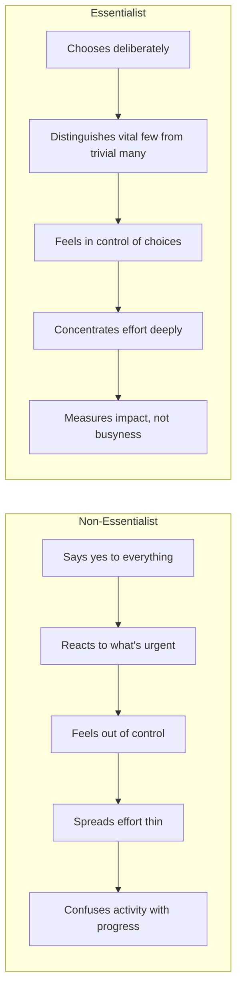
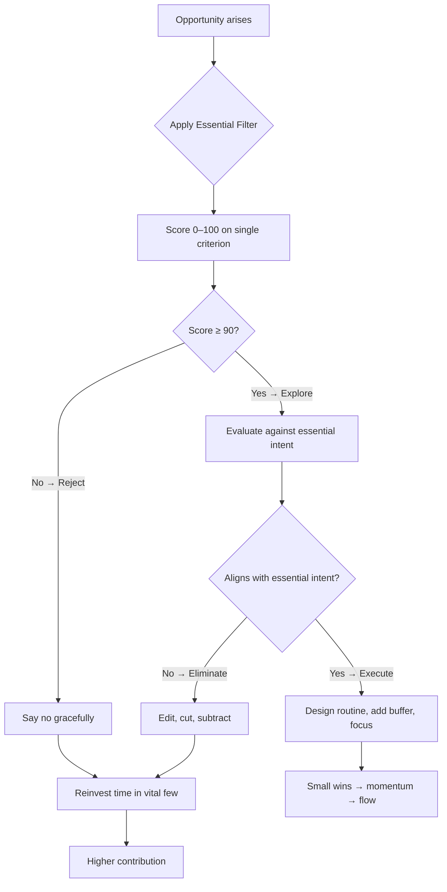

## The Paradox of Success

McKeown opens with a pattern that will feel familiar to many high achievers:

> Phase 1: We work hard and gain clarity about what matters → we succeed.
> Phase 2: Success brings reputation as the "go-to" person → more options and opportunities.
> Phase 3: More opportunities = more demands on our time → efforts become diffuse.
> Phase 4: We become distracted from our highest contribution → the clarity that produced success is lost.

This is the Paradox of Success. The things that made us valuable are undermined by the very success they produced. Essentialism is the escape route.

---

## Essentialist vs Non-Essentialist

---

## Decision Tree

---

## The 80/20 Principle (Pareto)

McKeown leans heavily on Vilfredo Pareto's observation that 20% of inputs produce 80% of outputs. The corollary: most of what we do produces negligible results. Essentialists internalize this not as a rough heuristic but as a **decision rule**: find the 20% that produces 80%, double down, cut the rest.

He introduces Joseph Juran's "Law of the Vital Few" alongside the Pareto Principle to shift the reader from asking "How can I do more?" to "Which few things produce exceptional results?"

---

## Trade-Offs: The Reality

> "There are no solutions. There are only trade-offs." — Thomas Sowell

McKeown argues that refusing to accept trade-offs is the single biggest source of mediocrity. Non-Essentialists say "I can do both" and end up doing neither well. Essentialists ask "Which problem do I want?" — they accept that every yes is a no to something else, and they make that choice intentionally.

The essentialist trade-off question: instead of "What do I have to give up?" ask "What do I want to go big on?"

---

## Priority vs Priorities

The word "priority" was singular for 500 years. It meant the one thing before all others. The industrial age pluralized it into "priorities," and McKeown argues this was a conceptual disaster. If everything is a priority, nothing is. Essentialists restore the singular: one essential intent, one most important thing now.

---

## Essential Intent

An essential intent is the single decision that makes a thousand later decisions. It must satisfy two criteria simultaneously:

| | General | Concrete |
|---|---|---|
| **Inspirational** | Vision / Mission | **Essential Intent** |
| **Measurable** | Quarterly Objective | Task / Metric |

Example: Not "make the world better" (vague) and not "launch feature X by Q3" (tactical), but "help every student in the district read at grade level by 2026" — both aspirational and measurable.

---

## Escape

Essentialists carve out space for thinking. McKeown describes how Steve Jobs would take long walks; Bill Gates takes "Think Weeks" in a cabin. The point is not laziness — it's creating distance from the noise so you can identify the signal. Without space to reflect, you default to reacting.

---

## Play

Based on research from Stuart Brown (National Institute for Play), McKeown makes the case that play is essential cognition: it fuels creativity, adaptability, and brain plasticity. Essentialists protect play not as a reward for work done, but as a prerequisite for doing important work well.

---

## Sleep

McKeown calls sleep "protecting the asset" — the most valuable asset being your own cognitive performance. He dismantles the overachiever belief that sleeping less produces more. Sleep-deprived people cannot distinguish the vital few from the trivial many, and they cannot sustain high contribution.

---

## Select: If It's Not a Clear Yes, It's a No

McKeown introduces **highly selective criteria** — not "Is this a good opportunity?" but "Is this the best possible use of my time?" He offers two tools:

1. **The 90% Rule**: Score on a single criterion 0–100. Below 90 → treat as 0.
2. **The Three-Criteria Filter**: Write three minimum criteria and three extreme criteria. If it doesn't pass at least two extreme criteria, reject it.

---

## The Power of No

> "We need to learn the slow yes and the quick no." — Tom Friel

McKeown provides scripts for graceful refusal:
- "Let me check my calendar and get back to you."
- "I'm honored you thought of me. I can't commit, but here's someone who might."
- "I have a competing commitment."
- The awkward pause — silence is a complete sentence.
- "No, but…" redirecting to an alternative.

---

## Trade-Off Affirmation

McKeown suggests a daily affirmation: "I choose to prioritize this over that." It forces explicit acknowledgment of what's being renounced. The goal is not to eliminate discomfort from trade-offs but to make them visible and intentional rather than accidental.

---

## Routine

> "If we create a routine that enshrines the essentials, we will begin to execute them on autopilot."

McKeown argues that willpower is finite — routine makes essential behavior automatic. He points to Michael Phelps' coach Bob Bowman, who designed pre-race routines so detailed that Phelps could execute at his best even under extreme pressure.

---

## Small Wins

Essentialists don't try to change everything overnight. They identify the smallest, most concrete step that builds momentum. McKeown calls this "minimum viable progress" — a term borrowed from lean startup methodology. Start small, gain confidence, and compound.

---

## Flow

The final execution state of essentialism: being entirely in the present, focused on one thing at a time, in _kairos_ rather than _chronos_. Essentialists don't multitask. They concentrate full energy on the essential task at hand.

---

## Key Lessons

1. **Regain your right to choose.** No one can take it away, but you can forget you have it.
2. **Apply the Pareto Principle as a decision rule**, not just an observation.
3. **Say no to good opportunities** so you can say yes to great ones.
4. **Define one essential intent** — concrete and inspiring — that governs all decisions.
5. **Protect space for escape, play, and sleep** — they are performance inputs, not rewards.
6. **Build buffers** — add 50% to every time estimate.
7. **Remove obstacles** before adding resources.
8. **Celebrate small wins** — they build the momentum that sustains essentialist practice.

---

## Action Plan

| Phase | Action | Time |
|---|---|---|
| Week 1 | Identify your essential intent | 1 hour |
| Week 2 | Apply the 90% Rule to current commitments | 30 min |
| Week 3 | Delete or delegate everything scoring &lt;90 | Ongoing |
| Week 4 | Build a weekly buffer — 50% margin on key tasks | 15 min/week |
| Week 5 | Design a morning routine that protects your first 90 minutes | 30 min |
| Week 6 | Practice one graceful no per day | 2 min/day |
| Week 7 | Run the "reverse pilot" on one stale project | 15 min |
| Week 8 | Audit your calendar; block time for the essential | 30 min/month |
