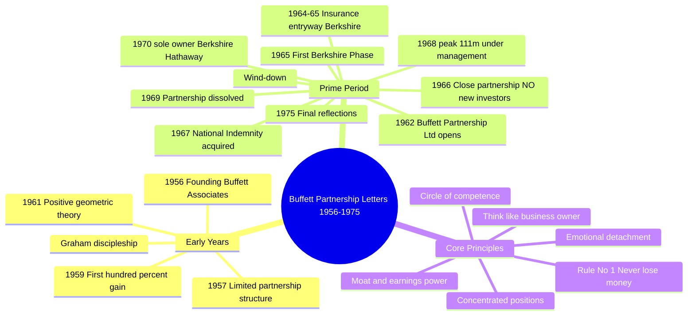

## Overview

Between 1956 and 1975, Warren Buffett ran a succession of investment partnerships
— first **Buffett Associates** (1956–1959), then the **Buffett Partnership, Ltd.**
(1957–1969). During those years he wrote annual letters to his limited partners
explaining his philosophy, reviewing performance, and walking through his thinking
in trenchant, direct prose unlike anything Wall Street produces. These letters are
the intellectual ur-text of everything Berkshire Hathaway later became.

This volume collects and annotates those partnership letters, introduced and
contextualised by Jeremy C. Miller (J.P. Morgan Asset Management). The 2017
Princeton University Press reissue carries the George Paperback imprint and an
accompanying audiobook edition.

---

## Reading Map

## Metadata

| Field | Value |
|-------|-------|
| Author | Warren E. Buffett |
| Compiler | Jeremy C. Miller et al. |
| Publisher | Princeton University Press |
| Hardcover | 2016 |
| This edition (George PB) | 2017 |
| ISBN-13 | 978-0691214917 |
| Pages | ~208 (varies by edition) |
| Also | Audiobook ISBN 9780691214917 (audio) |

## Source Documents

The letters themselves are in the public domain as part of the academic/scholarly
record. Digital archives include:

- **chian.io / buffett-letters** — complete annotated archive
- **RBCPA** — Buffett Letters Archive 1959–1975
- **GitHub: jayleecn/Warren-Buffett-Letters-1956-2025**

---

