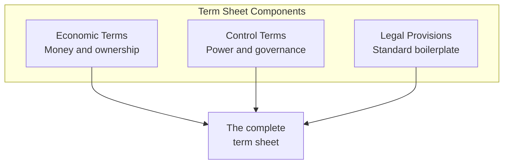
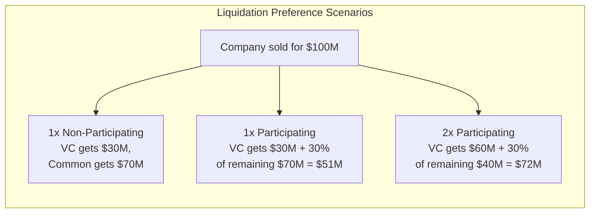
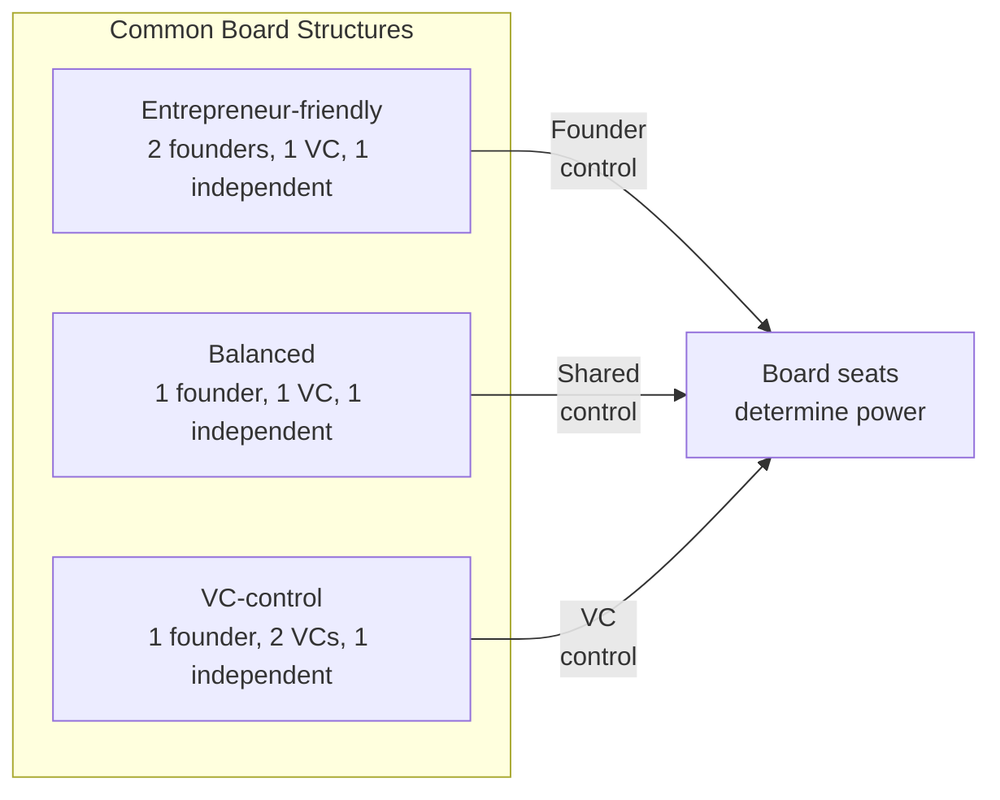
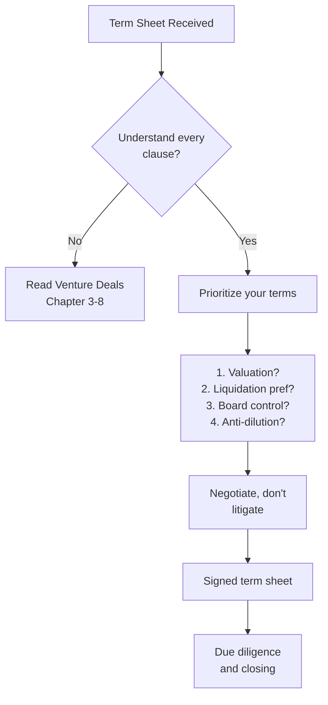

## The Term Sheet Anatomy

Feld and Mendelson walk through every clause of a standard VC term sheet.

---

## Economic Terms

### Valuation

| Term | Definition | Typical Range |
|---|---|---|
| Pre-money valuation | Value before investment | Depends on stage, sector |
| Post-money valuation | Pre-money + investment amount | Determines ownership % |
| Price per share | Valuation / fully diluted shares | Varies |

### Liquidation Preference

The most important economic term.

### Anti-Dilution

| Type | Protection Level | Effect |
|---|---|---|
| Full ratchet | Strongest | Investors repriced to lowest round price |
| Weighted average | Standard | Adjusts based on price and amount |
| No protection | Weakest | Investors bear full dilution risk |

---

## Control Terms

### Board of Directors

### Protective Provisions

Items that require investor approval, even if the board agrees:
- Changing authorized shares
- Selling the company
- Incurring debt above a threshold
- Paying dividends
- Changing the business

---

## The Term Sheet Negotiation

Feld's advice: only negotiate what matters. Save your chips for the
terms that will have real impact on your outcome.

---

## The Entrepreneur-VC Relationship

| Phase | Key Activity | Pitfall |
|---|---|---|
| Courtship | Getting to know each other | Falling in love with money |
| Term sheet | Negotiating terms | Fighting over everything |
| Due diligence | Opening your books | Hiding problems |
| The close | Legal paperwork | Losing momentum |
| The marriage | Working together | Misaligned expectations |

---

## Reading Guide

| Chapter | Topic | Est. Time | Priority |
|---|---|---|---|
| 1-2 | How VC works | 45 min | Essential |
| 3-5 | Economic terms | 1.5h | Essential |
| 6-7 | Control terms | 1h | Essential |
| 8 | Legal terms | 30 min | Important |
| 9-10 | Negotiation | 45 min | Essential |
| 11-13 | The relationship | 45 min | Important |
